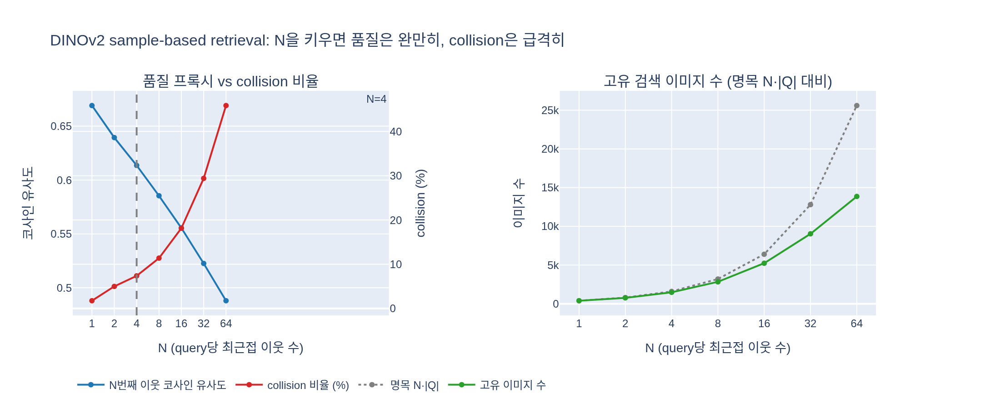

# retrieval에서 N=4를 선택한 이유는?

> **답**: N을 훨씬 크게 해도 검색 품질은 시각적으로 좋아 보였지만, collision(여러 쿼리의 최근접 이웃으로 중복 검색되는 이미지)이 늘어난다. N=4가 그 사이의 좋은 절충점이다.

출처: DINOv2 논문(Oquab et al., 2023, arXiv:2304.07193) §3 *Data Processing* — "Self-supervised image retrieval" 단락, 그리고 부록 A.4 *Retrieval*, Table 15.

## 1. 맥락: LVD-142M을 만드는 데이터 파이프라인

DINOv2는 라벨·메타데이터·텍스트 없이 **이미지 유사도만으로** 사전학습 데이터셋(LVD-142M)을 자동 구축한다. 흐름은 그림 3과 같다.

- **Embedding**: curated(ImageNet-22k, GLDv2 등)와 uncurated(웹 크롤 1.2B장) 이미지를 모두 ImageNet-22k로 사전학습한 자기지도 ViT-H/16으로 임베딩하고, 코사인 유사도로 거리를 잰다.
- **Deduplication**: uncurated 쪽의 near-duplicate를 제거(그림에서 빨간 X 표시된 복제 이미지들).
- **Retrieval**: curated 이미지 하나(그림의 굵은 테두리 피자 사진)를 **query**로 삼아 uncurated pool에서 가까운 이미지를 찾아 데이터셋에 합친다. 그림 오른쪽 "Augmented Curated Data"에 pool에서 건져 온 유사 음식 사진이 추가된 것이 보인다.

이 카드의 N은 마지막 Retrieval 단계의 하이퍼파라미터다.

## 2. 두 가지 retrieval 방식과 N의 위치

| 방식 | 적용 대상 | 동작 |
|---|---|---|
| **sample-based** | query 데이터셋이 큰 경우(≥1M장) | query 이미지 **각각**에 대해 최근접 이웃 **N개**를 검색 → 데이터셋을 약 N배로 확장 |
| **cluster-based** | query 데이터셋이 작은 경우 | uncurated pool을 k-means로 100,000개 클러스터로 나눈 뒤, query가 3장 이상 속한 클러스터에서 M(=10,000)장씩 샘플링 |

즉 N은 sample-based retrieval에서 "query 한 장당 몇 장을 끌어올 것인가"다. 논문 본문은 "typically 4"라고 쓰고, 부록 A.4는 ImageNet-22k와 Google Landmarks v2에 `k = 4`, 예외적으로 ImageNet-1k에만 `k = 32`를 써서 ImageNet-1k 유사 이미지를 LVD-142M의 핵심 축으로 삼았다고 밝힌다.

## 3. 왜 4인가 — 품질 vs collision

논문의 원문:

> Although visual inspection seemed to indicate good retrieval quality for N much larger than 4, this leads to more collisions (images that are nearest-neighbor retrievals of multiple queries). We choose N = 4 as it provides a good tradeoff in that sense.

두 힘이 맞선다.

1. **검색 품질(개별 결과의 관련성)**: N을 키우면 4번째, 8번째, 32번째 이웃까지 가져온다. 임베딩이 좋으면 32번째 이웃도 여전히 같은 개념의 이미지여서 *눈으로 보면* 나쁘지 않다. 그래서 "품질만 보면 N을 더 키워도 될 것 같다"는 유혹이 생긴다.
2. **collision(중복 검색)**: query들은 서로 무관하지 않다. ImageNet-22k의 "골든 리트리버" 사진 수천 장은 임베딩 공간에서 한 덩어리를 이룬다. 각 query가 N개씩 이웃을 가져오면, N이 클수록 이웃 반경이 겹치면서 **같은 pool 이미지가 여러 query의 결과로 중복 선택**된다. 이것이 collision이다.

collision이 문제인 이유:

- **실효 증강량이 명목치보다 작아진다.** N배로 키우려 했는데 고유 이미지 수는 그보다 훨씬 적다. Table 15의 "Retrieved" 열은 정확히 N × |query|(ImageNet-22k: 14,197,086 × 4 = 56,788,344; GLDv2: 1,580,470 × 4 = 6,321,880)로 적혀 있는데, 이는 collision을 세지 않은 명목 수치다.
- **분포가 왜곡된다.** 밀집된 개념(query가 많은 개념) 주변의 pool 이미지가 여러 번 뽑히면, 그 개념은 이미 curated 쪽에서 많이 표현되어 있는데 uncurated 쪽에서도 과대 대표된다. 반대로 희소한 개념은 N개조차 못 채우거나 멀리 있는 저품질 이웃을 끌어온다. 즉 큰 N은 **다양성을 늘리는 대신 이미 많은 것을 더 많이** 가져오는 방향으로 기울어진다.
- **계산·저장 비용**은 N에 비례해 늘지만 얻는 고유 이미지는 그에 못 미친다.

N=4는 (a) 4번째 이웃까지는 유사도 손실이 작고, (b) 이웃 반경이 좁아 query끼리 겹치는 일이 적어 collision이 낮은 지점이다. "훨씬 큰 N에서도 품질은 좋아 보였다"는 문장은 결국 **품질이 아니라 collision이 N의 상한을 결정했다**는 뜻이다.

## 4. 직관: 반경이 겹치는 원

query를 임베딩 공간의 점, N개 이웃을 그 점을 중심으로 한 작은 원 안의 pool 점들로 생각하면:

- N이 작으면 원이 작아 서로 거의 겹치지 않는다 → 각 query가 서로 다른 이미지를 가져온다.
- N이 크면 원이 커져 같은 개념의 query들이 그린 원이 크게 겹친다 → 겹친 영역의 pool 이미지는 여러 번 선택된다(collision).

pool 밀도가 개념마다 다르므로 "적당한 N"은 실험적으로 정해야 하고, 논문은 시각 검사 + collision 관찰로 4를 골랐다.

## 5. 한 줄 정리

**N은 "품질이 나빠지기 전까지"가 아니라 "collision이 늘기 전까지" 키운다.** N을 훨씬 크게 해도 개별 검색 결과는 눈으로 보기에 여전히 좋았지만, 여러 query가 같은 이미지를 중복 검색하는 collision이 늘어 실효 다양성이 떨어지므로, 그 절충점으로 N=4를 택했다(ImageNet-1k만 예외적으로 32).

## 시각화

합성 임베딩(50개 개념 클러스터, query 400장, pool 20,000장)에서 N을 1~64로 바꾸며 sample-based retrieval을 재현한 결과. 왼쪽: N번째 이웃의 코사인 유사도(파란색)는 완만히 떨어지지만 collision 비율(빨간색)은 N=4에서 7%, N=32에서 29%, N=64에서 46%로 급증한다. 오른쪽: 명목 검색 수 N·|Q|(회색 점선)와 실제 고유 이미지 수(녹색)의 격차가 N과 함께 벌어진다. 재현 코드는 `expy.py`.

