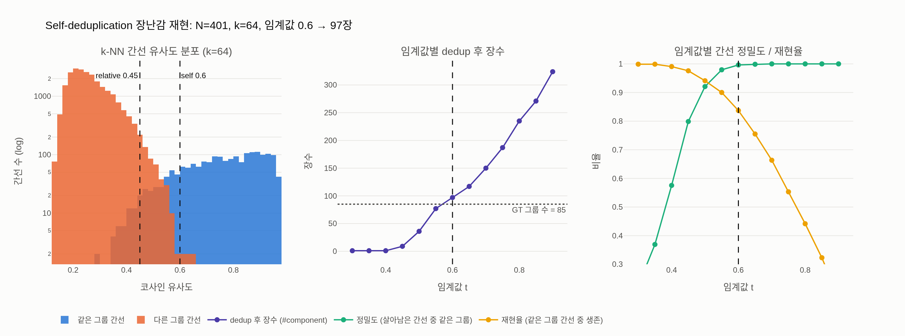

# Self-deduplication의 구체적 절차와 임계값은?

> **답:** Pizzi et al.(2022) 임베딩으로 각 이미지의 $k=64$ 최근접 이웃을 코사인 유사도로 검색하고, 유사도 $>0.6$인 이웃만 고려해 k-NN 그래프의 connected component를 추출한다. 각 component당 대표 1장만 남겨 13억 → 11억 장이 된다.

출처: DINOv2 논문(Oquab et al., 2023, arXiv 2304.07193) §3 "Data Processing"의 **Deduplication** 문단과 Appendix **A.3 Deduplication**.

## 1. 파이프라인 안에서의 위치

논문 Figure 3은 LVD-142M을 만드는 세 단계를 보여준다.

- **Embedding**: uncurated 데이터(위, 회색 원통)와 curated 데이터(아래, 주황 원통)의 모든 이미지를 임베딩 벡터(그림의 작은 격자 막대)로 바꾼다.
- **Deduplication**(가운데 점선 구간): uncurated 쪽에만 적용된다. 그림에서 같은 파스타 사진이 세 번 등장하는데, 두 장에 빨간 X가 찍혀 **한 장(대표)만 남는다**. 자동차·다른 음식 사진은 서로 다른 이미지라 그대로 통과한다.
- **Retrieval**: dedup을 통과한 uncurated 이미지 중 curated 이미지와 가까운 것만 골라(grey-out된 것은 탈락) curated 데이터를 증강한다.

즉 self-deduplication은 "retrieval 이전에 uncurated 풀 자체의 중복을 없애는" 전처리 단계다. 본문(§3)의 표현으로는 "redundancy를 줄이고 diversity를 높이기 위해" 수행한다.

## 2. 절차를 단계별로

Appendix A.3의 문장을 그대로 분해하면 다음 4단계다.

| 단계 | 내용 | 수치 |
|---|---|---|
| ① 임베딩 | 13억 장 uncurated 이미지 각각을 Pizzi et al.(2022)의 copy-detection 임베딩(SSCD)으로 변환 | 1.3B |
| ② k-NN 검색 | 각 이미지에 대해 코사인 유사도 기준 최근접 이웃 $k$개 검색 | $k=64$ |
| ③ 간선 필터 + 그래프 | 유사도 $>0.6$인 이웃 쌍만 간선으로 남긴 k-NN 그래프에서 **connected component** 추출("scalable disjoint set" 즉 union-find 사용) | 임계값 0.6 |
| ④ 대표 선택 | component마다 **1장만** 유지, 나머지는 제거 | 1.3B → **1.1B** |

코사인 유사도는 A.2에 정의된 그대로다:

$$m(s,r)=\frac{f(s)\cdot f(r)}{\lVert f(s)\rVert_2\,\lVert f(r)\rVert_2}$$

$f$는 임베딩 모델, $s,r$은 비교할 두 이미지. 벡터를 L2 정규화해 두면 내적이 곧 유사도가 되어 Faiss의 inner-product 검색으로 바로 처리할 수 있다.

## 3. 왜 SSCD(Pizzi et al., 2022) 임베딩인가

Pizzi et al.(2022) "A Self-Supervised Descriptor for Image Copy Detection"(SSCD)은 **copy detection**에 특화된 self-supervised 디스크립터다.

- 일반적인 SSL 특징(DINO, SimCLR 등)은 "의미가 같은" 이미지를 가깝게 만든다. 예컨대 서로 다른 두 골든리트리버 사진도 매우 가깝다. 이런 임베딩으로 dedup을 하면 **같은 개념의 서로 다른 이미지**까지 지워 버려 데이터 다양성이 오히려 줄어든다.
- SSCD는 **같은 원본에서 파생된 편집본**(crop, resize, 재압축, 워터마크, 색조 변경, 텍스트 오버레이 등)만 가깝게 두고, 의미만 비슷한 다른 사진은 멀리 두도록 학습한다(SimCLR 계열 대조학습 + entropy regularization으로 디스크립터 공간을 넓게 펴고, 강한 augmentation을 "복사본"으로 정의). 그래서 유사도가 "같은 그림인가"라는 질문에 직접 대응하고, 임계값 하나(0.6)로 잘라도 의미가 명확하다.
- 실제로 DINOv2가 dedup 대상으로 삼는 것은 웹 크롤에서 반복적으로 나오는 **near-duplicate**(썸네일, 리사이즈, 재업로드)다. 이는 A.1에 언급된 URL 수집 후처리의 PCA hash dedup(거의 픽셀 동일본만 잡음)보다 훨씬 넓은 범위다.

## 4. 왜 "쌍별 비교"가 아니라 "k-NN 그래프 + connected component"인가

단순히 "유사도 $>0.6$인 쌍을 찾아 한쪽을 지운다"고 하지 않고 그래프의 연결 요소를 쓰는 이유는 **전이성(transitivity)** 때문이다.

- 이미지 A(원본), B(살짝 크롭), C(B를 다시 리사이즈+압축)가 있을 때 $m(A,B)>0.6$, $m(B,C)>0.6$이지만 $m(A,C)$는 0.6 아래일 수 있다. 쌍별 처리라면 A–B에서 하나를 지우고 B–C에서 하나를 지우는 순서에 따라 결과가 달라지고, A와 C가 둘 다 살아남을 수도 있다.
- connected component는 "간선으로 이어진 경로가 존재하면 같은 묶음"이므로 A, B, C가 **한 component**가 되어 정확히 1장만 남는다. 결과가 처리 순서에 무관하고 결정적이다.
- 데이터 구조로는 union-find(disjoint set)가 자연스럽다. 간선 $(i,j)$를 하나씩 `union`하면 되고, 13억 노드 규모에서도 거의 선형 시간에 처리된다("scalable disjoint set data structure implementation").
- $k=64$의 의미: 각 노드가 최대 64개 간선만 갖는 **희소 그래프**다. 중복본이 64장 넘게 있는 이미지도 있겠지만, 그 경우에도 이웃끼리 서로 이어지므로 component로는 합쳐진다. $k$를 모든 쌍으로 늘리지 않고 64로 자르는 것은 계산량과 저장량($N\times k$ 간선)을 제한하기 위한 실용적 선택이다.

한편 전이성은 위험도 있다. 임계값이 너무 낮으면 "A~B~C~D…" 체인이 길어져 서로 다른 이미지가 거대한 component로 뭉개지는 **과병합**이 일어난다. 그래서 self-dedup에서는 상대적으로 높은 0.6을 써서 "정말 같은 그림"만 묶는다.

## 5. "대표 1장"의 의미와 13억 → 11억

- component마다 1장만 남긴다는 것은 **어떤 장이 남는지는 중요하지 않다**는 뜻이다. 목적은 "이 시각적 콘텍스트가 학습 데이터에 한 번만 등장하게" 하는 것이고, near-duplicate끼리는 학습 신호가 사실상 같으므로 임의의 하나(구현상 보통 component의 첫 인덱스)를 택해도 된다.
- 1.3B → 1.1B는 약 **15%** 감소다. 웹 크롤 데이터는 대부분 unique이지만, 인기 이미지(로고, 밈, 상품 사진, 뉴스 사진)는 수십~수천 번 재업로드되므로 이 정도 중복이 나온다. 중복을 제거하면 (1) 같은 이미지에 대한 과적합·암기 위험이 줄고, (2) 같은 compute로 더 다양한 이미지를 보게 되며, (3) 이후 retrieval 단계에서 한 curated 이미지의 이웃 $k$개가 "같은 사진 $k$장"으로 채워지는 일을 막는다.

## 6. 이어지는 relative deduplication(0.45)과의 차이

A.3의 두 번째 문단은 **relative deduplication**이다. 절차는 같지만 목적·대상·임계값·삭제 규칙이 다르다.

| | Self-dedup | Relative dedup |
|---|---|---|
| 비교 대상 | uncurated 풀 내부 서로 | uncurated 풀 ↔ **평가 데이터셋의 train/test split** |
| 임계값 | $>0.6$ | $>0.45$ (더 엄격 = 더 많이 잡음) |
| 삭제 규칙 | component당 대표 1장 **남김** | 평가셋 이미지가 속한 component를 **통째로 버림** |
| 목적 | 중복 제거, 다양성 | **벤치마크 오염 방지**(test leakage) |
| 결과 | 1.3B → 1.1B | 1.1B → **744M** |

임계값이 0.45로 낮은 이유는 오류의 비용이 비대칭이기 때문이다. self-dedup에서 진짜 중복을 하나 놓치면 데이터가 조금 중복될 뿐이지만, relative dedup에서 test 이미지의 변형본을 놓치면 평가 점수가 부풀려져 논문의 결론 자체가 흔들린다. 그래서 재현율을 우선해 문턱을 낮추고, 대표를 남기지 않고 전부 버린다. 본문 §3에도 "We also remove near-duplicates of images contained in the test or validation set of any benchmark used in this work"라고 명시돼 있다.

## 7. 대규모 k-NN을 Faiss로 처리한 방법

13억 × 13억 유사도 행렬은 계산할 수 없으므로 §3 "Implementation Details"에 따르면 다음처럼 처리했다.

- **Faiss**(Johnson et al., 2019)의 **GPU 가속 인덱스**를 사용해 배치 단위로 최근접 이웃을 검색.
- 인덱스 종류는 **IVF + PQ**(inverted file index with product quantization codes; Jégou et al., 2010): 벡터 공간을 coarse quantizer로 수만~수십만 개 셀로 나눠(IVF) 질의와 가까운 몇 개 셀만 탐색하고, 각 벡터는 PQ 코드로 압축해 메모리에 올린다. 정확한 k-NN이 아닌 근사 k-NN이지만 dedup 목적에는 충분하다.
- 코사인 유사도는 정규화된 벡터의 내적이므로 inner-product metric으로 검색한다.
- 하드웨어는 **V100-32GB × 8 GPU 노드 20대**, dedup과 retrieval을 포함한 전체 파이프라인이 **2일 미만**에 완료됐다.
- 검색 결과(각 이미지의 이웃 64개 + 유사도)는 그대로 그래프의 간선 목록이 되고, 유사도 $>0.6$ 필터 후 union-find로 component를 만든다.

## 8. 한 줄 정리

> SSCD 임베딩 → Faiss(GPU IVF-PQ)로 $k=64$ 코사인 k-NN → 유사도 $>0.6$ 간선만 남긴 그래프 → union-find로 connected component → component당 1장 유지 → 1.3B에서 1.1B로. 이어서 평가셋 기준 relative dedup($>0.45$, component 전체 삭제)으로 744M.

## 시각화

`expy.py`는 합성 임베딩(N≈400, D=32, 그룹 크기 1~8)으로 위 절차를 재현한다. 왼쪽은 k-NN 간선의 유사도 분포(같은 그룹 vs 다른 그룹, 0.6과 0.45 선 표시), 가운데는 임계값별 dedup 후 장수(점선 = 실제 그룹 수), 오른쪽은 간선 정밀도/재현율이다. 임계값이 낮으면 다른 그룹 간선이 새어 들어와 component가 과병합되고(정밀도↓, 장수가 실제 그룹 수 아래로 붕괴), 높으면 느슨한 그룹이 갈라진다(재현율↓). 0.6은 정밀도가 거의 1에 도달하는 지점이다. 또한 스크립트는 A–B, B–C만 0.6을 넘고 A–C는 넘지 않는 세 벡터가 한 component로 묶이는 전이적 병합을 직접 확인한다.

