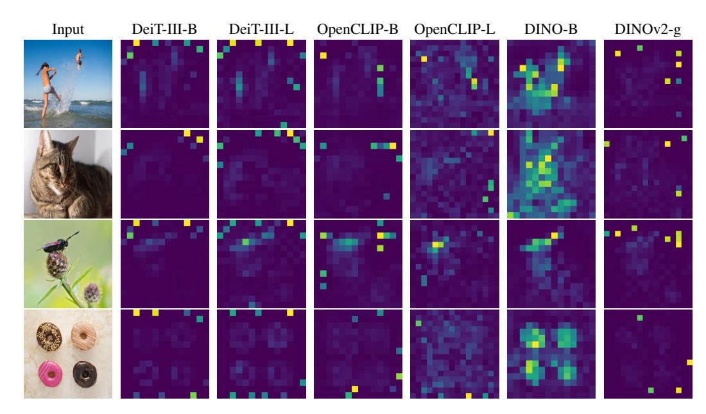

# "Vision Transformers Need Registers"가 발견한 핵심 문제

**Q.** 논문 "Vision Transformers Need Registers"가 발견한 핵심 문제는 무엇인가?

**A.** 지도학습·자기지도학습 ViT **모두**의 feature map에 **artifact**가 존재한다는 것. 이 artifact는 이미지의 **정보량이 적은 배경 영역**에서 **추론 중** 나타나는 **high-norm token**으로, 모델이 **내부 연산 용도로 재활용(repurpose)** 하는 토큰이다.

---

## 1. 발견의 출발점 — "DINOv2는 왜 LOST와 안 맞지?"

저자들(Darcet, Oquab, Mairal, Bojanowski / FAIR·Inria, ICLR 2024)이 이 문제를 파게 된 계기는 실용적인 이상 현상이었다.

- DINO는 마지막 attention layer가 의미적으로 일관된 객체 영역에 자연스럽게 집중해서, LOST 같은 **비지도 객체 발견(unsupervised object discovery)** 알고리즘의 토대가 되었다.
- 그런데 후속작인 DINOv2는 dense prediction(깊이 추정, 세그멘테이션)에서 훨씬 강한데도 **LOST와는 놀랍도록 궁합이 나빴다.** 지도학습 백본과 비슷한 수준의 실망스러운 성능만 나왔다.
- 원인을 추적해 보니 DINOv2의 feature map에 **DINO에는 없던 artifact**가 있었다. 그리고 같은 눈으로 지도학습 ViT를 봤더니 **거기에도 똑같은 artifact가 있었다.**

즉 결론이 뒤집힌다: **DINO가 예외이고, DINOv2 쪽이 ViT의 "기본(baseline) 동작"** 이라는 것.

## 2. 문제의 시각적 증거 — 모든 계열 ViT의 attention map에 튀는 점

*Figure 2 (논문 p.2).* 라벨 지도학습(DeiT-III), 텍스트 지도학습(OpenCLIP), 자기지도학습(DINO, DINOv2)으로 학습된 ViT의 [CLS] attention map을 나란히 놓았다.

그림에서 실제로 관찰되는 것:

- **DINO-B 열(오른쪽에서 두 번째)만** 사람·고양이·나비·도넛의 형태를 따라 attention이 부드럽게 퍼져 있다 — 흔히 "DINO의 아름다운 attention map"으로 알려진 그 그림.
- 나머지 **모든 열(DeiT-III-B/L, OpenCLIP-B/L, DINOv2-g)** 에는 배경 위에 **띄엄띄엄 찍힌 노란 점(peaky outlier)** 들이 보인다. 이 점들은 객체 위가 아니라 하늘, 벽, 균일한 초록 배경, 대리석 바닥처럼 **아무 내용도 없는 영역**에 찍혀 있다.
- 감독 방식(라벨/텍스트/자기지도)과 무관하게 나타난다는 점이 핵심이다 → "자기지도학습 특유의 버그"가 아니라 **ViT 전반의 현상**.

## 3. artifact의 정량적 정체 — norm이 ~10배 튀는 토큰

*Figure 3 (논문 p.3).* 왼쪽은 비글 사진 한 장에 대한 patch token L2 norm 히트맵, 오른쪽은 작은 데이터셋 전체에 대한 norm 분포.

그림에서 실제로 관찰되는 것:

- **DINO norms**: 전체가 고르게 어두운 값(대체로 0~40). 히스토그램도 낮은 값 하나에 몰린 **단봉(unimodal)** 분포.
- **DINOv2 norms**: 대부분은 0~100인데, **개 얼굴이 아닌 흰 배경 쪽에 노란 정사각형 몇 개**가 뚜렷하게 박혀 있다. 히스토그램은 **명확한 이봉(bimodal)** — 낮은 봉우리 하나, 그리고 400~500 근처에 두 번째 봉우리.
- 저자들은 이 이봉성 덕분에 아주 단순한 판정 기준을 세운다: **norm > 150이면 "high-norm(=outlier) 토큰"**. (컷오프 값은 모델마다 다를 수 있다.)
- 비율은 전체 토큰의 약 **2.37%** (≈2%). 즉 **소수지만 norm은 약 10배** 튄다.

이것이 "artifact = high-norm token"이라는 답안 문구의 근거다. 답을 외울 때 **"norm 10배, 전체의 약 2%"** 두 숫자를 붙여두면 좋다.

## 4. 언제·어디서 나타나는가

*Figure 4 (논문 p.4).* 40-layer DINOv2 ViT-g 기준.

- **(a) layer 축**: 초반 layer에서는 모든 토큰의 norm이 낮게 붙어 있다가, **약 15번째 layer 근처(40층 중 중간)** 에서 위쪽으로 갈라져 나오는 별도의 가지가 생긴다 → outlier는 **모델 중간층에서 분화**한다.
- **(b) 학습 iteration 축**: 학습 **1/3 지점을 지난 뒤에야** 고-norm 가지가 나타난다 → **충분히 오래 학습해야** 생긴다.
- **(c) 모델 크기 축**: T, S, B에는 없고 **L, H, g** 에서만 위쪽 가지가 보인다 → **ViT-Large 이상의 큰 모델**에서만 생긴다.

정리하면 조건은 **"충분히 크고(≥ViT-L), 충분히 오래 학습된"** 모델. 그리고 **학습 중에 생겨서 추론 시점에 관측되는** 현상이므로 답안의 "추론 중 나타나는(appearing during inference)"이라는 표현은 "forward pass의 출력 feature에서 관측된다"는 뜻으로 읽으면 된다.

## 5. 왜 하필 배경인가, 그리고 그 토큰은 무엇을 담고 있나

**어디에 생기나 (Fig. 5a)**: patch embedding 직후에 각 patch와 상하좌우 4개 이웃 patch의 코사인 유사도를 재보면, high-norm이 될 patch들은 **이웃과 매우 유사한 patch**들이다. 즉 **추가 정보가 거의 없는 중복(redundant) 영역** — 하늘, 벽 같은 균일한 배경. Fig. 2에서 노란 점이 배경에만 찍혔던 것과 정확히 일치한다.

**무엇을 잃었나 (Fig. 5b, linear probing)**: 이 토큰들 위에 선형 모델을 얹어

- **위치 예측(position prediction)**: 정확도가 일반 토큰보다 **훨씬 낮다** → 자기 patch가 이미지 어디였는지를 잊었다.
- **픽셀 복원(pixel reconstruction)**: 역시 **훨씬 낮다** → 원래 patch의 픽셀 정보를 버렸다.

즉 **local 정보를 폐기**했다.

**무엇을 얻었나 (Table 1)**: 반대로 patch token 하나만 뽑아 이미지 전체를 분류하게 시키면(logistic regression),

| | IN1k | Aircraft | CUB | Cars | Flowers | Pets |
|---|---|---|---|---|---|---|
| [CLS] | 86.0 | 87.3 | 91.3 | 91.5 | 99.7 | 96.9 |
| normal patch | 65.8 | 17.1 | 18.6 | 10.8 | 59.5 | 47.8 |
| **outlier patch** | **69.0** | **79.1** | **84.9** | **85.2** | **99.6** | **94.1** |

outlier 토큰은 일반 patch 토큰을 압도하고 **거의 [CLS] 수준의 global 정보**를 담고 있다.

**→ 논문의 가설(Sec. 2.2):** *크고 충분히 학습된 모델은 중복된 토큰을 알아보고, 그 자리를 global 정보를 **저장·처리·인출**하는 공간으로 재활용한다.* 이것이 답안의 "모델이 내부 연산 용도로 재활용하는 토큰"이라는 표현이다. 행위 자체가 나쁜 건 아니지만, 그 일이 **patch token 안에서 벌어지는 것**이 문제다 — 그 patch의 local 정보가 파괴되고, dense prediction 성능과 attention map 해석 가능성이 함께 망가진다.

## 6. 해법(문맥용) — register token

문제 정의가 위와 같으므로 처방도 자연스럽다: 모델이 몰래 patch를 훔쳐 쓰지 않도록, **쓰라고 만들어 준 여분의 토큰을 준다.**

- patch embedding 직후 [CLS]처럼 **학습 가능한 토큰 N개를 추가**하고, 출력에서는 **그냥 버린다**(patch token과 [CLS]만 사용).
- 결과: **norm outlier가 완전히 사라지고**(Fig. 7), attention map이 DINO처럼 부드러워지며(Fig. 1), ImageNet/ADE20k/NYUd 성능은 유지되거나 소폭 향상(DINOv2 ADE20k mIoU 46.6 → 47.9), LOST 객체 발견은 크게 개선(DINOv2 VOC07 corloc 35.3 → 55.4).
- **1개만 넣어도 artifact는 사라지고**, dense task에는 최적 개수가 존재. 논문은 **4개**를 사용.
- 아이디어 자체는 NLP의 Memory Transformer(Burtsev et al., 2020)에 있었지만, 이 논문의 새로운 기여는 **"그 메커니즘이 ViT 안에서 이미 자생적으로 일어나고 있으며, register는 그것을 만드는 게 아니라 격리(isolate)하는 것"** 이라는 통찰이다.

## 7. 암기 포인트

- 대상: **지도학습(DeiT-III) + 텍스트 지도(OpenCLIP) + 자기지도(DINOv2) 전부** — DINO만 예외.
- 증상: feature map / attention map의 **artifact**.
- 정체: **high-norm outlier token** (norm ~10배, 전체의 ~2%, 컷오프 150).
- 위치: **정보량 적은 중복 배경 patch**.
- 성질: **local 정보(위치·픽셀) 상실 + global 정보 보유**.
- 해석: 모델이 **내부 연산용 스크래치 공간으로 재활용**.
- 조건: **ViT-L 이상**, **학습 1/3 이후**, **중간층(~15/40)부터** 분화.
