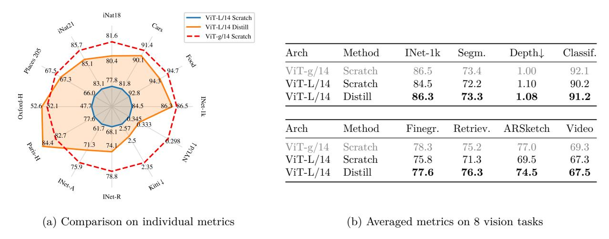

# DINOv2가 소형 모델을 만드는 방식과 그 이유

> **Q.** DINOv2가 소형 모델을 만드는 방식과 그 이유는?
> **A.** 처음부터 학습하는 대신 가장 큰 ViT-g에서 knowledge distillation한다. ablation 결과 ViT-L조차 scratch 학습보다 증류가 더 좋은 성능을 냈다.

출처: Oquab et al., *DINOv2: Learning Robust Visual Features without Supervision* (arXiv 2304.07193v2) — Sec. 5 "Model distillation", Sec. 6.5 "Impact of Knowledge Distillation", Fig. 5, Appendix Table 16–17.

---

## 1. 한 줄 요약

DINOv2 가족(ViT-S/B/L/g) 중 **처음부터(from scratch) 학습하는 모델은 ViT-g/14 하나뿐**이다. 나머지 ViT-S/14, ViT-B/14, ViT-L/14는 이 ViT-g를 **얼려둔 teacher**로 삼아 **knowledge distillation**으로 얻는다. 이유는 단순하다 — 실험해 보니 같은 크기라도 **증류한 모델이 scratch 모델보다 모든 벤치마크에서 더 좋았기** 때문이다. 그것도 소형 ViT-S/B만 아니라 3억 파라미터급 ViT-L에서도 그랬다.

## 2. 왜 이런 선택을 했나 — 배경

논문의 기술적 개선(KoLeo loss, Sinkhorn-Knopp centering, untying head, 고해상도 적응, FlashAttention/FSDP 등)은 대부분 **"큰 모델을 대량 데이터로 안정적으로 빠르게 학습시키기"**를 목표로 한다. 즉 학습 레시피 자체가 ViT-g 같은 대형 모델에 최적화돼 있다.

소형 모델에는 두 가지 선택지가 있다.

| 방식 | 장점 | 단점 |
|---|---|---|
| 각 크기를 scratch로 SSL 학습 | 독립적, 단순 | 소형 모델은 SSL 목표를 스스로 풀기 어려워 성능이 낮음. 크기마다 하이퍼파라미터 재조정 필요 |
| **ViT-g에서 증류** | 대형 모델이 이미 찾아낸 좋은 표현을 그대로 흡수. 학습 안정적 | teacher가 먼저 있어야 함 (DINOv2는 이미 ViT-g를 학습했으므로 비용이 아님) |

Knowledge distillation(Hinton et al., 2014)의 기본 아이디어는 "**큰 모델의 출력을 작은 모델이 흉내 내도록**, 같은 입력에 대한 두 출력 간 거리를 최소화"하는 것이다. DINO/iBOT 계열 목표함수는 애초에 teacher(EMA) → student로의 self-distillation 형태이므로, DINOv2는 **기존 학습 루프를 거의 그대로 재사용**할 수 있었다.

## 3. 구체적 증류 절차 (Sec. 5)

일반 DINOv2 학습 루프와의 차이점만 정리하면:

1. **Teacher = 학습 완료된 ViT-g/14, frozen.** 일반 학습에서는 teacher가 student의 EMA이지만, 증류에서는 더 큰 별도 모델을 고정해 둔다.
2. **Student의 EMA를 따로 유지**하고, 이 EMA를 **최종 모델**로 사용한다 (teacher 역할은 안 하지만 가중치 평균 효과를 얻기 위해).
3. **Masking 제거** — iBOT식 patch masking을 하지 않는다.
4. **Stochastic depth 제거** (drop-rate 0).
5. **iBOT loss를 두 global crop에 적용.**
6. Duval et al. (2023)의 증류 방법과 거의 같지만, loss 항을 증류용으로 바꾸지 않고, student의 EMA를 평가한다는 점이 다르다.

하이퍼파라미터 차이는 Appendix Table 16에 정리돼 있다.

| 모델 | 방식 | Drop-rate | LR | Batch | FFN |
|---|---|---|---|---|---|
| DINOv2-S (ViT-S/14) | distilled | 0 | 1e-3 | 2048 | MLP |
| DINOv2-B (ViT-B/14) | distilled | 0 | 1e-3 | 2048 | MLP |
| DINOv2-L (ViT-L/14) | distilled | 0 | 1e-3 | 2048 | MLP |
| DINOv2-L (ViT-L/14) | from scratch (ablation용) | 0.4 | 3.5e-4 | 3072 | SwiGLU |
| DINOv2-g (ViT-g/14) | from scratch | 0.4 | 3.5e-4 | 3072 | SwiGLU |

관찰 포인트: 증류 모델은 정규화(stochastic depth)를 끄고 LR을 약 3배 높게 쓴다. teacher가 안정적인 목표를 주니 정규화 없이도 과적합·붕괴 위험이 적다는 뜻이다. 또 증류 모델은 FFN을 SwiGLU 대신 평범한 MLP로 쓴다(공개 배포 모델의 단순성).

## 4. Ablation 근거 — Figure 5

논문은 "ViT-L/14를 scratch로 학습" vs "ViT-L/14를 ViT-g/14에서 증류"를 12개 벤치마크에서 비교하고, teacher인 ViT-g/14 성능을 topline으로 함께 표시했다.

그림에서 읽을 수 있는 것:

- **(a) 레이더 차트.** 파란 실선 = ViT-L/14 Scratch, 주황 실선 = ViT-L/14 Distill, 빨간 점선 = ViT-g/14 Scratch (teacher). **주황 다각형이 파란 다각형을 12개 축 모두에서 바깥으로 감싸고 있다** — 즉 증류가 scratch를 한 곳도 빠짐없이 이겼다.
  - 예: INet-1k 84.5 → 86.3, iNat18 77.8 → 80.4, Cars 81.8 → 90.1, Food 92.8 → 94.3, Places205 66.0 → 67.3, INet-A 61.7 → 71.3, INet-R 68.1 → 74.1, Paris-H 77.6 → 84.4, Oxford-H 47.7 → 52.6.
  - depth 지표(NYUd↓ 0.345 → 0.333, Kitti↓ 2.57 → 2.5)는 낮을수록 좋고, 여기서도 증류가 낫다.
- **Teacher를 넘는 경우도 있다.** Oxford-H(52.6 vs 52.1), Paris-H(84.4 vs 82.7)에서는 증류된 ViT-L이 ViT-g teacher보다 높다. 캡션에 "sometimes even outperforming the distillation target"이라고 쓴 이유다.
- **(b) 8개 태스크 평균 표.** 증류 ViT-L은 모든 열에서 scratch ViT-L을 앞선다.

| 태스크 | ViT-g Scratch (teacher) | ViT-L Scratch | **ViT-L Distill** |
|---|---|---|---|
| INet-1k | 86.5 | 84.5 | **86.3** |
| Segm. | 73.4 | 72.2 | **73.3** |
| Depth ↓ | 1.00 | 1.10 | **1.08** |
| Classif. | 92.1 | 90.2 | **91.2** |
| Finegr. | 78.3 | 75.8 | **77.6** |
| Retriev. | 75.2 | 71.3 | **76.3** (teacher 초과) |
| ARSketch | 77.0 | 69.5 | **74.5** |
| Video | 69.3 | 67.3 | **67.5** |

특히 INet-1k와 Segmentation은 증류 ViT-L이 teacher와 0.1~0.2p 차이로 거의 동급이고, Retrieval 평균은 teacher를 넘는다. ARSketch(도메인 시프트)에서 +5p라는 큰 격차가 나는 것도 눈에 띈다 — 대형 모델의 강건성이 함께 전달된다는 신호다.

## 5. 왜 "ViT-L조차"가 중요한 문장인가

증류는 흔히 "작은 모델(ViT-S/B)용 압축 기법"으로 생각된다. 그런데 ViT-L/14는 약 3억 파라미터로, 그 자체가 SSL 문헌에서 대형 모델로 취급되던 크기다. 그런 모델도 **스스로 학습하는 것보다 1B 모델을 따라가는 편이 낫다**는 결과는:

- DINOv2의 "크게 학습하고 증류로 내려보내기" 전략이 단순 비용 절감이 아니라 **성능 면에서도 우월한 기본 레시피**임을 보여준다.
- 결론(Sec. 8)에서도 DINOv2 성능의 4대 요인 중 하나로 "iv) 증류 과정이 작은 모델이 가장 강한 ViT-g의 성능을 누리게 해준다 (Fig. 5)"를 명시한다.
- 실제로 공개된 `dinov2_vits14`, `dinov2_vitb14`, `dinov2_vitl14`는 모두 증류 모델이고, `dinov2_vitg14`만 scratch 모델이다.

## 6. 기억 포인트 (암기용)

- **어떻게**: 학습 완료된 **ViT-g/14를 frozen teacher**로 두고, 같은 DINOv2 학습 루프로 S/B/L을 증류. student의 **EMA가 최종 모델**. masking·stochastic depth 제거, iBOT loss는 global crop 2개에.
- **왜**: **증류 > scratch**가 12/12 벤치마크에서 성립. **ViT-L에서도** 그랬고, retrieval 등 일부에서는 **teacher조차 넘었다** (Fig. 5).
- 연결 개념: Hinton et al. 2014 KD, DINO의 self-distillation 구조, Duval et al. 2023.
