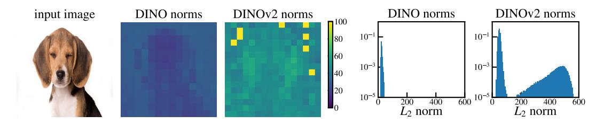

# Fig. 2 — artifact가 없는 유일한 모델은 DINO

출처: *Vision Transformers Need Registers* (Darcet et al., ICLR 2024), Figure 2

## 정답 요약

Fig. 2는 네 종류의 학습 방식으로 만들어진 ViT의 마지막 층 attention map을 나란히 놓고 비교한다.

| 감독 방식 | 모델 | artifact |
|---|---|---|
| label supervision (분류 라벨) | DeiT-III | 있음 |
| text supervision (이미지-텍스트 정렬) | OpenCLIP | 있음 |
| self-supervision | **DINO** | **없음** |
| self-supervision | DINOv2 | 있음 |

즉 **자기지도 여부가 기준이 아니다**. 같은 self-supervision 계열인 DINO와 DINOv2가 정반대로 갈린다.
논문의 표현대로 "all models but DINO exhibit peaky outlier values in the attention maps" —
DINO만 예외이고, DINOv2는 오히려 **일반적인 ViT의 기본 행동(baseline behavior)에 부합**한다.

## 그림에서 실제로 보이는 것

- 레이아웃: 맨 왼쪽이 **Input**(해변의 사람, 고양이, 꽃 위의 곤충, 도넛 4장), 오른쪽으로
  **DeiT-III-B / DeiT-III-L / OpenCLIP-B / OpenCLIP-L / DINO-B / DINOv2-g** 6개 열.
  모델 "종류"는 넷이고, DeiT-III와 OpenCLIP은 Base/Large 두 크기씩 보여준다.
- **DINO-B 열(오른쪽에서 두 번째)만 다르게 보인다.** 여기서는 밝은(노랑~연두) 영역이
  피사체 위에 **덩어리로 뭉쳐서** 나타난다 — 수영하는 사람의 몸통, 고양이의 얼굴과 몸,
  도넛 4개의 위치. 그래서 attention map만 봐도 물체 실루엣이 읽히고,
  이 성질 덕분에 LOST 같은 unsupervised object discovery가 DINO 위에서 동작했다.
- 나머지 다섯 열(DeiT-III ×2, OpenCLIP ×2, DINOv2-g)에서는 밝은 점이 **1~2 패치짜리 낱개 점**으로
  흩어져 있고, 위치가 **물체와 무관하다**. 특히 이미지 **위쪽 가장자리와 모서리, 하늘/벽/배경처럼
  균일한 영역**에 노란 점이 몰려 있다(예: 해변 사진의 하늘, 고양이 사진의 흰 벽,
  도넛 사진의 대리석 바닥, 각 패널 맨 윗줄). 배경은 전체적으로 어두운 보라(낮은 attention)인데
  그 위에 소수의 픽셀만 튀어 오르는 이 모습이 바로 "peaky outlier value" = **artifact**다.
- 관찰 포인트: artifact는 정보량이 적은(주변 패치와 비슷한) 배경 패치에 생긴다.
  모델이 쓸모없는 패치를 골라 전역 정보 저장용으로 재활용한다는 것이 논문의 해석이고,
  이를 대신 받아 줄 **register token**을 넣는 것이 해법이다(Fig. 1 / Sec. 3).

## 왜 DINO만 예외인가

Fig. 3~4의 정량 분석이 이유를 설명한다.

- Fig. 3: 같은 강아지 이미지에 대해 DINO의 patch token norm map은 전체가 고르게 어둡지만,
  DINOv2는 몇 개 패치만 노랗게 튄다. 오른쪽 히스토그램에서 DINO는 단봉(unimodal)인 반면
  DINOv2는 **bimodal**이고, norm이 150을 넘는 토큰이 약 **2.37%**다. artifact 토큰은 다른 토큰보다
  norm이 대략 **10배** 크다 → attention map의 뾰족한 점과 같은 토큰이다.
- Fig. 4: 이 outlier는 (a) 40층 ViT-g에서 **약 15층 근처(중간층)** 부터 분화하고,
  (b) 학습의 **1/3 지점 이후**에 나타나며, (c) **ViT-Large 이상 크기**에서만 나타난다.
- Fig. 2의 DINO는 **ViT-B/16**이다. 즉 "large 이상 + 충분히 긴 학습"이라는 발생 조건을 만족하지
  않아 artifact가 없었던 것에 가깝다. DINO가 특별히 우월해서가 아니라 **DINO 쪽이 예외 사례**이고,
  DINOv2가 보통의 ViT와 같은 행동을 한다는 것이 논문의 주장이다.
  (DeiT-III-B, OpenCLIP-B처럼 Base 크기에서도 artifact가 보이는 것은 학습 레시피/데이터 차이 때문이며,
  발생 조건은 모델·학습 방식마다 다르게 걸린다.)

## 함정 포인트

- "self-supervised라서 깨끗하다"고 외우면 DINOv2에서 틀린다. **DINO만** 예외다.
- artifact = attention map의 뾰족한 밝은 점 = 출력 토큰 norm이 10배 큰 high-norm outlier token.
  세 표현이 같은 현상을 가리킨다.
- Fig. 2의 열은 6개지만 "종류"는 DeiT-III / OpenCLIP / DINO / DINOv2 네 가지다.
