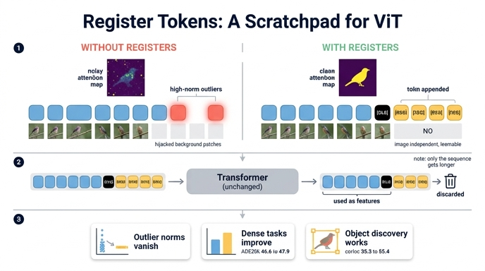

# 제안 해결책: register 토큰

> **Q.** 이 논문이 제안하는 해결책은 무엇인가?
> **A.** Vision Transformer의 입력 시퀀스에 추가 토큰(register)을 넣어 그 내부 연산 역할을 대신 맡게 하는 것이다. 매우 단순하지만 지도·자기지도 모델 모두에서 artifact를 완전히 제거한다.

출처: Darcet et al., *Vision Transformers Need Registers* (ICLR 2024, arXiv 2309.16588)

---

## 1. 무엇을 고치려는 것인가 (문제 요약)

논문이 관찰한 현상은 이렇다.

- 충분히 크고(ViT-L 이상) 충분히 오래 학습된 ViT는, 출력 patch 토큰 중 약 **2%가 나머지보다 norm이 10배쯤 높은 outlier**가 된다(DINOv2-g 기준 norm 150 초과가 2.37%).
- 이 outlier는 **주변 패치와 거의 똑같은, 정보량이 적은 배경 패치**에서 생긴다.
- 선형 probing으로 재보니 이 토큰들은 자기 **위치 정보와 픽셀 정보를 거의 잃어버린 대신**, 이미지 전체에 대한 **전역 정보**를 담고 있다(patch 하나만으로 ImageNet 69.0% vs 일반 patch 65.8%, CUB는 84.9 vs 18.6).

즉 **가설**: 모델은 "쓸모없는 패치"를 알아보고 그 자리를 **전역 정보를 저장·처리·회수하는 스크래치 공간(scratchpad)** 으로 재활용한다. 이 연산 자체는 나쁘지 않지만, **하필 patch 토큰 위에서 벌어지는 것이 문제**다. 그 자리의 지역 정보가 파괴되어 dense prediction 성능과 attention map 해석성이 망가지기 때문이다.

## 2. 해결책: 전용 낙서장을 따로 준다

> "모델이 어차피 낙서장을 쓸 거라면, 사진 위에 낙서하게 두지 말고 **빈 메모지를 몇 장 끼워 주자**."

구체적 구현은 놀랄 만큼 단순하다.

1. patch embedding 레이어 **직후**, 입력 시퀀스에 학습 가능한 토큰 `[REG1] … [REGN]`을 **N개 덧붙인다**. `[CLS]` 토큰과 똑같은 방식의 learnable parameter이며, **입력 이미지와 무관**하다(이미지로부터 어떤 정보도 받지 않는다).
2. 그대로 Transformer를 통과시킨다. 아키텍처의 다른 부분은 **아무것도 바꾸지 않는다**.
3. 출력단에서 register 토큰은 **그냥 버린다**. 학습·추론 모두에서 최종 표현으로는 기존과 동일하게 `[CLS]` + patch 토큰만 사용한다.
4. 손실 함수, 학습 레시피, 데이터는 전부 그대로. 즉 **순수한 아키텍처 한 줄짜리 변경**이라 DeiT-III / OpenCLIP / DINOv2 어디에든 그대로 얹을 수 있다.

그림에서 읽어야 할 포인트:

- 아래쪽 입력 줄: 파란색 = 이미지 패치 토큰, 검정 = `[CLS]`, **노란색 = `[REG1]…[REGN]`**. 노란 토큰 아래에는 **대응하는 이미지 패치 그림이 없다** — 입력 이미지와 독립적인 학습 파라미터라는 뜻이다.
- 위쪽 출력 줄: `output`이라는 대괄호가 파란 patch 토큰과 검정 `[CLS]`만 감싸고 있고, 노란 register 출력 쪽에는 **쓰레기통 아이콘**이 붙어 있다 — 출력값을 어디에도 쓰지 않고 폐기한다는 표시.
- 가운데 회색 박스(`Transformer Model`)는 통째로 그대로다. **register는 층 내부를 건드리지 않고 시퀀스 길이만 N만큼 늘린다.**

핵심 표현을 하나 고르면: register는 **"정보를 만들지도, 읽어내지도 않는 토큰"** 이다. 출력이 쓰이지 않으므로 정보를 모으는 `[CLS]`/DETR object query와도 다르고, 새 정보를 넣는 BERT `[SEP]`과도 다르다. 오직 forward pass 도중 모델이 값을 **적어 두었다가 다시 꺼내 쓰는 레지스터(register)** 역할만 한다.

## 3. 효과: artifact가 "완전히" 사라진다

**(a) attention map이 깨끗해진다** — 지도(DeiT-III), 텍스트 지도(OpenCLIP), 자기지도(DINOv2) 세 계열 모두에서.

왼쪽 `Without registers` 블록에서는 세 모델 모두 배경(하늘, 잔디, 여백)에 **밝은 노란 점들이 흩뿌려져** 있고 정작 물체(벌, 케이블카, 물총새)는 흐릿하다. 오른쪽 `With registers` 블록에서는 그 점들이 사라지고 **물체 윤곽을 따라 attention이 뭉친다**. 원래 DINO만 가지고 있던 "해석 가능한 attention map"이 지도학습 모델에까지 생긴 것이 요점이다.

**(b) high-norm outlier 자체가 소멸한다** — 정성적 인상이 아니라 수치로도 확인된다.

세 패널 모두 왼쪽(기본)에는 낮은 norm 덩어리 위로 **위로 길게 뻗은 outlier 기둥**이 있는데, 오른쪽(`+reg`)에서는 그 기둥이 사라지고 **하나의 좁은 띠만 남는다**. "완전히 제거"라는 답변 문구가 가리키는 것이 바로 이 그림이다.

**(c) 성능은 떨어지지 않고, dense 태스크는 오히려 오른다**

| 모델 | ImageNet Top-1 | ADE20k mIoU | NYUd rmse ↓ |
|---|---|---|---|
| DeiT-III / +reg | 84.7 / 84.7 | 38.9 / **39.1** | 0.511 / 0.512 |
| OpenCLIP / +reg | 78.2 / 78.1 | 26.6 / **26.7** | 0.702 / **0.661** |
| DINOv2 / +reg | 84.3 / **84.8** | 46.6 / **47.9** | 0.378 / **0.366** |

OpenCLIP zero-shot도 59.9 → 60.1로 사실상 동일. 즉 **공짜에 가까운 수정**이다.

**(d) 비지도 object discovery(LOST, corloc)가 되살아난다** — DINOv2 VOC07 35.3 → **55.4**, VOC12 40.2 → 60.0, COCO20k 26.9 → 42.0. DeiT-III도 11.7 → 27.1. (OpenCLIP만 약간 하락.) DINOv2가 LOST와 궁합이 나빴던 원래 미스터리가 이 수정으로 상당 부분 해소된다.

## 4. 세부 사항과 뉘앙스

- **몇 개나 넣나?** 0/1/2/4/8/16으로 ablation. **1개만 넣어도 artifact는 시각적으로 사라진다.** dense 태스크(seg/depth)는 4~8 부근이 최적이고 ImageNet은 많을수록 조금씩 좋아진다. 논문은 전 실험에서 **4개**를 사용했다. → "매우 단순"의 근거.
- **register끼리 역할이 갈린다**: 강제하지 않았는데도 일부 register가 서로 다른 물체에 attend하는, slot attention 비슷한 패턴이 자연 발생했다(Fig. 9).
- **완전한 신규 아이디어는 아니다**: 같은 메커니즘이 NLP의 Memory Transformer(Burtsev et al., 2020) / Recurrent Memory Transformer에 있었고, 비전 fine-tuning용 learnable memory(Sandler et al., 2022)도 있었다. 이 논문의 기여는 **"이 메커니즘을 새로 만드는 것이 아니라, ViT 안에 이미 자생적으로 존재하던 행동을 격리(isolate)해 부작용을 없앤다"** 는 해석이다.
- **한계**: 어떤 학습 요인이 artifact를 만드는지 완전히 규명하지는 못했다(사전학습 방식·모델 크기·학습 길이가 모두 관여). 또 register를 넣어도 DINOv2의 VOC07 corloc(55.4)은 원조 DINO(61.9)에는 아직 못 미친다.

## 5. 한 문장 암기용

> **"모델이 배경 패치를 몰래 스크래치패드로 쓰고 있었으니, 버려도 되는 전용 스크래치패드 토큰 몇 개(register 4개)를 입력에 끼워 주고 출력에서 버린다 — 그러면 artifact가 사라진다."**

## 인포그래픽

