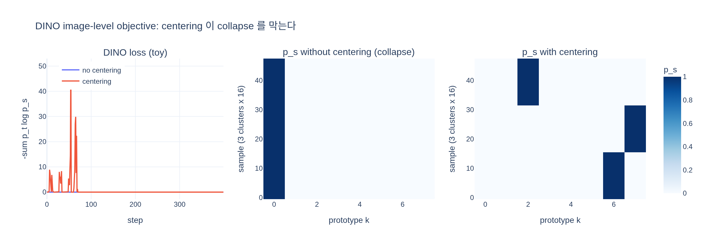

# DINO(image-level) objective는 어떻게 계산되는가?

**한 줄 요약** — 같은 이미지의 서로 다른 crop을 student와 teacher ViT에 넣어 각자의 class token을 얻고, 이를 각자의 DINO head(MLP)에 통과시켜 $K$차원 *prototype score*를 만든다. student 쪽은 softmax로 $p_s$, teacher 쪽은 softmax + centering(또는 Sinkhorn-Knopp)으로 $p_t$를 만든 뒤, 두 분포 사이의 cross-entropy

$$\mathcal{L}_{DINO} = -\sum_{k=1}^{K} p_t^{(k)} \log p_s^{(k)}$$

를 최소화한다. 기울기는 student에만 흐르고, teacher는 student 파라미터의 지수이동평균(EMA)으로 갱신된다.

출처: DINOv2 논문(arXiv 2304.07193) §4 *Discriminative Self-supervised Pre-training* 의 첫 항목 "Image-level objective (Caron et al., 2021)" 및 이 저장소 코드(`dinov2/loss/dino_clstoken_loss.py`, `dinov2/layers/dino_head.py`, `dinov2/train/ssl_meta_arch.py`).

---

## 1. 배경: self-distillation with no labels

DINO(Caron et al., 2021)의 이름은 "self-**di**stillation with **no** labels"에서 왔다. 지식 증류(knowledge distillation)처럼 student가 teacher의 출력 분포를 흉내내지만, 여기서 teacher는 미리 학습된 별도 모델이 아니라 **student 자신의 과거 가중치들의 이동평균**이다. 정답 라벨은 전혀 쓰지 않는다. "같은 이미지의 다른 crop을 보고도 같은 예측을 하라"는 일관성(consistency)만이 학습 신호다.

DINOv2는 이 image-level objective를 그대로 유지하면서 iBOT의 patch-level objective, SwAV식 Sinkhorn-Knopp centering, KoLeo 정규화 등을 결합했다. 이 카드는 그중 image-level 항 하나만 다룬다.

## 2. 계산 단계

### 2-1. 멀티크롭(multi-crop) 입력

한 이미지 $x$에서 무작위 crop들을 만든다(기본 설정 `dinov2/configs/ssl_default_config.yaml`).

| 종류 | 개수 | 해상도 | 원본 면적 비율 | 누가 보는가 |
|---|---|---|---|---|
| global crop | 2 | 224×224 | 0.32 ~ 1.0 | teacher, student 둘 다 |
| local crop | 8 | 96×96 | 0.05 ~ 0.32 | student만 |

teacher는 넓게 보이는 global crop만 받고, student는 global + local 모두 받는다. 그래서 "작은 조각을 보고도 전체를 본 teacher와 같은 답을 내라"는 *local-to-global* 대응이 학습된다.

### 2-2. ViT 백본 → class token

각 crop을 ViT에 넣고 마지막 LayerNorm을 거친 **class token**(코드에서 `x_norm_clstoken`, 차원은 ViT-L이면 1024, ViT-g면 1536)을 꺼낸다. 이미지 하나를 대표하는 벡터다. patch token들은 iBOT 항에서 쓰이고 DINO 항에서는 쓰지 않는다.

### 2-3. DINO head: class token → prototype score

class token을 **DINO head**에 통과시킨다. 논문은 "MLP model outputting a vector of scores, that we call *prototype scores*"라고만 적었고, 구체 구조는 코드 `DINOHead`에 있다.

```
in_dim ─ Linear(→2048) ─ GELU ─ Linear(→2048) ─ GELU ─ Linear(→256)   # 3-layer MLP
       ─ L2 normalize (256차원 단위벡터로)
       ─ weight_norm Linear(256 → K, bias 없음)                        # K = 65,536 prototypes
```

* 마지막 층은 bottleneck 256차원 벡터를 단위벡터로 정규화한 뒤, 역시 크기가 1로 고정된(`weight_g = 1`) $K$개의 가중치 벡터와 내적한다. 즉 **prototype score $= \cos(\text{feature}, \text{prototype}_k)$** 에 가까운 값이며, 각 prototype은 "군집 중심" 역할을 한다.
* $K$는 DINOv2에서 65,536으로 크게 잡았다(Table 1의 "+128k prototypes" 실험은 그보다 큰 값도 시험). 라벨은 없지만 "가상의 6만여 개 클래스"에 대한 분류 문제처럼 보이게 된다.
* student와 teacher는 **각자의** head를 가진다(구조는 동일, 파라미터는 다름). 또 DINOv2는 DINO head와 iBOT head도 분리했다("Untying head weights", Table 1 마지막 행).
* 학습은 float16이지만 DINO head의 기울기만은 float32로 reduce한다(Table 16 캡션) — softmax/log 수치안정성 때문.

### 2-4. student: softmax → $p_s$

student의 prototype score $s\in\mathbb{R}^K$에 온도 $\tau_s = 0.1$을 적용해 확률분포를 만든다.

$$p_s^{(k)} = \frac{\exp(s_k/\tau_s)}{\sum_j \exp(s_j/\tau_s)}$$

코드에서는 `F.log_softmax(s / student_temp)` 로 바로 $\log p_s$를 계산한다.

### 2-5. teacher: softmax + centering(또는 Sinkhorn-Knopp) → $p_t$

teacher의 prototype score $t\in\mathbb{R}^K$는 두 가지 처리를 함께 받는다.

**(a) centering** — 배치 전체 teacher 출력의 이동평균 $c$를 빼준다.

$$c \leftarrow m\,c + (1-m)\,\frac{1}{B}\sum_{i=1}^{B} t_i, \qquad m = 0.9$$

**(b) sharpening** — student보다 낮은 온도 $\tau_t$(30 epoch 동안 0.04 → 0.07로 warmup)로 softmax를 취해 분포를 날카롭게 만든다.

$$p_t^{(k)} = \frac{\exp\big((t_k - c_k)/\tau_t\big)}{\sum_j \exp\big((t_j - c_j)/\tau_t\big)}$$

코드(`DINOLoss.softmax_center_teacher`)는 정확히 `softmax((teacher_output - center) / teacher_temp)`다. 논문 본문은 "softmax followed by a centering"이라고 서술 순서를 적었지만, 실제 구현은 logit에서 center를 빼고 softmax를 취하는 위 형태다. 이 연산 전체는 `@torch.no_grad()` 아래에서 실행된다 — **teacher 쪽으로는 기울기가 흐르지 않는다**(stop-gradient).

center 갱신은 비동기로 처리된다: 현재 배치의 teacher 출력을 `update_center()`로 합산해 두고(`all_reduce`로 GPU 간 합산), 다음 iteration의 `softmax_center_teacher()` 시작 시 `apply_center_update()`가 EMA를 적용한다.

**대안: Sinkhorn-Knopp centering** — `train.centering: sinkhorn_knopp`이면 EMA 대신 SwAV의 SK 알고리즘을 3회 반복한다. $Q = \exp(t/\tau_t)^\top$ ($K\times B$)를 만들고, "각 prototype의 행 합 = 1/K", "각 샘플의 열 합 = 1/B"가 되도록 행·열 정규화를 번갈아 수행한다. 결과적으로 배치 안에서 prototype들이 **균등하게** 샘플을 나눠 갖도록 강제된다. Table 1에서는 k-NN/linear 모두 "=" 로, 성능은 같지만 DINOv2 최종 레시피에 포함되어 있다.

### 2-6. cross-entropy 손실

$$\mathcal{L}_{DINO} = -\sum_{k} p_t^{(k)} \log p_s^{(k)}$$

코드 `DINOLoss.forward`는 `torch.sum(t * lsm, dim=-1)`을 배치 평균한 뒤 부호를 뒤집어 누적한다. $p_t$는 상수(기울기 없음)이므로 이 손실은 $H(p_t, p_s) = H(p_t) + \mathrm{KL}(p_t\,\|\,p_s)$에서 KL 항만 student를 움직인다.

### 2-7. 어떤 crop 쌍끼리 비교하는가

`SSLMetaArch.forward_backward`에서:

* **global ↔ global**: teacher의 global crop A의 $p_t$ ↔ student의 global crop B의 $p_s$, 그리고 그 반대. 코드는 teacher class token 두 덩어리를 **역순으로 이어붙여**(`torch.cat((chunk[1], chunk[0]))`) 같은 crop끼리 자기 자신을 맞추는 항을 배제한다. 항 수 $= 2\times 1 = 2$.
* **global ↔ local**: teacher의 global crop 2개 각각 ↔ student의 local crop 8개. 항 수 $= 2\times 8 = 16$.
* 총 18개 항을 더해 `(n_global_crops_loss_terms + n_local_crops_loss_terms)`로 나눠 평균한다. `dino.loss_weight = 1.0`.

### 2-8. teacher 갱신: EMA

$$\theta_t \leftarrow \lambda\,\theta_t + (1-\lambda)\,\theta_s$$

$\lambda$는 cosine schedule로 0.992(논문 표기 0.994)에서 1까지 올라간다. backbone과 DINO head 모두 이렇게 갱신되며, teacher는 옵티마이저로 학습되지 않는다.

## 3. 왜 centering과 sharpening이 둘 다 필요한가 (collapse 방지)

라벨 없이 "두 출력을 같게 하라"고만 하면 자명한 해(collapse)가 있다.

| collapse 형태 | 무엇이 막는가 |
|---|---|
| 모든 입력에 대해 **한 prototype만** 켜짐 (one-hot 고정) | **centering**: 배치 평균을 빼면 모두가 공유하는 편향이 사라져 한 차원이 지배할 수 없다 |
| 모든 입력에 대해 **균등분포** 출력 | **sharpening**(낮은 $\tau_t$): teacher 목표가 뾰족해져 균등분포로는 손실이 줄지 않는다 |

centering만 쓰면 균등분포로, sharpening만 쓰면 한 차원 지배로 무너진다. 둘의 균형이 핵심이며(DINO 논문 Fig. 7), Sinkhorn-Knopp은 "배치 안에서 prototype별 점유율을 같게" 하는 더 강한 형태의 centering이다.

teacher 쪽 stop-gradient와 EMA도 중요하다: teacher가 student보다 느리게, 그러나 앙상블처럼 더 좋은 목표를 제공해 학습이 안정된다.

## 4. 코드 ↔ 수식 대응표

| 수식/개념 | 코드 위치 |
|---|---|
| DINO head(MLP → L2norm → weight-norm linear) | `dinov2/layers/dino_head.py: DINOHead` |
| $p_s$: `log_softmax(s/τ_s)` | `dinov2/loss/dino_clstoken_loss.py: DINOLoss.forward` |
| $p_t$: `softmax((t-c)/τ_t)` | `DINOLoss.softmax_center_teacher` |
| $c$ EMA 갱신 (m=0.9) | `DINOLoss.update_center / apply_center_update` |
| Sinkhorn-Knopp 3회 반복 | `DINOLoss.sinkhorn_knopp_teacher` |
| $-\sum p_t \log p_s$ 배치 평균 | `DINOLoss.forward` |
| crop 쌍 구성, 18항 평균 | `dinov2/train/ssl_meta_arch.py: SSLMetaArch.forward_backward` |
| $K$=65536, $\tau_s$=0.1, $\tau_t$ 0.04→0.07, 모멘텀 0.992→1 | `dinov2/configs/ssl_default_config.yaml` |

## 5. 논문에서 확인할 수 있는 관련 수치 (Table 1, ViT-L / ImageNet-22k)

| 변경 | k-NN | linear |
|---|---|---|
| +128k prototypes | 76.6 (↑1.2) | 81.9 (↓0.1) |
| +Sinkhorn-Knopp centering | 81.7 (=) | 84.7 (=) |
| +Untying heads (= DINOv2) | 82.0 (↑0.3) | 84.5 (↓0.2) |

prototype 수를 늘리는 것은 k-NN 성능에 크게 기여했고, SK centering은 성능 중립, head 분리는 소폭 이득이었다.

> 참고: 논문의 그림(Fig.1 PCA 시각화, Fig.2 성능 비교, Fig.3 데이터 파이프라인, 부록 정성 결과)은 모두 이 objective의 계산 과정을 직접 그린 것이 아니므로 여기에는 싣지 않았다.

## 시각화

`expy.py`(numpy 토이 실험) 결과. 왼쪽은 학습 곡선, 가운데·오른쪽은 학습 후 student의 $p_s$ 히트맵(행 = 3개 군집 × 16 샘플, 열 = 8개 prototype). centering이 없으면 모든 샘플이 prototype 0 하나로 무너지고(collapse), centering이 있으면 군집마다 다른 prototype을 사용한다 — 두 경우 모두 손실은 0에 가깝다는 점이 핵심이다.


