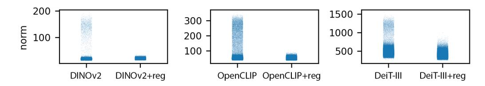
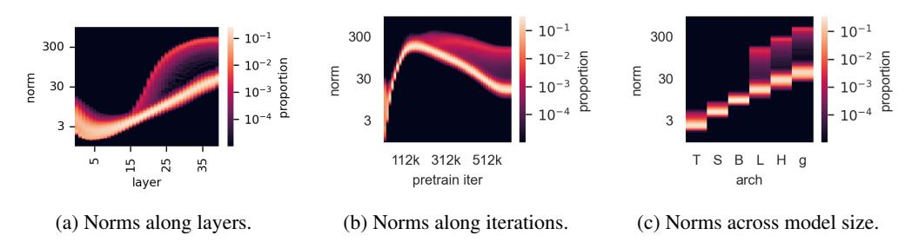
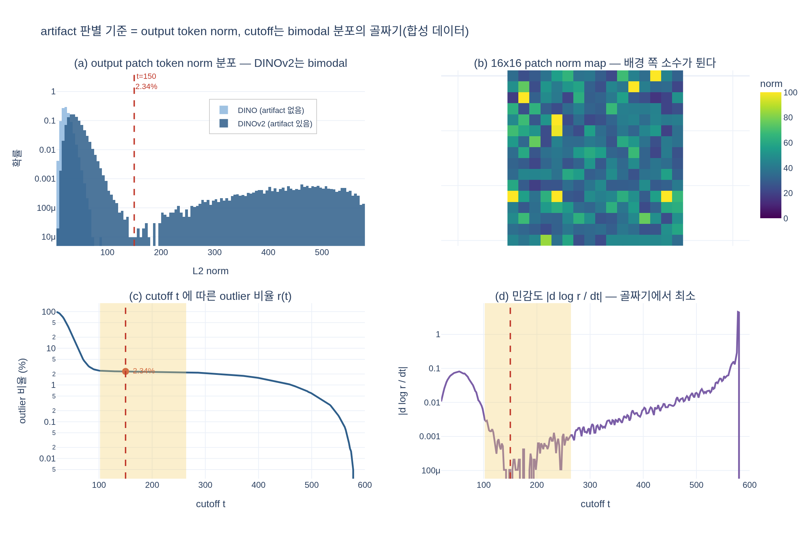

# artifact patch를 정량적으로 구분하는 기준

> 출처: *Vision Transformers Need Registers* (Darcet et al., ICLR 2024, arXiv:2309.16588), §2.1 "Artifacts are high-norm outlier tokens"

## 한 줄 답

**모델 출력단(output)에서의 token embedding L2 norm**이다. 이 norm의 분포가 뚜렷하게 **bimodal**이라서, 논문은 **norm > 150** 인 patch token을 **"high-norm"(= outlier = artifact)** 토큰으로 정의했다.

---

## 왜 "정량적 기준"이 필요했나

Fig. 2에서 보듯 artifact는 원래 **질적으로만** 보였다. attention map을 그려 보면 배경 어딘가에 뾰족한 점(peaky outlier)이 찍혀 있고, feature map을 PCA로 시각화하면 배경에 얼룩이 생긴다. 하지만 "이 패치가 artifact다/아니다"를 자동으로 판정하고, 통계를 내고, 이후 분석(위치 예측 probing, 픽셀 복원 probing, 분류 probing)에서 두 집단을 **나눠서 비교**하려면 눈으로 찍는 게 아니라 계산 가능한 판별식이 필요하다.

논문의 표현:

> "We want to find a quantitative way of characterizing artefacts that appear in the local features. We observe that an important difference between 'artifact' patches and other patches is **the norm of their token embedding at the output of the model**."

즉 기준량은
$$
\lVert x_i^{(L)} \rVert_2 ,\qquad x_i^{(L)} \in \mathbb{R}^d
$$
마지막 블록을 통과한 $i$번째 **patch token**의 L2 norm이다. ([CLS]나 중간 레이어가 아니라 **출력단 patch token**이라는 점이 중요하다 — Fig. 4a를 보면 중간 레이어에서는 아직 분리되지 않는다.)

## 근거가 되는 그림: Fig. 3

그림에서 실제로 관찰되는 것:

- **왼쪽 2장 (norm 맵)**: 같은 강아지 이미지에 대해 patch별 norm을 heat map으로 그린 것. DINO(ViT-B/16)는 전체가 고르게 낮은 값(어두운 파랑)인데, DINOv2(ViT-g/14)는 **배경 쪽 몇 개 패치만 노란색으로 튄다**. 컬러바 상한이 100인데 그 패치들은 상한을 뚫는다. 이게 곧 artifact 패치의 위치이고, attention map의 뾰족한 점 위치와 일치한다.
- **오른쪽 2장 (히스토그램, y축 log scale)**: 작은 이미지 데이터셋 전체에 대한 norm 분포.
  - DINO: $L_2$ norm이 **0~50 부근 단봉(unimodal)**. 200 이상은 사실상 없다. → artifact 없음.
  - DINOv2: **0~100 근처의 거대한 첫 번째 봉우리** + **400~500 근처의 넓고 낮은 두 번째 봉우리**. 그 사이 150~200 구간이 확률밀도가 가장 낮은 **골짜기(valley)** 다.
- 이 골짜기 덕분에 임계값을 골짜기 안 아무 데나 잡아도 판정 결과가 거의 변하지 않는다. 논문은 **150**을 골랐고, 그 결과 **norm > 150인 토큰 비율 = 2.37%** 라고 보고한다(≈ "전체 시퀀스의 약 2%", 정상 토큰 대비 대략 **10배 높은 norm**).

## 이 기준의 성질 — "hand-picked" 이고 모델마다 다르다

논문이 명시적으로 단서를 단다:

> "tokens with norm higher than 150 will be considered as 'high-norm' tokens ... **This hand-picked cutoff value can vary across models.** In the rest of this work, we use 'high-norm' and 'outlier' interchangeably."

즉 150은 **DINOv2 ViT-g에서 그 bimodal 분포의 골짜기 위치**일 뿐, 보편 상수가 아니다.

Fig. 7의 y축 눈금을 보면 이유가 바로 보인다.

| 모델 | 정상 토큰 norm 대역 | outlier 대역 | 150이 임계값으로 쓸모 있나 |
|---|---|---|---|
| DINOv2 | ~20 이하 | ~50–190 | 이 세팅(ViT-g)에서 OK |
| OpenCLIP | ~50 부근 | ~200–330 | 150 근처가 골짜기 |
| DeiT-III | ~300–500 | ~500–1400 | **전혀 안 됨** (정상 토큰조차 150 초과) |

그래서 실무적으로는 "150"을 외우는 게 아니라 **절차**를 외우는 게 맞다: ① 여러 이미지에서 출력단 patch norm을 모아 히스토그램(log y축)을 그린다 → ② bimodal인지 확인한다 → ③ 두 봉우리 사이 골짜기에서 cutoff를 하나 고른다. 골짜기가 넓고 얕을수록 cutoff 선택에 결과가 둔감해진다(→ expy.py의 민감도 곡선).

또한 Fig. 7 오른쪽 절반은 이 기준의 **검증 도구**로서의 쓰임을 보여준다: register를 붙이면 patch token의 고-norm 꼬리가 통째로 사라진다. "artifact가 없어졌다"를 그림 눈대중이 아니라 norm 분포로 **정량 확인**한 것이다. (부록 Fig. 15에서는 그 고-norm 질량이 register 토큰 쪽으로 그대로 옮겨간 것까지 보여준다.)

## 언제/어디서 이 bimodality가 생기나 (Fig. 4)

norm 히스토그램을 축 하나씩 바꿔가며 그린 그림. 세 패널 모두 세로축이 norm(log), 색이 비율이다.

- **(a) layer별**: 40-layer ViT-g에서 초반 레이어는 밴드가 하나뿐이다. **약 15번째 레이어 부근에서 위쪽으로 밴드가 갈라져** 두 줄이 된다. → bimodality는 중간 레이어에서 발생하며, 그래서 판정은 **출력단**에서 해야 깔끔하다.
- **(b) 학습 iteration별**: 학습 **1/3 지점(≈ 112k~312k iter)** 이후에야 고-norm 밴드가 분리된다. → 충분히 오래 학습해야 나타난다.
- **(c) 모델 크기별 (T/S/B/L/H/g)**: Tiny~Base는 밴드가 하나, **Large 이상**에서 두 번째 밴드가 나타난다. → 충분히 큰 모델에서만 나타난다.

즉 "norm > 150" 기준이 의미를 가지려면 애초에 **분포가 둘로 갈라져 있어야** 하고, 그 조건은 (큰 모델) × (긴 학습) × (깊은 레이어)다.

## 이 기준으로 갈라놓고 나서 밝혀낸 것들

기준이 있으니 두 집단을 통계적으로 비교할 수 있게 되었고, 그게 논문의 핵심 서사가 된다.

- **어디에 생기나 (Fig. 5a)**: high-norm 토큰은 patch embedding 직후 기준으로 **4-이웃과 cosine similarity가 매우 높은** 패치, 즉 **정보가 중복된 균일한 배경**에 생긴다.
- **로컬 정보가 없다 (Fig. 5b)**: high-norm 토큰만 써서 (i) 자기 위치 예측, (ii) 원본 픽셀 복원을 linear probing하면 정상 토큰보다 **훨씬 못한다**. 위치 정보·픽셀 정보를 버렸다는 뜻.
- **글로벌 정보를 담는다 (Table 1)**: 반대로 **패치 토큰 하나를 이미지 표현으로 삼아** 분류기를 학습하면 outlier 토큰이 압도적이다. 예: Aircraft 17.1% → **79.1%**, Cars 18.6% → **84.9%**, Flowers 63.1% → **84.9%**.
- **해석**: 모델은 정보량이 적은 패치를 알아보고 그 토큰을 **재활용(recycle)** 해, 공간 정보를 버리는 대신 이미지 전역 정보를 모으는 내부 스크래치패드로 쓴다.
- **처방**: 그 역할을 할 토큰을 입력에 명시적으로 붙여 주자 → **register token**. 붙이면 patch token의 고-norm outlier가 사라지고(Fig. 7), dense prediction 성능과 attention map 품질이 좋아진다.

## 자주 헷갈리는 포인트

- **attention map의 밝기 ≠ 기준**. attention의 peak는 증상(symptom)이고, 정량 기준은 **출력 token embedding의 norm**이다.
- **[CLS] 토큰이 아니다.** 판정 대상은 patch token들이다.
- **norm 계산 위치는 마지막 블록 출력.** 중간 레이어에서는 두 봉우리가 아직 안 갈라졌을 수 있다(Fig. 4a).
- **150은 상수가 아니라 하이퍼파라미터.** 모델·해상도·정규화 방식이 바뀌면 다시 골짜기를 찾아야 한다.
- **2.37%는 "norm > 150 토큰의 비율"** 이지, 임계값 자체가 상위 2.37% 분위수로 정의된 게 아니다. 순서가 반대다(임계값 → 비율).

## 시각화

