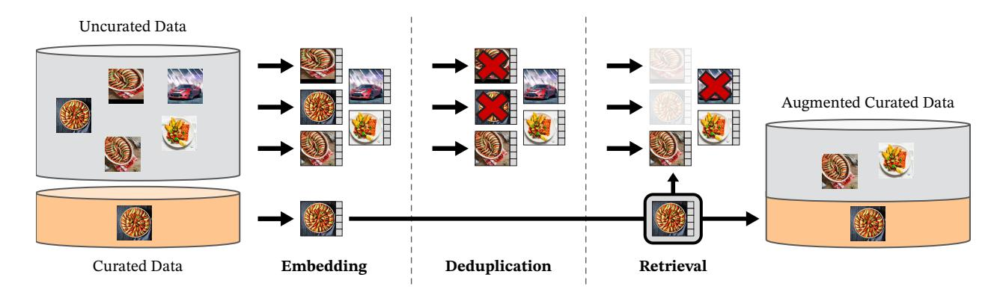

# DINOv2의 uncurated 데이터 소스 수집·전처리

**Q. uncurated 데이터 소스는 어떻게 수집·전처리했나?**

**A.** 공개된 웹 크롤 저장소의 각 페이지에서 `` 태그의 URL을 추출하고, 안전하지 않거나 도메인 제한된 URL을 버렸다. 다운로드 후 PCA hash 중복제거, NSFW 필터링, 얼굴 블러링을 거쳐 12억 장의 고유 이미지를 얻었다.

---

## 1. 왜 "uncurated" 소스가 따로 필요한가

DINOv2(Oquab et al., 2023, arXiv 2304.07193)의 핵심 데이터 아이디어는 **LVD-142M**이라는 큐레이션된 사전학습 데이터셋을 *자동 파이프라인*으로 만드는 것이다. 이 파이프라인은 두 종류의 원천을 쓴다.

| 구분 | 내용 | 역할 |
|---|---|---|
| **Curated 소스** | ImageNet-22k, ImageNet-1k train, Google Landmarks, 여러 fine-grained 데이터셋 (부록 Table 15) | 검색(retrieval)의 **쿼리(query)** — "이런 이미지를 더 모아라"의 기준 |
| **Uncurated 소스** | 웹 크롤에서 수집한 원시 이미지 풀 | 검색의 **대상(pool)** — 여기서 curated와 비슷한 이미지를 골라 데이터셋을 증강 |

이 카드는 표의 두 번째 줄, 즉 **검색 대상이 되는 대규모 원시 풀을 어떻게 만들었는가**를 묻는다. 논문 3절 *Data Processing*의 "Data sources" 단락이 출처다.

## 2. 수집 단계 (crawl → URL → download)

논문 원문(3절 Data sources)을 그대로 따라가면 순서는 다음과 같다.

1. **공개 웹 크롤 저장소(publicly available repository of crawled web data)** 를 출발점으로 삼는다. 직접 크롤러를 돌린 것이 아니라 이미 공개된 크롤 덤프를 사용했다. (논문은 저장소 이름을 명시하지 않지만, 데이터 파이프라인이 NLP의 CCNet(Wenzek et al., 2020)에서 영감을 받았다고 밝히고 있어 Common Crawl 계열 저장소로 이해하는 것이 자연스럽다.)
2. **각 웹 페이지의 HTML에서 `` 태그를 파싱해 이미지 URL 링크를 추출**한다. 텍스트 캡션·alt 속성·메타데이터는 사용하지 않는다 — 파이프라인이 "메타데이터나 텍스트를 전혀 요구하지 않고 이미지만으로 동작"한다는 것이 DINOv2의 차별점이다(LAION처럼 CLIP 점수나 alt-text로 필터링하지 않음).
3. **URL 필터링**: 안전하지 않은(unsafe) URL과 도메인 제한(restricted by domains)에 걸리는 URL은 다운로드 전에 버린다.
4. 남은 URL의 이미지를 **다운로드**한다.

## 3. 다운로드 후 전처리 (post-processing) 3가지

논문은 다운로드된 이미지에 세 가지 후처리를 적용했다고 명시한다.

| 단계 | 목적 | 비고 |
|---|---|---|
| **PCA hash 중복제거** | 픽셀 수준의 정확·근사 복제본을 빠르게 제거 | 이미지를 저차원 PCA 투영 후 해시로 만들어 같은 해시를 가진 이미지를 중복으로 처리하는 경량 기법. 이후 3절 "Deduplication"의 임베딩 기반 copy-detection(Pizzi et al., 2022)과는 **별개의, 더 앞단의** 저비용 필터다. |
| **NSFW 필터링** | 부적절 콘텐츠 제거 | 웹 크롤 데이터의 안전성 확보 |
| **식별 가능한 얼굴 블러링** | 개인정보 보호 | 얼굴 영역을 흐리게 처리. 부록 Table 15의 curated 데이터셋도 마찬가지로 얼굴 블러가 적용된 버전을 쓴다 |

이 세 단계를 거친 결과가 **12억(1.2B) 장의 고유(unique) 이미지**다. 이것이 이후 retrieval의 대상 풀이 된다.

## 4. 이후 파이프라인에서의 위치 (Fig. 3)

그림 3은 uncurated 풀이 만들어진 **뒤**의 처리를 보여준다. 왼쪽 위 회색 원통 **"Uncurated Data"** 가 바로 이 카드에서 만든 1.2B 이미지 풀이고, 아래 주황색 원통이 **"Curated Data"** 다. 그림에서 관찰되는 흐름은 다음과 같다.

- **Embedding**: 두 소스의 모든 이미지를 ImageNet-22k로 사전학습된 자기지도 ViT-H/16으로 임베딩(그림의 작은 격자 벡터)한다.
- **Deduplication**: uncurated 쪽에만 적용된다. 그림에서 같은 케이크 사진 여러 장 중 하나만 남고 나머지에 빨간 X가 표시된 것이 근사 중복 제거를 뜻한다. 이 단계는 Pizzi et al.(2022)의 copy-detection 임베딩으로 k=64 최근접 이웃(코사인 유사도 >0.6)의 연결 요소를 찾아 대표 하나만 남기는 방식이며(**self-deduplication**), 추가로 평가 벤치마크의 train/test와 유사한 이미지(유사도 >0.45)를 전부 제거한다(**relative deduplication**).
- **Retrieval**: curated 쿼리 이미지(그림 하단 굵은 테두리의 케이크)와 코사인 유사도가 높은 uncurated 이미지를 찾아 온다. 쿼리와 무관한 자동차 사진은 X로 탈락하고, 유사한 음식 사진들만 선택되어 오른쪽 **"Augmented Curated Data"** 원통에 curated 데이터와 합쳐진다. 대규모 쿼리셋에는 sample-based(각 쿼리당 N=4 최근접), 소규모 쿼리셋에는 cluster-based(uncurated를 k-means 100,000 클러스터로 나눠 클러스터 단위 샘플링) 검색을 쓴다.

즉 카드의 답(크롤 → `` URL 추출 → URL 필터 → PCA hash dedup / NSFW / 얼굴 블러 → 1.2B)은 **그림 3의 "Uncurated Data" 원통을 채우기까지의 과정**이며, 그림에 그려진 Embedding→Deduplication→Retrieval은 그 다음 단계다.

## 5. 숫자 정리 — 1.2B와 부록의 1.3B/1.1B/744M

논문 본문과 부록의 숫자를 함께 놓으면 다음과 같다.

| 시점 | 이미지 수 | 출처 |
|---|---|---|
| 다운로드 + PCA hash dedup + NSFW + 얼굴 블러 후 | **1.2B unique** | 3절 Data sources (이 카드의 답) |
| 부록 A.3에서 self-dedup 입력으로 언급되는 uncurated 소스 | 1.3B | 부록 A.3 |
| Pizzi et al. 임베딩 기반 self-deduplication 후 | 1.1B | 부록 A.3 |
| 벤치마크 대비 relative deduplication 후 | 744M | 부록 A.3 |
| retrieval로 최종 선택된 curated 데이터셋 | **LVD-142M** | 3절, 부록 Table 15 |

본문의 1.2B와 부록의 1.3B는 논문 내에서 서로 약간 다르게 표기되어 있으나(반올림 또는 집계 시점 차이로 보임), 카드에서 기억할 값은 **본문의 "1.2B unique images"** 다. 핵심 메시지는 "PCA hash 중복제거는 웹 크롤 직후의 가벼운 1차 필터이고, 임베딩 기반 dedup은 그 뒤 별도 단계"라는 층 구조다.

## 6. 비교: 다른 웹 스케일 데이터셋과의 차이

- **LAION-400M/5B**: alt-text와 CLIP 유사도로 이미지-텍스트 쌍을 필터링. → 텍스트와 사전학습 인코더에 의존.
- **Instagram 해시태그(Mahajan et al., 2018)** 등: 메타데이터 기반 필터링.
- **DINOv2**: 텍스트·메타데이터·외부 사전학습 인코더를 쓰지 않고 `` URL만 수집한 뒤, 안전성·중복·프라이버시 후처리만 적용해 원시 풀을 만든다. 데이터의 "질"은 이후 **시각적 유사도 기반 retrieval**로 확보한다. 이 점이 6.2절 Table 2에서 확인된다 — 같은 소스에서 무작위로 142M을 뽑은 uncurated 데이터로 학습하면 LVD-142M 대비 대부분 벤치마크에서 성능이 크게 떨어진다(예: iNat2018 59.4 vs 73.9, Places205 68.0 vs 82.3 … ImageNet-1k 83.3 vs 85.8).

## 7. 실무 관점의 시사점

- 크롤 데이터에서 `` 태그만 파싱하면 텍스트 페어가 없는 이미지도 모두 활용 가능 → 자기지도 학습에 적합한 방대한 풀 확보.
- URL 단계 필터(unsafe/도메인 제한)로 다운로드 비용을 먼저 줄이고, 다운로드 후에는 저비용 해시 dedup → 안전 필터 → 프라이버시 처리 순으로 정리한 뒤, 비용이 큰 임베딩 기반 dedup·retrieval은 정리된 풀에만 적용하는 **비용 계층화**가 설계 포인트다.
- 전체 dedup+retrieval은 Faiss(GPU IVF-PQ 인덱스)로 20노드×8 V100 클러스터에서 2일 이내에 LVD-142M을 생성했다(3절 Implementation Details).

## 참고

- Oquab et al., *DINOv2: Learning Robust Visual Features without Supervision*, arXiv:2304.07193 — 3절 "Data Processing", 6.2절 "Pretraining Data Source", 부록 A.
- Pizzi et al., 2022 — copy detection(SSCD) 파이프라인(임베딩 기반 dedup).
- Wenzek et al., 2020 — CCNet: 웹 크롤 텍스트 큐레이션 파이프라인(영감의 출처).
