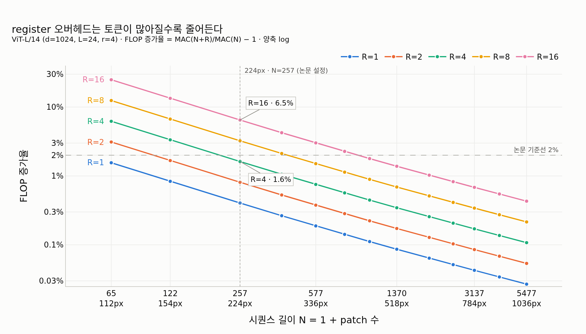

# register 추가에 따른 계산 비용 증가는 어느 정도인가?

register는 새로운 연산자나 레이어가 아니라 **시퀀스 길이를 $N \to N+R$ 로 늘리는 것**뿐이다.
그래서 학습 파라미터는 정확히 $R \times d$ 개만 늘어난다 — ViT-L(d=1024)에서 R=4면 4,096개,
전체 3억 파라미터의 **13.5 ppm(0.0014%)** 이라 사실상 0이다. 논문이 "negligible"이라고 쓴 이유다.

FLOP은 조금 다르다. 그 몇 개의 토큰이 24개 블록의 모든 행렬곱을 통과하므로 비용은
대략 $R/N$ 만큼 는다. ViT-L/14 @224 (N = 1 + 256 = 257) 기준으로 해석식
$\text{MAC}(N) = L(12Nd^2 + 2N^2d)$ 을 직접 계산하면 R=4에서 **1.62%**, R=16에서 **6.48%** 로,
논문 부록 B / Fig. 12의 "16개에서 최대 6%, 주로 쓰는 4개에서는 2% 미만"과 일치한다.
$N$이 커질수록(고해상도일수록) 오버헤드는 더 작아져 518px·R=4에서는 0.35%에 불과하다.
`expy.py`는 이 계산을 단계별로 재현하고, `torch.utils.flop_counter.FlopCounterMode` 실측과
해석식이 정확히 일치함(비율 1.0000)을 확인한다.

## 시각화

