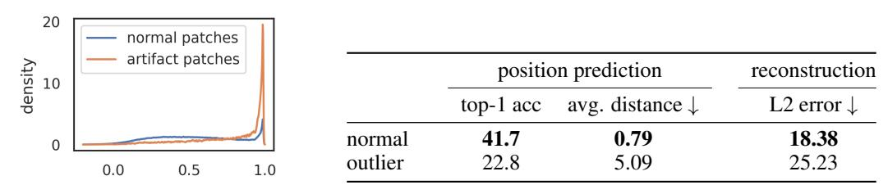

# high-norm token의 정보를 캐묻는 두 가지 probing 과제

> **Q.** high-norm token이 담은 정보를 조사하기 위해 사용한 두 가지 probing 과제는?
> **A.** **position prediction**(patch의 이미지 내 위치 예측)과 **pixel reconstruction**(patch embedding으로부터 픽셀 값 복원). 두 과제 모두 patch embedding 위에 **선형 모델**을 학습시켜 성능을 측정한다.

출처: *Vision Transformers Need Registers* (Darcet et al., ICLR 2024), §2.1 "High-norm tokens hold little local information", Fig. 5b, 부록 D.2 Table 5.

---

## 0. 먼저: high-norm token이 뭔가

DINOv2의 출력 patch token들의 L2 norm 분포는 **bimodal**이다. 대부분은 norm 0~100 사이인데, 소수(약 2.37%)가 norm 400~500대로 튄다. 논문은 **norm 150**을 컷오프로 잡아 그 위를 "high-norm" = "outlier" = "artifact" token이라 부른다. (컷오프 값은 모델마다 달라질 수 있는 hand-picked 값이다.)

그림에서 볼 것:
- 가운데 "DINOv2 norms" 맵의 **노란 셀 몇 개** — 개 사진의 배경/균일한 영역에 흩어져 있다. 이게 artifact patch.
- 오른쪽 히스토그램 — DINO는 봉우리가 하나인데, DINOv2는 낮은 norm 봉우리 옆에 **200~600 구간의 두 번째 봉우리**가 있다. 이 두 번째 봉우리가 컷오프 150을 정당화한다.

핵심 질문은 "이 튀는 토큰들 안에는 대체 뭐가 들어 있나?"이고, 그 답을 찾는 도구가 **linear probing**이다.

---

## 1. 왜 하필 linear probing인가 — 방법론 자체의 의미

probing의 전제는 이렇다.

> **어떤 표현 $z$ 안에 정보 $y$가 "들어 있다"는 걸 어떻게 증명하나?**
> → $z$로부터 $y$를 맞히는 모델 $f$를 학습시켜서, 잘 맞히면 정보가 있다고 본다.

여기서 **$f$를 선형 모델로 제한하는 것**이 결정적이다. 이유:

1. **"정보가 있다"와 "정보를 쓸 수 있다"는 다르다.**
   충분히 큰 MLP를 붙이면 거의 아무 표현에서나 정보를 짜낼 수 있다. 극단적으로, 원본 픽셀을 그대로 담은 벡터에서도 MLP는 클래스를 맞힌다. 그러면 probe가 표현의 성질이 아니라 **probe 자신의 표현력**을 측정하게 되어 아무것도 구분해 내지 못한다.
2. **선형 모델은 "정보가 선형적으로 접근 가능한(linearly decodable/accessible) 형태로 남아 있는가"를 묻는다.**
   즉 정보가 단순히 존재하는지가 아니라, **표현 공간의 방향(direction)으로 깔끔하게 정리되어 있는지**를 본다. ViT 위에 얹히는 실제 downstream head(segmentation head, depth head, classifier)들이 대체로 얕고 선형에 가깝기 때문에, 이 척도가 곧 "그 표현이 실용적으로 쓸모 있는가"와 직결된다.
3. **backbone은 얼려 둔다(frozen).**
   probe 학습이 backbone을 바꾸면 측정 대상이 오염된다. 표현은 고정하고 probe만 학습해야 "표현이 이미 갖고 있던 것"을 잰다.
4. **비교가 목적이라 절대 수치는 부차적이다.**
   논문의 관심은 "41.7%가 좋은 점수인가"가 아니라 **normal token과 outlier token에 동일한 probe 프로토콜을 적용했을 때 생기는 격차**다. probe를 단순하게 고정해야 이 비교가 공정해진다.

이 논문에서 linear probing은 **두 방향**으로 쓰인다. 이 카드가 묻는 건 앞쪽이다.

| 목적 | 과제 | 결과(요지) |
|---|---|---|
| **local 정보**가 남아 있나 (§2.1, Fig. 5b) | ① position prediction ② pixel reconstruction | outlier가 **훨씬 나쁨** → local 정보를 버렸다 |
| **global 정보**를 담았나 (Table 1) | 단일 patch token으로 이미지 분류 (logistic regression) | outlier가 **훨씬 좋음** (Airc. 17.1 → 79.1) → global 정보를 모았다 |

두 결과를 합친 논문의 해석: **모델은 정보량이 적은(이웃과 중복된) 패치를 알아보고, 그 토큰을 재활용해 전역 정보를 모으는 레지스터처럼 쓰면서 원래의 공간 정보는 버린다.**

---

## 2. 두 과제의 구체적 설정

공통 프로토콜: DINOv2 ViT-g/14를 얼린 채 통과시켜 **출력 patch embedding**을 얻고, 그 위에 **선형 모델 하나**를 학습. normal patch 집합과 outlier(norm > 150) patch 집합에 대해 각각 성능을 잰다.

### ① Position prediction — "이 패치가 이미지의 어디였는지 아직 기억하나"

- **과제**: patch embedding → 그 패치의 **이미지 내 격자 위치**를 예측. 위치를 격자 셀에 대한 **분류 문제**로 풀어 **top-1 accuracy**로 평가하고, 보조 지표로 예측 위치와 정답 위치 사이의 **avg. distance**(↓, 패치 단위 거리)를 함께 본다. 클래스 수는 패치 격자 크기와 같다(224px 입력 / patch 14 → 16×16 = 256개 셀 규모. 논문 본문이 숫자를 명시하지는 않는다).
- **왜 이 과제가 의미 있나**: 위치 정보는 **첫 ViT 레이어 이전에 absolute position embedding 형태로 모든 토큰에 주입**되었다. 즉 **모든 토큰이 출발선에서는 자기 위치를 알고 있었다.** 그러니 마지막 레이어에서 위치를 못 맞힌다면 그건 "원래 없었다"가 아니라 **"모델이 통과하면서 버렸다(discard)"**는 뜻이 된다. 이 논증 구조가 position prediction을 고른 이유의 핵심이다.
- **avg. distance를 같이 보는 이유**: top-1만 보면 "한 칸 빗나감"과 "이미지 반대편을 찍음"이 똑같이 오답이다. 거리 지표는 예측이 **정답 근처에 몰려 있는지, 아예 무의미하게 흩어졌는지**를 구분해 준다.

### ② Pixel reconstruction — "이 패치의 원래 픽셀을 복원할 수 있나"

- **과제**: patch embedding → 그 패치의 **raw 픽셀 값**을 선형 회귀로 복원. 평가 지표는 **L2 error**(↓, 낮을수록 좋음).
- **왜 이 과제가 의미 있나**: 위치가 아닌 **외형(appearance)** 쪽 local 정보를 잰다. 위치 정보만 사라진 게 아니라 "그 자리에 뭐가 보였는지"까지 사라졌음을 보이면, "local 정보 전반을 버렸다"는 주장이 훨씬 강해진다. 두 과제가 **서로 다른 종류의 local 정보**를 커버하도록 짝지어진 설계다.
- 참고로 §2.1의 다른 실험은 high-norm 토큰이 **patch embedding 직후 이웃 4개와 cosine similarity가 1에 가까운**(= 중복된, 균일한 배경) 패치에서 주로 나타남을 보인다. 아래 그림 왼쪽이 그 분포다. 즉 "복원할 게 별로 없는 패치"가 애초에 희생양으로 뽑힌다.

---

## 3. 실제 수치

### Fig. 5b — DINOv2 ViT-g, normal vs outlier

|  | position prediction top-1 acc ↑ | position prediction avg. distance ↓ | reconstruction L2 error ↓ |
|---|---|---|---|
| **normal** | **41.7** | **0.79** | **18.38** |
| **outlier** | 22.8 | 5.09 | 25.23 |

읽는 법:
- **top-1 41.7 → 22.8**: 위치 정확도가 거의 절반으로 떨어진다.
- **avg. distance 0.79 → 5.09 (약 6.4배)**: normal 토큰은 틀려도 **평균 한 칸 이내**로 빗나가는 반면, outlier는 **평균 5칸 넘게** 어긋난다. 16×16 격자에서 5칸은 사실상 위치 감각이 무너진 수준이다. top-1보다 이 지표의 격차가 훨씬 극적이라는 점이 중요하다.
- **L2 error 18.38 → 25.23**: 픽셀 복원 오차도 뚜렷하게 증가.
- 세 지표가 **한 방향으로 일치**한다는 점이 결론의 근거다. outlier 토큰은 자기 패치에 대한 local 정보를 (위치도, 외형도) 덜 갖고 있다.
- 왼쪽 그래프: artifact patch(주황)는 이웃과의 cosine similarity가 **1.0 부근에 뾰족하게 몰려** 있고, normal patch(파랑)는 0~1에 넓게 퍼져 있다. → outlier는 **정보가 중복되어 버려도 되는** 패치에서 생긴다.

### Table 5 (부록 D.2) — register 도입이 normal 패치의 local 정보를 해치지 않음을 확인

DINOv2 **ViT-L**(ImageNet-22k)을 register 없이/4개로 학습한 뒤, **"normal" 패치만** 대상으로 같은 두 probing을 돌린 결과다.

| #registers | patches considered | position prediction top-1 acc ↑ | reconstruction L2 error ↓ |
|---|---|---|---|
| 0 | non-outliers | 66.3 | 15.9 |
| 4 | non-outliers (즉 전부) | 65.8 | 16.0 |

- register를 넣으면 **outlier 패치 자체가 사라지므로** 4-register 행의 "non-outliers"는 곧 **모든 패치**다.
- 두 행의 수치가 사실상 동일(66.3 vs 65.8, 15.9 vs 16.0) → **register는 outlier 현상만 흡수해 갈 뿐, 정상 패치가 담고 있던 local 정보를 바꾸지 않는다.** 이것이 register 처방의 안전성을 뒷받침하는 근거다.
- 관련해 Table 4는 반대편을 보인다: outlier가 갖고 있던 **global 정보 수집 역할이 register로 그대로 이전된다.**

> ⚠️ **주의**: Fig. 5b(41.7 / 18.38)와 Table 5(66.3 / 15.9)의 절대 수치는 다르다. **모델이 다르기 때문**이다 — Fig. 5b는 공개된 DINOv2 **ViT-g/14**, Table 5는 저자들이 §3.1 프로토콜로 **직접 학습한 ViT-L**이다. 각 표는 **표 안에서의 비교**로만 읽어야 한다.

---

## 4. 한 줄 정리

**두 과제 = position prediction(top-1 acc, 보조로 avg. distance) + pixel reconstruction(L2 error).** 둘 다 얼린 patch embedding 위 **선형 모델**로 재며, "정보가 선형적으로 꺼낼 수 있는 형태로 남아 있는가"를 묻는다. 결과는 **high-norm 토큰이 local 정보(위치·픽셀)를 덜 갖고 있다**는 것이고, Table 1의 반대 결과(global 정보는 더 많이 갖고 있다)와 합쳐져 **"모델이 중복된 패치를 골라 내부 레지스터로 재활용한다"**는 가설로 이어진다.
