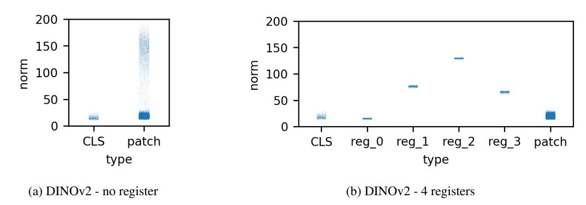

# register 사용 시 출력 norm 분포는 어떻게 변하는가?

**한 줄 답**: DINOv2 · OpenCLIP · DeiT-III 세 알고리즘 모두에서 register를 넣고 학습하면 출력에 large-norm 토큰이 더 이상 나타나지 않는다. 즉 "artifact가 사라졌다"는 정성적 관찰이 norm이라는 정량 지표로 확인된다.

---

## 1. 왜 norm을 보는가

이 논문(Vision Transformers Need Registers)의 출발점은 **artifact patch = high-norm outlier token** 이라는 발견이다.

- 정상 patch 대비 대략 **10배 높은 norm**을 가지며, 전체 시퀀스의 **약 2%** 정도만 차지한다 (DINOv2 ViT-g 기준 norm > 150 인 토큰이 2.37%).
- 이 토큰들은 정보량이 적은(주변 patch와 cosine 유사도가 높은) 배경 영역에 나타나고, local 정보(위치·픽셀 복원)는 거의 없고 대신 global 정보를 담고 있다.
- 그래서 norm 분포는 **bimodal**(정상 토큰 덩어리 + 멀리 떨어진 소수의 outlier)이 되고, 이 bimodality 덕분에 "norm > cutoff"라는 간단한 기준으로 artifact를 정의할 수 있었다.

역으로, **register가 진짜 효과가 있다면 이 bimodality가 사라져야 한다**. Fig. 7이 바로 그 검증이다.

## 2. Fig. 7 — 세 모델의 output norm 분포 (register 유무)

> Figure 7: Effect of register tokens on the distribution of output norms on DINOv2, OpenCLIP and DeiT-III. Using register tokens effectively removes the norm outliers that were present previously.

세로축은 출력 patch token의 norm, 각 패널은 한 알고리즘의 **without registers vs. `+reg`** 쌍이다. 점 하나가 토큰 하나이므로, 진하게 뭉친 띠 = 대다수 토큰, 위로 흩뿌려진 옅은 점들 = outlier다.

그림에서 읽히는 바:

| 모델 | register 없음 | register 있음 |
|---|---|---|
| **DINOv2** | 아래쪽 norm ≈ 20 근처에 두꺼운 띠, 그 위로 norm 150~200대까지 옅은 점들이 길게 뻗음 → 명확한 bimodal | 아래쪽 띠만 남고 위쪽 꼬리가 **완전히 소멸** → unimodal |
| **OpenCLIP** | norm ≈ 50~60 띠 + norm 250~330대의 두 번째 밀집 구름. 두 덩어리가 시각적으로 뚜렷이 분리 | 낮은 띠 하나만 남음. 고norm 구름 사라짐 |
| **DeiT-III** | norm ≈ 300~600 띠 + 900~1400대의 옅은 확산 | 위쪽 확산이 사라지고 300~600 띠만 남음 |

핵심 관찰은 **"위로 뻗은 outlier 꼬리/구름이 없어진다"**는 것이며, 세 알고리즘(자기지도 / 텍스트지도 / 라벨지도)에서 공통으로 일어난다는 점이 register 해법의 일반성을 뒷받침한다.

### 스케일 주의: 모델마다 y축 눈금이 다르다

세 패널의 y축 범위는 각각 대략 **0–200 (DINOv2), 0–350 (OpenCLIP), 0–1500 (DeiT-III)** 로 서로 다르다.

- DeiT-III는 **정상 토큰의 norm 자체가 원래 크다** (수백 단위). 즉 "norm 500이면 artifact"가 아니다.
- 따라서 "norm > 150이면 outlier" 같은 cutoff는 **DINOv2에 손으로 고른 값**이며, 논문도 *"This hand-picked cutoff value can vary across models"* 라고 명시한다.
- 판단 기준은 절댓값이 아니라 **분포의 모양** — 정상 군집으로부터 얼마나 떨어진 두 번째 mode가 존재하는가 — 다. register의 효과도 "norm이 작아졌다"가 아니라 "**두 번째 mode가 없어졌다**"로 읽어야 한다. 실제로 DeiT-III+reg의 정상 띠는 여전히 300~600 부근에 그대로 있다.

## 3. 어디로 간 것인가 — 부록 D.1과의 연결

Fig. 7은 patch token만 본 것이라 "고norm 행동이 그냥 없어졌는지, 옮겨 갔는지"를 구분하지 못한다. 부록 D.1의 Fig. 15가 CLS와 개별 register까지 나눠 그려 그 답을 준다.

> Figure 15: Distribution of token norms for a DINOv2 model without (left) and with (right) 4 registers. Introducing registers entirely negates the high-norm outliers among the patch tokens.

- **좌(register 없음)**: CLS는 norm ≈ 20으로 좁게 모여 있고, patch는 20 근처 덩어리 + 위로 200까지 뻗은 outlier 꼬리를 갖는다.
- **우(4 registers)**: patch는 20 근처 덩어리만 남아 깨끗해졌고, 대신 **reg_1 ≈ 77, reg_2 ≈ 130, reg_3 ≈ 66** 처럼 register들이 높은 norm을 떠맡았다 (reg_0만 CLS와 비슷한 낮은 값).
- 논문 결론: 고norm outlier를 만들던 모델의 **행동이 사라진 게 아니라 register로 흡수(absorbed)** 되었다. patch token은 그 부담에서 해방되어 순수하게 local feature 역할만 한다.
- 추가 관찰: register들의 norm은 이전 outlier들의 넓게 퍼진 분포와 달리 **양자화(quantized)된 것처럼** 각각 가느다란 선으로 나타난다. 그림에서도 reg_1/2/3이 폭이 거의 없는 수평선으로 보인다. 논문은 이 현상의 원인 규명을 future work로 남겼다.

## 4. 정리 — 이 카드가 말하려는 것

1. artifact의 정량 지표는 output token norm이고, artifact가 있으면 분포가 **bimodal**이다.
2. register를 넣으면 세 알고리즘 모두에서 **large-norm 토큰이 출력에 나타나지 않는다** → 분포가 **unimodal**로 바뀐다 (Fig. 7).
3. 이는 attention map/feature map에서 얼룩이 사라졌다는 **정성적 관찰을 정량적으로 뒷받침**한다.
4. 단, 정상 norm의 절대 스케일은 모델마다 다르므로(특히 DeiT-III는 원래 크다) cutoff를 모델 간에 그대로 옮겨 쓰면 안 된다.
5. 고norm 행동 자체는 소멸이 아니라 **register로 이전**되었고, 그 norm은 양자화된 듯한 이산적 값을 보인다 (Fig. 15, 부록 D.1).

---

### 원문 근거

- 본문 §3.2: *"In order to quantitatively measure this effect, for each model, we probe the norm of features at the output of the model. We report these norms for all three algorithms with and without registers in Fig. 7. We see that when training with registers, models do not exhibit large-norm tokens at the output, which confirms the initial qualitative assessment."*
- 부록 D.1: *"...the norms of patch tokens do not contain outliers anymore, and the high-norm tokens are entirely contained in the set of registers. ... the behavior leading to high-norm outliers in the model is effectively absorbed in the registers."* / *"An additional interesting observation is that the norms of the registers appear to be quantized, compared to the previous outliers."*
- 관련 그림: Fig. 3(원래의 bimodal 분포와 cutoff 150), Fig. 21(register 유무에 따른 이미지별 norm map — outlier가 공간적으로 어디 있었는지 시각화).
