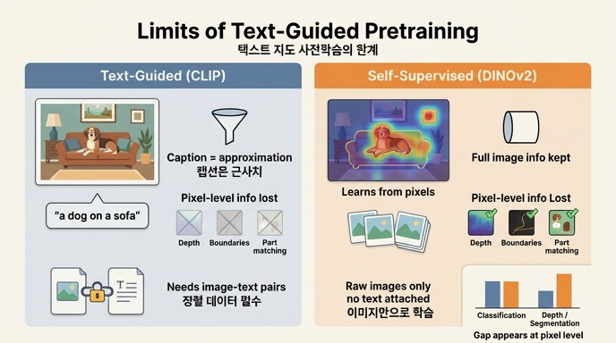

# 텍스트 지도 사전학습(text-guided pretraining)의 한계로 논문이 지적한 것은?

## 한 줄 답

DINOv2 논문(Oquab et al., 2023, §1 Introduction)은 CLIP류 **텍스트 지도 사전학습**의 한계를 두 가지로 요약한다.

1. **정보 병목**: 캡션은 이미지가 담은 풍부한 정보의 *근사치*일 뿐이므로, 특징(feature)에 보존될 수 있는 정보량이 캡션 수준으로 제한된다. 특히 **복잡한 픽셀 수준 정보**(깊이, 경계, 부위 대응 등)는 이런 지도로는 잘 드러나지 않는다.
2. **데이터 유연성 부족**: 정렬된 **image-text 쌍 코퍼스**가 반드시 필요하다. 그래서 NLP의 언어모델처럼 "라벨 없는 raw 데이터만으로" 학습하는 유연성이 없다.

원문(§1): *"This form of text-guided pretraining limits the information that can be retained about the image since captions only approximate the rich information in images, and complex pixel-level information may not surface with this supervision. Furthermore, these image encoders require aligned text-image corpora and hence, do not offer the flexibility of their text counterparts, that is, to learn from raw data alone."*

## 배경: 왜 이 지적이 나오는가

논문은 NLP의 성공 공식을 비전으로 옮기려 한다. NLP의 foundation model은 (a) 라벨 없는 **raw 텍스트**만으로, (b) 언어모델링 같은 **pretext task**로 학습하고, (c) 파인튜닝 없이 "그대로" 쓰인다. 비전에서 이에 가장 근접한 시도는 CLIP(Radford et al., 2021), SWAG(Singh et al., 2022), Joulin et al. (2016), Mahajan et al. (2018) 같은 **텍스트(캡션·해시태그) 지도 학습**이었다. 하지만 이 방식은 위 (a)·(b)를 만족하지 못한다는 것이 저자들의 문제 제기다.

| 관점 | 텍스트 지도 사전학습 (CLIP류) | 자기지도 학습 (DINOv2가 택한 길) |
|---|---|---|
| 지도 신호 | 이미지에 딸린 캡션 | 이미지 자체 (pretext task) |
| 학습 가능한 정보의 상한 | 캡션이 언급하는 것까지 (근사) | 이미지 픽셀에 담긴 것 전부 (원칙적으로) |
| 픽셀 수준 정보 | 캡션에 안 쓰이는 정보는 잘 안 드러남 | patch 수준까지 학습 가능 (Caron et al., 2021) |
| 필요한 데이터 | 정렬된 image-text 쌍 (WIT-400M, LAION-2B 등) | raw 이미지만 |
| NLP식 유연성 | 없음 | 있음 |

### 한계 1 — "캡션은 근사일 뿐"

캡션 "a dog on a sofa"는 개의 자세, 소파의 재질·깊이, 배경의 공간 구조, 픽셀별 물체 경계 같은 정보를 전혀 담지 않는다. 학습 목표가 이미지와 캡션의 정렬이라면, 모델은 캡션과 무관한 정보를 굳이 보존할 이유가 없다. 그래서 **image-level 의미(분류, 검색)**에는 강하지만 **pixel-level 정보(분할, 깊이)**는 표면화되지 않을 수 있다. 저자들은 이를 §7.4 깊이 추정 결과에서 다시 언급한다: ViT-L iBOT이 ViT-G OpenCLIP보다 깊이 추정을 잘한다는 관찰이 *"caption-based feature learning fails to learn subtle patterns like this one"*이라는 직관을 뒷받침한다고 쓴다.

Fig. 7은 이 한계를 정성적으로 보여준다. 동일한 선형 프로브를 frozen 특징 위에 얹었을 때, ADE20K 분할(첫 행)에서 OpenCLIP-G의 마스크는 건물·잔디 영역 안에 잡음처럼 흩어진 조각과 끊어진 영역(artifacts, disconnected components)이 많은 반면 DINOv2-g는 덩어리가 깨끗하다. 깊이(NYUd·SUN-RGBd·KITTI 행)에서는 OpenCLIP-G 결과가 전반적으로 얼룩진 질감이고, SUN-RGBd 오른쪽 예시의 **의자**는 OpenCLIP에서는 거의 사라지지만 DINOv2에서는 형태와 위치가 또렷하게 나온다. 논문은 두 모델 모두 깊이 정보를 어느 정도 선형 분리할 수는 있으나, DINOv2 쪽이 훨씬 부드럽고 artifacts가 적다고 정리한다 — "픽셀 수준 정보가 캡션 지도로는 잘 드러나지 않는다"는 주장의 시각적 근거다.

Fig. 2에서도 같은 패턴이 보인다. 분홍 삼각형(WSL = 텍스트 지도)은 **Inet-1k, Classification** 같은 image-level 과제에서는 DINOv2와 거의 맞닿아 있지만, **Segmentation**과 **Monocular Depth(↓, 낮을수록 좋음)** 패널에서는 DINOv2 곡선과 큰 격차를 보인다. 특히 Monocular Depth 패널에서 WSL 점들은 R-MSE 1.4 부근에, DINOv2는 1.0~1.2 부근에 있다. 즉 텍스트 지도의 약점이 정확히 "픽셀 수준" 과제에 집중되어 나타난다.

### 한계 2 — "정렬된 image-text 코퍼스가 필요"

CLIP은 WIT-400M, OpenCLIP은 LAION-2B처럼 웹에서 긁어 모은 **이미지-캡션 쌍**을 전제로 한다(Table 4의 "Data" 열). 이는 두 가지 부담을 낳는다.

- **데이터 확보**: 캡션이 없는 이미지(센서 데이터, 의료 영상, 개인 사진 아카이브 등)는 그대로 쓸 수 없다. NLP처럼 "인터넷의 raw 텍스트를 전부 먹이는" 접근이 불가능하다.
- **부수 비용**: 텍스트 인코더도 함께 학습해야 한다. §Carbon footprint에서 저자들은 OpenCLIP ViT-G 재학습이 118.9 MWh로 DINOv2 ViT-g 대비 약 10배의 탄소를 배출한다고 추정하면서, 시각 특징만 필요하다면 자기지도 방식이 유리하다고 언급한다(단, 텍스트 인코더를 재사용할 계획이면 텍스트 지도도 의미가 있다고 공정하게 덧붙인다).

## 그래서 논문이 택한 대안

이 두 한계를 피하기 위해 논문은 **자기지도 학습(SSL)**을 택한다. SSL은 이미지만으로 학습해 언어모델링 같은 pretext task에 개념적으로 더 가깝고, image-level과 pixel-level 정보를 모두 포착할 수 있다(DINO, iBOT). 다만 기존 SSL은 ImageNet-1k 같은 소규모 큐레이션 데이터에서만 검증되었고, 큐레이션 없는 대규모 데이터로 확장하면 품질이 떨어졌다. 그래서 DINOv2의 핵심 기여는 (i) 자동 큐레이션 파이프라인으로 LVD-142M을 구축하고, (ii) 학습을 안정화·가속해 ViT-g 1B 모델을 학습한 뒤 증류하는 것이다. 그 결과 Fig. 2처럼 텍스트 지도 없이도 OpenCLIP-G와 동등하거나 그 이상의 frozen 특징을 얻었다 — 즉 "캡션 없이도 된다"는 것을 실증한 것이다.

## 기억 포인트

- **정보 측면**: 캡션 ≈ 이미지의 *근사* → 보존 정보 상한 → 픽셀 수준 정보 미표면화 (분할·깊이 약점, Fig. 2·7).
- **데이터 측면**: 정렬 image-text 쌍 필수 → raw 데이터만으로 학습 불가 → NLP식 유연성 없음.
- 두 한계는 각각 "무엇을 배울 수 있나"와 "무엇으로 배울 수 있나"의 제약이다.

## 참고

- Oquab et al., *DINOv2: Learning Robust Visual Features without Supervision*, arXiv:2304.07193, §1, §7.4, §7.5, Table 4/11, Fig. 2/7.
- Radford et al., *Learning Transferable Visual Models From Natural Language Supervision* (CLIP), ICML 2021.
- Caron et al., *Emerging Properties in Self-Supervised Vision Transformers* (DINO), ICCV 2021.

## 인포그래픽

