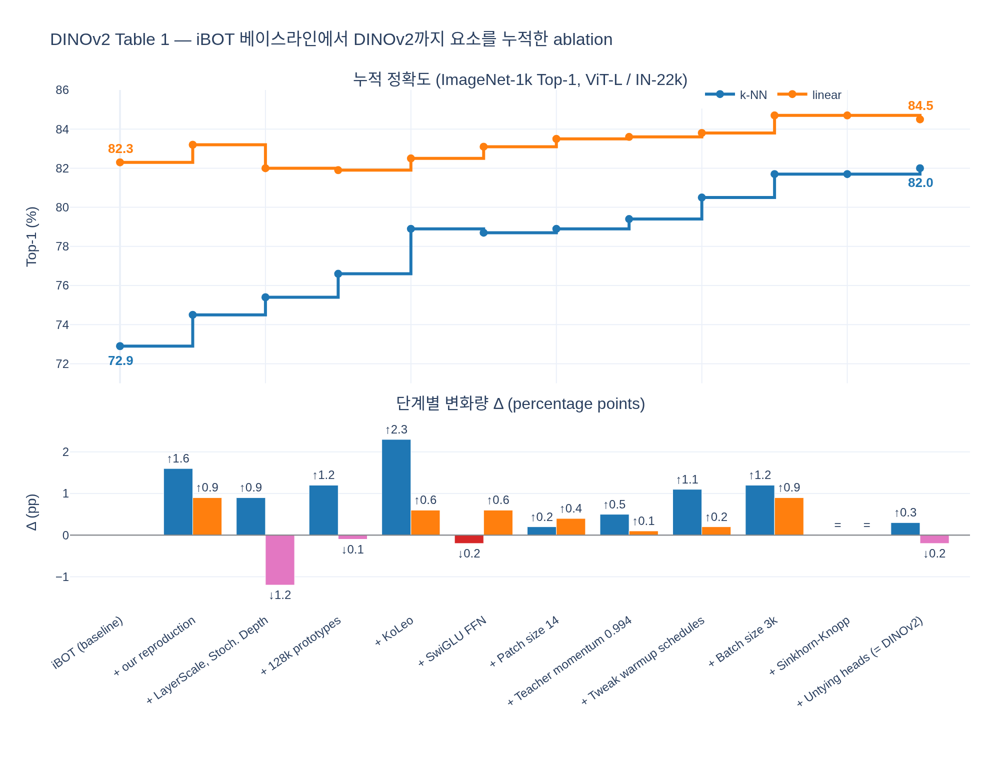

# Table 1의 iBOT→DINOv2 점진적 ablation에서 최종 k-NN과 linear 성능은?

**답:** iBOT 베이스라인 **k-NN 72.9 / linear 82.3**에서 출발해, 모든 개선 요소를 누적한 최종 DINOv2 설정에서 **k-NN 82.0 / linear 84.5**에 도달한다. **ViT-Large를 ImageNet-22k에서 사전학습**한 실험이다 (ImageNet-1k 검증셋 Top-1 정확도).

출처: Oquab et al., *DINOv2: Learning Robust Visual Features without Supervision* (arXiv:2304.07193), Sec. 6.1 "Improved Training Recipe", Table 1.

## 실험 설계

DINOv2는 "새 손실 함수"가 아니라 **iBOT(DINO + 패치 마스킹 손실)에 기존 기법들을 잘 조합한 레시피**다. 각 요소가 정말 필요한지 보이기 위해, 논문은 iBOT 베이스라인에서 시작해 Sec. 4의 요소들을 **한 번에 하나씩 순서대로 누적**하며 모델을 다시 학습하고 두 가지 평가를 기록했다.

- **k-NN**: 프리징된 특징으로 최근접 이웃 분류 (학습 파라미터 없음). 특징 공간 자체의 품질.
- **linear**: 프리징된 특징 위에 선형 분류기 학습.

논문은 **k-NN 성능을 최적화 목표**로 삼았다. 경험적으로 linear probe 성능은 k-NN 성능에 의해 **하한이 정해진다**(lower-bounded)고 봤기 때문이다.

## Table 1 전체 (논문 수치 그대로)

| 누적 설정 | k-NN | Δ | linear | Δ |
|---|---:|:---:|---:|:---:|
| iBOT | 72.9 | | 82.3 | |
| + (our reproduction) | 74.5 | ↑1.6 | 83.2 | ↑0.9 |
| + LayerScale, Stochastic Depth | 75.4 | ↑0.9 | 82.0 | **↓1.2** |
| + 128k prototypes | 76.6 | ↑1.2 | 81.9 | ↓0.1 |
| + KoLeo | 78.9 | **↑2.3** | 82.5 | ↑0.6 |
| + SwiGLU FFN | 78.7 | ↓0.2 | 83.1 | ↑0.6 |
| + Patch size 14 | 78.9 | ↑0.2 | 83.5 | ↑0.4 |
| + Teacher momentum 0.994 | 79.4 | ↑0.5 | 83.6 | ↑0.1 |
| + Tweak warmup schedules | 80.5 | ↑1.1 | 83.8 | ↑0.2 |
| + Batch size 3k | 81.7 | ↑1.2 | 84.7 | ↑0.9 |
| + Sinkhorn-Knopp | 81.7 | = | 84.7 | = |
| + Untying heads **= DINOv2** | **82.0** | ↑0.3 | **84.5** | ↓0.2 |

총 개선: k-NN **+9.1** (72.9 → 82.0), linear **+2.2** (82.3 → 84.5).

## 읽는 법 — 기억할 포인트

1. **k-NN이 크게, linear는 조금 오른다.** k-NN을 목표로 최적화했기 때문. linear 최종값 84.5는 바로 전 단계(84.7)보다 오히려 0.2 낮지만, k-NN이 0.3 올랐으므로 최종 레시피로 채택.
2. **linear가 떨어진 단계는 세 곳**: LayerScale + Stochastic Depth(↓1.2), 128k prototypes(↓0.1), Untying heads(↓0.2). 특히 LayerScale과 높은 Stochastic Depth(rate 0.4)는 정확도를 희생하는 대신 **학습 중 NaN loss를 막아 안정성**을 확보한다(Touvron et al., 2022). 논문은 "이 수정 덕분에 이후 개선 요소들을 쌓을 수 있었다"고 설명한다.
3. **k-NN 최대 기여는 KoLeo(+2.3)**. KoLeo 정규화기는 배치 내 특징이 균일하게 퍼지도록 하는 항으로, $\mathcal{L}_{\text{koleo}} = -\frac{1}{n}\sum_i \log d_{n,i}$, $d_{n,i} = \min_{j\ne i}\|x_i - x_j\|$ (ℓ2 정규화 후 계산). 특징이 뭉치지 않게 하므로 거리 기반인 k-NN에 직접 도움이 되는 것이 자연스럽다.
4. **Sinkhorn-Knopp는 k-NN/linear 모두 변화 없음(=)** — SwAV식 배치 정규화로 교사(teacher)의 softmax-centering을 대체한 것. 정확도보다는 설계 선택.
5. **Untying heads**: iBOT 원 논문은 DINO 헤드와 iBOT 헤드를 **공유**하는 것이 좋다고 했지만, 대규모에서는 반대였다고 관찰해 **분리**했다. 이 마지막 행이 DINOv2 최종 설정.

## 각 요소 짧은 설명 (Sec. 4–5 기준)

- **our reproduction**: iBOT를 DINOv2 코드베이스(PyTorch 2.0, xFormers 등)로 재구현한 베이스라인.
- **LayerScale / Stochastic Depth**: 잔차 분기별 학습 가능한 스케일(초기값 1e-5), 잔차 블록을 확률 0.4로 드롭 — 대형 ViT 학습 안정화.
- **128k prototypes**: DINO/iBOT 헤드의 출력 프로토타입(클러스터) 개수를 크게 늘림.
- **KoLeo**: Kozachenko–Leonenko 미분 엔트로피 추정기 기반 정규화기(Sablayrolles et al., 2019).
- **SwiGLU FFN**: ViT의 MLP를 SwiGLU로 교체(Shazeer, 2020). 스크래치 학습 모델에만 사용.
- **Patch size 14**: 16 → 14. 같은 해상도에서 토큰 수 증가.
- **Teacher momentum 0.994**: EMA 교사 모멘텀 시작값(코사인으로 1까지).
- **Tweak warmup schedules**: LR/teacher temperature 등 워밍업 스케줄 조정.
- **Batch size 3k**: 배치 크기 확대.
- **Sinkhorn-Knopp**: 교사 출력 centering을 SK 배치 정규화(3회 반복)로 대체(Ruan et al., 2023 권고).
- **Untying heads**: DINO 헤드와 iBOT 헤드의 파라미터 분리.

주의: Table 1의 수치는 **ViT-L, ImageNet-22k** 소규모 설정이며, 논문 본문에서 보고하는 DINOv2 대표 성능(ViT-g/14, LVD-142M, 고해상도 적응 포함)과는 다르다. 같은 iBOT ViT-L/16 IN-22k 행(k-NN 72.9 / linear 82.3)이 Table 4(다른 SSL 방법과의 비교)에도 베이스라인으로 재등장한다.

## 시각화

`expy.py`(jupyter percent script)가 Table 1 수치를 그대로 옮겨 단계별 Δ를 재계산하고, 누적 곡선과 단계별 기여도를 그린다.

