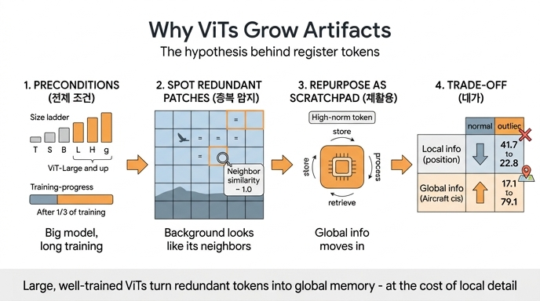

# 저자들의 핵심 가설: artifact는 "버그"가 아니라 모델이 스스로 만든 레지스터

**출처**: Darcet et al., *Vision Transformers Need Registers* (ICLR 2024), §2.2 Hypothesis and Remediation

## 한 문장 정의

> *large*, *sufficiently trained* models learn to recognize *redundant* tokens, and to use them as places to *store*, *process* and *retrieve* global information.
>
> (크고 충분히 학습된 모델은 중복 토큰을 인식하는 법을 배우고, 그것을 global 정보를 저장·처리·검색하는 장소로 사용한다.)

여기서 말하는 artifact는 attention map / feature map에 튀어나오는 **high-norm outlier 토큰**이다. DINOv2 ViT-g 기준으로 norm > 150인 토큰이 전체의 **2.37%** 정도이며, norm 분포가 뚜렷한 bimodal 형태라 150을 컷오프로 잡을 수 있다 (Fig. 3).

## 가설의 구조 — 두 개의 절(clause)

| 절 | 내용 | 근거 |
|---|---|---|
| 조건절 | "large, sufficiently trained" | 모델 크기 ≥ ViT-L, 학습 1/3 지점 이후에만 등장 (Fig. 4) |
| 메커니즘절 | "redundant 토큰을 인식 → global 정보의 store/process/retrieve 장소로 사용" | 증거 ①②③ (아래) |

저자들은 여기에 **가치 판단**을 덧붙인다. "이 행동 자체는 나쁘지 않다(not bad in itself). 다만 그 일이 *patch token 안에서* 일어나는 것이 바람직하지 않다." 즉 global 정보를 모으는 스크래치패드가 필요한 것은 맞는데, 모델이 그 용도로 **원래 국소 정보를 담아야 할 패치 토큰을 강탈(repurpose)** 하고 있어서, 그 패치의 local 정보가 버려지고 dense prediction 성능이 깎인다는 것이다. → 해결책이 register token(§2.2, Fig. 6).

## 언제 나타나는가 (조건절의 근거, Fig. 4)

40-layer DINOv2 ViT-g 기준:

- **(a) layer**: high-norm 토큰이 **layer 15 근처**(모델 중반)에서 다른 토큰과 분화되기 시작한다. 입력부터 존재하는 것이 아니라 중간에 "만들어진다".
- **(b) training iteration**: 학습 **1/3 지점을 지난 뒤**에야 outlier가 나타난다. 초기화 아티팩트가 아니라 **학습된 전략**이라는 뜻.
- **(c) model size**: Tiny/Small/Base에는 없고 **Large, Huge, giant** 세 개의 큰 모델에서만 나타난다.


## 가설을 뒷받침하는 세 갈래 증거

### ① high-norm 토큰은 이웃과 중복된(redundant) patch에서 나온다

patch embedding 직후(ViT 첫 레이어 이전)에 각 토큰과 **상하좌우 4개 이웃 사이의 cosine similarity** 분포를 그려 비교한다 (Fig. 5a).

- normal patch: 0~1 전 구간에 넓게 퍼진 완만한 분포
- artifact patch (출력 norm > 150): **1.0 바로 앞에 아주 뾰족한 피크** — 이웃과 거의 동일

즉 outlier는 하늘·잔디 같은 **균일한 배경**에서 발생하며, 그 패치의 원래 정보를 버려도 이미지 표현 품질에 손해가 없다. 모델이 "여기는 버려도 되는 자리"를 골라내고 있다는 것이 **"recognize redundant tokens"** 의 직접 증거다.

### ② 국소 정보(위치·픽셀)를 덜 담는다 → 정보가 "지워졌다"

patch embedding 위에 linear probe 두 개를 학습시켜 측정 (Fig. 5b).

| | position prediction top-1 acc ↑ | position avg. distance ↓ | pixel reconstruction L2 error ↓ |
|---|---|---|---|
| normal | **41.7** | **0.79** | **18.38** |
| outlier | 22.8 | 5.09 | 25.23 |

위치 예측 정확도가 41.7 → 22.8로 거의 반토막 나고, 평균 오차 거리는 0.79 → 5.09로 6배 이상 커진다. 픽셀 복원 오차도 18.38 → 25.23으로 커진다. **위치 정보는 첫 레이어 이전에 absolute position embedding으로 분명히 주입됐는데도** outlier에서 사라졌다는 점이 중요하다 — 원래 있던 국소 정보가 덮어써진 것이다.


### ③ global 정보(이미지 분류)를 더 담는다 → 정보가 "채워졌다"

이미지 하나당 patch token을 **딱 하나만 무작위로** 골라 그것을 이미지 표현으로 삼고 logistic regression 분류기를 학습시킨다 (Table 1 / Table 6).

| | IN1k | Airc. | CF100 | CUB | Cars | DTD | Flow. | Pets | SUN | VOC |
|---|---|---|---|---|---|---|---|---|---|---|
| [CLS] | 86.0 | 87.3 | 94.5 | 91.3 | 91.5 | 85.2 | 99.7 | 96.9 | 78.6 | 89.1 |
| normal patch | 65.8 | 17.1 | 81.3 | 18.6 | 10.8 | 63.1 | 59.5 | 47.8 | 37.7 | 70.8 |
| **outlier patch** | **69.0** | **79.1** | **93.7** | **84.9** | **85.2** | **84.9** | **99.6** | **94.1** | **78.5** | **89.7** |

차이가 극적이다. Aircraft에서 17.1 → **79.1**, Cars에서 10.8 → **85.2**, CUB에서 18.6 → **84.9**. 로컬 패치 하나로는 알 수 없어야 할 fine-grained 카테고리를, outlier 토큰 하나만 보면 **[CLS] 토큰에 필적하는 수준**(Airc. 87.3, Cars 91.5, DTD 85.2)으로 맞힌다. 즉 outlier는 국소 패치가 아니라 **이미지 전역 요약**을 들고 있다.

(Table 6은 토큰을 무작위로 뽑는 데서 오는 분산까지 보고한다. 예: Airc. normal 17.1±0.5 vs outlier 79.1±0.5 — 표준편차보다 격차가 훨씬 크다.)

## ②+③을 합치면

같은 토큰에서 **local 정보는 빠지고 global 정보는 들어찼다.** 이것이 "그 자리를 global 정보의 **저장·처리·검색** 장소로 **사용한다**"는 표현의 근거다. 셋을 이어 붙이면 인과 사슬이 된다:

```
큰 모델 + 충분한 학습     (Fig. 4)
   ↓
중복 patch 탐지            (① Fig. 5a: 이웃 유사도 ≈ 1.0)
   ↓
그 자리를 global scratchpad로 재활용
   ├─ local 정보 소거      (② 위치 41.7→22.8, L2 18.38→25.23)
   └─ global 정보 축적     (③ Airc. 17.1→79.1, CLS급)
   ↓
high-norm outlier = artifact (norm>150, 전체의 2.37%)
```

## 가설이 낳은 처방과 검증

가설이 맞다면 **global 정보를 담을 전용 자리를 따로 주면** 모델이 패치를 강탈할 이유가 없어진다. 그래서 patch embedding 직후에 [CLS]처럼 학습 가능한 토큰 N개(**register**)를 추가하고, 출력에서는 버린다.

![Fig. 6 — register token(노란색) 추가. 출력에서는 patch와 [CLS]만 사용](fig-3.jpeg)

가설을 지지하는 사후 검증들:

- **norm 이전(transfer)**: register를 넣으면 patch token의 high-norm outlier가 완전히 사라지고, 높은 norm은 **전부 register 쪽으로 옮겨간다** (Fig. 15). outlier를 만들던 행동이 register에 "흡수"된 것.
- **global 정보도 함께 이동**: Aircraft linear probing에서 outlier가 갖던 global 정보가 그대로 register로 옮겨간다 (Table 4).
- **나머지 patch는 그대로**: register 유무와 무관하게 non-outlier patch의 local 정보는 거의 동일 (position 66.3 vs 65.8, L2 15.9 vs 16.0 — Table 5). register는 outlier 행동만 제거할 뿐 다른 패치를 건드리지 않는다.
- **register도 global 특성을 보인다**: register의 평균 attention map은 support가 넓어 [CLS]와 닮았고, 일반 patch의 국소적인 attention과는 다르다 (Fig. 16).
- **반례로서의 MAE**: MAE에는 artifact가 없는데, 저자들은 MAE가 patch token에 대한 **local loss만** 쓰고 global 정보 집계 목적함수가 없기 때문이라고 본다 (Appendix E). 이 역시 "global 정보를 모아야 하는 압력"이 원인이라는 가설과 부합.

## 유의할 점 (저자들이 남긴 한계)

- 어떤 학습 요소가 artifact를 만드는지 **완전히 규명하지는 못했다**. pretraining paradigm도 영향이 있어 보인다(OpenCLIP, DeiT-III는 B와 L 둘 다에서 outlier가 보인다). 모델 크기와 학습 길이도 중요한 역할을 한다.
- DINO(v1)에는 artifact가 없고 DINOv2에는 있다. 저자들의 결론은 "DINO가 오히려 예외이고, DINOv2가 ViT의 baseline 행동에 부합한다"는 것.
- artifact 자체가 나쁜 것이 아니다 — **위치가 잘못됐을 뿐**이다. 이 뉘앙스가 답의 핵심이며, register라는 해법이 "제거"가 아니라 "이사"인 이유다.

## 인포그래픽


