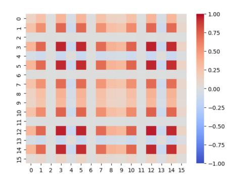
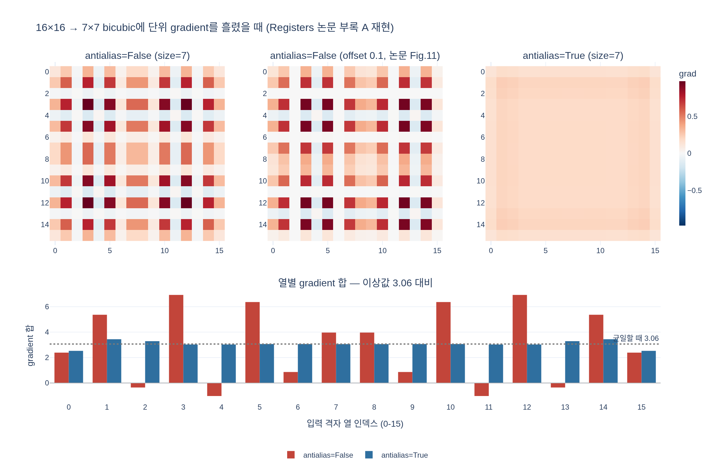

# 부록 A의 수직 줄무늬는 왜 생겼나

**Q.** 부록 A에서 관찰한 outlier 위치 분포의 수직 줄무늬 패턴의 원인은?

**A.** 원래 DINOv2 구현이 학습 중 position embedding을 16×16 맵에서 7×7 맵으로 **antialiasing 없이** 보간했기 때문이다. bicubic resize를 통해 단위 gradient를 전파하면 같은 줄무늬 패턴이 나타난다.

출처: Darcet et al., *Vision Transformers Need Registers* (arXiv:2309.16588), Appendix A — "Interpolation artifacts and outlier position distribution".

---

## 1. 부록 A가 무엇을 그린 그림인가

본문 Fig. 3에서 저자들은 patch token의 norm 분포가 bimodal이고, 수동으로 정한 cutoff를 넘는 소수의 토큰(= outlier / high-norm token)이 존재함을 보였다. 부록 A는 그 outlier가 **feature map의 어느 위치에서** 나오는지를 집계한다. 각 셀 값은 "그 위치의 토큰이 cutoff를 넘을 확률"이다.


여기서 두 가지가 보인다.

1. **왼쪽 그림의 수직 줄무늬** — 특정 열에서만 outlier 확률이 유독 높다. 어떤 위치는 20% 넘게 나온다.
2. **테두리 편향** — outlier는 중앙보다 가장자리에 몰린다.

이 카드가 묻는 건 (1)이다. 그리고 저자들의 결론은 **(1)은 모델이 학습한 현상이 아니라 구현 버그성 아티팩트**라는 것이다. (2)만 진짜 현상이다 — 사람이 찍은 사진은 object-centric이라 테두리는 대개 정보량이 적은 배경이고, 모델은 그런 저정보 토큰을 register로 재활용하는 경향이 있다는 해석.

## 2. 원인: antialiasing 없는 position embedding 보간

DINOv2 학습 설정에서 position embedding은 **16×16 격자**로 학습된다 (global crop 224px / patch 14 = 16). 그런데 multi-crop 학습이라 local crop도 같이 들어가고, local crop은 98px / 14 = **7×7 패치**다. 그래서 매 step, 모든 local crop에 대해 pos_embed를 16×16 → 7×7로 다운샘플해야 한다.

DINOv2 공식 코드(`dinov2/models/vision_transformer.py`의 `interpolate_pos_encoding`)가 그걸 하는 부분:

```python
M = int(math.sqrt(N))                              # pos_embed 격자 한 변 = 16
kwargs = {}
if self.interpolate_offset:
    # Historical kludge: add a small number to avoid floating point error ...
    sx = float(w0 + self.interpolate_offset) / M   # (7 + 0.1) / 16
    sy = float(h0 + self.interpolate_offset) / M
    kwargs["scale_factor"] = (sx, sy)
else:
    kwargs["size"] = (w0, h0)                      # (7, 7)
patch_pos_embed = nn.functional.interpolate(
    patch_pos_embed.reshape(1, M, M, dim).permute(0, 3, 1, 2),
    mode="bicubic",
    antialias=self.interpolate_antialias,          # <-- 문제의 인자
    **kwargs,
)
```

원조 DINOv2 체크포인트는 `interpolate_antialias=False`, `interpolate_offset=0.1`로 학습됐다 (`dinov2/hub/classifiers.py`의 기본값이 정확히 그것). registers 논문 이후 공개된 모델·평가 헤드는 `interpolate_antialias=True`, `interpolate_offset=0.0`을 쓴다.

### 왜 antialias=False가 문제인가

`F.interpolate(..., mode="bicubic")`은 출력 픽셀 중심을 입력 좌표로 되돌린 뒤, 그 주변 **고정된 4탭** 창에 Keys의 bicubic 커널을 씌운다. 16 → 7 다운샘플이면 출력 픽셀 간격이 입력 격자 기준 16/7 ≈ **2.29칸**인데 커널 폭은 여전히 4칸이다. 즉 커널이 입력을 다 훑지 못한다 (전형적인 aliasing 상황).

그 결과 입력 격자의 각 열이 받는 총 가중치가 **주기적으로 요동친다**:

- 어떤 열은 출력 픽셀 중심 바로 위에 놓여 가중치 ≈ 1.0을 통째로 받고,
- 바로 옆 열은 bicubic 커널의 **음의 lobe**에만 걸려 **음수** 가중치를 받는다.

`antialias=True`는 다운샘플 배율에 맞춰 커널 support를 늘려(여기선 4탭 → 6~9탭) 모든 입력 열이 어떤 출력에든 고르게 기여하게 만든다.

### 단위 gradient를 흘려보면

이 불균형이 학습에 미치는 영향을 보는 가장 직접적인 방법이 논문이 한 실험이다. 출력 7×7 전체에 gradient 1을 주고(`y.sum().backward()`) 입력 16×16이 받는 gradient를 본다. 이 값은 곧 **각 입력 셀이 출력에 기여하는 총 가중치**이고, 학습 내내 pos_embed가 이 비율로 갱신된다는 뜻이다.



Fig. 10 왼쪽과 같은 줄무늬가 그대로 나온다. 즉 **줄무늬 위치 = gradient가 크게/작게(심지어 반대 부호로) 흐르던 위치**다. 특정 열의 position embedding만 매 step 강하게 밀리고 옆 열은 거의 갱신되지 않거나 반대로 밀린 결과, 그 위치의 토큰이 high-norm outlier가 되기 쉬워졌다.

## 3. 실제 수치 (expy.py 재현 결과)

torch로 그대로 돌려보면:

| | `antialias=False` | `antialias=True` |
|---|---|---|
| 셀 gradient 범위 | −0.14 ~ 0.98 (**부호 반전**) | 0.13 ~ 0.24 |
| 열별 gradient 합 | `[2.4, 5.4, -0.4, 6.9, -1.0, 6.4, 0.9, 4.0, ...]` | `[2.5, 3.4, 3.3, 3.0, 3.0, 3.1, ...]` |
| 열 합 표준편차 | 2.86 | 0.25 (**11.6배** 차이) |
| 총합 | 49 | 49 |

총합은 둘 다 49(= 출력 픽셀 수)로 같다. 커널이 정규화돼 있으므로 문제는 "총량"이 아니라 **분배의 불균형**이다. 균일하다면 열별 합이 모두 49/16 = 3.06이어야 하는데, antialias 없이는 6.9까지 올라갔다가 −1.0으로 내려간다.

가중치 행렬을 직접 뽑아 보면 원인이 더 노골적이다:

```
입력 열  2: 열 합 -0.050   (출력 0,1에만 걸림)
입력 열  3: 열 합 +0.989   (출력 1 하나에서 통째로)
입력 열  4: 열 합 -0.145   (출력 1,2 모두 음의 lobe)
입력 열  5: 열 합 +0.909   (출력 2 하나에서 통째로)
```

이웃한 네 열이 −0.15 ~ +0.99 사이를 오간다.

## 4. 논문이 한 조치와 남는 것

- 저자들은 DINOv2로 결과를 낼 때(특히 Table 2a, 3) **항상 antialiasing을 켰고**, 그러자 Fig. 10 오른쪽처럼 줄무늬가 사라진 분포를 얻었다.
- 다만 **antialiasing은 줄무늬만 없앤다.** high-norm outlier 자체는 그대로 남는다. 남은 테두리 편향도 그대로다. outlier를 없애는 것이 이 논문의 본론인 **register token**이다.

### 헷갈리기 쉬운 지점

- "antialias를 켜면 artifact가 사라진다"가 **아니다.** 사라지는 건 outlier 위치의 *줄무늬 배치*일 뿐, outlier 현상 자체가 아니다.
- 이건 inference 시 해상도 보간 얘기가 아니라 **학습 중 local crop 처리** 얘기다. 학습 내내 매 step 반복됐기 때문에 위치 임베딩에 누적된 것이다.
- `interpolate_offset=0.1`은 별개의 historical kludge(부동소수 오차 회피)다. 이걸 켜면 좌우 대칭이 깨져 논문 Fig. 11의 비대칭 패턴(오른쪽 끝 열이 흐릿한 모습)이 재현된다.

## 시각화


