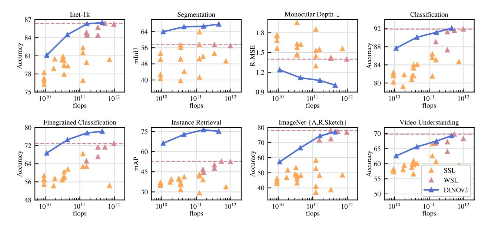

# NLP의 사전학습 패러다임이 DINOv2에 준 시사점

## 한 줄 요약

NLP에서는 **지도 신호(라벨)가 전혀 필요 없는 pretext objective**(language modeling, word vector)로 **대량의 raw text**를 사전학습한 표현이, **파인튜닝 없이 "그대로(as they are)"** 써도 태스크별로 따로 만든 모델보다 좋은 성능을 낸다는 것이 확인되었다. DINOv2는 "이 성공 공식을 비전으로 옮기면 비전 foundation model도 가능하지 않을까"라는 질문에서 출발한다.

## 논문 Introduction의 논리 흐름

DINOv2 논문(Oquab et al., 2023, arXiv 2304.07193) 1장 첫 단락은 아래 세 요소를 NLP 성공의 원인으로 짚는다.

| 요소 | NLP에서의 모습 | 논문이 인용한 예 |
|---|---|---|
| **태스크-불문(task-agnostic) 표현** | 한 번 사전학습한 표현이 어느 downstream 태스크에도 통한다 | GPT-2, T5, PaLM, Chinchilla, LLaMA |
| **파인튜닝 없이 사용** | 표현을 "as they are"로 써도 task-specific 모델을 크게 앞선다 | GPT-3 (Brown et al., 2020) |
| **지도 없는 pretext objective + 대량 raw text** | language modeling, word vector 같은 목표는 라벨이 필요 없어서 데이터를 무한히 늘릴 수 있다 | language modeling (Radford et al.), word vectors/BERT (Devlin et al.) |

핵심은 세 번째 줄이다. 라벨링이 필요 없기 때문에 **데이터 규모의 병목이 사라졌고**, 그 결과 첫 두 줄(범용성, 파인튜닝 불필요)이 따라왔다는 것이 논문의 해석이다.

## 비전으로의 번역: DINOv2가 취한 입장

이 시사점을 비전에 그대로 옮기면 "비전 foundation model"은 다음 조건을 만족해야 한다.

1. **이미지 레벨(분류)과 픽셀 레벨(분할, 깊이)** 모두에서 out of the box로 작동하는 시각 특징을 내야 한다.
2. 그 특징은 **파인튜닝 없이** frozen 상태로 평가해도 좋아야 한다.

그리고 "라벨 없는 pretext objective"에 해당하는 비전 쪽 선택지는 두 갈래가 있는데, 논문은 이 중 하나를 고른다.

- **텍스트 유도(text-guided) 사전학습 (CLIP 계열)** — 캡션이라는 약한 지도 신호를 쓴다. 논문은 두 가지 한계를 지적한다. (a) 캡션은 이미지의 풍부한 정보를 근사할 뿐이라 **픽셀 수준 정보가 잘 드러나지 않고**, (b) 정렬된 이미지-텍스트 쌍이 필요하므로 **"raw 데이터만으로 학습"하는 NLP의 유연성이 없다**.
- **자기지도학습(SSL)** — 이미지만으로 특징을 배운다. 논문은 이것이 **"language modeling 같은 pretext task에 개념적으로 더 가깝다"**고 명시하며, 이미지·픽셀 수준 정보를 모두 잡을 수 있다고 본다. 즉, NLP 시사점에 충실한 쪽은 SSL이다.

다만 기존 SSL은 대부분 ImageNet-1k라는 작은 큐레이션 데이터셋에서만 발전했고, 규모를 키우려던 시도는 **비큐레이션(uncurated)** 데이터를 써서 특징 품질이 떨어졌다. 그래서 DINOv2는 "SSL + **대량의 큐레이션된** 데이터(142M, LVD-142M)"라는 조합으로 NLP 공식을 재현하려 한다. 데이터 큐레이션 파이프라인 자체도 NLP의 CCNet(Wenzek et al., 2020)처럼 **메타데이터·수동 주석 대신 데이터 유사도**로 필터링·재균형한다고 밝혀, 데이터 처리 방식까지 NLP에서 빌려왔음을 알 수 있다.

## 그림으로 보는 "파인튜닝 없이도 앞선다"의 비전판

논문의 Figure 2는 NLP 시사점이 비전에서도 재현되었는지를 보여주는 그림이다. 8개 패널(ImageNet-1k, Segmentation, Monocular Depth, Classification, Fine-grained Classification, Instance Retrieval, ImageNet-{A,R,Sketch}, Video Understanding)은 모두 **frozen 특징**으로 측정한 것이다.

- 파란 선(DINOv2)은 모델 크기(가로축 flops)를 키울수록 단조롭게 좋아지며, 이는 NLP에서 스케일링이 통했던 것과 같은 양상이다.
- 주황 삼각형(기존 SSL)은 모든 패널에서 파란 선 아래에 흩어져 있다. 같은 "라벨 없는 학습"이어도 데이터 큐레이션·규모 없이는 NLP식 성공이 나오지 않았음을 뜻한다.
- 분홍 삼각형과 점선(약지도 WSL, 즉 CLIP 계열 최고 성능)은 이미지 분류 계열에서는 DINOv2와 비슷하지만, **Segmentation, Monocular Depth, Instance Retrieval** 같은 픽셀·인스턴스 수준 태스크에서는 DINOv2가 훨씬 앞선다. 이는 "캡션 지도는 픽셀 수준 정보를 놓친다"는 앞서의 비판을 뒷받침한다.

## 기억 포인트

- 시사점의 핵심 세 단어: **지도 없는 pretext objective / 대량 raw data / 파인튜닝 없이 as-is 사용**.
- 비전에서 이에 대응하는 선택: 캡션 지도(CLIP)가 아닌 **SSL**, 단 데이터는 **큐레이션된 대규모**로.
- 성공 판정 기준: frozen 특징이 이미지 레벨과 픽셀 레벨 모두에서 task-specific/약지도 모델과 견주거나 앞서는가 (Fig.2).
