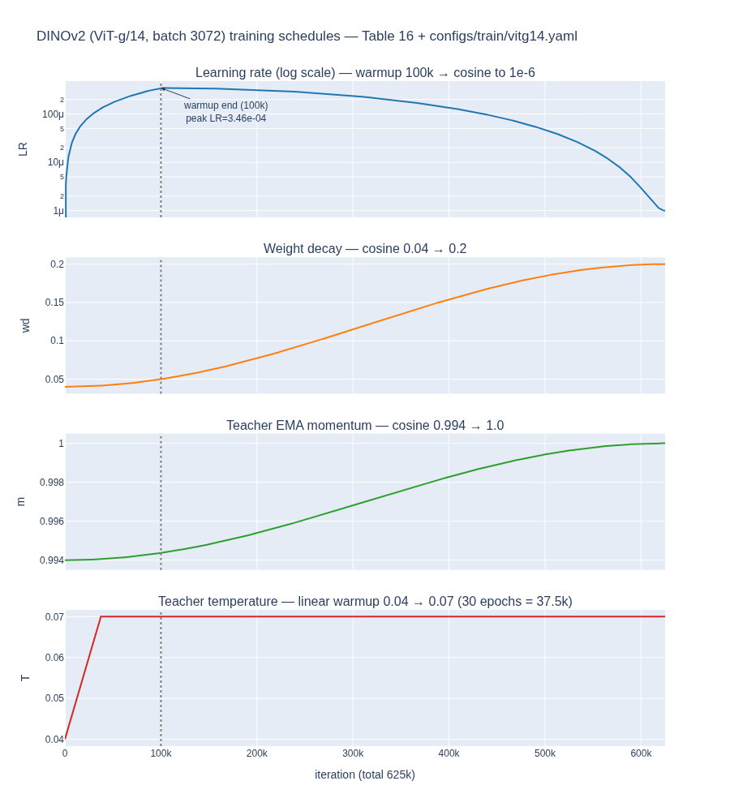

# DINOv2의 주요 학습 하이퍼파라미터(스케줄 포함)는?

**답:** 초기 LayerScale 값 1e-5, weight decay는 0.04→0.2 코사인 스케줄, learning rate warmup 100k iteration, teacher momentum은 0.994→1 코사인 스케줄이다. DINO head의 gradient를 float32로 reduce하는 것을 제외하면 float16으로 학습한다.

출처: Oquab et al., *DINOv2: Learning Robust Visual Features without Supervision* (arXiv 2304.07193), Appendix B.1 "Unsupervised pre-training", Table 16·17, 그리고 §5 "Efficient implementation"의 FSDP 문단. 값의 근거는 공식 저장소 `dinov2/configs/ssl_default_config.yaml`, `configs/train/vitg14.yaml`, `dinov2/utils/utils.py::CosineScheduler`, `dinov2/utils/config.py::apply_scaling_rules_to_cfg`로 교차 확인했다.

---

## 1. 한 문장으로 된 Table 16 캡션

Table 16 캡션이 카드의 답 그 자체다.

> All models run for **625k iterations** with optimizer **AdamW**, an initial **LayerScale value of 1e-5**, a **weight decay cosine schedule from 0.04 to 0.2**, a **learning rate warmup of 100k iterations**, a **teacher momentum cosine schedule from 0.994 to 1**, and we train in **float16** precision in all cases (**except for the DINO heads where we reduce the gradients in float32**).

외울 때는 "무엇이 고정값이고 무엇이 스케줄인가"로 나누면 쉽다.

| 구분 | 항목 | 값 |
|---|---|---|
| 고정 | 총 iteration | 625k |
| 고정 | optimizer | AdamW ($\beta_1=0.9,\ \beta_2=0.999$, config 기준) |
| 고정 | LayerScale 초기값 | 1e-5 |
| 고정 | precision | float16 (backbone·teacher 전부), DINO/iBOT head **gradient reduce만** float32 |
| 스케줄 | weight decay | 0.04 → 0.2, cosine |
| 스케줄 | learning rate | 0 → peak (100k 선형 warmup) → 1e-6 cosine |
| 스케줄 | teacher EMA momentum | 0.994 → 1.0, cosine |
| 스케줄 | teacher temperature | 0.04 → 0.07, 30 epoch(37.5k iter) 선형 warmup 후 고정 (config, 논문 본문에는 없음) |

---

## 2. Table 16 재구성 — 모델별로 다른 값

| 모델 | 학습 방식 | Arch. | Stochastic depth (drop-rate) | LR (peak) | Batch size |
|---|---|---|---|---|---|
| DINOv2-S | distilled | ViT-S/14 | 0 | 1e-3 | 2048 |
| DINOv2-B | distilled | ViT-B/14 | 0 | 1e-3 | 2048 |
| DINOv2-L | distilled | ViT-L/14 | 0 | 1e-3 | 2048 |
| DINOv2-L | from scratch | ViT-L/14 | 0.4 | 3.5e-4 | 3072 |
| DINOv2-g | from scratch | ViT-g/14 | 0.4 | 3.5e-4 | 3072 |

읽는 법:

- **from scratch vs distilled**가 갈림길이다. 처음부터 학습하는 L/g는 큰 배치(3072)·낮은 LR·높은 stochastic depth(0.4)로 안정성을 우선하고, ViT-g에서 증류(distill)하는 S/B/L은 drop-rate 0, 더 높은 LR(1e-3), 배치 2048로 빠르게 수렴시킨다. 증류 시에는 teacher가 이미 고정된 ViT-g라서 학습이 훨씬 안정적이기 때문이다(§5 "Distillation": 같은 학습 루프를 쓰되 EMA teacher 대신 frozen ViT-g를 teacher로 사용).
- **모든 행에 공통**인 것이 캡션에 있는 625k / AdamW / LayerScale 1e-5 / WD 0.04→0.2 / warmup 100k / momentum 0.994→1 / fp16이다.

### LR 스케일링 규칙 (`sqrt_wrt_1024`)

논문 표의 3.5e-4는 config의 `base_lr: 2.0e-4  # learning rate for a batch size of 1024`에 다음 규칙을 적용한 결과다.

$$
\text{lr} = \text{base\_lr}\times\sqrt{\frac{B}{1024}}
\quad\Rightarrow\quad
2\times10^{-4}\times\sqrt{\tfrac{3072}{1024}} = 2\times10^{-4}\times1.732 \approx 3.46\times10^{-4}\ (\approx 3.5\text{e-}4)
$$

DINO 원논문은 배치에 **선형**(`lr = 5e-4 × B/256`) 스케일링을 썼지만, DINOv2 코드는 **제곱근** 스케일링을 쓴다(`dinov2/utils/config.py`, `scaling_rule == "sqrt_wrt_1024"` 외에는 `NotImplementedError`). 배치를 3배 키워도 LR은 $\sqrt3$배만 키우는 보수적인 선택이다. 그 외 config에 있는 관련 값: `min_lr 1e-6`, `clip_grad 3.0`, `patch_embed_lr_mult 0.2`(patch embedding LR은 0.2배), `freeze_last_layer_epochs 1`(DINO head 마지막 layer는 첫 1 epoch 동안 LR 0 — DINO 관행).

---

## 3. Table 17 재구성 — 아키텍처

| Arch. | 학습 방식 | Embed dim | Heads | Blocks | FFN layer |
|---|---|---|---|---|---|
| ViT-S/14 | distilled | 384 | 6 | 12 | MLP |
| ViT-B/14 | distilled | 768 | 12 | 18 | MLP |
| ViT-L/14 | distilled | 1024 | 16 | 24 | MLP |
| ViT-L/14 | from scratch | 1024 | 16 | 24 | SwiGLU |
| ViT-g/14 | from scratch | 1536 | 24 | 40 | SwiGLU |

- from-scratch 모델만 **SwiGLU** FFN을 쓰고, 증류 모델은 평범한 MLP다(캡션). Table 1 ablation에서 SwiGLU는 linear probe +0.6.
- ViT-g는 원래 Zhai et al.의 1408 dim/16 heads(88 dim/head) 대신 **1536 dim / 24 heads(64 dim/head)**로 바꿨다. 자체 구현한 FlashAttention이 head 차원이 64의 배수, 전체 차원이 256의 배수일 때 가장 빠르기 때문(§5). 파라미터 1.1B.
- ViT-B/14가 통상의 12 블록이 아니라 **18 블록**인 점에 주의.

---

## 4. 각 하이퍼파라미터 — 무엇이고 왜 그 값인가

### 4.1 LayerScale 초기값 1e-5

LayerScale(Touvron et al., CaiT)은 각 residual branch 출력에 학습 가능한 채널별 대각 스케일 $\text{diag}(\lambda_1,\dots,\lambda_d)$을 곱하는 것이다.

$$
x_{l+1} = x_l + \text{diag}(\lambda)\cdot \text{Attn}(\text{LN}(x_l)),\qquad \lambda_i \leftarrow 10^{-5}
$$

$\lambda$를 1e-5로 시작하면 **모든 residual branch가 처음엔 거의 0**이라 40층짜리 ViT-g가 초기에는 사실상 identity에 가깝게 동작하고, 각 층이 필요한 만큼만 스케일을 키워 간다. Table 1 ablation에서 LayerScale + stochastic depth 0.4는 linear probe를 1.2 떨어뜨리지만 "NaN loss로 학습이 죽는 것을 막아 이후 개선을 쌓을 수 있게 한" 안정화 장치라고 명시한다. config 키는 `student.layerscale: 1.0e-05`.

### 4.2 weight decay 0.04 → 0.2 (cosine 증가)

AdamW의 decoupled weight decay 계수를 학습 초반 0.04에서 종반 0.2까지 코사인으로 **키운다**. DINO 원논문(0.04→0.4)에서 온 관행으로, 초반에는 가중치를 자유롭게 움직이게 두고 후반에는 정규화를 강하게 걸어 teacher/student가 붕괴(collapse)하거나 특정 프로토타입에 과적합하는 것을 막는다. DINOv2는 DINO의 0.4보다 완화된 0.2를 쓴다(`ssl_default_config`는 0.4, `vitg14.yaml`이 0.2로 덮어씀). 스케줄 형태는 warmup 없이

$$
\text{wd}(t) = 0.2 + \tfrac12(0.04-0.2)\Bigl(1+\cos\tfrac{\pi t}{T}\Bigr)
$$

이므로 정확히 절반(312.5k)에서 중간값 0.12가 된다.

### 4.3 learning rate warmup 100k iteration

LR은 0에서 peak까지 **100k iteration 선형 warmup**, 그 뒤 `min_lr 1e-6`까지 cosine decay. 100k는 전체 625k의 **16%**로, 상당히 긴 warmup이다(config에서는 `warmup_epochs: 80` × `OFFICIAL_EPOCH_LENGTH: 1250`). 이유는 (i) 배치 3072·AdamW에서 초기 2차 모멘트 추정이 불안정한 구간을 넘길 것, (ii) 학습 초반에는 teacher도 랜덤에 가까워 타깃 자체가 잡음이라 큰 LR로 밀면 안 된다는 점이다. Table 1의 "+Tweak warmup schedules"(k-NN +1.1)가 이 warmup 길이(teacher temperature warmup 포함)를 조정한 항목이다.

### 4.4 teacher momentum 0.994 → 1.0 (cosine)

teacher $\theta_t$는 student $\theta_s$의 EMA다.

$$
\theta_t \leftarrow m\,\theta_t + (1-m)\,\theta_s,\qquad m: 0.994 \xrightarrow{\ \cos\ } 1.0
$$

매 step 끝에 갱신된다(B.1 "EMA update for the teacher"). 유효 평균 창은 $\approx 1/(1-m)$ step이므로 **0.994 ≈ 최근 167 step 평균**, DINO 기본값 0.996은 250 step, 0.999는 1000 step이다. 즉 DINOv2는 DINO보다 teacher가 student를 **더 빨리 따라가도록** 시작값을 낮췄고(Table 1 "+Teacher momentum 0.994": k-NN +0.5), 코사인으로 1.0에 접근하면서 후반에는 teacher가 거의 고정된 안정 타깃이 된다(예: 600k 시점에 $m\approx0.99998$, 창 ≈ 4만 step). 초반엔 빠른 추종, 후반엔 안정 — 이것이 EMA 코사인 스케줄의 목적이다.

### 4.5 float16 학습 + DINO head gradient만 float32 reduce

§5 FSDP 문단이 근거다. AdamW는 student·teacher·1차·2차 모멘트 4개 복제본을 float32로 들고 있어야 하므로(ViT-g 기준 16GB) PyTorch FSDP로 GPU에 샤딩한다. 이때

- **weight shard 저장**: float32 (optimizer가 요구)
- **weight broadcast·gradient reduce**: backbone은 **float16** → DDP의 fp32 all-reduce 대비 통신량 약 50% 절감
- **MLP head(DINO/iBOT head)의 gradient reduce**: **float32** — "to avoid training instabilities"

config에서 그대로 보인다: `student.backbone.mixed_precision.reduce_dtype: fp16`, `student.dino_head.mixed_precision.reduce_dtype: fp32`(`param_dtype`는 둘 다 fp16). head는 65k~131k 프로토타입에 대한 softmax/cross-entropy에서 작은 gradient가 많이 나와 fp16 reduce 시 underflow·오차 누적이 생기기 쉬운 반면 파라미터 수는 작아 통신 비용이 미미하므로, "통신 절감(backbone fp16)"과 "안정성(head fp32)"의 절충이다. 결과적으로 iBOT 구현 대비 약 2배 빠르고 메모리 1/3.

---

## 5. 본문에는 없지만 config에 있는 관련 값 (참고)

| 키 | 값 | 의미 |
|---|---|---|
| `teacher.warmup_teacher_temp → teacher_temp` | 0.04 → 0.07, 30 epoch | teacher softmax 온도 warmup. 초반엔 더 sharp한 타깃 |
| `dino.head_n_prototypes` | 131072 (vitg14) | Table 1 "+128k prototypes" |
| `dino.koleo_loss_weight` | 0.1 | B.1 KoLeo regularizer weight |
| `train.centering` | sinkhorn_knopp | SwAV식 SK centering 3 iter |
| `student.drop_path_rate` | 0.4 (from scratch) | Table 16 Drop-rate |
| `optim.clip_grad` | 3.0 | gradient clipping |
| `crops.global/local_crops_size` | 224 / 98 | 패치 14의 배수 |

고해상도(518) 적응 단계(B.2)는 같은 스케줄을 **10k iteration으로 압축**하고 base LR만 낮춘다.

---

## 시각화

`expy.py`가 공식 `CosineScheduler`를 그대로 옮겨 ViT-g/14(batch 3072) 기준 네 스케줄을 그린 것이다. 점선이 LR warmup 종료(100k)이며, weight decay·momentum은 warmup 없이 0부터 cosine으로 움직인다.

