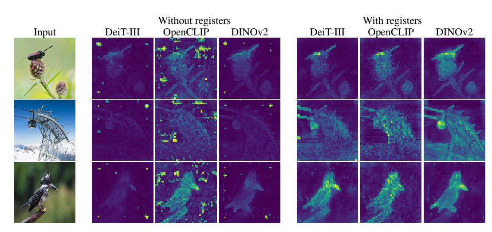
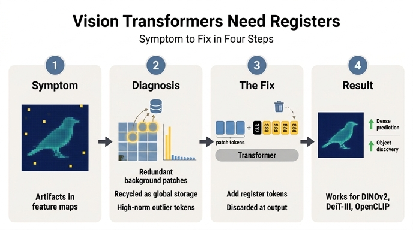

# 논문의 최종 결론 요약 — Vision Transformers Need Registers

> **Q.** 논문의 최종 결론을 요약하면?
>
> **A.** 모델이 저정보 영역의 토큰을 재활용해 다른 역할로 쓰는 현상을 outlier norm으로 탐지하고, 출력에 쓰이지 않는 추가 토큰을 붙이는 단순한 수정으로 artifact를 완전히 제거했다. dense prediction과 object discovery 성능이 개선되며, DeiT-III·OpenCLIP 같은 지도학습 모델에도 동일하게 적용된다.

이 카드는 논문(Darcet, Oquab, Mairal, Bojanowski, ICLR 2024, arXiv:2309.16588) 전체를 한 장으로 압축한 카드다. 5절 CONCLUSION의 문장들이 그대로 정답에 대응하며, 그 각 구절이 논문 본문의 어느 단계에서 나온 결론인지를 따라가면 전체 구조가 복원된다.

결론 문장을 다섯 조각으로 쪼개면 이렇게 대응한다.

| 결론 구절 | 논문 위치 |
|---|---|
| "artifact가 DINOv2뿐 아니라 여러 인기 모델에 존재" | Fig. 2 (발견) |
| "outlier norm으로 탐지" | §2.1, Fig. 3 (진단 도구) |
| "저정보 영역 토큰을 재활용해 다른 역할로" | §2.1 세 갈래 증거 + §2.2 가설 |
| "출력에 안 쓰이는 추가 토큰 = register" | §2.2, Fig. 6 (처방) |
| "dense prediction / object discovery 개선, 지도학습 모델도" | Table 2a, Table 3, Fig. 7 (검증) |

---

## 1. 발견 — 문제는 DINOv2가 아니라 ViT 전반이었다

출발점은 실용적인 관찰이었다. DINOv2는 dense task(깊이 추정, 세그멘테이션)에서 매우 강한데, 정작 **LOST 기반 object discovery에는 놀랄 만큼 안 맞았다.** DINO로는 잘 되던 것이 DINOv2로는 지도학습 백본 수준으로 떨어졌다.

attention map을 직접 눈으로 보니 원인이 드러난다. 배경 영역에 의미 없는 밝은 점(artifact)이 흩뿌려져 있다. 더 놀라운 건 이게 DINOv2만의 문제가 아니라는 점이다 — 레이블 지도학습(DeiT-III), 텍스트 지도학습(OpenCLIP) 모두 같은 점이 보인다. **깨끗한 쪽인 DINO가 오히려 예외**이고, DINOv2는 ViT의 기본 거동을 그대로 따르고 있었다.

왼쪽 절반(without registers)의 배경에 박힌 밝은 픽셀이 artifact다. 오른쪽 절반(with registers)에서는 그 점들이 사라지고 물체 윤곽만 남는다. 이 그림 한 장이 논문 전체의 before/after다.

## 2. 진단 도구 — "outlier norm"이라는 정량 지표

정성적인 "점이 보인다"를 정량 지표로 바꾼 것이 논문의 첫 기여다. artifact patch는 **출력 토큰 임베딩의 L2 norm이 정상 patch의 약 10배**다. norm 분포를 그리면 뚜렷한 **bimodal(쌍봉)** 형태여서, 임계값 하나(DINOv2-g 기준 150)로 깔끔하게 갈린다. 이 기준으로 세면 전체 토큰의 **약 2.37%**만 outlier다.

이 지표가 있으니 "언제 생기는가"도 측정할 수 있다(Fig. 4).

- **깊이**: 40층 ViT-g 기준 **약 15번째 층**부터 갈라진다 (중간 층)
- **학습 시간**: 학습의 **1/3 지점을 지나야** 나타난다
- **모델 크기**: **ViT-Large 이상**에서만 나타난다 (Tiny~Base는 없음)

즉 artifact는 버그가 아니라, **크고 충분히 오래 학습된 모델에서만 창발하는 학습된 거동**이다.

> 연결 고리: 이 세 조건(중간 층 / 1/3 학습 / L 이상)과 2.37%, 150, 10배 같은 숫자들은 별도 카드로 자주 물어보는 지점이다.

## 3. 해석 — 세 갈래 증거로 "재활용" 가설을 세운다

정답의 "저정보 영역의 토큰을 재활용해 다른 역할로 쓴다"는 문장은 세 개의 독립적 실험이 모여 만들어진 결론이다.

**(a) 어디에 생기나 — 중복된 패치에 생긴다.**
patch embedding 직후(ViT 첫 층 이전) 각 토큰과 상하좌우 이웃 4개의 코사인 유사도를 재보면, 나중에 high-norm이 될 토큰들은 이웃과 매우 유사하다(Fig. 5a). 즉 **이웃이 이미 말해주는, 버려도 되는 잉여 정보**를 담은 패치다. 정성적으로도 균일한 배경 영역에 몰린다. (부록 A: 물체 중심 사진이 많아 outlier가 프레임 가장자리 쪽에 더 많다.)

**(b) 무엇을 잃었나 — 지역 정보가 없다.**
patch embedding 위에 linear probe를 얹어 두 과제를 시킨다. ① 이 패치가 이미지의 어느 위치인지 예측(위치는 absolute position embedding으로 첫 층 전에 주입된 정보다), ② 원본 픽셀 복원. 두 과제 모두 outlier 토큰의 성능이 정상 토큰보다 **크게 낮다**(Fig. 5b). 모델이 forward 도중 그 패치의 **지역 정보를 버렸다**는 뜻이다.

**(c) 무엇을 얻었나 — 전역 정보가 들어 있다.**
patch 토큰 하나를 무작위로 골라 그것만으로 이미지 분류를 학습시킨다(Table 1). 정상 토큰은 참담한데(Aircraft 17.1, Cars 10.8, CUB 18.6) outlier 토큰은 [CLS]에 근접한다(Aircraft 79.1 vs [CLS] 87.3, Cars 85.2 vs 91.5, Flowers 99.6 vs 99.7). **패치 하나가 이미지 전체를 요약**하고 있다.

세 증거를 합치면 §2.2의 가설이 나온다:

> 크고 충분히 학습된 모델은 **잉여 토큰을 알아보고, 그 자리를 전역 정보를 저장(store)·처리(process)·회수(retrieve)하는 스크래치패드로 재활용**한다.

그리고 이 행동 자체는 나쁘지 않다 — **나쁜 것은 그 일이 patch 토큰 안에서 벌어진다는 사실**이다. patch 토큰이 지역 정보를 잃으면 dense prediction이 손해를 본다.

> 연결 고리: 이 (a)/(b)/(c) 삼각 증거는 각각 개별 카드가 되는 부분이다. 특히 Table 1의 "outlier가 [CLS]에 근접" 대비가 핵심.

## 4. 처방 — register: 넣기만 하고 안 쓰는 토큰

가설이 "모델이 스크래치패드를 필요로 한다"라면, 처방은 자명하다. **스크래치패드를 따로 마련해 주면 된다.**

patch embedding 층 뒤에 [CLS]처럼 학습 가능한 토큰 N개를 추가로 붙인다(register). 모델 끝에서 **register 출력은 그냥 버리고**, 평소처럼 [CLS]와 patch 토큰만 표현으로 쓴다. 학습·추론 모두 동일하다.

정답의 "출력에 쓰이지 않는 추가 토큰"이 바로 이 폐기 구조를 가리킨다. 이 점이 기존의 특수 토큰들과 register를 가르는 기준이다 — BERT의 [SEP], ViT의 [CLS], DETR의 object query, BEiT의 [MASK]는 전부 **정보를 넣거나 출력값을 쓰기 위한** 토큰이다. register는 **정보를 넣지도, 출력을 쓰지도 않는다.** 순전히 forward pass 중의 저장 공간이다.

메커니즘 자체는 NLP의 Memory Transformer(Burtsev et al., 2020)가 먼저 제안했다. 논문이 새로 기여하는 통찰은 이것이다: **ViT에서는 이 메커니즘이 이미 자발적으로 일어나고 있으며, register는 그것을 만들어내는 것이 아니라 격리(isolate)해서 부작용을 없앤다.**

비용도 거의 없다(부록 B). register 4개 기준 **FLOPs 증가 2% 미만**, 파라미터 증가는 무시할 수준.

## 5. 검증 — "완전히 제거" + "성능 개선"

**artifact 제거(Fig. 7, Fig. 15).** DINOv2, OpenCLIP, DeiT-III 세 모델 모두 register를 넣으면 출력 norm 분포에서 high-norm 봉우리가 사라진다. Fig. 15의 세밀한 분석은 더 결정적이다 — **high-norm 토큰이 전부 register 쪽으로 옮겨갔다.** 거동이 사라진 게 아니라 register에 **흡수(absorb)** 된 것이며, 이는 §2.2의 가설을 사후적으로 입증한다. Table 4/5도 같은 말을 한다: 전역 정보 집계 행동은 register로 이전되고, 나머지 patch의 지역 정보는 그대로다(위치 예측 66.3 → 65.8, 복원 오차 15.9 → 16.0).

**표현 품질 회귀 없음, 오히려 개선 (Table 2a).** 동결 백본 + linear probing.

| | ImageNet Top-1 | ADE20k mIoU | NYUd rmse ↓ |
|---|---|---|---|
| DeiT-III | 84.7 | 38.9 | 0.511 |
| DeiT-III+reg | 84.7 | **39.1** | 0.512 |
| OpenCLIP | 78.2 | 26.6 | 0.702 |
| OpenCLIP+reg | 78.1 | **26.7** | **0.661** |
| DINOv2 | 84.3 | 46.6 | 0.378 |
| DINOv2+reg | **84.8** | **47.9** | **0.366** |

DINOv2가 가장 큰 이득을 본다: ADE20k **+1.3 mIoU**, NYUd rmse **0.378 → 0.366**, ImageNet도 **+0.5**. 정답의 "dense prediction 개선"이 이 줄이다. OpenCLIP zero-shot도 59.9 → 60.1로 유지된다(Table 2b).

**object discovery (Table 3, LOST corloc).** 가장 극적인 부분이다.

| | VOC 2007 | VOC 2012 | COCO 20k |
|---|---|---|---|
| DeiT-III | 11.7 | 13.1 | 10.7 |
| DeiT-III+reg | **27.1** | **32.7** | **25.1** |
| OpenCLIP | 38.8 | 44.3 | 31.0 |
| OpenCLIP+reg | 37.1 | 42.0 | 27.9 |
| DINOv2 | 35.3 | 40.2 | 26.9 |
| DINOv2+reg | **55.4** | **60.0** | **42.0** |

DINOv2는 VOC2007에서 **+20.1 corloc**(35.3 → 55.4), DeiT-III는 11.7 → 27.1로 **두 배 이상**. 서두의 "DINOv2가 LOST에 안 맞는다"는 수수께끼가 여기서 풀린다.

**register 개수 (Fig. 8).** artifact를 지우는 데는 **1개면 충분**하다. 다만 dense task에는 최적점이 존재하고, ImageNet 분류는 개수를 늘릴수록 좋아진다. 논문은 전 실험에서 **4개**를 쓴다.

**부수적 발견 (Fig. 9, Fig. 16).** 강제하지 않았는데도 register들이 서로 다른 영역에 attend하는 **자발적 분화**가 나타난다 (slot attention과 유사). register 3은 가장자리에, register 2는 위쪽에 더 집중한다. 평균 attention map의 지지 영역이 넓다는 점에서 [CLS]와 닮았고 — 이 역시 register가 전역 정보를 담고 있다는 증거다.

**일반성.** 자기지도(DINOv2), 레이블 지도(DeiT-III), 텍스트 지도(OpenCLIP) 전부에서 artifact가 사라지고 성능이 유지·개선된다. 정답 마지막 문장 "DeiT-III·OpenCLIP 같은 지도학습 모델에도 동일하게 적용된다"가 이 지점이다. 아키텍처 변경 한 줄이므로 **어떤 학습 절차에도 그대로 얹을 수 있다**는 것이 실무적 함의다.

## 6. 남은 한계 — 논문이 스스로 열어둔 것들

결론을 "완전히 해결했다"로만 외우면 논문의 절반을 놓친다. 저자들이 명시적으로 미해결로 남긴 것이 넷 있다.

1. **OpenCLIP의 LOST 예외 (부록 C).** OpenCLIP만 register를 넣으면 corloc이 오히려 **떨어진다**(VOC07 38.8 → 37.1). Fig. 7에서 분명히 high-norm patch가 존재하는데도 LOST의 seed expansion 점수는 매끄럽다. 이유는 LOST가 OpenCLIP에 대해서는 feature가 아니라 attention의 **value**를 쓰기 때문이다. key/query에서는 artifact가 배경 점으로 보이는데, **value projection이 outlier를 걸러낸다** — 즉 outlier가 **value projection의 null space에 살고 있는** 것으로 보인다. 왜 그런지는 future work로 남겼다.
2. **DINO의 61.9 corloc 미달.** DINOv2+reg의 VOC2007 55.4는 큰 도약이지만, 원조 DINO가 LOST 논문에서 기록한 **61.9에는 여전히 못 미친다.** register가 격차를 크게 줄였을 뿐 완전히 메우지는 못했다.
3. **register norm의 양자화 미규명 (부록 D.1).** Fig. 15에서 register들의 norm이 예전 outlier와 달리 **띄엄띄엄 양자화된 값**처럼 보인다. 원인 미상, future work.
4. **어떤 학습 요인이 artifact를 만드는가 — 미규명 (§2.2 말미).** 저자들은 "artifact 발생을 어떤 학습 요소가 유발하는지 완전히 밝히지 못했다"고 명시한다. pretraining paradigm이 관여하는 듯하고(OpenCLIP·DeiT-III는 B와 L 모두에서 outlier), 모델 크기와 학습 길이도 중요하지만(Fig. 4), 결정적 요인은 특정되지 않았다. 부록 E의 MAE 관찰이 힌트다 — MAE는 artifact가 없는데, 저자 가설로는 patch 토큰에 대한 **국소 손실만** 쓰고 전역 집계 목적함수가 없기 때문이다. (다만 MAE는 linear probing 성능 자체가 낮아 대안이 못 된다.)

정리하면 이 논문은 **"진단은 완결됐고 처방은 유효하지만, 병인(病因)은 미규명"** 인 상태로 끝난다. 그래서 register는 원인 치료가 아니라 증상을 안전한 곳으로 옮기는 **격리(isolation)** 라고 이해하는 편이 정확하다.

## 한 문장 압축

> 큰 ViT는 배경의 잉여 patch를 전역 정보 스크래치패드로 몰래 재활용하며(→ 출력 norm 10배 outlier, 전체의 2%), 그 대가로 지역 정보를 잃는다. 출력에서 버려질 register 토큰 몇 개를 시퀀스에 붙여 그 역할을 대신 맡기면 artifact가 완전히 사라지고, dense prediction과 object discovery가 개선되며, 이는 자기지도·레이블지도·텍스트지도 모델에 공통으로 통한다.

## 인포그래픽

