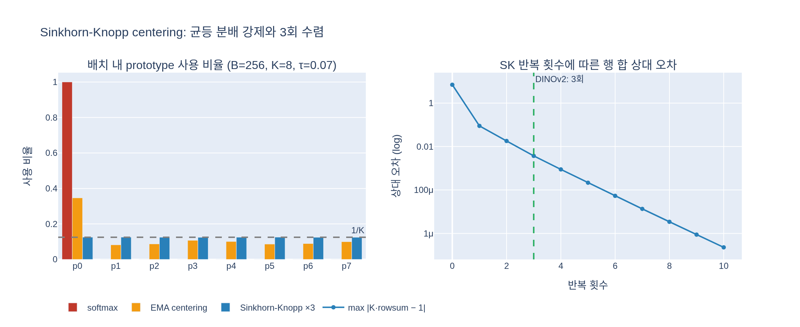

# Sinkhorn-Knopp centering이란 무엇이며 몇 번 반복하나?

> **답:** teacher의 softmax-centering 단계를 SwAV의 Sinkhorn-Knopp(SK) batch normalization으로 대체하는 것. SK 알고리즘을 **3번 반복**하며, student 쪽은 그대로 softmax 정규화를 쓴다.

출처: DINOv2 논문(arXiv 2304.07193) §4 "Discriminative Self-supervised Pre-training" 의 항목 **"Sinkhorn-Knopp centering (Caron et al., 2020)"**:

> Ruan et al. (2023) recommend to replace the teacher softmax-centering step of DINO and iBOT by the Sinkhorn-Knopp (SK) batch normalization of SwAV (Caron et al., 2020). We run the Sinkhorn-Knopp algorithm steps for 3 iterations. For the student, we apply the softmax normalization.

---

## 1. 배경: DINO에서 teacher 출력은 왜 "centering"이 필요한가

DINO/iBOT 계열의 self-distillation은 다음 구조다.

- student와 teacher(student의 EMA)가 같은 이미지의 다른 crop을 본다.
- 각 네트워크의 head는 $K$개의 **prototype score**(로짓) $z \in \mathbb{R}^K$를 낸다 (DINOv2는 $K = 128{,}000$ 개의 prototype 사용).
- student 분포 $p_s = \mathrm{softmax}(z_s / \tau_s)$, teacher 분포 $p_t$ 를 만들어 $\mathcal{L}_{DINO} = -\sum p_t \log p_s$ 로 학습한다.

teacher 쪽에 라벨이 없으므로 **collapse**(붕괴)가 항상 위협이다. 두 종류가 있다.

| 붕괴 형태 | 현상 | DINO의 대응 |
|---|---|---|
| 한 prototype 독점 | 모든 이미지에서 같은 차원이 최대가 됨 → 손실은 0에 가까운데 정보가 없음 | **centering**: $z_t \leftarrow z_t - c$, $c$ 는 배치 평균의 EMA |
| 균등분포 붕괴 | 모든 차원이 $1/K$ 로 같아짐 | **sharpening**: 낮은 온도 $\tau_t$ (0.04~0.07) |

원래 DINO teacher는 이 둘을 합쳐

$$p_t = \mathrm{softmax}\!\left(\frac{z_t - c}{\tau_t}\right), \qquad c \leftarrow m\,c + (1-m)\,\frac{1}{B}\sum_{i=1}^{B} z_{t,i}$$

로 계산한다. 이것이 카드에서 말하는 **"softmax-centering 단계"** 다. 이 저장소에서는 `dinov2/loss/dino_clstoken_loss.py` 의 `DINOLoss.softmax_center_teacher()` 와 `update_center()` (center_momentum = 0.9) 가 그대로 남아 있다.

centering 은 "평균을 빼서 특정 prototype이 항상 이기는 것을 막는" 간접적인 장치다. 배치 안에서 prototype 사용 비율이 정확히 균등해진다는 보장은 없고, EMA 이므로 현재 배치가 아닌 과거 통계에 의존한다.

## 2. SwAV의 Sinkhorn-Knopp: 균등 분배를 "제약"으로 강제

SwAV(Caron et al., 2020)는 같은 문제를 **최적수송(optimal transport)** 관점에서 푼다. 배치의 $B$개 샘플을 $K$개 prototype에 배정하는 행렬 $Q \in \mathbb{R}^{K \times B}$ 를 구하되,

- 각 샘플(열)은 총 확률 1 을 가지고,
- 각 prototype(행)은 정확히 $B/K$ 만큼의 샘플을 받아야 한다 (**equipartition 제약**).

이 조건을 만족하는 $Q$ 중 score $z$ 와 가장 잘 맞는(엔트로피 정규화 항 $\varepsilon$ 포함) 해는 닫힌 형태

$$Q^\ast = \mathrm{Diag}(u)\,\exp\!\left(\frac{Z}{\varepsilon}\right)\mathrm{Diag}(v)$$

로 쓰이고, 스케일 벡터 $u, v$ 는 **Sinkhorn-Knopp 알고리즘** — 행 정규화와 열 정규화를 번갈아 반복 — 으로 구한다. 이름 그대로 1960년대 Sinkhorn과 Knopp이 "양의 행렬을 행·열 스케일링으로 이중확률행렬(doubly stochastic matrix)로 만들 수 있다"는 정리를 증명한 알고리즘이다. 배치 전체의 통계를 사용해 정규화하므로 SwAV 논문과 DINOv2 논문은 이를 **"SK batch normalization"** 이라고 부른다.

## 3. DINOv2에서의 구현 (3회 반복)

저장소의 `DINOLoss.sinkhorn_knopp_teacher()` (`dinov2/loss/dino_clstoken_loss.py`) 는 논문 표기와 같도록 $Q$ 를 $K \times B$ 로 두고 다음을 수행한다.

```python
@torch.no_grad()
def sinkhorn_knopp_teacher(self, teacher_output, teacher_temp, n_iterations=3):
    Q = torch.exp(teacher_output / teacher_temp).t()   # K x B
    B = Q.shape[1] * world_size                        # 전체 GPU의 샘플 수
    K = Q.shape[0]                                     # prototype 수
    Q /= Q.sum()                                       # (all_reduce) 전체 합 1
    for it in range(n_iterations):                     # 기본 3회
        Q /= Q.sum(dim=1, keepdim=True); Q /= K        # 행: prototype 마다 1/K
        Q /= Q.sum(dim=0, keepdim=True); Q /= B        # 열: 샘플 마다 1/B
    Q *= B                                             # 열 합 = 1 → 각 샘플의 확률분포
    return Q.t()                                       # B x K 로 되돌림
```

핵심 포인트:

1. **온도가 여전히 들어간다.** $\exp(z/\tau_t)$ 로 시작하므로 sharpening 역할은 유지된다. 대체되는 것은 "$c$ 를 빼는 EMA centering" 만이다.
2. **배치 통계로 즉시 정규화.** `dist.all_reduce` 로 GPU 전체 배치(3k)의 합을 모아 행 합을 맞추므로, 그 배치 안에서 prototype 사용량이 실제로 $B/K$ 로 균등해진다. EMA 지연이 없다.
3. **3회 반복.** SK 는 기하급수적으로 빨리 수렴하고, teacher target 은 어차피 근사여도 무방하므로 SwAV 와 마찬가지로 3번만 돈다 (`n_iterations=3` 기본값). 아래 시각화에서 3회 후 행 합의 상대 편차가 이미 $10^{-3}$ 수준임을 확인할 수 있다 (수렴 속도는 로짓의 스케일·온도에 따라 달라지며, 극단적으로 뾰족한 행렬일수록 느려진다).
4. **student 는 그대로 softmax.** $p_s = \mathrm{softmax}(z_s/\tau_s)$ 로 두고, SK 로 얻은 $p_t$ 를 target 으로 cross-entropy 를 계산한다. student 쪽에 SK 를 쓰면 gradient 가 배치 다른 샘플에 얽히고 붕괴 방지 목적과도 무관하므로 teacher 만 바꾼다.
5. **DINO head 와 iBOT head 둘 다 적용.** `ssl_meta_arch.py` 에서 `cfg.train.centering == "sinkhorn_knopp"` 이면 class-token 손실과 patch-token(iBOT) 손실 모두 `sinkhorn_knopp_teacher` 를 호출한다. iBOT 쪽(`iBOTPatchLoss.sinkhorn_knopp_teacher`)은 샘플 수 $B$ 가 "마스킹된 패치 총 개수" 라는 점만 다르다.
6. **설정값.** 기본 설정 `ssl_default_config.yaml` 은 `centering: "centering"` 이지만, 공개된 학습 레시피 `configs/train/vitl14.yaml`, `vitg14.yaml` 은 `centering: sinkhorn_knopp` 을 사용한다.

## 4. 효과: 성능은 같지만 채택된 이유

논문 Table 1 (ViT-L, ImageNet-22k 학습) 의 점진적 ablation 에서

| 단계 | k-NN | linear |
|---|---|---|
| +Batch size 3k | 81.7 | 84.7 |
| **+Sinkhorn-Knopp** | 81.7 (=) | 84.7 (=) |
| +Untying heads = DINOv2 | 82.0 | 84.5 |

SK centering 은 정확도를 바꾸지 않았다. 그럼에도 채택한 배경은

- **Ruan et al. (2023)** ("Weighted Ensemble Self-Supervised Learning", ICLR 2023) 의 권고 — DINO 계열의 EMA centering 을 SK 로 바꾸면 teacher target 의 품질이 개선된다는 분석.
- 128k prototype, 3k 배치, 대규모 데이터(LVD-142M) 라는 스케일에서 붕괴 없이 안정적으로 학습시키는 것이 최우선 목표였고, SK 는 배치 내 균등 분배를 **보장** 하므로 하이퍼파라미터(center momentum) 에 덜 민감하다.
- DINOv2 §4 서두에서 방법 전체를 "DINO + iBOT 손실 + **SwAV 의 centering**" 의 조합으로 정의할 만큼, 이 항목은 설계의 정체성 일부다.

## 5. 한 줄 정리

> teacher 로짓에서 EMA 평균을 빼던(centering) 대신, $\exp(z/\tau_t)$ 행렬의 행(prototype)·열(샘플) 합을 **3번 교대로 정규화**해 배치 내 prototype 사용량이 균등한 확률분포 $p_t$ 를 만든다. student 는 평범한 softmax.

## 시각화



왼쪽: 한 prototype 이 과대 사용되는 로짓에서 (a) 단순 softmax, (b) EMA centering, (c) SK 3회를 거쳤을 때의 prototype 사용 비율. SK 만 정확히 $1/K$ 로 균등해진다. 오른쪽: SK 반복 횟수에 따른 행 합(prototype 사용량)의 최대 상대 오차(log 스케일). 3회에서 이미 충분히 작다.
