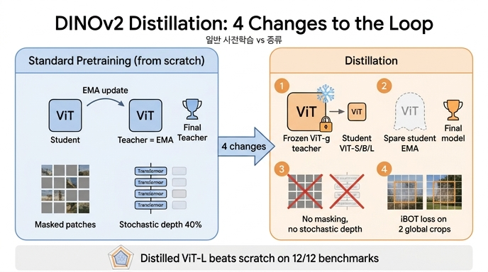

# DINOv2의 distillation이 일반 사전학습 루프와 다른 4가지 점은?

**답:** ① 더 큰 모델(ViT-g/14)을 **frozen teacher**로 사용, ② student의 **EMA를 별도로 유지**해 그것을 최종 모델로 사용, ③ **masking과 stochastic depth 제거**, ④ **iBOT loss를 두 global crop에 적용**.

출처: DINOv2 논문(arXiv 2304.07193) 5절 "Efficient implementation" 중 **Model distillation** 단락, 6.5절 "Impact of Knowledge Distillation", Fig. 5.

---

## 1. 배경: 왜 "같은 루프"를 재활용할 수 있는가

DINOv2의 사전학습 목적함수(DINO loss + iBOT loss)는 애초에 **teacher → student 자기증류(self-distillation)** 형태다.

| 구성 | 일반 사전학습(from scratch) |
|---|---|
| teacher | student와 **같은 아키텍처**, student 가중치의 **EMA**(momentum 0.994→1.0 cosine, 매 step 갱신) |
| student | 역전파로 학습되는 모델 |
| DINO loss | class token: `-Σ p_t log p_s` (서로 다른 crop 간) |
| iBOT loss | student 입력 패치 일부를 **마스킹**하고, teacher의 대응 패치(visible) 출력으로 마스크 토큰을 예측 |
| 정규화 | stochastic depth **d = 40%** (fused kernel로 drop된 residual 연산 자체를 skip) |
| 최종 모델 | teacher(EMA)를 사용 |

논문 표현: *"Since our objective function is a form of distillation from the teacher network to the student network, we leverage the same training loop with a few exceptions."* — 즉 큰 모델 → 작은 모델 지식증류(Hinton et al., 2014)를 위해 새 파이프라인을 만들지 않고, 위 루프에서 **네 가지만 바꿨다**.

## 2. 네 가지 차이점 상세

### ① 더 큰 모델을 frozen teacher로 사용
- 일반 루프: teacher = student의 EMA (같은 크기, 매 step 움직임).
- distillation: teacher = **이미 학습된 ViT-g/14 (1.1B)**, 가중치를 **고정(frozen)**. student(ViT-S/B/L)는 이 고정된 목표를 향해 학습한다.
- 따라서 teacher와 student의 크기가 다르고, teacher는 학습 중 전혀 변하지 않는다.

### ② student의 EMA를 별도로("spare") 유지해 최종 모델로 사용
- 일반 루프에서 EMA는 곧 teacher였고, 최종 모델 역시 teacher(EMA)였다.
- distillation에서 teacher는 frozen ViT-g이므로 EMA 역할이 사라진다. 그러나 EMA 가중치의 **가중치 평균(weight averaging) 효과**를 잃지 않기 위해, teacher와 무관하게 **student의 EMA 사본을 따로 유지**하고 학습이 끝나면 **그 EMA를 최종 배포 모델**로 쓴다.
- Duval et al. (2023)의 증류 방식과 거의 같지만, DINOv2는 loss 항을 수정하지 않고 **student의 EMA를 평가**한다는 점이 다르다고 명시.

### ③ masking과 stochastic depth 제거
- **masking 제거**: iBOT의 패치 마스킹은 student 자신이 EMA teacher와 놀이하는 "가려진 패치 복원" 과제였다. 목표가 강력한 frozen teacher일 때는 입력을 가리지 않고 teacher의 패치 출력을 **그대로 모사**하는 것이 더 직접적이다.
- **stochastic depth 제거**: d=40%의 stochastic depth는 1B 규모 모델 from-scratch 학습의 과적합·불안정을 막는 정규화였다. 작은 student가 고정된 목표를 따라가는 회귀 문제에서는 이런 강한 정규화가 불필요하며, 오히려 teacher 출력 모사를 방해한다.
- 참고로 Table 17에 따르면 distilled 모델은 FFN으로 **MLP**를, from-scratch 모델은 **SwiGLU**를 쓴다(아키텍처 차이는 카드의 4가지 항목에는 포함되지 않음).

### ④ iBOT loss를 두 global crop에 적용
- 마스킹이 없어졌으니 iBOT loss(패치 단위 cross-entropy)를 "마스크된 패치"에 걸 수 없다. 대신 **두 개의 global crop(224 해상도)** 의 **모든 패치 토큰**에 대해 student 패치 출력이 teacher 패치 출력을 따르도록 iBOT loss를 적용한다.
- 결과적으로 class token(DINO loss)뿐 아니라 **패치 수준 표현까지 dense하게 증류**되어, 세그멘테이션·깊이 추정 같은 dense task 성능도 함께 전달된다.

## 3. 효과: Fig. 5

- 왼쪽 레이더 차트: 파란 선(ViT-L/14 **Scratch**), 주황 면(ViT-L/14 **Distill**), 빨간 점선(ViT-g/14 teacher). 주황 면이 파란 선을 **12개 벤치마크 전부**에서 감싸고 있으며, Oxford-H·Paris-H(검색)에서는 teacher 점선을 넘어선다.
- 오른쪽 표: INet-1k 84.5→**86.3**, Segm. 72.2→**73.3**, Depth 1.10→**1.08**, Retriev. 71.3→**76.3**, ARSketch 69.5→**74.5** 등. teacher(ViT-g, 회색)와의 격차가 크게 줄어든다.
- 논문 결론: *"this approach achieves better performance than training from scratch, even for a ViT-L."* — 그래서 공개된 DINOv2 ViT-S/B/L은 모두 ViT-g에서 증류된 모델이다.

## 4. 기억법

**"큰 선생은 얼음(frozen), 내 EMA는 따로, 가리지도 빼지도 말고(no mask / no drop), 두 큰 그림(global crop)에 iBOT."**

| # | 일반 사전학습 | distillation |
|---|---|---|
| ① teacher | 자기 EMA(같은 크기) | **더 큰 frozen 모델** |
| ② 최종 모델 | teacher(EMA) | **별도 유지한 student EMA** |
| ③ 정규화 | 패치 masking + stochastic depth 40% | **둘 다 제거** |
| ④ iBOT loss | 마스크된 패치에만 | **두 global crop의 패치 전체** |

## 인포그래픽

