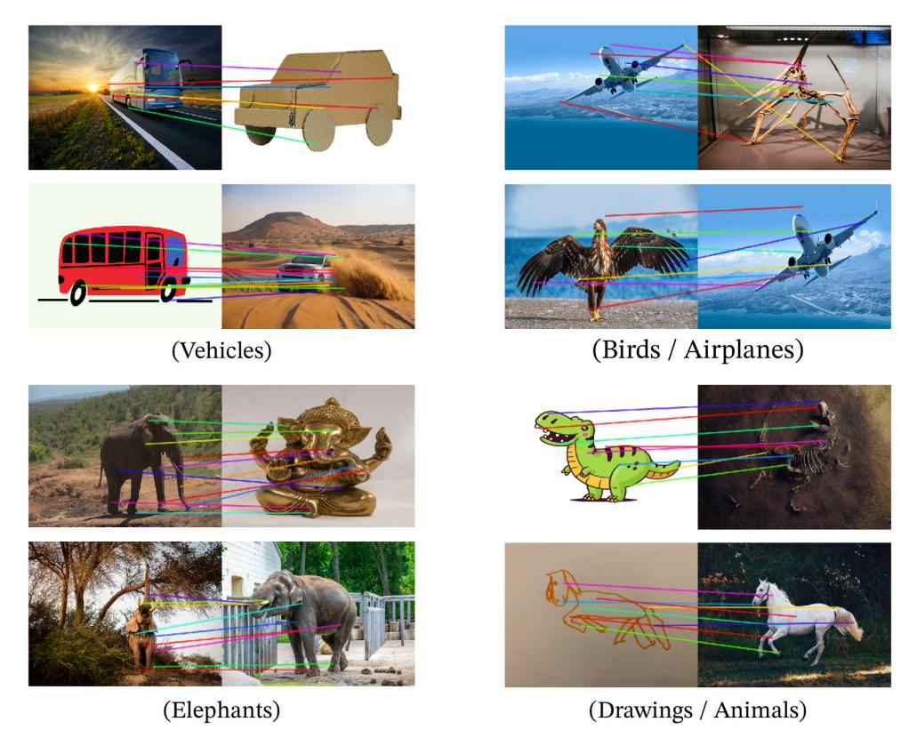

# Figure 1의 PCA 시각화가 보여주는 emergent property

**출처**: Oquab et al., *DINOv2: Learning Robust Visual Features without Supervision* (arXiv 2304.07193v2), Figure 1 및 §7.4 "Qualitative Results — PCA of patch features", Figure 9.

## 한 줄 답

DINOv2의 **패치 feature**에 PCA를 걸어 첫 3개 성분을 R·G·B 채널로 칠하면, 같은 컬럼(같은 범주)의 이미지들 사이에서 **포즈·스타일·심지어 객체 종류가 달라도 같은 "부위(part)"가 같은 색으로 대응**된다. 그리고 **첫 번째 성분을 thresholding하는 것만으로 배경이 제거**된다. 모델은 부위를 구분하도록 학습된 적이 없으므로, 이는 자기지도 학습에서 **저절로 나타난(emergent) 속성**이다.

## Figure 1 실제로 보기

각 컬럼은 하나의 PCA 그룹이다. 왼쪽이 원본, 오른쪽이 PCA 색상 맵(배경은 검게 제거됨).

| 컬럼 | 포함 이미지 | 관찰되는 것 |
|---|---|---|
| (a) | 독수리 2장 + 비행기 2장 | 새의 날개와 비행기의 주익이 같은 색(녹색/파랑 계열), 머리·동체 앞부분은 붉은색으로 **종(species)이 다른 객체 간에도 부위가 정렬**됨 |
| (b) | 코끼리 사진 3장 + 황금 가네샤 상 | 실제 코끼리의 머리/등/다리 색 배치가 **금속 조각상(스타일 완전히 다름)**에서도 동일하게 재현됨 |
| (c) | 백마 사진, 말 떼, 말 선화(線畫), 항공 사진의 양 떼 | 사진과 **손으로 그린 스케치** 사이에서도 머리·몸통·다리가 같은 색으로 매칭; 작은 말 떼는 각 개체마다 같은 색 패턴이 반복 |
| (d) | 골판지 자동차, 버스, 붉은 버스 일러스트, 사막 SUV | 재질·도메인(실사/공예/일러스트)이 달라도 차체 상부(파랑/녹색)와 바퀴 부근(붉은/마젠타)이 일관되게 대응 |

색 자체에는 절대적 의미가 없다(PCA 성분 부호는 임의). 중요한 것은 **한 컬럼 안에서 색이 일관되게 같은 부위를 가리킨다**는 점이다.

## 어떻게 만들었나 (§7.4의 절차)

1. 이미지를 ViT에 넣어 **패치 단위 feature**(각 패치당 하나의 벡터)를 얻는다. 시각화의 격자 모양 픽셀들이 패치 하나하나다.
2. **1차 PCA**: 패치 feature 전체에 PCA를 수행하고, **첫 번째 주성분 값이 양(+)인 패치만 남긴다**. 이 thresholding이 전경(주 객체)/배경을 분리한다. 즉 "분산이 가장 큰 방향"이 곧 *객체 vs. 배경* 축이었다는 뜻으로, 학습 없이 얻은 **비지도 전경 검출기**가 된다.
3. **2차 PCA**: 남은 전경 패치들을 같은 범주의 이미지(Fig.1은 한 컬럼 = 3~4장)에 걸쳐 모아 다시 PCA를 하고, 첫 3개 성분을 각각 R, G, B에 매핑한다.
4. 결과적으로 나머지 성분들이 객체의 "부위"에 대응하며, 같은 범주 이미지 사이에서 잘 일치한다.

논문의 표현을 그대로 옮기면: *"This is an emerging property – our model was not trained to parse parts of objects."*

## 왜 "emergent"인가

- DINOv2의 학습 목표는 이미지 수준 DINO loss + 패치 수준 iBOT loss(마스크된 패치 예측)일 뿐, **부위 레이블·분할 마스크·대응점 감독은 전혀 없다**.
- 그런데도 feature 공간의 **주요 분산 방향**이 (1) 전경/배경, (2) 객체 부위와 정렬되어 있다는 것은, 그런 구조가 표현 안에 *선형적으로 readily available*하다는 증거다. 이는 논문이 결론에서 강조하는 "linear classifier만으로 정보가 바로 꺼내진다"는 주장과 같은 맥락이다.
- 도메인을 넘어 대응된다는 점(사진↔스케치↔조각상↔일러스트)은 feature가 텍스처나 색이 아닌 **의미적 구조**를 인코딩함을 보여준다.

## 더 많은 예시 — Figure 9

부록의 Fig. 9는 20장(소·말·개·양 등)에 대해 **모든 이미지의 패치를 한꺼번에** PCA한 결과다. 여기서도

- 배경(잔디, 하늘, 실내)은 첫 성분 음수 → 검게 제거되고,
- 소·말·개·양처럼 **서로 다른 동물 사이에서도** 머리는 붉은/마젠타 계열, 등·몸통은 녹색, 다리 쪽은 파랑/보라 계열로 대체로 일관된 배치가 보인다.
- 만화 소("HELLO" 그림), 손 그림 말처럼 스타일이 다른 입력도 같은 색 문법을 따른다.

## 같은 성질의 다른 얼굴 — Figure 10 패치 매칭

PCA 시각화와 같은 전경 검출 절차 후, 두 이미지의 패치 feature 간 유클리드 거리로 할당 문제를 풀어 대응선을 그린 것이다. 버스↔골판지 차, 독수리↔비행기(날개끼리, 머리↔기수), 코끼리↔가네샤 상, 공룡 만화↔공룡 화석이 **부위 단위로 연결**된다. Fig. 1이 "색으로" 보여준 부위 대응을 Fig. 10은 "선으로" 직접 확인해 주는 셈이다.

## 기억용 요약

- **입력**: 같은 범주 이미지 여러 장의 패치 feature
- **1st PC threshold** → 배경 제거(비지도 전경 검출)
- **PC 1~3 → RGB** → 같은 색 = 같은 부위, 포즈·스타일·객체 불변
- **핵심 함의**: 부위 파싱을 배운 적 없는데 나타난 **emergent part correspondence**
