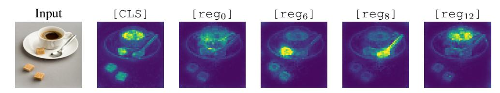

# 평균 attention map으로 "register = global 정보"를 주장한 논증

출처: *Vision Transformers Need Registers* (Darcet et al., ICLR 2024), Appendix **D.3 Positional Focus**, **Fig. 16**.

---

## 0. 카드 한 줄 요약

register의 **평균 attention map**이 [CLS]의 것과 거의 같은 모양(넓은 support)이고, 일반 patch token의 것과는 확연히 다르다.
[CLS]가 global 정보를 담는다는 건 이미 확립된 사실이므로 → register도 global 정보 쪽이다.
**이것은 "모양이 닮았으니 역할도 닮았다"는 유비 추론(analogy)이다.**

---

## 1. 그림부터: 실제로 무엇이 보이나

![Fig. 16 — [CLS], reg0~reg3, patch의 평균 attention map](fig-1.jpeg)

왼쪽부터 (a) `[CLS]`, (b)~(e) `reg_0`~`reg_3`, (f) 일반 `patch` 하나의 평균 attention map이다. 실제로 눈에 보이는 것:

- **(a) [CLS]**: 이미지 중앙에 크고 부드러운 밝은 blob. 밝은 영역이 화면의 상당 부분을 덮는다 → **support가 넓다**.
- **(b) reg₀**: (a)와 거의 구분이 안 될 정도로 닮았다. 같은 위치, 같은 크기의 중앙 blob.
- **(c) reg₁, (d) reg₂**: 여전히 중앙 중심의 큰 blob이지만 형태가 조금씩 다르다. reg₂는 위쪽으로 더 치우쳐 있다.
- **(e) reg₃**: 중앙이 오히려 **어둡고 테두리(border)가 밝다**. 여전히 "넓은" 영역이지만 초점이 가장자리로 간 케이스.
- **(f) patch**: 거의 전부 검은 배경에 **점 하나만 밝다**(자기 자신/자기 주변). 아주 국소적(localized).

즉 (a)~(e)는 서로 다른 세부에도 불구하고 **"이미지 전체 규모의 영역을 본다"**는 공통 성질을 갖고, (f)만 성질 자체가 다르다.

---

## 2. 이 map은 어떻게 만들어졌나 (중요 — 해석 주의점)

논문 D.3의 절차:

1. DINOv2 + register 모델을 **ImageNet-22k의 무작위 부분집합(random subset)**에 대해 forward.
2. **마지막 layer**에서 각 토큰([CLS], reg₀~₃, 그리고 비교용 patch 하나)이 patch token들에 주는 attention map을 얻는다.
3. 이 map들을 **이미지 전체에 걸쳐 평균**한다.

여기서 나오는 것은 개별 이미지의 attention이 아니라 **"이 토큰은 평균적으로 이미지의 어느 위치를 보는가"**, 즉 **positional focus**다.

⚠️ **해석상 주의점**: 그래서 그림에 보이는 **중앙 blob은 모델의 성질이자 동시에 데이터의 성질**이다. ImageNet-22k는 장면(scene)이 아니라 **object-centric 이미지**가 대부분이라 물체가 대개 화면 가운데 있다. 논문도 명시적으로 "ImageNet-22k contains mostly object-centric images rather than scenes, which explains why the average attention maps correspond to centered blobs"라고 적는다.

→ 따라서 이 그림에서 읽어야 할 근거는 **"중앙을 본다"가 아니라 "support가 넓은가 좁은가"** 라는 대비다. 데이터셋을 장면 위주로 바꾸면 blob 위치는 달라질 수 있지만, [CLS]/register의 넓은 support vs patch의 좁은 support라는 **대비 자체**는 데이터 편향으로 설명되지 않는다.

또한 평균을 냈기 때문에 **개별 이미지 단위의 다양성은 지워진다**. 실제로 개별 이미지에서 register들은 서로 다른 물체/부위에 붙는 slot-attention 같은 행동을 보인다(Fig. 9). 평균 map은 그 다양성을 뭉개고 "위치 편향"만 남긴 요약이라는 점을 기억해야 한다.

---

## 3. 논증의 구조 (이 카드의 핵심)

### 전제 (Premise): [CLS]는 global 정보를 담는다

이건 이 논문이 새로 증명하는 게 아니라 **가져다 쓰는 기성 사실**이다. 근거는:

- ViT/DINO 계열에서 [CLS]는 **image-level 표현**으로 쓰이도록 학습된다. 분류 head가 [CLS]에 붙고, DINO/DINOv2의 self-distillation loss도 [CLS] 임베딩 수준에서 걸린다. 즉 목적함수 자체가 [CLS]에게 "이미지 전체를 요약하라"고 요구한다.
- 경험적으로도 **[CLS] linear probing 성능이 압도적**이다. 같은 논문 Table 1(DINOv2-g, register 없음)에서 Aircraft 기준 [CLS] 87.3 vs 일반 patch 17.1. 단일 patch로는 못 맞히는 클래스를 [CLS] 하나로 맞힌다는 건 그 안에 이미지 전역 정보가 응축돼 있다는 뜻이다.
- 구조적으로도 [CLS]는 공간적 위치가 없는 토큰이라 "여기 근처"라는 국소 정보를 담을 이유가 없다.

### 관찰 (Observation): 평균 attention map의 두 부류

Fig. 16에서 토큰들이 **두 그룹으로 갈린다**:

| 그룹 | 토큰 | 평균 attention의 성질 |
|---|---|---|
| A | [CLS], reg₀, reg₁, reg₂, reg₃ | **large support** — 이미지의 큰 영역에 퍼져서 attend |
| B | 일반 patch token | **localized** — 자기 주변 소수 patch에만 집중 |

그리고 register들은 그룹 B가 아니라 **그룹 A에, 그것도 [CLS]와 "very similarly"** 로 들어간다.

### 추론 (Inference): 따라서 register도 global 쪽

> "정보를 어디서 모으는가"가 "어떤 정보를 담는가"를 결정한다.
> [CLS]는 넓게 모아서 global을 담는다. register도 넓게 모은다. → register도 global을 담는다.

논문 원문: *"registers produce maps with a large support area, very similarly to the [CLS] token, and very different of a typical patch token which is more localized. As the [CLS] token is known to carry global information (as proven by the linear probing classification performance): this suggests that registers also carry global information."*

동사가 **"suggests"** 라는 점에 주목. 논문 스스로 이걸 증명이 아니라 시사로 표현한다.

---

## 4. 왜 이것만으로는 결정적이지 않은가

이 논증은 **구조적 유사성 → 기능적 유사성**을 옮기는 유비 추론이다. 약한 고리들:

1. **넓은 support ≠ global 정보.** 넓게 attend하면서도 결과적으로 무의미한 평균(예: 거의 uniform한 "no-op" attention, attention sink)을 뽑을 수 있다. 실제로 LLM의 attention sink 토큰은 attention을 잔뜩 받으면서 내용은 거의 담지 않는다. attention 분포는 **정보의 유입 경로**를 보여줄 뿐 **저장된 내용**을 직접 측정하지 않는다.
2. **평균의 함정.** 평균 map이 넓다고 개별 map이 넓은 건 아니다. 이미지마다 좁게 보되 그 위치가 이미지마다 다르면 평균은 넓게 퍼진다. (Fig. 9를 보면 개별 register는 실제로 특정 물체에 국소적으로 붙기도 한다.)
3. **reg₃ 같은 반례성 케이스.** reg₃는 border를 본다 — "[CLS]와 닮았다"는 서술이 4개 register 모두에 균일하게 적용되지는 않는다. 논문도 register 간 variability와 specialization을 함께 인정한다.
4. **데이터 편향 교란.** 위 2절대로, 중앙 blob은 ImageNet-22k의 object-centric 성질이 만든 부분이 있다.

**그래서 이 근거는 단독으로 서지 못하고, 독립적인 다른 증거들과 합쳐질 때 결론이 단단해진다.**

---

## 5. 이 유비를 떠받치는 독립 증거 두 개

### (a) Table 4 — linear probing으로 "내용"을 직접 측정

Aircraft 데이터셋에서 토큰 종류별 linear probing:

- **register 없는 모델**: [CLS] 높음 / 일반 patch 매우 낮음 / **outlier(high-norm) patch는 [CLS]에 가깝게 높음** (Table 1에서 87.3 / 17.1 / 79.1).
- **register 4개 모델**: [CLS]와 일반 patch 점수는 거의 그대로. **outlier patch가 사라지고, 그 높은 점수를 register가 그대로 물려받는다.**

논문 Table 4 캡션: *"the behavior of the outlier tokens, aggregating global information, is absorbed into the register."*

이건 attention 모양이 아니라 **"그 토큰만 보고 이미지 클래스를 맞힐 수 있는가"** 를 재는 것 — global 정보의 **직접적** 측정이다. 유비가 아니다.

### (b) Fig. 15 — high norm이 patch에서 register로 이동

왼쪽(register 없음): patch token 중 일부가 norm 150~200까지 치솟는 **high-norm outlier**로 흩뿌려져 있다.
오른쪽(register 4개): patch의 outlier가 **완전히 사라지고**, 대신 reg₁, reg₂, reg₃가 그 높은 norm 대역(65~130)을 차지한다.

즉 "global 정보를 저장하던 그 이상 행동" 자체가 patch에서 register로 **옮겨간** 것이 norm 분포로도 확인된다. (부수 관찰: register들의 norm이 양자화된 것처럼 좁은 띠로 나타나는데, 논문은 이 현상의 원인을 future work로 남긴다.)

---

## 6. 세 증거의 역할 분담 (외울 때 이 프레임으로)

| 증거 | 무엇을 보나 | 강도 |
|---|---|---|
| **Fig. 16** 평균 attention map | 정보를 **어디서 모으는가** (경로) | 유비 — 시사적 |
| **Table 4** linear probing | 토큰이 **무엇을 담고 있는가** (내용) | 직접 측정 — 강함 |
| **Fig. 15** norm 분포 | 이상 행동이 **어디로 이동했는가** (위치) | 직접 측정 — 강함 |

세 가지가 "register = 원래 outlier patch가 하던 global 정보 저장소 역할을 넘겨받은 토큰"이라는 **하나의 그림**으로 수렴한다. Fig. 16 혼자였다면 "그럴듯한 관찰" 수준이지만, Table 4/Fig. 15가 내용과 이동을 직접 재주기 때문에 attention map의 유사성이 **해당 메커니즘의 자연스러운 귀결**로 읽히게 된다.

---

## 7. 시험용 체크 질문

- Q. Fig. 16에서 "support가 넓다"는 게 왜 근거가 되나? → 정보 수집 범위가 이미지 전역이라는 뜻이고, [CLS]가 global을 담는 방식과 같은 패턴이기 때문.
- Q. 왜 patch token은 대조군으로 적절한가? → 같은 layer, 같은 attention 메커니즘인데 성질이 명확히 다르다는 걸 보여주므로, "넓은 support"가 모델 전반의 trivial한 성질이 아님을 확인시켜 준다.
- Q. 이 논증의 논리적 형식은? → 유비 추론. 결정적 증명이 아니라 다른 증거(Table 4, Fig. 15)와의 수렴으로 강화되는 정황.
- Q. 중앙 blob을 "모델이 중앙을 중시한다"고 읽으면 안 되는 이유는? → ImageNet-22k가 object-centric이라 물체가 대개 중앙에 있기 때문. 데이터 편향이 섞인 위치 통계다.
