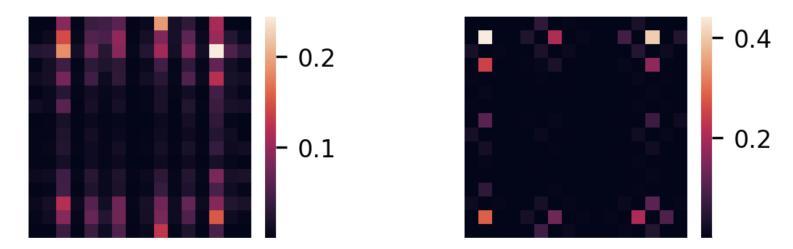
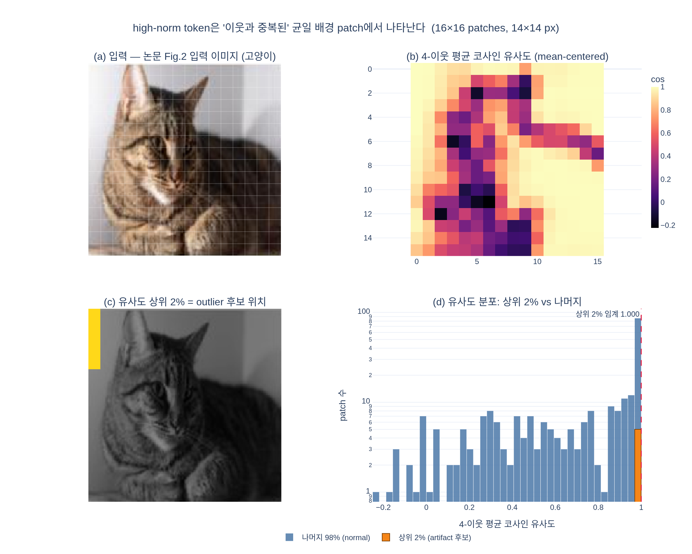

# high-norm token은 어떤 위치의 patch에서 나타나는가?

> 출처: **Vision Transformers Need Registers** (Darcet et al., ICLR 2024, arXiv:2309.16588) §2 "Problem Formulation"

## 한 줄 답

**patch embedding 직후(= ViT 첫 블록에 들어가기 직전) 기준으로 상하좌우 이웃 4개 patch와의 코사인 유사도가 1에 가까운 patch**, 즉 **주변과 중복된 정보만 담고 있어 굳이 따로 표현할 필요가 없는 patch**에서 나타난다. 질적으로는 하늘·벽·잔디 같은 **균일한 배경 영역**에 자주 등장한다.

---

## 1. 배경: "high-norm token"이 뭐였나

논문은 DINOv2·OpenCLIP·DeiT-III 같은 큰 ViT의 feature map에서 튀는 artifact를 발견하고, 이를 **출력 token의 L2 norm이 비정상적으로 큰 token**으로 정량화한다.

- 일반 patch token의 norm은 0~100 범위인데, 일부 token은 그보다 약 **10배** 크다.
- 논문은 편의상 **norm > 150**을 "high-norm(= outlier)" 기준으로 삼는다 (모델마다 컷오프는 달라짐).
- 전체 sequence의 약 **2.37%** 정도로 소수다.
- 40-layer ViT-g 기준 **layer 15 근처(중간층)** 에서 갈라지기 시작하고, 학습이 1/3쯤 진행된 뒤, ViT-Large 이상 크기에서만 나타난다.

즉 "high-norm"은 **출력(output) token**의 성질이다. 그런데 질문은 "**어떤 위치의 patch**에서 나타나느냐"이므로, 출력이 아니라 **입력 쪽 patch의 성질**로 되짚어야 한다. 이 되짚기가 아래 §2다.

## 2. 정량적 답: 이웃 4개와의 코사인 유사도

논문의 측정 절차는 이렇다.

1. 이미지를 forward 해서 **출력** patch token들의 norm을 재고, norm > 150인 patch를 "artifact patch"로 라벨링한다.
2. 같은 patch들에 대해 이번엔 **patch embedding layer 직후**(ViT 첫 layer 이전)의 embedding을 가져온다.
3. 각 patch와 **상하좌우 이웃 4개** patch embedding 사이의 코사인 유사도를 계산한다.
4. artifact patch 집합과 normal patch 집합의 유사도 분포를 따로 그린다.

왼쪽 그래프(Fig. 5a)에서 실제로 관찰되는 것:

- **주황색(artifact patches)** 분포는 x = 1.0 바로 앞에 density 20에 육박하는 **아주 뾰족한 스파이크** 하나로 몰려 있다. 거의 모든 artifact patch가 이웃과 코사인 유사도 ≈ 1이라는 뜻이다.
- **파란색(normal patches)** 분포는 0.0 ~ 1.0에 걸쳐 넓고 완만하게 퍼져 있다. 0.3~0.6 구간에도 상당한 질량이 있고, 1.0 근처의 봉우리도 주황색보다 훨씬 낮다.
- 두 분포의 대비가 핵심이다: **"이웃과 매우 비슷하다"는 것이 high-norm이 될 patch의 선행 조건**이다. (역은 성립하지 않는다 — 이웃과 비슷한 patch가 전부 outlier가 되지는 않는다. 배경 patch는 훨씬 많지만 outlier는 2%뿐이다.)

오른쪽 표(Fig. 5b)는 같은 이야기를 반대편에서 확인해 준다. outlier token으로 **위치 예측**(top-1 41.7% → 22.8%, 평균 거리 0.79 → 5.09)과 **픽셀 복원**(L2 error 18.38 → 25.23)을 해 보면 모두 크게 나빠진다. 즉 그 token은 자기 자리의 local 정보를 이미 버린 상태다. **버려도 되는 정보(= 이웃과 중복)** 였기 때문에 버릴 수 있었던 것이다.

### 코사인 유사도 정의

$$\mathrm{sim}(p_i, p_j) = \frac{\langle p_i,\, p_j \rangle}{\lVert p_i \rVert \, \lVert p_j \rVert}$$

$p_i$ = patch embedding layer 직후의 $i$번째 patch 벡터, $\mathcal{N}(i)$ = $i$의 상하좌우 이웃 인덱스 집합일 때, 논문이 보는 값은 사실상

$$s_i = \frac{1}{|\mathcal{N}(i)|}\sum_{j \in \mathcal{N}(i)} \mathrm{sim}(p_i, p_j)$$

이고, artifact patch에서는 $s_i \approx 1$이다.

## 3. 질적 답: 균일한 배경 영역

Fig. 2는 같은 결론의 눈으로 보는 버전이다. 왼쪽 Input 열(해변의 사람, 벽 앞의 고양이, 풀밭 위의 벌레, 대리석 위의 도넛)과 오른쪽 attention map들을 겹쳐 보면:

- DeiT-III-B/L, OpenCLIP-B/L, DINOv2-g에서 **노란/청록색으로 튀는 몇 개의 픽셀**이 보인다. 이것이 artifact다.
- 그 튀는 점들의 위치는 대체로 **하늘, 평평한 벽, 균일한 초록 배경, 단색 대리석** 같은 곳이다 — 물체(사람·고양이 얼굴·벌레·도넛) 위가 아니다.
- **DINO-B**만 이런 뾰족한 점 없이 물체를 부드럽게 강조한다. artifact는 모든 ViT의 숙명이 아니라, 충분히 크고 충분히 오래 학습된 모델에서 나타나는 현상이다.

균일한 배경 = 이웃 patch와 픽셀 통계가 거의 같은 영역 = §2의 코사인 유사도 ≈ 1. 정량 관찰과 질적 관찰이 같은 곳을 가리킨다.

## 4. 보너스: 위치 분포도 중심보다 가장자리 쪽

부록 A의 Fig. 10은 outlier가 feature map의 어느 좌표에 뜨는지를 누적한 히트맵이다.

- **왼쪽**(원 DINOv2 구현): 세로 줄무늬 패턴이 뚜렷하다. 이건 내용과 무관한 구현 버그로, position embedding을 $16\times16 \to 7\times7$로 bicubic interpolate 할 때 **antialiasing을 끄고** 해서 생긴 격자 artifact다.
- **오른쪽**(antialiasing 적용): 줄무늬가 사라지고, 밝은 칸이 **네 모서리와 테두리**에 몰린다. 중앙은 거의 검다.
- 해석: 사람이 찍은 사진은 object-centric이라 **가장자리 = 배경**인 경우가 많다. 모델이 "정보가 적은 곳"을 register로 재활용한다는 §2의 설명과 정확히 맞물린다.

## 5. 왜 하필 그런 patch인가 (해석)

논문의 가설: 충분히 크고 충분히 학습된 ViT는 **중복된(=버려도 되는) token을 알아보고, 그 자리를 global 정보를 저장·연산·회수하는 스크래치 공간으로 재활용**한다.

- 근거 1: outlier token은 local 정보(위치·픽셀)를 거의 안 갖고 있다 (Fig. 5b).
- 근거 2: 반대로 outlier token 하나만 뽑아 linear probing 하면 normal token보다 이미지 분류 정확도가 **훨씬 높다** (Table 1 — 예: Aircraft 79.1 vs 17.1, Cars 85.2 vs 10.8, IN1k 69.0 vs 65.8) → global 정보를 담고 있다.
- 결론: 이 동작 자체는 나쁘지 않지만, **patch token 안에서** 일어나는 게 문제다. dense prediction에 필요한 local 정보를 날려 버리기 때문이다.
- 처방: 이미지와 무관한 여분 token(**register**)을 입력 시퀀스에 붙여 그 역할을 대신 맡긴다. 그러면 patch token 쪽 high-norm outlier가 **완전히 사라진다** (Fig. 7, Fig. 15).

## 암기 포인트

| 축 | high-norm token이 나타나는 곳 |
|---|---|
| 정량 (입력 쪽) | patch embedding 직후, **이웃 4개와 코사인 유사도 ≈ 1** 인 patch |
| 정보량 | 이웃과 **중복**되어 버려도 되는 patch |
| 질적 | **균일한 배경** 영역 (하늘·벽·잔디·단색 바닥) |
| 공간 분포 | feature map **중앙보다 테두리/모서리** 쪽 |
| 측정 시점 주의 | "high-norm"은 **출력** token의 norm(>150), "유사도"는 **입력** patch embedding |

## 시각화

`expy.py`는 실제 사진(논문 Fig. 2의 고양이 입력 이미지)을 14×14 patch로 잘라 16×16 = 256개 patch를 만들고, 원본 픽셀 수준에서 4-이웃 평균 코사인 유사도를 계산해 상위 2%(= 논문의 outlier 비율 2.37%에 대응)를 표시한다.

- (b) 히트맵: **균일한 벽 배경**이 밝은 노랑(cos ≈ 1)으로 뭉쳐 있고, 고양이 얼굴·눈·털 윤곽은 검게(cos ≈ 0 이하) 떨어진다.
- (c) 상위 2%로 뽑힌 5개 patch는 전부 **왼쪽 가장자리 col 0 (row 0~4)** 의 벽이다 — Fig. 10의 "가장자리 배경" 관찰과 같은 방향.
- (d) 분포: 상위 2%(주황)는 x = 1.0 직전 한 칸에 몰려 있고 나머지(파랑)는 −0.2 ~ 1.0에 넓게 퍼진다 → 논문 Fig. 5a의 모양 그대로. 상위 2% 평균 0.9998 vs 나머지 평균 0.677.

