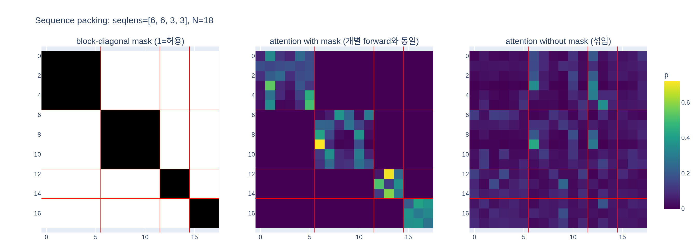

# sequence packing에서 서로 다른 시퀀스가 섞이지 않게 하는 방법은?

**답:** self-attention 행렬에 **block-diagonal mask**를 적용해 서로 다른 시퀀스 사이의 attention을 차단한다. 마스크된 항목은 softmax에서 확률 0이 되므로, 각 토큰은 자기 시퀀스 안의 토큰만 참조한다 → 시퀀스를 하나씩 따로 forward한 것과 **수학적으로 완전히 동일**(strictly equivalent)하다.

## 1. 문제: 길이가 다른 시퀀스를 한 배치로 못 돌린다

DINO/iBOT 학습은 한 이미지에서 여러 crop을 만들어 모두 ViT에 통과시킨다 (DINOv2, §5 "Implementation details").

| crop 종류 | 해상도 | 패치(14px) 격자 | 토큰 수 (+CLS) |
|---|---|---|---|
| global crop ×2 | 224×224 | 16×16 = 256 | 257 |
| local crop ×8 | 98×98 | 7×7 = 49 | 50 |

토큰 길이가 257 vs 50으로 다르니 `[B, N, C]` 텐서 하나로 쌓을 수 없다. 기존 구현(iBOT 등)은 **global 배치와 local 배치를 따로 두 번 forward/backward** 했다. 커널 런치가 두 배, 작은 crop 쪽은 GPU 활용률도 낮다. 대안인 padding(50 → 257로 채우기)은 local 8개에서 토큰의 80%가 낭비다.

## 2. 해법: sequence packing (NLP에서 가져온 트릭)

Krell et al. (2022) "Efficient sequence packing without cross-contamination"에서 유래. 아이디어는 단순하다.

1. forward할 시퀀스들을 **하나의 긴 시퀀스로 이어붙인다** (`concat`). 예: 257 + 257 + 50×8 = 914 토큰이 배치 크기 1인 시퀀스 하나가 된다.
2. transformer block(LayerNorm, MLP, residual)은 **토큰 단위 연산**이므로 이어붙여도 결과가 그대로다.
3. 유일하게 토큰 간에 정보가 오가는 곳은 **self-attention**. 여기에서만 마스크가 필요하다.

## 3. 섞임을 막는 장치: block-diagonal mask

$N = \sum_i n_i$ 개의 토큰이 packed 되어 있을 때, attention score $S = QK^\top/\sqrt{d}$ 에 다음 마스크를 더한다.

$$
M_{ab} =
\begin{cases}
0 & \text{토큰 } a,\ b \text{가 같은 시퀀스} \\
-\infty & \text{다른 시퀀스}
\end{cases}
\qquad
A = \mathrm{softmax}(S + M)\,V
$$

$M$은 시퀀스 경계를 따라 대각선에 $n_i \times n_i$ 블록만 0이고 나머지는 $-\infty$인 **block-diagonal** 구조다.

왜 "완전히 동일"한가:

- softmax는 행(query) 단위로 정규화된다. 행 $a$에서 $\exp(-\infty)=0$ 이므로 다른 시퀀스의 key는 분자·분모 어디에도 기여하지 않는다. 남는 것은 자기 시퀀스의 key들만으로 계산한 softmax — 즉 그 시퀀스를 **단독으로 forward했을 때의 attention 행 그대로**다.
- 값 $V$ 쪽도 가중치 0이 곱해지니 다른 시퀀스의 value는 섞이지 않는다.
- 이 등식은 근사가 아니라 항등식이므로 forward뿐 아니라 backward(gradient)도 동일하다. 학습 결과에 영향이 없고 단지 빠르기만 하다.

이어붙인 순서(어떤 crop을 먼저 넣는지)나 시퀀스 개수와도 무관하게 성립한다.

## 4. "낭비"는 없나? — 마스크를 곱하는 것이 아니라 블록을 건너뛴다

dense $N\times N$ 행렬을 만들고 $-\infty$를 더하는 식으로 구현하면, 914 토큰 예에서 유효 항목은 $\frac{2\cdot257^2+8\cdot50^2}{914^2}\approx 18\%$ 밖에 안 된다. 그래서 DINOv2는 xFormers의 `memory_efficient_attention`에 `BlockDiagonalMask`를 **attn_bias로 넘기고**, 커널이 대각 블록 바깥의 타일은 계산 자체를 건너뛴다. 결과적으로 FLOPs는 "따로 forward" 한 것과 같으면서 커널 런치·메모리 왕복은 한 번뿐이다.

DINOv2 코드(`dinov2/layers/block.py`)의 핵심:

```python
# 각 crop 그룹 x(shape [b, n, C])에 대해 시퀀스 길이 n을 b번 나열
seqlens = [x.shape[1] for b, x in zip(batch_sizes, x_list) for _ in range(b)]
attn_bias = fmha.BlockDiagonalMask.from_seqlens(seqlens)   # 블록 경계 정보만 저장
x_cat = torch.cat([x.reshape(1, -1, C) for x in x_list], dim=1)  # [1, sum(b*n), C]
x_cat = x_cat + attn(norm1(x_cat), attn_bias=attn_bias)          # 한 번에 forward
x_list = attn_bias.split(x_cat)                                  # 다시 crop 그룹별로 분리
```

`MemEffAttention.forward`는 받은 `attn_bias`를 `memory_efficient_attention(q, k, v, attn_bias=attn_bias)`로 그대로 넘긴다. 즉 마스크는 tensor가 아니라 "seqlens 리스트"라는 메타데이터에 가깝고, 같은 shape 조합은 `attn_bias_cache`로 재사용한다. 이것이 `NestedTensorBlock.forward_nested`이며, 논문이 "iBOT 구현보다 약 2× 빠르고 메모리 1/3"이라고 보고한 개선의 한 축이다 (FlashAttention 자체 구현과 함께).

## 5. 한 줄 정리

> concat으로 한 시퀀스로 만들고, attention 점수에 **같은 시퀀스면 0 / 다른 시퀀스면 $-\infty$** 인 block-diagonal 마스크를 더한다. softmax가 $-\infty$를 0으로 만들어 교차 참조가 사라지므로, 결과는 개별 forward와 비트 수준이 아닌 **수학적** 동치이고 속도만 빨라진다.

## 시각화



왼쪽: 4개 crop(길이 6, 6, 3, 3)을 packing한 18×18 block-diagonal mask (허용=1, 차단=0). 가운데: 마스크를 적용한 attention 행렬 — 대각 블록 바깥이 정확히 0이며 각 블록은 개별 forward의 attention과 일치. 오른쪽: 마스크 없이 packing했을 때 — 다른 crop으로 attention이 새서(cross-contamination) 결과가 달라진다.
