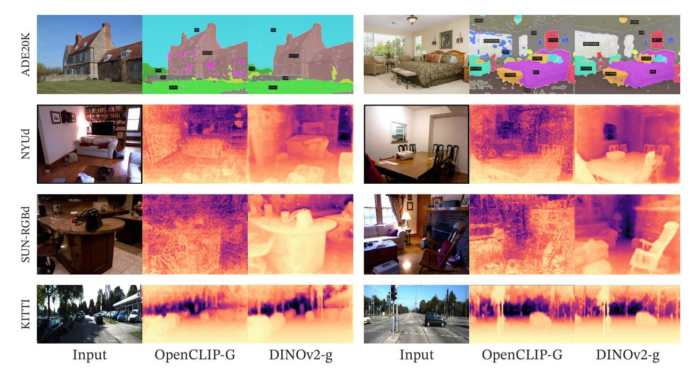
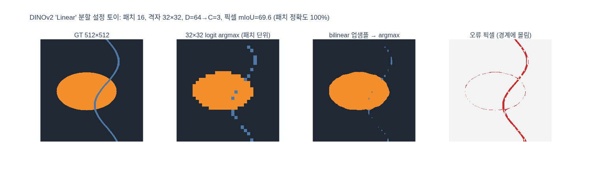

# semantic segmentation 평가의 "Linear" 설정은 무엇인가?

> **답**: 패치 토큰에서 class logit을 예측하는 **선형 층 하나**를 학습해 저해상도 logit map(예: patch 16이면 32×32)을 만든 뒤 512×512로 업샘플링한다. 매우 단순하지만 고해상도 분할을 만들기 어렵다.

출처: DINOv2 논문(arXiv 2304.07193) Sec. 7.4 *Dense Recognition Tasks* — "Semantic segmentation" 단락과 Table 10, Fig. 7.

---

## 1. 원문이 말하는 것

> **Linear:** a linear layer is trained to predict class logits from a patch tokens. It is used to produce a low-resolution logit map (eg 32x32 for a model with patch size 16), which is then upsampled to full resolution (512x512) to obtain a segmentation map. This procedure is extremely simple but cannot easily produce high-resolution segmentations.

즉 백본은 **frozen**이고, 학습되는 것은 선형 층 하나뿐이다. 이 설정의 목적은 "DINOv2의 패치 토큰 안에 픽셀 단위 의미 정보가 **선형적으로 읽어낼 수 있는 형태로** 들어 있는가"를 측정하는 것이지, 최고의 분할 성능을 내는 것이 아니다.

## 2. 파이프라인을 단계별로

### (a) ViT 패치 토큰 격자 — $H/p \times W/p$

입력 이미지 $H\times W$ 를 패치 크기 $p$ 로 쪼개면 토큰 수는 $\frac{H}{p}\times\frac{W}{p}$ 개다.

| 입력 | 패치 크기 | 토큰 격자 | 토큰 수 |
|---|---|---|---|
| 512×512 | 16 (논문 예시) | 32×32 | 1,024 |
| 512×512 | 14 (DINOv2 실제 모델) | ≈36×36 (518 입력 시 37×37) | ~1,300 |
| 640×640 (+ms) | 14 | ≈45×45 | ~2,000 |

각 토큰은 $D$ 차원 벡터다(ViT-S 384, ViT-B 768, ViT-L 1024, ViT-g 1536). **한 패치 = 한 벡터**이므로 패치 내부의 공간 정보는 이 하나의 벡터에 압축되어 있다.

### (b) 패치별 선형 분류 — $D \to C$

토큰 $\mathbf{x}_{ij}\in\mathbb{R}^D$ 마다 **같은** 가중치 $W\in\mathbb{R}^{C\times D}$, $\mathbf b\in\mathbb{R}^C$ 를 적용한다.

$$\mathbf{z}_{ij} = W\mathbf{x}_{ij} + \mathbf{b} \in \mathbb{R}^{C}$$

- ADE20k는 $C=150$, CityScapes 19, Pascal VOC 21.
- 구현상으로는 1×1 conv 하나와 동일하다. 파라미터 수는 $D\cdot C + C$ — ViT-g/ADE20k라면 약 23만 개로, 백본(1.1B)에 비하면 무시할 수준이다.
- 학습 타깃은 GT 마스크를 패치 해상도로 내린 것(또는 업샘플 후 픽셀 CE) — 어느 쪽이든 손실은 cross-entropy이고 백본에는 gradient가 흐르지 않는다.

### (c) 저해상도 logit map

결과는 $\frac{H}{p}\times\frac{W}{p}\times C$ 텐서, 즉 "32×32짜리 클래스 점수 지도"다. 이 시점에서 이미 **해상도 손실은 확정**되어 있다 — 16×16 픽셀 블록 하나가 클래스 하나의 점수 벡터로만 표현된다.

### (d) bilinear 업샘플링 → argmax

logit map을 512×512로 bilinear 보간한 뒤 픽셀마다 $\arg\max_c$ 를 취해 분할 마스크를 얻는다. 보간은 logit(연속 값)에 대해 하고 argmax는 마지막에 한다 — argmax를 먼저 하고 nearest로 키우면 계단형 블록이 그대로 드러난다.

## 3. 왜 경계가 뭉개져 고해상도 분할이 어려운가

1. **정보가 애초에 없다.** 경계가 패치 안을 지나가면 그 패치의 토큰은 두 클래스가 섞인 하나의 벡터다. 선형 층은 그 벡터에서 점수 하나를 내지만 "패치 안 어디에 경계가 있는지"는 출력 차원에 존재하지 않는다. 업샘플링은 픽셀을 늘릴 뿐 정보를 만들지 못한다.
2. **bilinear는 저역 통과 필터다.** 인접 패치 중심 4개의 logit을 거리 가중 평균하므로, 경계는 최대 패치 한 변(16px) 폭의 완만한 전이 구간이 된다. 진짜 경계가 직선이든 곡선이든 결과는 패치 격자에 정렬된 부드러운 곡선으로 근사된다.
3. **패치보다 얇은 구조는 사라진다.** 전선, 기둥, 가로등처럼 폭이 $p$ 보다 작은 물체는 어느 패치에서도 다수 클래스가 못 되어 logit이 이웃에 평균되어 묻힌다. 아래 토이 실험에서 폭 10px 띠의 IoU가 15.8%까지 떨어지는 것이 이 현상이다.
4. **수용 영역과 인코더의 문제가 아니다.** ViT의 self-attention은 전역이지만, *출력 격자*가 $H/p$ 로 고정된 것이 병목이다. 그래서 해법은 (i) 격자 자체를 촘촘하게(더 큰 입력 해상도, 작은 패치) 하거나, (ii) 디코더로 고해상도를 복원(ViT-Adapter, UperNet, Mask2Former)하는 두 방향으로 갈린다.

### Fig. 7 — 실제 Linear 설정 결과

첫 줄(ADE20K)이 이 카드의 설정이다. DINOv2-g 열을 보면 건물·하늘·잔디·벽·침대 같은 큰 영역은 잘 나눠지지만, 건물 지붕선이나 침대 가장자리는 곡선이 완만하게 뭉개지고 창틀·의자 팔걸이 같은 얇은 부분은 덩어리로 흡수되어 있다 — 위 3절의 현상이다. OpenCLIP-G 열은 같은 선형 헤드인데도 얼룩처럼 끊어진 조각과 잡음 클래스가 많다. 이는 해상도 문제가 아니라 **토큰 자체의 선형 분리성** 차이로, "Linear 설정이 백본의 패치 특성 품질을 측정하는 잣대"임을 보여준다.

## 4. `+ms`, frozen 백본 + Mask2Former와의 대비

| 설정 | 무엇이 다른가 | 학습 파라미터 | ADE20k mIoU (ViT-g/14) |
|---|---|---|---|
| **Linear (lin.)** | 마지막 층 토큰 → 선형층 → 32×32 logit → bilinear ↑ | 선형층 하나 | **49.0** |
| **+ms** | 마지막 **4개 층** 토큰 concat($4D$ 차원), 입력 **640**, **multiscale** test-time augmentation | 선형층 하나(입력 차원 4배) | **53.0** |
| frozen 백본 + ViT-Adapter + **Mask2Former** | 백본은 frozen(전체 가중치의 66%), adapter와 mask 헤드를 학습해 고해상도 마스크 복원 | adapter + 헤드 | **60.2** |
| SOTA (Wang et al. 2022, end-to-end) | 백본까지 미세조정 | 전부 | 62.9 |

- `+ms`는 세 가지 모두 "경계 정보"를 되살리는 처치다: 여러 층 concat(하위 층에는 더 지역적·저수준 정보가 남아 있음), 더 높은 해상도(격자가 촘촘해짐), multiscale TTA(여러 배율의 logit을 평균해 격자 정렬 오류를 상쇄). 그래도 여전히 선형 헤드라서, MAE를 UperNet으로 **완전 미세조정**한 53.6과 거의 같은 53.0을 내는 것이 논문이 "surprising"이라 한 대목이다.
- Mask2Former 파이프라인은 헤드가 비선형·고해상도라 60.2까지 오르지만 학습이 16 V100 × 28시간 걸린다. Linear 설정은 이 비용 없이 백본 품질을 비교하는 프로브다.

## 5. Table 10 수치 (frozen 특징, mIoU)

| Method | Arch. | ADE20k lin. | ADE20k +ms | CityScapes lin. | CityScapes +ms | VOC lin. | VOC +ms |
|---|---|---|---|---|---|---|---|
| OpenCLIP | ViT-G/14 | 39.3 | 46.0 | 60.3 | 70.3 | 71.4 | 79.2 |
| MAE | ViT-H/14 | 33.3 | 30.7 | 58.4 | 61.0 | 67.6 | 63.3 |
| DINO | ViT-B/8 | 31.8 | 35.2 | 56.9 | 66.2 | 66.4 | 75.6 |
| iBOT | ViT-L/16 | 44.6 | 47.5 | 64.8 | 74.5 | 82.3 | 84.3 |
| DINOv2 | ViT-S/14 | 44.3 | 47.2 | 66.6 | 77.1 | 81.1 | 82.6 |
| DINOv2 | ViT-B/14 | 47.3 | 51.3 | 69.4 | 80.0 | 82.5 | 84.9 |
| DINOv2 | ViT-L/14 | 47.7 | 53.1 | 70.3 | 80.9 | 82.1 | 86.0 |
| DINOv2 | ViT-g/14 | **49.0** | **53.0** | **71.3** | **81.0** | **83.0** | **86.2** |
| 절대 SOTA | — | 62.9 | | 86.9 | | 89.0 | |

읽는 법:
- 가장 작은 DINOv2 ViT-S/14(lin. 44.3)가 OpenCLIP ViT-G/14(39.3)와 MAE ViT-H/14(33.3)를 이긴다 — 선형 프로브라 백본의 패치 토큰 품질이 그대로 드러난다.
- MAE는 `+ms`에서 오히려 떨어지는 경우가 있다(33.3→30.7). MAE의 중간 층 특성이 선형 분리에 유리하지 않다는 뜻.
- Linear → +ms 상승폭(ADE20k 약 +4, CityScapes 약 +10)은 "해상도·다층 정보가 얼마나 부족했는가"의 척도이기도 하다. CityScapes(2048×1024, 얇은 기둥·표지판이 많음)에서 상승폭이 큰 것이 3절의 논리와 맞아떨어진다.
- 논문은 Table 3에서도 KoLeo/MIM 손실 ablation을 ADE20k **Linear** mIoU로 측정한다 — iBOT식 MIM 항이 있어야 패치 수준 과제가 약 3% 좋아진다는 결론을 낼 때 쓴 잣대가 바로 이 설정이다.

## 6. 한 줄 요약

**Linear = frozen 패치 토큰 × 선형층 → (H/p × W/p × C) logit map → bilinear 업샘플 → argmax.** 학습 비용과 가정이 최소라 백본 비교에 이상적이지만, 출력 격자가 패치 크기에 묶여 있어 경계와 얇은 구조가 뭉개진다. 그래서 논문은 다층 concat·고해상도·multiscale인 `+ms`와, frozen 백본 위에 Mask2Former를 얹는 세 번째 설정을 함께 보고한다.

## 시각화

`expy.py`(numpy 토이): 512×512 합성 GT(기울어진 타원 + 폭 10px 곡선 띠) → 32×32 패치 토큰(D=64) → 선형층(D→3) 학습 → logit bilinear 업샘플 → mIoU. 패치 단위 정확도는 100%인데 픽셀 mIoU는 69.6, 오류 픽셀의 100%가 GT 경계 ±8px 안에 있고 얇은 띠는 IoU 15.8%로 무너진다.

