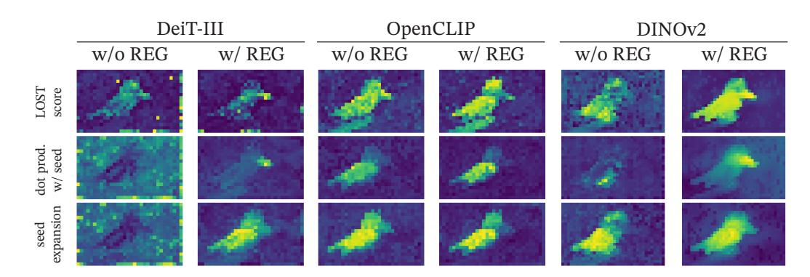
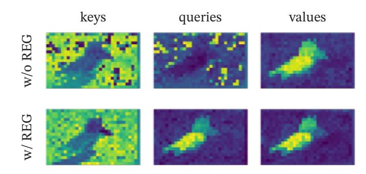

# OpenCLIP + register는 object discovery에서 왜 오히려 나빠졌나

출처: *Vision Transformers Need Registers* (arXiv 2309.16588v2), Sec. 3.3 + Table 3 + **Appendix C**

---

## 1. 카드가 가리키는 숫자 (Table 3, corloc)

| 모델 | VOC 2007 | VOC 2012 | COCO 20k |
|---|---|---|---|
| DeiT-III | 11.7 | 13.1 | 10.7 |
| DeiT-III+reg | **27.1** | **32.7** | **25.1** |
| OpenCLIP | 38.8 | 44.3 | 31.0 |
| OpenCLIP+reg | 37.1 ↓ | 42.0 ↓ | 27.9 ↓ |
| DINOv2 | 35.3 | 40.2 | 26.9 |
| DINOv2+reg | **55.4** | **60.0** | **42.0** |

- DeiT-III(+15.4 / +19.6 / +14.4)와 DINOv2(+20.1 / +19.8 / +15.1)는 register 도입으로 **크게 좋아짐**.
- OpenCLIP만 **-1.7 / -2.3 / -3.1**로 살짝 나빠짐. 본문은 이 예외를 설명하지 않고 "see Sec. C for analysis"라고 부록으로 넘긴다.
- 다만 절대 성능으로 보면 OpenCLIP은 register 유무와 무관하게 38~44 수준으로, "register 없는 DINOv2(35.3)"나 "register 있는 DeiT-III(27.1)"와 비슷하거나 더 좋다. 즉 **원래부터 LOST가 잘 돌던 백본**이었다.

### 실험 세팅 메모
- 방법: **LOST** (Siméoni et al., 2021) — unsupervised object discovery. 패치 feature들의 gram(유사도) 행렬을 만들고, 다른 패치와 양의 상관을 가장 적게 갖는 패치를 **seed**로 고른 뒤, seed와 유사한 패치들로 영역을 넓혀(**seed expansion**) 박스를 뽑는다. 그래서 **local feature map이 매끄러운지**가 성능을 좌우한다.
- 어떤 feature를 쓰나: **DeiT-III와 OpenCLIP은 attention의 value**, **DINOv2는 key**를 사용. (feature의 conditioning이 달라 gram matrix에 bias를 수동으로 더함.)
- 지표: corloc (correct localization).

---

## 2. 부록 C의 논증 (핵심)

**Figure 13** — LOST의 중간 계산(LOST score → seed와의 dot product → seed expansion)을 세 모델에 대해 register 유무로 비교:

- DeiT-III와 DINOv2는 register를 넣으면 중간 맵이 눈에 띄게 깨끗해진다(배경의 밝은 점 = artifact가 사라짐). Table 3의 큰 향상과 일치.
- **OpenCLIP은 register 유무 차이가 별로 없다.** register가 artifact를 지우는 건 맞는데(Fig. 20의 feature map, Fig. 7의 norm 분포에서 확인됨), LOST 점수에는 별 영향이 없다.

여기서 논문이 이상하다고 짚는 점: OpenCLIP은 register 없이도 출력에 **high-norm patch(artifact)가 분명히 존재**하는데(Fig. 7), Fig. 13의 seed expansion 맵은 이미 매끄럽다. 왜?

**답: LOST에 들어가는 게 출력 feature가 아니라 attention의 value이기 때문.**

**Figure 14** — OpenCLIP에 대해 key / query / value 각각으로 seed expansion score를 그려 register 유무를 비교:

- **keys, queries**: register가 없으면 배경에 artifact가 밝은 점으로 **뚜렷이 보인다**. register를 넣으면 점이 사라지고 점수가 객체에 집중된다.
- **values**: **register가 있든 없든** 이미 새(객체)에 깔끔하게 집중되어 있고 artifact가 안 보인다.

즉 **OpenCLIP의 value projection은 register 없이도 outlier를 걸러내고 있다.** 논문의 표현:

> "the value projection filters out the outliers even without registers. This means that the outliers appear to live in the **null space of the value projection layer**; the investigation for this phenomenon is left for future work."

### 그래서 결론
LOST를 OpenCLIP에 돌릴 때 쓰는 feature가 하필 **value**였고, value는 이미 artifact가 제거된 상태였다. → **register가 지워줄 것이 (LOST가 실제로 보는 입력에는) 이미 없었다.** 얻을 이득이 없으니 남는 건, register를 넣어 다시 학습하면서 모델이 조금 달라진 데서 오는 **잡음성 변동**뿐이고, 그게 마침 -1.7 ~ -3.1로 나타난 것. artifact 제거가 실패해서 나빠진 게 아니다.

(참고로 이 논증은 OpenCLIP의 value projection에 한정된 관찰이다. DeiT-III도 value를 쓰지만 register로 크게 좋아졌으므로, "value를 쓰면 항상 artifact가 걸러진다"는 일반 법칙은 아니다. 논문도 원인 규명은 future work로 남겼다.)

---

## 3. null space가 뭔데?

선형변환 $W$에 대해 **$Wx = 0$을 만족하는 벡터 $x$들의 집합**을 $W$의 null space(kernel, 영공간)라고 한다. 그 방향의 성분은 $W$를 통과하면서 **완전히 사라진다**.

$$\mathrm{null}(W) = \{x : Wx = 0\}$$

- 예: $W = \begin{pmatrix}1 & 0\\ 0 & 0\end{pmatrix}$이면 $x=(0, t)$ 형태는 전부 $Wx=0$. 두 번째 좌표에 아무리 큰 값이 실려 있어도 출력엔 흔적이 없다.
- ViT의 attention에서 각 token 표현 $x$는 $W_q x$, $W_k x$, $W_v x$로 각각 query/key/value가 된다.
- artifact token은 **norm이 매우 큰**(= 어떤 방향으로 크게 튄) token이다. 그런데 그 "튄 방향"이 하필 $W_v$의 null space(엄밀히는 거의 null space)에 놓여 있다면, $\|x\|$가 아무리 커도 $W_v x$에는 그 성분이 안 나타난다. → **value 맵에는 artifact가 안 보인다.**
- 반대로 $W_q$, $W_k$의 null space에는 그 방향이 없으므로 query/key 맵에는 점으로 튀어나온다. Fig. 14가 정확히 이 그림이다.

직관적으로: 모델이 그 token들에 "내부 계산용 스크래치패드" 정보를 큰 norm으로 실어놓되, 그 정보를 **value 경로로는 방출하지 않도록** 저장 방향을 골라 학습한 셈이다. 그래서 다른 token들이 attend해도 오염이 전파되지 않는다.

---

## 4. 한 줄 요약

OpenCLIP은 LOST에 **value**를 넣는데 value projection이 이미 artifact를 걸러주고 있었다(outlier가 $W_v$의 null space에 있는 듯) → register가 고칠 문제가 그 경로엔 없었다 → 이득 없이 재학습 잡음만 남아 **VOC2007 38.8→37.1, VOC2012 44.3→42.0, COCO 31.0→27.9로 소폭 하락**. artifact 제거 자체는 OpenCLIP에서도 성공했다(Fig. 7 norm, Fig. 20 feature map).
