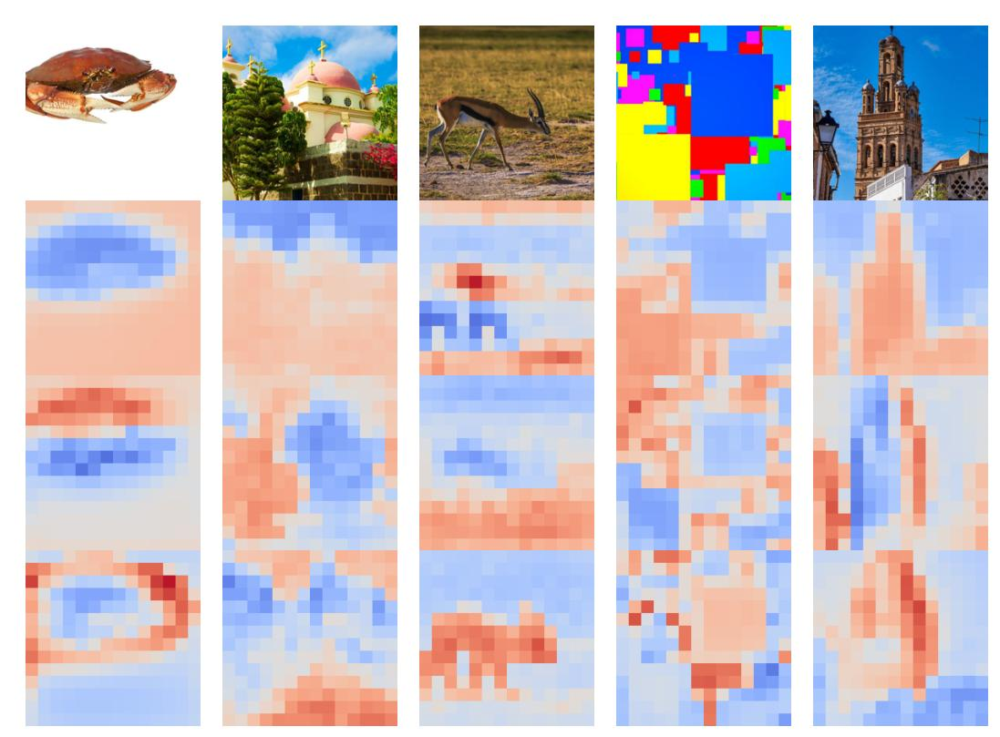

# MAE에는 왜 artifact가 없다고 추정하는가?

> **Q.** Masked Autoencoder(MAE)에는 왜 artifact가 없다고 추정하는가?
> **A.** MAE의 학습이 정보의 global aggregation을 요구하는 목적함수 대신 patch token에 대한 local loss만 사용하기 때문이라는 가설이다.

출처: *Vision Transformers Need Registers* (Darcet et al., ICLR 2024, arXiv:2309.16588) **Appendix E — Masked Autoencoders**.

---

## 1. 논문이 실제로 한 말

> "We observe in Fig. 17 that there are no artifacts in the maps produced by MAE: **our hypothesis is that the absence of artifacts is due to the training procedure using only a local loss on the patch tokens, rather than an objective involving global aggregation of information.** However, we also note that the performance of MAE models is very low for self-supervised representation learning (75% linear probing performance on ImageNet classification for ViT-Large), preventing it from being used as is, and making fine-tuning a requirement."

즉 관찰(MAE 특징맵은 깨끗하다) + 가설(local loss만 쓰기 때문) + 단서(그래도 표현 품질은 낮다) 세 덩어리다.

위가 논문 Figure 17이다. DINOv2에서 보이던 "배경에 콕콕 박힌 고노름 점"이 보이지 않고, 색이 물체 경계를 따라 부드럽게 흐른다.

비교용으로 논문 Figure 2. DeiT-III, OpenCLIP, DINOv2 모두 배경 패치에 튀는 노란 점(= 노름이 10배 큰 outlier token)이 있고, DINO만 없다.

---

## 2. MAE가 정확히 무엇인가 (He et al., 2021, arXiv:2111.06377 / CVPR 2022)

"Masked Autoencoders Are Scalable Vision Learners". BERT의 masked language modeling을 이미지에 옮긴 self-supervised pretraining이다.

핵심 설계 네 가지:

1. **높은 마스킹 비율(75%)**: 이미지를 16×16 패치로 자른 뒤 무작위로 75%를 가린다. 이웃 패치를 그냥 복사해서는 풀 수 없을 만큼 어려운 과제를 만들기 위해서다(언어의 15% 마스킹과 대비되는 지점 — 이미지는 정보 중복이 훨씬 크다).
2. **비대칭 encoder–decoder**: 무거운 ViT encoder는 **보이는 25% 패치만** 입력받는다(mask token을 넣지 않는다). 그래서 시퀀스 길이가 1/4로 줄고 학습이 3배 이상 빨라진다.
3. **가벼운 decoder**: encoder 출력 + 공유 학습 파라미터인 mask token들을 위치 임베딩과 함께 정렬해 넣고, 얕은 Transformer(예: 8층, 512차원)가 복원한다. decoder는 pretraining이 끝나면 버린다.
4. **복원 대상 = 픽셀**: 각 mask token의 최종 출력을 선형 사영해 해당 패치의 **픽셀 벡터**(16×16×3)를 만든다.

**이 카드에서 결정적인 부분 — 손실 함수:**

$$\mathcal{L}_{\text{MAE}} = \frac{1}{|\mathcal{M}|}\sum_{i \in \mathcal{M}} \lVert \hat{x}_i - x_i \rVert_2^2$$

- 마스킹된 패치 집합 $\mathcal{M}$ 각각에 대해 **픽셀 MSE**를 재고, 그 평균을 낸다(보이는 패치에는 손실이 걸리지 않는다 — BERT와 동일).
- 옵션으로 패치 내부 평균/표준편차로 정규화한 픽셀을 타깃으로 쓰면 표현 품질이 조금 더 좋아진다(그래도 여전히 "패치별 픽셀 회귀"다).
- 성능(ViT-H, ImageNet-1k만 사용): fine-tuning 86.9%, 448 해상도 fine-tuning 87.8%.

여기서 봐야 할 것: **손실이 패치 $i$ 하나하나에 대해 독립적으로 정의된다.** 이미지 전체를 요약하는 단일 벡터가 손실식 어디에도 등장하지 않는다. 물론 어떤 패치를 복원하려면 self-attention을 통해 다른 패치를 참조해야 하므로 "정보 전달"은 일어나지만, 그것은 *복원을 돕는 문맥 조회*이지 *이미지 전체를 하나의 표현으로 압축하라는 압력*이 아니다.

---

## 3. 핵심 대비 — 각 방법의 손실 한 줄 요약

| 방법 | 목적함수(한 줄) | 손실이 걸리는 위치 | global aggregation 압력 | artifact |
|---|---|---|---|---|
| **DINOv2** | self-distillation: student의 [CLS]가 teacher([CLS])의 분포와 맞도록(+iBOT patch-level 항, Sinkhorn/centering) | 주로 **[CLS] 토큰** = 이미지 전체 요약 벡터 | **강함** — 이미지 하나를 벡터 하나로 압축해야 crop 간 매칭이 성립 | 있음 |
| **DeiT-III** | supervised 분류: [CLS] 표현 → 로짓 → (BCE/CE) 레이블과 맞춤 | **[CLS] 토큰** | **강함** — 전체 이미지의 클래스를 결정해야 함 | 있음 |
| **OpenCLIP** | image–text contrastive: 이미지 임베딩 1개와 텍스트 임베딩 1개의 InfoNCE | 이미지 pooled/[CLS] **임베딩 1개** | **강함** — 캡션과 정렬되려면 이미지 전체 의미가 벡터 하나에 모여야 함 | 있음 |
| **MAE** | 마스킹된 각 패치의 **픽셀 MSE** | **각 patch token 개별** (마스킹된 것만) | **없음/약함** — 전체를 요약하라는 항이 아예 없음 | **없음(관찰)** |
| (참고) DINO | DINOv2와 같은 [CLS] self-distillation이지만 모델/학습 길이가 작음 | [CLS] | 강함 | 없음 — 크기·학습량 조건 미달로 논문은 해석 |

---

## 4. 왜 "global aggregation 압력"이 artifact를 만드는가 (논문 본문의 논리 사슬)

Appendix E의 가설은 본문 2.2절 가설의 대우(對偶)에 해당한다. 본문의 사슬은 이렇다.

1. artifact = **노름이 약 10배 큰 outlier patch token**, 전체 토큰의 약 2%(Fig. 3).
2. 이들은 **이웃과 매우 유사한 패치**, 즉 정보가 중복된 배경에서 나타난다(Fig. 5a).
3. 이들은 **local 정보를 잃었다** — 위치 예측·픽셀 복원 linear probe 점수가 낮다(Fig. 5b).
4. 반대로 이들은 **global 정보를 담고 있다** — 이 토큰 하나만으로 분류 linear probe를 하면 일반 토큰(IN1k 65.8)보다 훨씬 높고(69.0), Aircraft 같은 데이터셋에선 17.1 → 79.1로 [CLS](87.3)에 근접한다(Table 1).
5. 결론적 가설: **충분히 크고 충분히 오래 학습된 모델은 중복 토큰을 골라내어 global 정보를 저장·처리·조회하는 스크래치패드로 재활용한다.**

여기서 "왜 모델이 굳이 그런 스크래치패드를 원하는가?"의 답이 목적함수다. [CLS] 하나로 이미지를 요약해야 하는 목적함수는 중간 층에서 전역 통계를 모으고 다듬을 **연산 공간**을 요구하는데, ViT는 그런 여분의 슬롯을 주지 않으므로 모델이 스스로 쓸모없는 patch token을 징발한다. 논문의 처방인 **register token**은 바로 그 여분의 슬롯을 명시적으로 제공해서, 징발이 patch token에서 register로 옮겨가게 만드는 것이다(Table 4: outlier의 global 정보 aggregation 행동이 register에 "흡수"된다).

MAE는 이 사슬의 출발점인 "이미지를 하나로 요약하라"는 요구 자체가 없다. 따라서 스크래치패드를 만들 유인이 없고, 배경 패치를 희생시킬 이유도 없다 — 오히려 MAE의 손실은 **모든 마스킹 패치의 픽셀을 잘 맞히라**고 요구하므로, 배경 패치의 local 정보를 버리는 것이 직접적으로 손해다. 이 점이 가설을 그럴듯하게 만든다.

---

## 5. 이것은 어디까지나 *가설*이다 (검증되지 않았음)

논문은 "our hypothesis is that..."이라고 명시했고, 이에 대한 **통제 실험(ablation)은 수행하지 않았다.** 제시된 증거는 "MAE ViT-L 하나의 PCA 시각화가 깨끗하더라"는 정성적 관찰 한 장(Fig. 17)뿐이다. 게다가 논문은 본문에서 스스로 이렇게 인정한다: *"we have not been able to fully determine which aspects of the training led to the appearance of artifacts in different models"* — 목적함수 말고도 **모델 크기**(ViT-L 이상에서만 등장, Fig. 4c)와 **학습 길이**(학습의 1/3 지점 이후 등장, Fig. 4b)가 함께 작용한다. 즉 MAE가 깨끗한 이유가 정말 loss의 국소성 때문인지, 아니면 MAE의 학습 스케줄·데이터·유효 학습량이 임계점에 못 미쳐서인지 이 논문만으로는 분리되지 않는다. (본 카드의 답 문장 끝이 "…라는 **가설이다**"로 끝나는 이유다.)

**어떻게 검증할 수 있을까.** 목적함수만 바꾸고 나머지를 고정하는 통제 실험이 필요하다.
(a) **MAE에 global 목적함수를 더한다** — 동일한 ViT-L/데이터/스케줄에서 MAE 픽셀 손실에 [CLS] 기반 contrastive 또는 self-distillation 항을 추가하고(예: CMAE, MAE-CLIP류 하이브리드), 가중치를 0에서 키워가며 고노름 outlier의 비율(노름>임계값 토큰 %)이 나타나는지·언제 나타나는지 본다. 가설이 옳다면 global 항의 가중치가 커질수록 artifact가 생겨야 한다.
(b) **역방향** — DINOv2에서 [CLS] 항을 빼고 iBOT식 patch-level 항만 남긴 변형을 같은 크기·같은 학습량으로 돌려 artifact가 사라지는지 본다.
(c) **교란 변수 제거** — MAE를 ViT-H까지 키우고 학습 epoch를 크게 늘려도 여전히 깨끗한지 확인해, "크기·학습량 부족" 설명을 배제한다.
(d) **정량 지표 사용** — PCA 그림 대신 Fig. 3식 노름 분포의 이봉성(bimodality)과 outlier 비율, Fig. 5b식 position/pixel probe 점수를 지표로 삼아 비교한다.

---

## 6. 그런데 왜 MAE를 그냥 쓰지 않는가 (논문이 덧붙인 단서)

artifact가 없다는 것만 보면 MAE가 정답 같지만, 논문은 곧바로 제동을 건다.

- **ImageNet linear probing이 ViT-L 기준 약 75%**(MAE 논문 수치 75.8%)로 낮다. 같은 시기 DINOv2는 ViT-g에서 [CLS] linear probe로 86.0%를 낸다(Table 1). 격차가 10%p 이상이다.
- 낮은 이유는 목적함수의 성격 그 자체다. 픽셀 복원 손실은 **선형 분리 가능한 의미 표현**을 만들도록 강제하지 않는다. 표현에 의미 정보가 있더라도 선형 분류기가 바로 뽑아 쓸 수 있는 형태로 정리되어 있지 않다.
- 그 결과 **frozen backbone + linear head**로는 쓰기 어렵고 **fine-tuning이 사실상 필수**가 된다(fine-tuning 시엔 ViT-L 85.9%, ViT-H 86.9%로 매우 강하다). 반면 DINOv2 계열이 매력적인 이유는 backbone을 얼린 채 depth estimation·segmentation까지 되는 점이다.
- 정리하면 **트레이드오프**다: global 목적함수 → 강한 frozen 표현 + artifact / local 목적함수 → 깨끗한 특징맵 + 약한 frozen 표현. 논문의 register는 "global 목적함수는 유지하되 artifact만 걷어내는" 제3의 길이므로, MAE로 갈아타는 것이 대안이 되지 못한다는 점을 밝히는 것이 Appendix E의 서술 목적이기도 하다.

---

## 7. 한 줄 정리

MAE의 손실은 마스킹된 **각 패치의 픽셀 MSE**라는 순수한 local 항이라서, DINOv2/DeiT-III/OpenCLIP처럼 "이미지 전체를 벡터 하나로 요약하라"는 압력이 없고, 따라서 모델이 중복 배경 patch token을 global 정보 스크래치패드로 징발할 이유가 없다 — 이것이 MAE에 artifact가 없는 이유로 **논문이 제시한 가설**이며, 통제 실험으로 검증되지는 않았다.

---

### 참고 자료
- Darcet et al., *Vision Transformers Need Registers*, ICLR 2024 — [arXiv:2309.16588](https://arxiv.org/abs/2309.16588) (Appendix E, Fig. 17)
- He et al., *Masked Autoencoders Are Scalable Vision Learners*, CVPR 2022 — [arXiv:2111.06377](https://arxiv.org/abs/2111.06377)
- Oquab et al., *DINOv2: Learning Robust Visual Features without Supervision* — [arXiv:2304.07193](https://arxiv.org/abs/2304.07193)
- [ar5iv HTML 판 MAE 본문](https://ar5iv.labs.arxiv.org/html/2111.06377) / [CVPR 2022 PDF](https://openaccess.thecvf.com/content/CVPR2022/papers/He_Masked_Autoencoders_Are_Scalable_Vision_Learners_CVPR_2022_paper.pdf)
