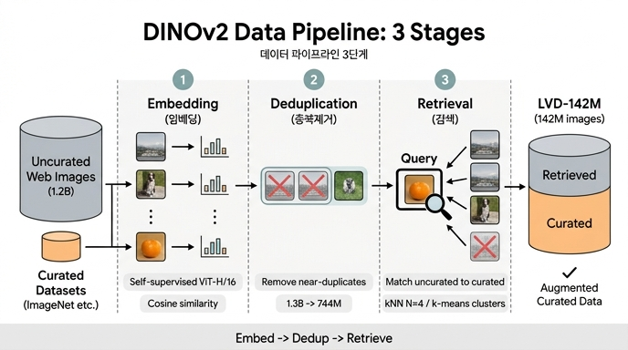

# DINOv2 데이터 파이프라인의 3단계는?

**답:** ① 큐레이션·비큐레이션 이미지를 **임베딩(embedding)** 으로 매핑 → ② 비큐레이션 이미지 **중복제거(deduplication)** → ③ 큐레이션 이미지와 매칭하는 **자기지도 검색(self-supervised retrieval)**. 세 단계를 거친 결과물이 초기 큐레이션 데이터를 증강한 최종 데이터셋 **LVD-142M**(1억 4,200만 장)이다.

그림(논문 Fig. 3)은 왼쪽에서 오른쪽으로 읽는다. 왼쪽의 회색 큰 원통이 **Uncurated Data**(웹 크롤링 원본), 그 아래 작은 주황 원통이 **Curated Data**(ImageNet 등). 두 소스 모두 **Embedding** 단계에서 벡터(그림의 격자 아이콘)로 바뀌고, 점선 경계 너머 **Deduplication** 단계에서 비큐레이션 쪽의 중복 이미지(같은 타르트 사진 두 장)에 빨간 X가 찍혀 제거된다. 마지막 **Retrieval** 단계에서는 큐레이션 이미지(굵은 테두리 상자, 질의 역할)와 비슷한 비큐레이션 이미지만 살아남고 무관한 이미지(자동차)는 X로 제외된다. 살아남은 이미지가 오른쪽 **Augmented Curated Data** 원통의 회색 부분으로 들어가, 기존 주황색 큐레이션 데이터 위에 쌓인다.

## 왜 이 파이프라인이 필요한가

- 자기지도학습(SSL) 선행 연구는 보통 **비큐레이션 대량 데이터**를 그대로 썼는데, 데이터 품질이 낮아 frozen feature 성능이 떨어지고 결국 fine-tuning에 의존해야 했다.
- 반대로 ImageNet-22k 같은 **큐레이션 데이터만** 쓰면 품질은 좋지만 규모와 다양성이 부족하다.
- DINOv2는 "큐레이션 데이터셋에 가까운 이미지를 비큐레이션 풀에서 골라온다"는 방식으로 **품질과 규모를 동시에** 확보한다. 텍스트 큐레이션 파이프라인(Wenzek et al., 2020: Wikipedia로 학습한 LM으로 웹 텍스트를 점수화)에서 영감을 받았다.
- 핵심 제약: **메타데이터·텍스트·사전학습 인코더의 감독을 전혀 쓰지 않고**, 오직 이미지 간 시각적 유사도만으로 필터링한다.

## 단계별 상세

### 0. 데이터 소스 준비
- **큐레이션 소스**: ImageNet-22k, ImageNet-1k train, Google Landmarks v2, 그리고 다수의 fine-grained 분류/분할/깊이/검색 데이터셋(Table 15).
- **비큐레이션 소스**: 공개 웹 크롤링 저장소의 `` 태그 URL을 수집. 안전하지 않거나 도메인 제한이 있는 URL은 폐기하고, PCA 해시 중복제거·NSFW 필터·얼굴 블러 후처리를 거쳐 **약 12억 장**의 고유 이미지를 확보.

### ① 임베딩(Embedding)
- ImageNet-22k로 사전학습한 **자기지도 ViT-H/16**으로 모든 이미지의 임베딩을 계산.
- 이미지 간 거리는 **코사인 유사도** `m(s, r) = f(s)·f(r) / (‖f(s)‖‖f(r)‖)`.
- 큐레이션·비큐레이션 양쪽이 같은 임베딩 공간에 놓이므로 이후 단계에서 직접 비교 가능.

### ② 중복제거(Deduplication)
- Pizzi et al. (2022)의 **copy detection** 임베딩을 사용.
- **자기 중복제거(self-dedup)**: 각 이미지의 k=64 최근접 이웃 중 유사도 >0.6인 것들로 k-NN 그래프를 만들고, disjoint-set으로 연결 요소를 뽑아 요소당 1장만 남긴다. 13억 → **11억 장**.
- **상대 중복제거(relative dedup)**: 평가 벤치마크의 train/test 분할과 너무 비슷한 이미지(유사도 >0.45, 더 엄격)는 해당 연결 요소를 통째로 폐기 → **7.44억 장**. 데이터 누출을 막아 공정한 평가를 보장한다.
- 효과: 중복 감소로 **다양성 증가**.

### ③ 자기지도 검색(Self-supervised Retrieval)
큐레이션 데이터셋을 **질의(query)** 로 삼아 비큐레이션 풀에서 이웃을 가져온다. 데이터셋 크기에 따라 두 방식을 쓴다.

| 방식 | 적용 대상 | 절차 | 예 |
|---|---|---|---|
| **sample-based** | 100만 장 이상 큰 데이터셋 | 각 질의 이미지마다 최근접 **N장**(기본 4)을 수집 → 데이터셋을 약 N배로 증강 | ImageNet-22k, Google Landmarks v2 (k=4); ImageNet-1k (k=32) |
| **cluster-based** | 작은 데이터셋 | 비큐레이션 풀을 분산 k-means로 **10만 클러스터**로 나눈 뒤, 질의 데이터셋 이미지가 3장 이상 속한 클러스터마다 1만 장을 샘플링. 데이터셋당 최대 100만 장으로 상한 | Caltech-101, Food-101, ADE20K, KITTI 등 |

- N을 4보다 크게 하면 검색 품질은 좋아 보이지만 **collision**(여러 질의가 같은 이미지를 가져오는 경우)이 늘어나므로 N=4가 절충점.
- 상한(100만 장)은 LVD-142M 안에서 데이터셋 간 **균형**을 유지하기 위함.

### 구현
- 중복제거·검색 모두 **Faiss** 라이브러리의 GPU 인덱스(IVF + product quantization)로 배치 최근접 탐색.
- 8×V100-32GB 노드 20대에서 **2일 이내**에 LVD-142M 완성.

## 결과: 큐레이션이 실제로 효과가 있었나 (Table 2)

같은 ViT-g/14를 같은 반복수로 학습했을 때(비큐레이션은 같은 소스에서 1.42억 장 무작위 샘플):

| 학습 데이터 | INet-1k | Im-A | ADE-20k | Oxford-M | iNat2018 | iNat2021 | Places205 |
|---|---|---|---|---|---|---|---|
| INet-22k | 85.9 | 73.5 | 46.6 | 62.5 | 81.1 | 85.6 | 67.0 |
| Uncurated data | 83.3 | 59.4 | 48.5 | 54.3 | 68.0 | 76.4 | 67.2 |
| **LVD-142M** | 85.8 | **73.9** | 47.7 | **64.6** | **82.3** | **86.4** | **67.6** |

- 비큐레이션 데이터는 특히 ImageNet-A(59.4)와 iNat(68.0)에서 크게 뒤진다 → **큐레이션은 SSL에서도 필수**.
- LVD-142M은 INet-1k에서는 INet-22k와 비슷하지만, 나머지 도메인에서는 모두 우세 → 다양성의 이득.
- 큐레이션에 쓰이지 않은 도메인(iNat, Places205)에서도 향상 → 규모·다양성이 **미학습 도메인**에도 전이된다.

## 기억 팁

**"임베딩 → 중복제거 → 검색"** 을 "**E-D-R**"로 외우자. 순서가 중요하다: 임베딩이 있어야 유사도를 재고, 중복을 먼저 걷어내야 검색 결과가 같은 사진 사본으로 채워지지 않는다. 그림 Fig. 3의 세 점선 구획과 정확히 대응한다.

## 인포그래픽

