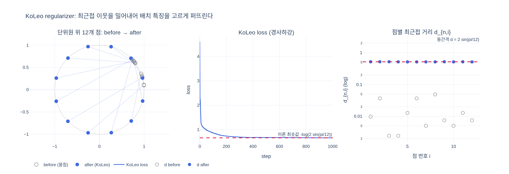

# KoLeo regularizer의 정의와 목적은?

> **한 줄 답**: Kozachenko-Leonenko 미분 엔트로피 추정량에서 유도된 정규화 항으로, 배치 안의 특징 벡터들이 서로 뭉치지 않고 고르게 퍼지도록 유도한다.
> $$\mathcal{L}_{koleo} = -\frac{1}{n}\sum_{i=1}^{n}\log(d_{n,i}),\qquad d_{n,i}=\min_{j\neq i}\|x_i-x_j\|$$

## 1. 정의

DINOv2 논문(Oquab et al., 2023) 4장 "Discriminative Self-supervised Pre-training"에서 DINO loss, iBOT loss, Sinkhorn-Knopp centering과 함께 소개되는 네 가지 구성 요소 중 하나다. 원 출처는 Sablayrolles et al., *Spreading vectors for similarity search* (ICLR 2019)이며, 논문은 다음과 같이 정의한다.

- 배치에서 $n$개의 특징 벡터 $(x_1,\dots,x_n)$가 주어진다. DINOv2에서는 **학생(student) 네트워크의 class token**이다.
- 각 벡터에 대해 **배치 안의 다른 벡터까지의 최소 거리** $d_{n,i}=\min_{j\neq i}\|x_i-x_j\|$ (최근접 이웃 거리)를 구한다.
- 그 로그의 평균에 음의 부호를 붙인다:

$$\mathcal{L}_{koleo} = -\frac{1}{n}\sum_{i=1}^{n}\log(d_{n,i})$$

- 계산 전에 특징을 $\ell_2$ 정규화한다. 따라서 모든 $x_i$는 단위 구(hypersphere) 위에 놓이고, "퍼짐"은 구 위에서의 각도 퍼짐을 뜻한다.

### 왜 이 식이 "퍼짐"을 유도하는가

$-\log d$는 $d$가 작아질수록(이웃이 가까울수록) 급격히 커진다. 즉 손실을 줄이려면 **모든 점이 자기 최근접 이웃과의 거리를 늘려야** 한다. $x_i$에 대한 기울기는

$$\frac{\partial}{\partial x_i}\bigl(-\log\|x_i-x_j\|\bigr) = -\frac{x_i-x_j}{\|x_i-x_j\|^2}$$

로, 가장 가까운 이웃에서 **멀어지는 방향**이며 거리가 가까울수록 힘이 세다(전하 사이의 반발력과 같은 꼴). 최댓값(평균)이 아니라 **최솟값(최근접)**만 보기 때문에 이미 멀리 있는 점은 건드리지 않고, 뭉친 점만 골라서 밀어낸다. 그 결과 단위 구 위에 점들이 균일하게 깔린다("uniform span of the features within a batch").

## 2. 이름의 유래: Kozachenko-Leonenko 엔트로피 추정량

이름의 "KoLeo"는 **Ko**zachenko-**Leo**nenko(1987)에서 왔다. 이들은 확률분포의 미분 엔트로피 $H(p)=-\int p\log p$를 확률밀도를 모른 채 **표본의 최근접 이웃 거리만으로** 추정하는 방법을 제안했다:

$$\hat H_{KL} = \frac{d}{n}\sum_{i=1}^{n}\log \varepsilon_i + \log V_d + \psi(n) - \psi(1)$$

($d$: 차원, $\varepsilon_i$: $i$번째 표본의 최근접 이웃 거리, $V_d$: $d$차원 단위구 부피, $\psi$: digamma 함수. 직관: 최근접 이웃이 멀다 ⇒ 그 근처 밀도가 낮다 ⇒ 엔트로피 기여가 크다.)

표본에 의존하는 부분은 $\frac{d}{n}\sum\log\varepsilon_i$뿐이고, 이것은 정확히 $-d\cdot\mathcal{L}_{koleo}$다. 따라서

$$\mathcal{L}_{koleo} = -\tfrac{1}{d}\,\hat H_{KL} + \text{const}$$

**KoLeo를 최소화하는 것 = 배치 특징 분포의 (추정) 엔트로피를 최대화하는 것**이다. 유계 영역(단위 구)에서 엔트로피가 최대인 분포는 균등분포이므로, 이 항은 특징이 구 위에 균등하게 퍼지도록 만드는 원리적인(엔트로피 기반) 정규화가 된다. 원 논문(Sablayrolles et al.)에서는 이 성질을 이용해 유사도 검색용 벡터를 구 위에 고르게 퍼뜨려 양자화·색인 효율을 높였다.

## 3. DINOv2에서의 목적과 효과

### 왜 필요한가

DINO/iBOT류 자기지도 학습은 같은 이미지의 다른 crop을 같은 prototype에 배정하도록 학습한다. 이때 서로 다른 이미지의 특징까지 좁은 영역으로 몰리면(부분적 collapse) 임베딩 공간의 "해상도"가 떨어져, 특히 **최근접 이웃 기반 과제**(k-NN 분류, 이미지 검색)에서 성능이 나빠진다. KoLeo는 배치 단위로 특징을 밀어 퍼뜨려 이 문제를 완화한다.

### 실험 근거 (논문 Sec. 6.1, Table 1 및 Sec. 6.4, Table 3a)

**Table 1 (구성 요소 누적 추가, ImageNet-1k)** — KoLeo를 더했을 때가 전체 요소 중 k-NN 향상 폭이 가장 크다.

| 구성 요소 | k-NN | linear |
|---|---|---|
| +128k prototypes | 76.6 | 81.9 |
| **+KoLeo** | **78.9 (↑2.3)** | **82.5 (↑0.6)** |
| +SwiGLU FFN | 78.7 | 83.1 |

**Table 3a (최종 모델에서 KoLeo 제거 ablation)**

| KoLeo | INet-1k linear | Im-A | ADE-20k mIoU | Oxford-M mAP |
|---|---|---|---|---|
| ✕ | 85.3 | 70.6 | 47.2 | 55.6 |
| ✓ | 85.8 | 72.8 | 47.1 | **63.9** |

논문의 해석: "instance retrieval performance improves by more than 8%, confirming that this term **helps spread features in the output space**. At the same time, the other metrics do not suffer from this regularization." 즉 검색(Oxford-M)이 8.3 mAP 오르고 분류·분할은 손해가 없다. 반대로 iBOT의 MIM 항은 분할(ADE-20k)에 중요하다(Table 3b) — 두 항의 역할이 서로 보완적이다.

### 구현 세부 (논문 Appendix B.1 + `dinov2/loss/koleo_loss.py`)

- 가중치 **0.1** (`cfg.dino.koleo_loss_weight`), 학생 backbone의 class token에 적용. DINO head를 거치기 전의 backbone 출력을 사용한다.
- **첫 번째 global crop의 class token들** 사이에서만 계산하며, GPU 간 통신 없이 GPU 내부 샘플끼리만 계산한다. 코드에서는 `student_cls_tokens.chunk(2)`로 두 global crop을 나눠 각각 KoLeo를 계산하므로, **같은 이미지의 두 crop 사이에는 KoLeo가 걸리지 않는다**(같은 이미지의 crop은 가까워야 하므로 밀어내면 DINO 목표와 충돌).
- 최근접 이웃 탐색 트릭: $\ell_2$ 정규화 후에는 $\|x_i-x_j\|^2 = 2-2\,x_i^\top x_j$이므로, 거리 행렬 대신 `x @ x.T`의 **행별 최대 내적** 인덱스가 곧 최근접 이웃이다. 대각선은 $-1$로 채워 자기 자신을 제외하고, `-log(distance + eps)`의 평균을 반환한다. autocast를 끄고 fp32로 계산한다.

## 4. 요약

| 항목 | 내용 |
|---|---|
| 정의 | $-\frac1n\sum_i\log d_{n,i}$, $d_{n,i}$ = 배치 내 최근접 이웃 거리 ($\ell_2$ 정규화 후) |
| 유래 | Kozachenko-Leonenko 미분 엔트로피 추정량의 표본 의존 항 (부호 반대) |
| 작동 원리 | 최근접 이웃을 밀어내는 반발력 → 구 위에 균등하게 퍼짐 = 엔트로피 최대화 |
| 목적 | 특징 collapse 방지, 임베딩 공간을 고르게 사용 |
| 효과 | k-NN +2.3, Oxford-M 검색 +8.3 mAP; 분류·분할은 무손실 |
| 설정 | weight 0.1, 첫 global crop의 student cls token, GPU 내부 배치 |

## 시각화

`expy.py`: 단위원 위에 뭉쳐 놓은 12개 점을 KoLeo 항만으로 경사하강시키면(왼쪽) 점들이 등간격으로 퍼지고, loss는 이론 최솟값 $-\log(2\sin(\pi/12))$에 도달하며(가운데), 각 점의 최근접 거리 $d_{n,i}$가 $10^{-3}\sim10^{-2}$ 수준에서 등간격 값 $2\sin(\pi/12)\approx0.52$로 정렬된다(오른쪽, 로그 축).

