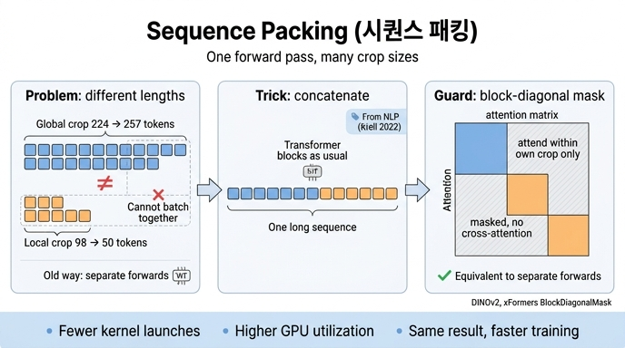

# sequence packing이란 무엇이고 왜 필요한가?

> **한 줄 답**: 길이가 다른 여러 토큰 시퀀스(224 크롭, 98 크롭)를 하나의 긴 시퀀스로 이어 붙여 transformer를 **한 번만** 통과시키되, self-attention에 **block-diagonal mask**를 걸어 시퀀스끼리 서로 attention하지 못하게 막는 기법. 결과는 따로따로 forward한 것과 정확히 같고, 속도만 빨라진다.

---

## 1. 문제: DINO는 크기가 다른 크롭을 동시에 forward해야 한다

DINO/DINOv2의 self-supervised 학습은 **multi-crop** 전략을 쓴다. 한 이미지에서

| 크롭 종류 | 개수(기본) | 해상도 | 패치 수 (patch 14) | 토큰 길이 (+CLS) |
|---|---|---|---|---|
| global crop | 2 | 224 × 224 | 16 × 16 = 256 | **257** |
| local crop | 8 (`local_crops_number: 8`) | 98 × 98 | 7 × 7 = 49 | **50** |

teacher는 global crop만 보고, student는 global + local crop을 모두 봐서 "작은 조각을 보고도 전체 이미지와 같은 표현을 내라"고 학습한다. 그런데 ViT는 이미지를 패치 토큰 시퀀스로 바꾸므로, 224 크롭은 257토큰, 98 크롭은 50토큰이 된다. **길이가 다르면 하나의 `[B, N, D]` 텐서로 쌓을 수 없어** 한 배치로 forward할 수 없다.

기존 구현(DINO, iBOT)은 그래서 global crop 배치와 local crop 배치를 **각각 따로** forward/backward했다. 이렇게 하면
- 커널 런치가 두 배로 늘고,
- local crop 배치는 시퀀스가 짧아 GPU를 충분히 채우지 못해 활용도가 떨어지고,
- 코드도 두 갈래로 갈린다.

## 2. 해법: NLP에서 가져온 "sequence packing"

논문 5절 *Efficient implementation*:

> The DINO algorithm requires forwarding both large crops (at resolution 224) and small crops (resolution 98). When split into patches, these two groups are represented by token sequences of different lengths and cannot be forwarded together. In order to accelerate training, we use a trick called "sequence packing," which originates from NLP (Krell et al., 2022). The idea is simple: we concatenate the sequences we must forward through the transformers into a single long sequence. We pass this sequence through the transformer blocks as usual. However, a block-diagonal mask is applied to the self-attention matrix in attention layers, preventing attention between different sequences. This way, the forward is strictly equivalent to forwarding each sequence separately.

세 단계로 정리하면:

1. **Concat** — 배치 안의 모든 시퀀스(global 257토큰 × 2B개, local 50토큰 × 8B개)를 토큰 축으로 이어 붙여 `[1, ΣNᵢ, D]` 모양의 **하나의 긴 시퀀스**로 만든다. 패딩이 없으므로 낭비되는 토큰이 없다.
2. **Transformer는 그대로** — LayerNorm, MLP, residual은 토큰별(position-wise) 연산이므로 시퀀스 경계를 몰라도 결과가 같다. 문제가 되는 것은 토큰끼리 섞이는 **self-attention** 하나뿐이다.
3. **Block-diagonal mask** — attention 행렬 `[ΣNᵢ × ΣNᵢ]`에서 같은 시퀀스에 속한 토큰 쌍(대각 블록)만 남기고 나머지는 −∞로 마스킹한다. 그러면 global crop의 토큰은 자기 크롭 안에서만, local crop의 토큰도 자기 크롭 안에서만 attention한다.

```
            ┌ seq A (257) ┐┌ B(50) ┐┌ C(50) ┐
 seq A(257) │ ████████████ │ ░░░░░░ │ ░░░░░░ │
 seq B(50)  │ ░░░░░░░░░░░░ │ ██████ │ ░░░░░░ │   █ = attention 허용
 seq C(50)  │ ░░░░░░░░░░░░ │ ░░░░░░ │ ██████ │   ░ = 마스킹(−∞)
```

이 마스크 덕분에 **수학적으로 각 시퀀스를 따로 forward한 것과 완전히 동일**하다("strictly equivalent"). 즉 정확도에는 아무 영향이 없고 순수한 시스템 최적화다.

### 왜 NLP 기법인가?
언어 모델 사전학습에서는 문장 길이가 제각각이라 고정 길이로 패딩하면 토큰의 상당 부분이 버려진다. Krell et al. (2022, *Efficient Sequence Packing without Cross-contamination*)은 여러 짧은 문장을 하나의 시퀀스에 채워 넣고, 문장끼리 attention이 새지 않도록(cross-contamination 방지) 마스크를 거는 방법을 제안했다. DINOv2는 "문장 길이가 다르다"를 "크롭 해상도가 다르다"로 바꿔 그대로 적용했다.

## 3. 왜 빨라지는가?

- **커널 호출 수 감소**: 두 번(또는 크롭 종류 수만큼)의 forward/backward가 한 번으로 줄어 launch overhead와 동기화 지점이 줄어든다.
- **GPU 활용도 상승**: 짧은 local crop 시퀀스만으로는 SM을 다 채우지 못하지만, 긴 시퀀스 하나로 묶으면 행렬 곱이 커져 처리량이 올라간다.
- **마스크 비용은 거의 0**: 단순한 dense mask라면 `ΣNᵢ²` 크기의 행렬을 채우느라 오히려 손해지만, xFormers의 memory-efficient attention(`fmha`)은 block-diagonal 구조를 **커널 안에서 인식**해 대각 블록만 실제로 계산한다. 그래서 "마스킹된 영역"의 연산 낭비가 없다. 이것이 논문이 FlashAttention 자체 구현과 sequence packing을 함께 소개하는 이유다.

이런 시스템 개선들(FlashAttention 자체 구현, sequence packing, efficient stochastic depth, FSDP)을 합쳐 DINOv2 코드는 같은 하드웨어에서 iBOT 대비 **약 2배 빠르고 메모리는 1/3**만 쓴다고 보고한다.

## 4. 코드에서 확인하기 (facebookresearch/dinov2)

- `dinov2/models/vision_transformer.py` — `DinoVisionTransformer.forward_features_list(x_list, masks_list)`: 입력이 **텐서 리스트**(global crop 텐서, local crop 텐서)로 들어오고, 각 block에 리스트째로 넘긴다. `SSLMetaArch.forward_backward`에서 `self.student.backbone([global_crops, local_crops], masks=[masks, None], ...)`로 호출한다.
- `dinov2/layers/block.py` — `NestedTensorBlock.forward_nested`: 리스트를 받아 `get_attn_bias_and_cat(x_list)`로 (a) 시퀀스 길이 목록 `seqlens`로부터 `fmha.BlockDiagonalMask.from_seqlens(seqlens)` 마스크를 만들고(shape 조합별로 캐시), (b) 각 텐서를 `[1, B·N, D]`로 펴서 `torch.cat(dim=1)`한다. attention 후 `attn_bias.split(x)`로 다시 원래 리스트 모양으로 쪼갠다.
- 같은 트릭이 **DINO head**에도 재사용된다: `forward_backward`에서 local CLS, global CLS, masked patch 토큰을 `fmha.BlockDiagonalMask.from_tensor_list(...)`로 한 번에 묶어 `dino_head`를 한 번만 호출한다.

핵심 함수의 골격:

```python
# dinov2/layers/block.py (요약)
def get_attn_bias_and_cat(x_list):
    seqlens = [x.shape[1] for x in x_list for _ in range(x.shape[0])]   # 예: [257]*2B + [50]*8B
    attn_bias = fmha.BlockDiagonalMask.from_seqlens(seqlens)            # block-diagonal mask
    cat = torch.cat([x.reshape(1, -1, x.shape[-1]) for x in x_list], dim=1)  # [1, ΣN, D]
    return attn_bias, cat

def forward_nested(self, x_list):
    attn_bias, x = get_attn_bias_and_cat(x_list)
    x = x + self.ls1(self.attn(self.norm1(x), attn_bias=attn_bias))     # 마스크 적용된 attention
    x = x + self.ls2(self.mlp(self.norm2(x)))                            # MLP는 경계 무관
    return attn_bias.split(x)                                            # 다시 리스트로
```

## 5. 기억 포인트

- **무엇**: 길이가 다른 시퀀스들을 하나로 concat + block-diagonal attention mask.
- **왜 필요**: DINO의 multi-crop(224 global / 98 local)은 토큰 길이가 달라 한 배치로 못 묶인다 → 따로 forward하면 느리다.
- **왜 안전한가**: mask가 시퀀스 간 attention을 완전히 차단하므로 개별 forward와 **수학적으로 동일**.
- **출처**: NLP의 packing(Krell et al., 2022); 구현은 xFormers `BlockDiagonalMask`.

## 참고
- Oquab et al., *DINOv2: Learning Robust Visual Features without Supervision* (arXiv 2304.07193), §5 Efficient implementation.
- Krell, Kosec, Perez, Fitzgibbon, *Efficient Sequence Packing without Cross-contamination* (2022).
- xFormers: https://github.com/facebookresearch/xformers (`xformers.ops.fmha.BlockDiagonalMask`).

## 인포그래픽


