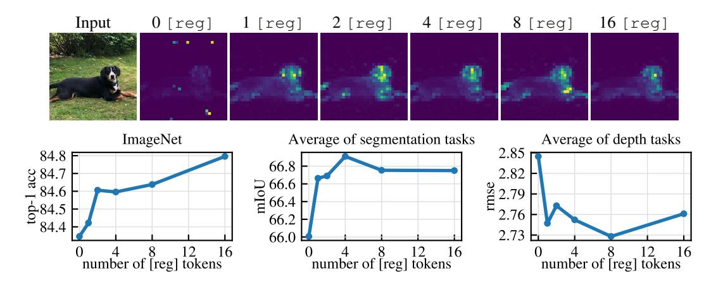
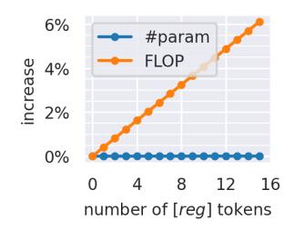
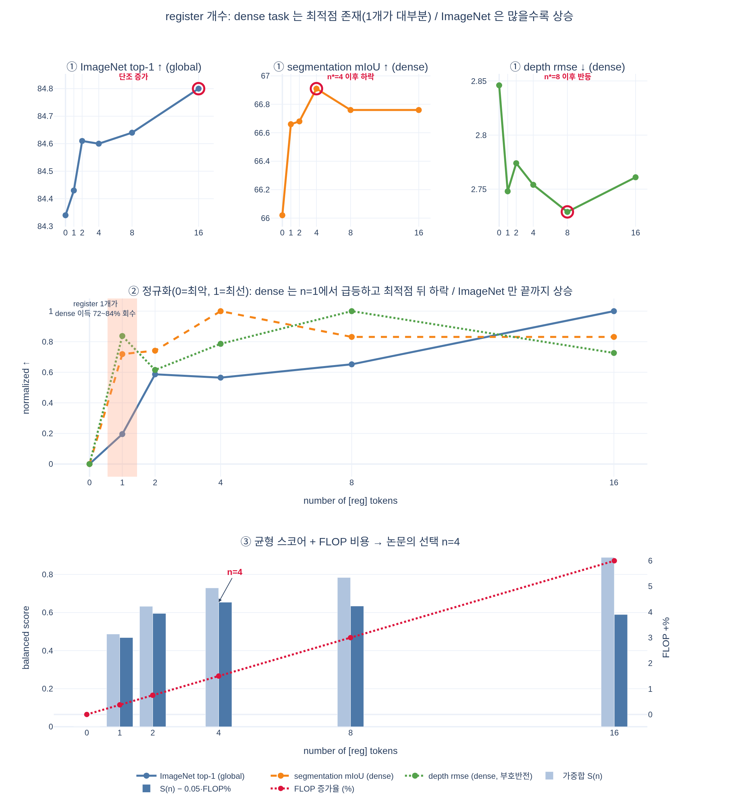

# Register 개수에 따른 dense task vs. ImageNet 성능 경향

**Q.** register 개수에 따른 dense task와 ImageNet 성능 경향의 차이는?

**A.** dense task에는 **최적 개수가 존재**하며 **하나만 추가해도 대부분의 이득**을 얻는다. 반면 **ImageNet 분류 성능은 register가 많을수록 향상**된다.

출처: Darcet et al., *Vision Transformers Need Registers* (arXiv:2309.16588v2), Sec. 3.2 "Number of register tokens", Fig. 8.

---

## 1. 실험 세팅

- 백본: **DINOv2 ViT-L/14**, ImageNet-22k 사전학습
- register 개수 $n \in \{0, 1, 2, 4, 8, 16\}$ 로 각각 **처음부터 다시 학습**
- 평가: frozen feature에 대한 linear probing (DINOv2 프로토콜, Oquab et al. 2023)
  - **ImageNet** top-1 acc — 전역(global) 분류 태스크
  - **segmentation 평균 mIoU** — dense 태스크
  - **depth 평균 rmse (↓)** — dense 태스크
- register 토큰은 patch embedding 직후에 학습 가능한 값으로 붙이고, ViT 출력에서는 **버려진다**. 표현으로 쓰는 것은 여전히 `[CLS]` + patch token뿐이다.

## 2. 핵심 그림 (Fig. 8)

**(위) 정성적 결과.** `0 [reg]`에서만 attention map에 밝은 점 형태의 **아티팩트(high-norm outlier patch)** 가 보이고, `1 [reg]`부터 16까지는 전부 깨끗하다. 즉 **아티팩트 제거 자체는 register 1개로 이미 끝난다.**

**(아래) 정량적 결과.** 세 지표의 경향이 서로 다르다.

| $n$ | ImageNet top-1 ↑ | seg. mIoU ↑ | depth rmse ↓ |
|---|---|---|---|
| 0 | 84.34 | 66.02 | 2.846 |
| 1 | 84.43 | 66.66 | 2.748 |
| 2 | 84.61 | 66.68 | 2.774 |
| 4 | 84.60 | **66.91** | 2.754 |
| 8 | 84.64 | 66.76 | **2.729** |
| 16 | **84.80** | 66.76 | 2.761 |

(수치는 Fig. 8 아래 그래프에서 눈으로 읽은 **근사치**다. 논문은 이 ablation의 수치 표를 본문/부록에 싣지 않았다. Table 2a는 `n=4` 대 `n=0`만, 그리고 다른 벤치마크 조합(ImageNet 84.3→84.8, ADE20k mIoU 46.6→47.9, NYUd rmse 0.378→0.366)으로 보고한다.)

## 3. 두 경향의 대비

### (a) dense task — "최적값이 있고, 1개가 대부분을 가져간다"

- **segmentation**: $0 \to 1$ 에서 $+0.64$ mIoU. 최적점 $n=4$ 까지의 전체 개선폭 $+0.89$ 중 **약 72%** 를 register 1개가 회수한다. 그 뒤 $n=8, 16$ 에서는 오히려 **떨어져서** 66.76에 머문다.
- **depth**: $0 \to 1$ 에서 rmse $2.846 \to 2.748$ ($-0.098$). 최적점 $n=8$ 까지의 전체 개선폭 $-0.117$ 중 **약 84%** 를 1개가 회수한다. $n=16$ 에서는 2.761로 되돌아간다.
- 즉 dense 지표는 **단조 증가가 아니라 U자/역U자 곡선**이며, 내부에 극값이 있다.

$$\text{(dense 이득)} \approx \underbrace{\text{큰 점프}}_{0 \to 1} + \underbrace{\text{작은 조정}}_{1 \to n^\*} - \underbrace{\text{과다 시 손실}}_{n > n^\*}$$

### (b) ImageNet — "많을수록 좋다"

- $84.34 \to 84.43 \to 84.61 \to 84.60 \to 84.64 \to 84.80$ 으로 (2→4의 미세한 흔들림을 빼면) **$n$ 에 대해 계속 오른다.** 16개에서 최고값이고, 실험 범위 안에서는 포화 조짐도 하락 조짐도 보이지 않는다.

### (c) 왜 이렇게 갈리나 (논문의 해석 + 자연스러운 확장)

- 논문이 명시한 것은 **dense 쪽 최적점의 이유**뿐이다: *"This optimum is likely explained by the disappearance of artifacts, leading to better local features."* 즉 **local feature 품질을 망치던 아티팩트가 사라지는 것이 dense 이득의 본체**이고, 그 일은 register 1개로 거의 완결된다. 그 이상은 더 개선할 아티팩트가 없다.
- ImageNet은 이야기가 다르다. 분류는 `[CLS]`가 모으는 **전역 정보**에 의존하는데, register는 부록 F(Fig. 16)에서 보듯 `[CLS]`처럼 넓은 support의 attention을 갖는 **전역 정보 보유 토큰**으로 동작한다. register가 많아질수록 모델이 **전역 정보를 담을 여유 슬롯 / 추가 연산량**을 더 갖게 되므로 분류 성능이 계속 올라간다고 읽는 것이 자연스럽다. (부록 C의 Table 4는 register가 outlier patch의 "전역 정보 집약" 역할을 그대로 흡수한다는 것을 보여준다.)
- 정리하면: **dense = 아티팩트 제거 효과(포화형)**, **classification = 추가 전역 용량 효과(누적형)**.

## 4. 그래서 논문은 몇 개를 썼나 — $n = 4$

> *"In all our experiments, we kept 4 register tokens."*

- $n=4$ 는 **segmentation의 최적점**이고, depth도 최적점(8)에 근접하며, ImageNet도 0 대비 대부분의 이득을 이미 확보한 지점이다. 두 상반된 경향의 **타협점**이다.
- 비용도 근거가 된다(부록 B, Fig. 12). register는 파라미터 수를 사실상 늘리지 않지만 FLOPs는 개수에 비례해 증가한다: **$n=16$ 에서 약 +6%**, **$n=4$ 에서는 2% 미만**.

  → ImageNet 단조 증가만 보고 16개를 쓰면 dense 성능은 오히려 손해를 보면서 FLOPs만 6% 더 낸다. **4개가 성능·비용 모두에서 합리적인 선택.**

## 5. 한 줄 암기

> **아티팩트 제거는 register 1개로 끝 → dense는 곧 포화되고 최적점(≈4) 이후 하락. 반면 ImageNet은 register가 늘수록 계속 상승 → 논문은 절충으로 4개를 채택.**

## 시각화

