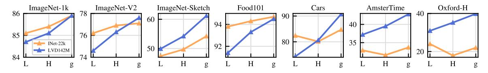
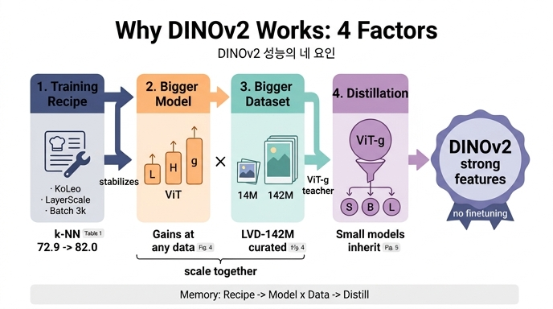

# DINOv2의 강력한 성능을 논문이 귀인한 네 가지 요인은?

> **답**: ① 더 나은 하이퍼파라미터·정규화를 갖춘 개선된 학습 레시피(Table 1), ② 데이터와 무관하게 이득을 주는 더 큰 모델 스케일(Fig. 4), ③ 더 큰 데이터셋(Fig. 4), ④ 소형 모델이 ViT-g의 성능을 물려받는 distillation(Fig. 5).

출처: Oquab et al., *DINOv2: Learning Robust Visual Features without Supervision* (arXiv 2304.07193v2), Sec. 8 Conclusion.

## 한 줄 요약

DINOv2가 파인튜닝 없이도 (약)지도학습 모델과의 성능 격차를 닫을 수 있었던 이유를, 논문은 Conclusion에서 네 가지로 명시했다. 각 요인은 본문의 ablation(Sec. 6)에 하나씩 대응하는 근거가 있다.

| # | 요인 | 근거 | 핵심 수치 |
|---|---|---|---|
| ① | 개선된 학습 레시피 (하이퍼파라미터·정규화) | Table 1 (Sec. 6.1) | ViT-L k-NN **72.9 → 82.0** (+9.1), linear 82.3 → 84.5 |
| ② | 더 큰 모델 스케일 (데이터와 무관하게 이득) | Fig. 4 (Sec. 6.3) | L → H → g로 갈수록 두 데이터셋 모두 상승 |
| ③ | 더 큰 데이터셋 (LVD-142M) | Fig. 4, Table 2 | 14M → 142M; ViT-g에서 대부분 벤치마크 우위 |
| ④ | Distillation (ViT-g → 소형) | Fig. 5 (Sec. 6.5) | ViT-L distill이 scratch를 12개 벤치마크 전부에서 이김 (INet-1k 84.5 → 86.3) |

## 요인 ① 개선된 학습 레시피 — Table 1

논문은 iBOT을 출발점으로 삼아 구성 요소를 하나씩 쌓아 올리며 ImageNet-1k k-NN / linear 정확도를 측정했다(ViT-L, ImageNet-22k 학습). k-NN 기준 누적 변화:

| 단계 | k-NN | linear |
|---|---|---|
| iBOT (원 논문) | 72.9 | 82.3 |
| + 자체 재현 | 74.5 | 83.2 |
| + LayerScale, Stochastic Depth(0.4) | 75.4 | 82.0 (↓) |
| + 128k prototypes | 76.6 | 81.9 |
| + KoLeo 정규화 | 78.9 | 82.5 |
| + SwiGLU FFN | 78.7 | 83.1 |
| + Patch size 14 | 78.9 | 83.5 |
| + Teacher momentum 0.994 | 79.4 | 83.6 |
| + Warmup 스케줄 튜닝 | 80.5 | 83.8 |
| + Batch size 3k | 81.7 | 84.7 |
| + Sinkhorn-Knopp | 81.7 | 84.7 |
| + Untying heads (= DINOv2) | **82.0** | 84.5 |

읽을 때 주의할 점:

- **"하이퍼파라미터"**: patch size, teacher momentum, warmup, batch size 같은 항목이 k-NN을 꾸준히 밀어올렸다.
- **"정규화"**: KoLeo(특징을 공간에 균일하게 퍼뜨리는 항)가 단일 항목으로 가장 큰 k-NN 이득(+2.3)을 냈고, LayerScale + Stochastic Depth는 linear가 1.2 떨어졌지만 **NaN 없이 대규모 학습을 안정화**하는 역할이라 채택했다. 논문은 "이 수정들이 이후 개선을 추가할 수 있게 해줬다"고 명시한다 — 레시피는 성능 향상 그 자체이면서 동시에 ②③(대규모 스케일링)의 전제 조건이다.
- 최적화 목표를 k-NN으로 잡은 이유: 경험상 linear probe 성능은 k-NN에 의해 아래에서 제한(lower-bounded)되기 때문.

## 요인 ② 모델 스케일 + 요인 ③ 데이터 스케일 — Fig. 4



가로축은 모델 크기(ViT-L → ViT-H → ViT-g), 주황선은 ImageNet-22k(14M장), 파란선은 LVD-142M(142M장). 7개 벤치마크(ImageNet-1k, -V2, -Sketch, Food101, Cars, AmsterTime, Oxford-H)를 나란히 보여준다.

- **요인 ② (모델 스케일)**: 어느 데이터셋에서든 L → H → g로 커질수록 곡선이 대체로 우상향한다. 특히 파란선(LVD-142M)은 7개 패널 모두에서 단조 증가한다. 그래서 논문은 "데이터와 무관하게(regardless of the data used) 모델 스케일이 이득을 준다"고 표현한다.
- **요인 ③ (데이터 스케일)**: ViT-L에서는 주황(INet-22k)이 파란(LVD-142M)보다 높은 벤치마크가 여럿이지만(ImageNet-1k, -V2, Food101, Cars), **모델이 커질수록 파란선이 따라잡고 역전**한다. ViT-g에서는 ImageNet-1k는 동률 수준이고 ImageNet-Sketch, Cars, AmsterTime, Oxford-H 등 나머지에서는 LVD-142M이 크게 앞선다. Sec. 6.3의 문장 그대로: "모델이 커질수록 LVD-142M 학습이 ImageNet-22k보다 더 유리해진다."
- 두 요인은 **상호작용**한다: 작은 모델은 큰 데이터를 다 소화하지 못하고, 큰 모델은 큰 데이터가 있어야 잠재력이 드러난다. 같은 그림이 ②와 ③의 근거로 동시에 인용되는 이유다.
- 보조 근거 Table 2(ViT-g, 동일 iteration): LVD-142M은 INet-22k 대비 ImageNet-1k만 소폭 열세(85.8 vs 85.9)이고 Im-A 73.9, Oxford-M 64.6, iNat2018 82.3 등 나머지 전부에서 우위. 큐레이션 없는 142M 랜덤 데이터(Im-A 59.4, iNat2018 68.0)보다도 확실히 좋아 "크기"뿐 아니라 "큐레이션"이 중요함도 보여준다.

## 요인 ④ Distillation — Fig. 5


소형 모델(ViT-S/B/L)은 처음부터 학습하지 않고 **frozen ViT-g/14를 교사**로 두고 증류했다. DINO 목적함수 자체가 teacher → student 증류 형태이므로 같은 학습 루프를 재사용하되, 교사를 큰 고정 모델로 바꾸고, masking과 stochastic depth를 제거하고, iBOT loss를 두 global crop에 적용하며, student의 EMA를 최종 모델로 쓴다.

그림 읽기:

- **(a) 레이더 차트**: 파란 다각형이 ViT-L scratch, 주황이 ViT-L distill, 빨간 점선이 교사 ViT-g. 주황이 파란을 **12개 축 전부**에서 감싸고 있고, 일부 축(Oxford-H 52.6 vs 교사 52.1, Paris-H 84.4 vs 82.7)에서는 교사 점선마저 바깥으로 넘는다 — 캡션의 "sometimes even outperforming the distillation target".
- **(b) 8개 태스크 평균표**: INet-1k 84.5 → **86.3**(교사 86.5에 근접), Segm. 72.2 → 73.3, Depth 1.10 → 1.08(낮을수록 좋음), Classif. 90.2 → 91.2, Finegr. 75.8 → 77.6, Retriev. 71.3 → **76.3**(교사 75.2 초과), ARSketch 69.5 → 74.5, Video 67.3 → 67.5.
- 요점: 증류된 ViT-L은 scratch ViT-L 대비 전 항목 우위이며 교사 ViT-g에 거의 붙어 있다. 즉 ①②③으로 만든 **최강 모델의 성능이 소형 모델로 전파**된다. 공개된 DINOv2-S/B/L이 모두 `(distilled)`로 표기된 이유(Table 16, 17).

## 네 요인이 하나의 흐름으로 결합되는 방식

```
① 레시피 (Table 1)          ② 모델 스케일  ×  ③ 데이터 스케일 (Fig. 4)          ④ 증류 (Fig. 5)
iBOT 72.9 → DINOv2 82.0     ViT-L → ViT-g   ×   INet-22k 14M → LVD-142M          ViT-g (frozen teacher)
LayerScale/SD로 NaN 방지 ──▶ 안정적으로 1B 모델을 142M장에 학습 가능 ──▶ 최강 ViT-g ──▶ ViT-S/B/L로 성능 전파
```

1. **레시피가 토대**: KoLeo·Sinkhorn-Knopp·untied heads 등이 특징 품질을 직접 올리고, LayerScale·Stochastic Depth·warmup 튜닝이 큰 모델의 발산을 막는다. 이것 없이는 다음 단계가 불가능하다("allowed for the next set of improvements to be added").
2. **안정된 레시피 위에서 모델과 데이터를 함께 키운다**: Fig. 4가 보여주듯 둘은 곱셈적으로 작용한다 — 큰 모델이 있어야 LVD-142M의 다양성이 이득으로 바뀌고, 큰 데이터가 있어야 ViT-g가 INet-22k 모델을 넘어선다. 그 결과가 ViT-g/14 (1.1B 파라미터).
3. **증류로 스케일의 이득을 아래로 흘려보낸다**: ViT-g 하나만 무겁게 학습하고, 실사용 크기인 S/B/L은 증류로 얻는다. 그래서 작은 모델까지 "ViT-g의 성능을 물려받는다."

기억 팁: **"레·모·데·증"** — 레시피(Table 1) → 모델(Fig. 4) → 데이터(Fig. 4) → 증류(Fig. 5). Fig. 4가 두 번 쓰인다는 점이 시험에서 자주 헷갈리는 부분이다.

## 인포그래픽


