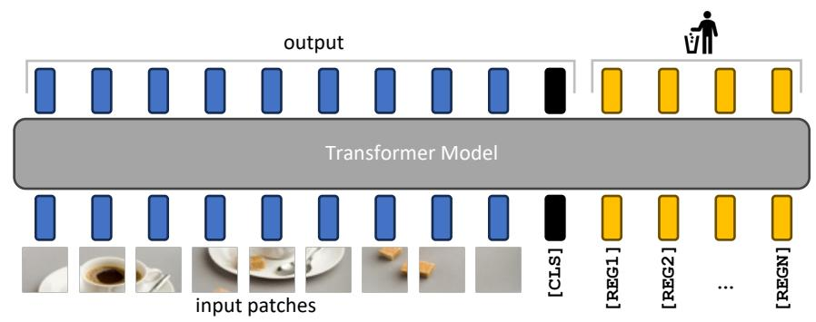

# register 메커니즘의 선행 연구: Memory Transformer (Burtsev et al., 2020)

## 카드 요약

- **질문**: register 메커니즘이 처음 제안된 선행 연구는?
- **답**: **Memory Transformers (Burtsev et al., 2020, arXiv:2006.11527)**. NLP의 **기계 번역** 성능을 올리려고 제안되었다. 이 논문(*Vision Transformers Need Registers*, Darcet et al., ICLR 2024)의 기여는 그 메커니즘을 **발명한 것이 아니라**, ViT에서 그 메커니즘이 **자연스러운 정당성(natural justification)** 을 갖는다는 걸 보인 것이다.

원문(§2.2 Hypothesis and remediation):

> "This mechanism was first proposed in Memory Transformers (Burtsev et al., 2020), improving translation tasks in NLP. Interestingly, we show here that this mechanism admits a natural justification for vision transformers, fixing an interpretability and performance issue that was present otherwise."

---

## 1. 이 논문에서 register가 무엇인가

구조 자체는 극히 단순하다.

- patch embedding 레이어 **뒤**에, 입력 이미지와 **무관한** 학습 가능한 토큰 `[reg]` N개를 시퀀스에 덧붙인다 (`[CLS]` 토큰과 같은 방식).
- 이후 전 레이어에서 patch/`[CLS]`/`[reg]`가 구분 없이 full self-attention을 한다.
- 모델 출력에서 `[reg]` 토큰들은 **그냥 버린다**. 학습 때도 추론 때도, 표현으로 쓰이는 건 `[CLS]`와 patch 토큰뿐이다.
- 논문은 대부분 실험에서 **4개**를 썼다(1개만 있어도 artifact는 사라지고, dense task엔 최적 개수가 있으며 ImageNet은 많을수록 좋아짐 — Fig. 8).
- 비용은 무시할 만하다: 파라미터 증가는 미미, 4 registers 기준 FLOPs 증가 **2% 미만**.

즉 register는 "정보를 넣어 주는 토큰"도 "정보를 뽑아 쓰는 토큰"도 아니다. **모델이 forward pass 도중 전역 정보를 저장(store)·처리(process)·검색(retrieve)할 수 있는 빈 저장 공간(scratchpad)** 일 뿐이다.

---

## 2. 선행 연구: Memory Transformer (Burtsev, Kuratov, Peganov, Sapunov, 2020)

**핵심 아이디어**: 표준 Transformer의 입력 시퀀스 **앞에** 학습 가능한 특수 토큰 `[mem]` m개를 붙인다.

$$X^{(mem+seq)} = [X^{mem};\; X^{seq}]$$

토큰 자체는 입력 문장과 무관한 학습 파라미터이고, 나머지는 바닐라 Transformer 그대로다. 목적은 "시퀀스의 **non-local / global 표현**을 저장할 자리를 명시적으로 만들어 주자"였다.

### 세 가지 변형

| 변형 | 어텐션 구조 | 특징 |
|---|---|---|
| **MemTransformer** | `[mem]`+시퀀스 전체에 대해 **full self-attention**. 메모리와 일반 토큰을 구분하지 않음 | 가장 단순. 이 논문의 register와 사실상 동일한 구조 |
| **MemCtrl Transformer** | 같은 확장 시퀀스를 쓰되, **메모리 전용 제어 서브네트워크**(별도 MHA/FFN 파라미터)로 `[mem]`과 시퀀스 토큰을 따로 업데이트 | 메모리 갱신을 "전용 회로"로 분리 |
| **MemBottleneck Transformer** | `[mem]`은 메모리+시퀀스 모두 보지만, **시퀀스 토큰은 오직 메모리만** 볼 수 있음 (토큰 간 직접 어텐션 제거) | 모든 전역 정보를 메모리로 강제 통과시킴 |

### WMT-14 번역 결과 (6층 enc/dec, 10 epoch, BLEU)

| 모델 | BLEU |
|---|---|
| Transformer baseline | 24.65 |
| MemTransformer, 10 `[mem]` | 25.07 |
| MemTransformer, 20 `[mem]` | 25.58 |
| MemCtrl Shared, 20 `[mem]` | 25.73 |
| MemCtrl, 20 `[mem]` | 24.13 |
| **MemBottleneck, 10 / 20 `[mem]`** | **11.20 / 10.41 (붕괴)** |

읽어야 할 두 가지:

1. **`[mem]` 토큰을 그냥 덧붙이는 것만으로 BLEU가 오른다** (+0.4 ~ +1.1). 이게 "register 메커니즘"의 원조 근거다.
2. **MemBottleneck은 참담하게 실패**했다. 토큰 간 직접 어텐션을 끊고 모든 것을 메모리로 강제하면 학습이 무너진다. → 메모리/register는 **기존 어텐션을 대체하는 게 아니라 곁들이는(additive)** 장치여야 한다. 이 논문이 register를 붙이되 patch 어텐션은 그대로 두는 설계와 정확히 같은 교훈이다.

### 어텐션 패턴 분석

Burtsev et al.은 메모리에 대한 어텐션을 시각화해, 모델이 **읽기/처리/쓰기에 해당하는 연산을 스스로 학습**함을 보였다: 초기 레이어에서 선택된 토큰 벡터를 `[mem]`에 **쓰고(write)**, 중간 레이어에서 대각선 형태의 **in-memory 처리**를 하며, 디코딩 시 **읽기(read)** 패턴이 나타난다. 심지어 메모리를 3개 블록으로 나눠 블록 단위로 같은 연산을 적용하는 것도 관찰됐다. 이 "store / process / retrieve" 서술이 본 논문 §2.2의 가설 문장("learn to recognize redundant tokens, and to use them as places to **store**, **process** and **retrieve** global information")과 그대로 겹친다.

---

## 3. 같은 점과 다른 점

### 메커니즘은 같다

입력과 무관한 학습 가능 토큰을 시퀀스에 붙이고, full attention으로 함께 굴리고, 최종 출력에서는 쓰지 않는다 — MemTransformer와 register는 **구현상 사실상 동일**하다. 그래서 이 논문은 정직하게 "이 메커니즘은 Memory Transformer가 먼저 제안했다"고 밝힌다.

### 동기와 정당화가 다르다 (여기가 이 카드의 핵심)

| | Memory Transformer (2020) | Vision Transformers Need Registers (2024) |
|---|---|---|
| 도메인 | NLP (번역, LM, GLUE) | Vision (DINOv2 / OpenCLIP / DeiT-III) |
| 동기 | "전역 정보를 담을 자리를 **추가로 만들어 주면** 성능이 오르지 않을까" (경험적 아키텍처 개선) | "ViT가 **이미 그 자리를 스스로 만들어 쓰고 있는데**, 하필 patch 토큰을 훔쳐 쓰고 있다" (진단 후 처방) |
| 논거 | BLEU 상승 + 어텐션 시각화 | high-norm outlier 분석 → 그 토큰이 local 정보를 잃고 global 정보를 담고 있음을 probing으로 입증 |
| 기여의 성격 | 메커니즘 **제안** | 메커니즘의 **정당화 및 격리(isolation)** |

이 논문이 §4 Related work에서 직접 못을 박는다:

> "the mechanism implemented through memory tokens **already appears naturally** in Vision Transformers; our study shows that *such tokens allow us not to create but to **isolate** this existing behavior*, and thus avoid collateral side-effects."

**not to create but to isolate** — 이 대비가 카드의 답이 노리는 지점이다.

### 왜 vision에서 "자연스러운 정당성"인가

논문 §2의 진단 체인을 따라가면 처방이 필연적으로 나온다.

1. DINOv2 등 대형 ViT의 patch 토큰 중 약 2.4%가 **비정상적으로 norm이 크다**(> 150). DINO(구버전)에는 없다.
2. 이 outlier는 ViT-L 이상 크기, 학습 1/3 지점 이후, 40층 중 15층 근처에서 **나타나기 시작**한다 (Fig. 4).
3. outlier는 **주변 patch와 코사인 유사도가 높은**, 즉 **중복(redundant) 영역**(배경 등)에서 생긴다 (Fig. 5a).
4. outlier로 위치 예측 / 픽셀 복원을 시켜 보면 **local 정보가 없다** (Fig. 5b).
5. 반대로 outlier 하나만으로 이미지 분류 linear probing을 하면 정확도가 급등한다 (Table 1: Aircraft 17.1 → **79.1**, CUB 18.6 → **84.9**). 즉 **global 정보를 담고 있다**.

→ 가설: 대형 ViT는 **정보가 중복된 patch를 재활용해서 자기만의 register로 쓰고 있다**. 문제는 그 자리가 하필 "이미지의 그 위치를 설명해야 할" patch 토큰이라서, dense prediction과 어텐션 맵 해석성이 망가진다는 것.

→ 처방: **버려도 되는 전용 자리를 명시적으로 주자.** 그게 register다.

**검증**: register를 넣으면 patch 토큰의 high-norm outlier가 **완전히 사라지고**, 그 high-norm이 정확히 register 토큰들로 **옮겨간다**(Fig. 7, Fig. 15). Table 4에서는 outlier가 담고 있던 "global 정보 집약" 행동이 register로 **흡수**됨을, Table 5에서는 정상 patch의 local 정보는 **그대로**임을 보인다. 즉 register는 없던 행동을 만든 게 아니라 있던 행동을 옮겨 담은 것이다.

![[CLS]와 register 토큰의 어텐션 맵 비교 (Fig. 9)](fig-2.jpeg)

덤으로, register들은 강제하지 않았는데도 **서로 다른 객체/영역에 주목하는 분화**를 보인다(slot attention과 유사). Appendix에서는 register가 `[CLS]`처럼 넓은 support의 어텐션 맵을 갖고(= global 정보를 나른다), norm이 양자화(quantized)되어 보인다는 관찰도 덧붙인다.

---

## 4. 인접 선행 연구와의 구분

논문 §4는 "토큰을 추가하는" 기존 연구들을 목적별로 정리하고, register가 그중 어디에도 속하지 않음을 보인다.

- **정보를 넣어 주는 토큰**: BERT의 `[SEP]`
- **연산량을 더 쓰기 위한 토큰**: AdaTape의 tape token
- **출력값을 쓰는 토큰**: `[CLS]`(BERT/ViT), `[MASK]`(BERT/BEiT), DETR의 object query, YOLOS의 detection token, ViDT, Perceiver의 latent array
- **register**: 정보를 **넣지도 않고**, 출력값을 **쓰지도 않는다**. 순수한 작업 공간.

Memory Transformer 계열의 후속도 짚는다:

- **Bulatov et al., 2022 (Recurrent Memory Transformer, NeurIPS)** — 같은 메모리 토큰으로 copy-repeat-reverse 같은 장기 의존 과제를 다룸.
- **Sandler et al., 2022 (Learnable memory, CVPR)** — 이 계열을 vision으로 가져왔지만 **fine-tuning** 용도였고, 그런 토큰이 task 간 전이가 잘 안 된다고 보고했다. 반면 이 논문은 fine-tuning이 아니라 **pretraining부터** register를 넣어 모든 downstream에 도움이 되는 feature를 얻는다.

---

## 5. 후속 맥락: NLP의 attention sink / massive activations

이 논문이 vision에서 발견한 현상은 NLP LLM 쪽 연구와 사실상 같은 것을 다른 각도에서 본 것이다.

- **attention sink** (Xiao et al., StreamingLLM, 2023): LLM이 의미 없는 초기 토큰(주로 첫 토큰)에 어텐션 질량을 몰아 버리는 현상. KV 캐시에서 sink 토큰만 남겨 두면 학습 길이를 넘어선 스트리밍 추론이 안정된다.
- **massive activations** (Sun et al., 2024): 특정 토큰·특정 채널에서 극단적으로 큰 활성값이 나타나며, 이것이 사실상 **고정된 bias**처럼 동작한다. 이 논문들은 ViT에서도 (빈도는 낮지만) 같은 현상이 관찰된다고 보고한다.

세 갈래 모두 **"Transformer는 어텐션 소프트맥스의 합이 1이라는 제약 때문에 '아무 데도 주목하지 않음'을 표현할 수 없어서, 쓸모없는 토큰을 희생시켜 쓰레기통 겸 전역 캐시로 삼는다"** 는 같은 병리를 가리킨다. register / `[mem]` / 명시적 sink 토큰은 전부 **"그 희생양을 전용 토큰으로 대체하라"** 는 동일한 처방이다. 실제로 이후 LLM들은 학습 가능한 sink 토큰이나 attention bias를 명시적으로 넣는 방향으로 갔고, ViT 쪽에서는 register가 DINOv3 등 후속 백본의 표준 구성요소가 되었다.

---

## 6. 시험 포인트

- **누가 먼저?** → Memory Transformers, **Burtsev et al., 2020**. (Bulatov 2022는 후속, Sandler 2022는 vision fine-tuning 적용.)
- **원래 목적?** → **NLP 번역 성능 개선** (WMT-14 BLEU).
- **이 논문의 기여는?** → 메커니즘 발명이 **아니라**, ViT가 그 메커니즘을 **이미 자발적으로 구현하고 있음**을 high-norm outlier 분석으로 밝혀 명시적 register에 **자연스러운 정당성**을 부여한 것. 핵심 문구는 *"not to create but to isolate"*.
