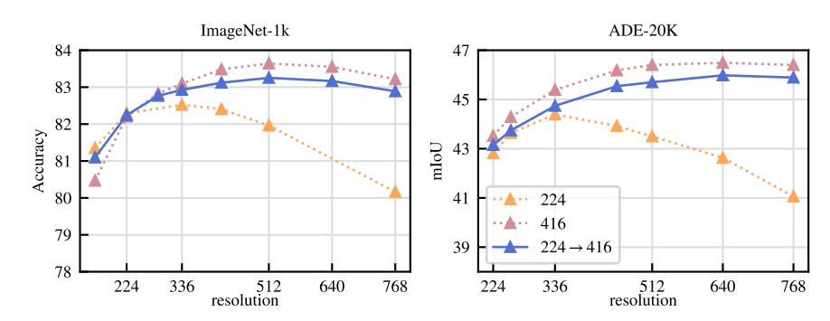
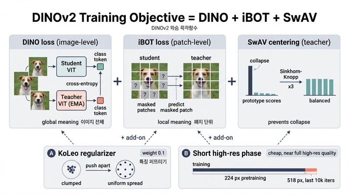

# DINOv2의 학습 목적함수는 어떤 방법들의 조합인가?

**한 줄 답**: DINO loss(이미지 수준) + iBOT loss(패치 수준)를 SwAV의 Sinkhorn-Knopp centering으로 정규화한 판별적(discriminative) 자기지도 목적함수. 여기에 특징을 배치 안에서 퍼뜨리는 **KoLeo regularizer**와, 학습 마지막에 짧게 도는 **고해상도(518×518) 적응 단계**를 더했다.

논문(Oquab et al., 2023, *DINOv2: Learning Robust Visual Features without Supervision*) 4절 첫 문장이 이 카드의 출처다:

> "a discriminative self-supervised method that can be seen as a combination of DINO and iBOT losses with the centering of SwAV. We also add a regularizer to spread features and a short high-resolution training phase."

즉 DINOv2는 새 손실을 발명한 것이 아니라 **기존 세 계열(DINO·iBOT·SwAV)의 부품을 조립하고, 대규모(ViT-g, 142M 이미지)에서 안정적으로 돌게 두 가지를 덧붙인 것**이다.

---

## 1. 다섯 가지 구성요소

| 구성요소 | 출처 | 무엇을 정렬/규제하나 | 역할 |
|---|---|---|---|
| **DINO loss** | Caron et al., 2021 | 학생·교사의 **class token** | 이미지 전체(global) 의미 학습 |
| **iBOT loss** | Zhou et al., 2022 | 학생의 **마스킹된 patch token** ↔ 교사의 같은 위치 패치 | 패치 수준(dense) 의미 학습 (MIM) |
| **SwAV centering** | Caron et al., 2020 | 교사 출력의 softmax 정규화 | Sinkhorn-Knopp 3회 반복으로 붕괴(collapse) 방지 |
| **KoLeo regularizer** | Sablayrolles et al., 2019 | 배치 내 class token 간 최근접 거리 | 특징이 뭉치지 않고 균일하게 퍼지도록 |
| **고해상도 적응** | Touvron et al., 2019 (FixRes) | 입력 해상도 | 마지막 짧은 구간만 518×518로 학습 |

### 1-1. DINO loss — 이미지 수준 목적함수
같은 이미지의 서로 다른 crop을 학생(student)과 교사(teacher) ViT에 넣고, 각자의 class token을 MLP 헤드(DINO head)에 통과시켜 "prototype score" 벡터를 얻는다. 학생은 softmax → $p_s$, 교사는 softmax + centering → $p_t$. 손실은 교차 엔트로피:

$$\mathcal{L}_{DINO} = -\sum p_t \log p_s$$

교사는 역전파 없이 학생 가중치의 **EMA(momentum 0.994→1.0 코사인 스케줄)** 로 만들어진다.

### 1-2. iBOT loss — 패치 수준 목적함수
학생 입력 패치 일부를 무작위로 **마스킹**하고(교사는 마스킹 없음), 학생의 mask token을 iBOT head에, 교사의 대응 위치(보이는) patch token을 교사 iBOT head에 통과시킨 뒤 같은 softmax·centering을 적용한다:

$$\mathcal{L}_{iBOT} = -\sum_i p_{ti} \log p_{si}, \quad i \in \text{마스킹된 패치}$$

이 항이 세그멘테이션 같은 **dense task**를 책임진다. Table 3b: MIM 항 제거 시 ADE-20k mIoU 47.1 → 44.2(약 3점 하락).

> **DINOv2에서 바꾼 점 — 헤드 분리(Untying heads)**: 원래 iBOT 논문은 DINO head와 iBOT head를 공유하는 것이 좋다고 했지만, DINOv2는 대규모에서는 반대라는 것을 관찰해 **두 개의 별도 헤드**를 쓴다(Table 1 마지막 행, k-NN +0.3).

### 1-3. SwAV의 Sinkhorn-Knopp centering
DINO 원본은 교사 softmax 후 **이동평균 centering**(배치 평균을 빼서 한 prototype으로 쏠리는 붕괴 방지)을 썼다. DINOv2는 Ruan et al.(2023)의 권고에 따라 이를 SwAV의 **Sinkhorn-Knopp(SK) 배치 정규화**로 대체한다 — 교사 점수 행렬을 행·열 합이 균등해지도록 **3회 반복**으로 재조정해, 배치 내 샘플이 prototype들에 고르게 배정되도록 강제한다. 학생 쪽은 그냥 softmax.

- Table 1에서 SK 도입 자체는 k-NN/linear 수치 변화가 없었다(`=`). 성능보다는 **대규모 학습 안정성** 목적의 부품이다.
- 저장소 기본 설정에도 두 옵션이 그대로 남아 있다: `dinov2/configs/ssl_default_config.yaml`의 `centering: "centering" # or "sinkhorn_knopp"`.

### 1-4. KoLeo regularizer — "특징을 퍼뜨리는" 정규화항
Kozachenko-Leonenko 미분 엔트로피 추정량에서 유래한 항으로, 배치 안의 $n$개 특징 벡터가 **균일하게 펼쳐지도록** 유도한다:

$$\mathcal{L}_{koleo} = -\frac{1}{n}\sum_{i=1}^{n} \log(d_{n,i}), \qquad d_{n,i} = \min_{j \ne i}\|x_i - x_j\|$$

각 점의 **최근접 이웃 거리**가 작아지면(뭉치면) 손실이 커지므로, 점들이 서로 밀어내며 초구(ℓ₂ 정규화 후) 위에 고르게 퍼진다.

- 구현 세부: 가중치 **0.1**, 첫 번째 global crop의 class token에 대해, GPU 간 통신 없이 GPU 내 샘플만으로 계산(부록 B.1; `koleo_loss_weight: 0.1`).
- 효과(Table 3a): Oxford-M 이미지 검색 mAP **55.6 → 63.9(+8점 이상)**. 최근접 이웃 검색·k-NN처럼 특징 공간의 거리 구조를 직접 쓰는 작업에서 특히 이득이고, 분류·분할 수치는 손해가 없다. Table 1에서도 KoLeo 추가 시 k-NN +2.3으로 단일 항목 중 가장 큰 상승.

### 1-5. 짧은 고해상도 학습 단계
분할·검출 같은 픽셀 수준 작업은 해상도가 중요하지만, 처음부터 고해상도로 학습하면 시간·메모리 비용이 크다(416 학습은 224의 약 3배 연산). 그래서 DINOv2는 **사전학습 끝부분 짧은 구간(10k iteration)만 518×518**로 올려 학습한다. 부록 B.2: 사전학습 가중치로 초기화하고 같은 절차·스케줄을 10k iteration에 압축, base LR만 낮춘다.



Fig. 6(ViT-L/16, ImageNet-1k 소규모 실험)에서 실제로 관찰되는 것:
- **주황 점선(224 고정)**: 평가 해상도가 336을 넘어가면 ImageNet 정확도·ADE-20k mIoU가 모두 급락한다(768에서 ~80.2 / ~41). 낮은 해상도만 본 모델은 큰 입력에 일반화하지 못한다.
- **분홍 점선(416 고정)**: 모든 평가 해상도에서 최고지만 학습 비용 3배.
- **파란 실선(224→416, 10k iter만)**: 분홍 곡선에 거의 붙어 따라간다 — 512 평가에서 ImageNet ~83.3 vs ~83.7, ADE-20k 640에서 ~46 vs ~46.5. **비용은 일부인데 결과는 거의 동일**하다는 것이 이 단계를 채택한 근거다.

---

## 2. 왜 이 조합인가 — 부품별 담당 영역

```
                 ┌─ DINO loss  (class token)  → 이미지 전체 의미, 분류·검색
   목적함수 ─────┼─ iBOT loss  (masked patch) → 패치 의미, 분할·깊이 (dense)
                 └─ SwAV SK centering (교사 정규화) → 붕괴 방지·안정성
   + KoLeo regularizer            → 특징 공간을 균일하게 → 검색/k-NN 향상
   + 고해상도 적응 (마지막 10k)    → 큰 입력 해상도에서도 성능 유지, 비용은 소폭
```

- **DINO ↔ iBOT**: 전자는 global, 후자는 local. 둘을 함께 써야 이미지 수준과 패치 수준 특징을 한 백본에서 모두 얻는다(iBOT 자체가 DINO + MIM 구조이며, DINOv2는 이를 출발점으로 삼았다 — Table 1의 baseline이 iBOT).
- **centering / KoLeo**는 둘 다 "쏠림 방지"이지만 층이 다르다: centering은 **prototype 배정**이 한쪽으로 몰리는 것을 막고, KoLeo는 **특징 벡터 자체**가 배치 내에서 뭉치는 것을 막는다.
- **고해상도 적응**은 손실이 아니라 **학습 스케줄** 수준의 트릭이며, 그래서 4절에서도 "추가로(also add)" 항목으로 언급된다.

## 3. 기억용 요약
- **D + I + S**: **D**INO(이미지) + **i**BOT(패치) + **S**wAV centering(SK 3회, 교사 쪽).
- 덧붙인 둘: **KoLeo**(퍼뜨리기, 0.1, 검색 +8) · **고해상도 마무리**(518², 10k iter).
- DINOv2만의 변경: DINO/iBOT **헤드 분리**, 이동평균 centering → **Sinkhorn-Knopp**.

## 인포그래픽


