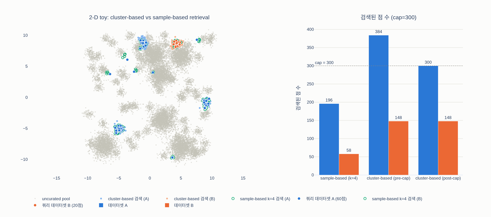

# cluster-based retrieval의 절차는?

> **답**: 분산 k-means로 uncurated 소스를 10만 개 클러스터로 나누고, 검색 대상 데이터셋의 이미지가 3장 넘게 속한 클러스터마다 10,000장을 뽑는다. 데이터셋 간 균형을 위해 한 데이터셋당 최대 100만 장으로 제한한다.

출처: DINOv2 논문(arXiv 2304.07193) §3 "Data Processing"의 *Self-supervised image retrieval* 단락과 Appendix A.4 "Retrieval", Table 15.

## 1. 어디에 쓰이는 절차인가 — LVD-142M 데이터 파이프라인

Figure 3은 LVD-142M을 만드는 흐름이다. 위쪽 회색 실린더가 **uncurated data**(웹 크롤 12억 장), 아래 주황 실린더가 **curated data**(ImageNet-22k, 소규모 fine-grained 데이터셋 등). 두 소스의 이미지를 같은 self-supervised 임베딩(ImageNet-22k로 사전학습한 ViT-H/16, cosine similarity)으로 매핑한 뒤, uncurated 쪽만 **deduplication**(그림의 빨간 X = 중복 제거, 12억 → 11억 → 7.44억 장)을 거치고, 마지막 **retrieval** 단계에서 curated 이미지(그림에서 테두리가 굵은 피자 사진)와 가까운 uncurated 이미지들을 찾아 데이터셋을 증강한다. 그림에서 자동차 사진에 X가 쳐진 것은 쿼리(피자)와 무관한 이미지는 검색되지 않음을, 다른 음식 사진들이 살아남은 것은 쿼리와 같은 개념의 이미지가 뽑힘을 뜻한다.

이 retrieval 단계에 두 가지 방식이 있고, **cluster-based retrieval**은 그중 소규모 데이터셋용이다.

## 2. 두 가지 retrieval 방식과 선택 기준

| | sample-based | cluster-based |
|---|---|---|
| 적용 대상 | **1M 장 초과** 데이터셋 (ImageNet-22k, ImageNet-1k, Google Landmarks v2) | **1M 장 미만** 소규모 데이터셋 (fine-grained 분류, segmentation, depth, 소규모 retrieval 벤치마크) |
| 단위 | 쿼리 이미지 1장 | 클러스터 1개 |
| 방법 | 각 쿼리 이미지의 최근접 $k$장 (GLv2·IN-22k는 $k = 4$, IN-1k는 $k = 32$) | 아래 3단계 |
| 결과 크기 | 데이터셋을 약 $k$배로 확대 | 쿼리 수와 무관, 개념 영역 크기에 비례 → 1M으로 cap |

**왜 작은 데이터셋에는 k-NN이 부적합한가.** sample-based는 데이터셋을 $k$배 늘리는 방식이다. Flowers-102 train은 1,020장이니 $k = 4$로 늘려도 4,080장 — 1억 4천만 장짜리 사전학습 데이터 안에서는 존재감이 없다. $k$를 크게 키우면 논문이 지적하듯 서로 다른 쿼리가 같은 이웃을 뽑는 **collision**이 늘어나 실제 증가량은 더 줄고, 개별 이미지의 이웃만 좁게 따라가므로 "꽃"이라는 **개념 영역** 전체를 덮지 못한다. 반면 클러스터는 이미 "이런 종류의 이미지" 단위로 pool을 잘라 놓은 것이므로, 쿼리 몇 장이 걸린 클러스터를 통째로 가져오면 그 개념의 이웃 영역을 한 번에 확보할 수 있다.

## 3. cluster-based retrieval의 3단계

### Step 1 — 분산 k-means로 uncurated 소스를 100,000개 클러스터로

dedup 후 7.44억 장의 임베딩을 분산 $k$-means 구현으로 $K = 100{,}000$개 클러스터로 나눈다. 클러스터당 평균

$$\frac{744\text{M}}{100{,}000} \approx 7{,}440\ \text{장}$$

이다. 논문은 "각 클러스터가 서로 다른 이미지 개념과 내용을 포착해야 한다"고 전제한다. 즉 클러스터 = pool을 개념 단위로 미리 색인한 것.

### Step 2 — "검색 대상 데이터셋의 이미지가 3장 넘게 속한" 클러스터만 선택

검색 대상(curated) 데이터셋의 각 이미지를 가장 가까운 centroid의 클러스터에 배정하고, 클러스터 $c$에 배정된 이미지 수를 $n_c$라 하면

$$S = \{\, c : n_c > 3 \,\}$$

만 선택한다. 조건이 "3장 이상($\geq 3$)"이 아니라 **"3장 넘게($> 3$)"**임에 주의. 의미:

- curated 이미지 1~2장이 우연히 걸린 클러스터는 그 데이터셋의 핵심 개념이 아니라 **잡음**(배경이 특이한 사진, 라벨 노이즈, centroid 경계에 걸린 사진)일 가능성이 높다. 이런 클러스터에서 10,000장을 가져오면 무관한 이미지가 대량으로 섞인다.
- 4장 이상 몰린 클러스터는 그 데이터셋이 실제로 다루는 개념(특정 새 종, 특정 차종, 특정 건축물)을 담고 있다고 볼 수 있다.

### Step 3 — 선택 클러스터마다 10,000장 추출, 데이터셋당 최대 1M 장

선택된 각 클러스터에서 $M = 10{,}000$장을 뽑는다. 평균 클러스터 크기(~7,440)보다 크므로 평균적인 클러스터는 사실상 통째로 들어간다. 검색량은 "선택 클러스터 수 × 클러스터 크기"이므로 쿼리 이미지가 많고 다양한 데이터셋(Food-101 75,750장, Met 397,121장)에서는 수천만 장이 나온다. 그래서 **데이터셋당 최대 1M 장**으로 잘라 LVD-142M 안에서 데이터셋 간 균형을 맞춘다.

이 cap은 §3.3(서론)이 말한 "이미지 in the wild에서는 **개념을 rebalance**하고 **소수의 지배적 모드에 과적합하는 것을 피하는** 것이 가장 어렵다 — 단순 클러스터링이 이를 잘 해결한다"와 연결된다. 클러스터링은 pool을 개념 단위로 나눠 흔한 이미지 종류가 pool 비율대로 밀고 들어오는 것을 막고, cap은 curated 데이터셋 중 한두 개(Met, Food-101)가 최종 데이터셋을 지배하는 것을 막는다. 결과적으로 소규모 데이터셋 대부분이 각 100만 장 안팎으로 나란히 들어간다.

## 4. Table 15 — cluster-based로 처리된 소스와 최종 장수

| 과제 | 데이터셋 / split | 원본 장수 | 검색된 장수 | 최종 포함 |
|---|---|---:|---:|---:|
| fine-grained 분류 | Caltech 101 / train | 3,030 | 2,630,000 | 1,000,000 |
| fine-grained 분류 | CUB-200-2011 / train | 5,994 | 1,300,000 | 1,000,000 |
| fine-grained 분류 | DTD / train1 | 1,880 | 1,580,000 | 1,000,000 |
| fine-grained 분류 | FGVC-Aircraft / train | 3,334 | 1,170,000 | 1,000,000 |
| fine-grained 분류 | Flowers-102 / train | 1,020 | 1,060,000 | 1,000,000 |
| fine-grained 분류 | Food-101 / train | 75,750 | 21,670,000 | 1,000,000 |
| fine-grained 분류 | Oxford-IIIT Pet / trainval | 3,680 | 2,750,000 | 1,000,000 |
| fine-grained 분류 | Stanford Cars / train | 8,144 | 7,220,000 | 1,000,000 |
| fine-grained 분류 | SUN397 / train1 | 19,850 | 18,950,000 | 1,000,000 |
| fine-grained 분류 | Pascal VOC 2007 / train | 2,501 | 1,010,000 | 1,000,000 |
| segmentation | ADE20K / train | 20,210 | 20,720,000 | 1,000,000 |
| segmentation | Cityscapes / train | 2,975 | 1,390,000 | 1,000,000 |
| segmentation | Pascal VOC 2012 (seg.) / trainaug | 1,464 | 10,140,000 | 1,000,000 |
| depth | KITTI / train (Eigen) | 23,158 | 3,700,000 | 1,000,000 |
| depth | NYU Depth V2 / train | 24,231 | 10,850,000 | 1,000,000 |
| depth | SUN RGB-D / train | 4,829 | 4,870,000 | 1,000,000 |
| retrieval | AmsterTime / new | 1,231 | 960,000 | **960,000** |
| retrieval | AmsterTime / old | 1,231 | 830,000 | **830,000** |
| retrieval | Met / train | 397,121 | 62,860,000 | 1,000,000 |
| retrieval | Revisiting Oxford / base | 4,993 | 3,680,000 | 1,000,000 |
| retrieval | Revisiting Paris / base | 6,322 | 3,660,000 | 1,000,000 |

표에서 읽을 수 있는 것:

- **검색된 장수는 모두 10,000의 배수** — 클러스터마다 정확히 10,000장을 뽑는다는 절차의 흔적. 예컨대 Flowers-102의 1,060,000은 106개 클러스터, Met의 62,860,000은 6,286개 클러스터가 "> 3" 조건을 통과했다는 뜻이다.
- **원본 장수와 검색량은 비례하지 않는다.** Flowers-102(1,020장)는 106개 클러스터, 원본이 20배인 SUN397(19,850장)은 1,895개 클러스터 — 데이터셋이 덮는 개념의 다양성이 검색량을 결정한다.
- **AmsterTime 두 split만 cap 미만**(96만, 83만). 나머지 19개는 모두 1M으로 잘렸다. 즉 cap이 실제로 거의 모든 소규모 데이터셋에 작동해 rebalancing을 수행했다.
- Met(397,121장)은 1M 미만이라 cluster-based로 분류됐지만 6,286만 장이 검색됐다 — cap이 없었다면 LVD-142M의 40% 이상을 Met 하나가 차지했을 것이다.
- ImageNet-22k(14.2M), ImageNet-1k(1.28M), Google Landmarks v2(1.58M), Mapillary SLS(1.43M)는 1M 초과이므로 이 표에 없다(as is 또는 sample-based).

## 5. 요약

1. **k-means**: dedup 후 7.44억 장 pool → 분산 k-means로 100,000 클러스터 (개념 단위 색인, 평균 ~7,440장/클러스터).
2. **선택**: 검색 대상 데이터셋 이미지가 **3장 넘게** 속한 클러스터만 (1~3장 걸린 잡음 클러스터 배제).
3. **추출 + cap**: 선택 클러스터마다 **10,000장**, 데이터셋당 **최대 1M 장**으로 잘라 LVD-142M 내 균형 유지 (지배적 모드 과적합 방지).

## 시각화

`expy.py`(2-D toy: pool 20,000점, $K = 200$, 클러스터마다 100점, cap 300, 쿼리 데이터셋 A 60점·B 20점)의 결과. 왼쪽 산점도에서 연한 파랑/주황이 cluster-based로 가져온 점(쿼리가 몰린 개념 영역 전체), 초록 테두리가 sample-based $k = 4$로 가져온 점(쿼리 바로 옆 몇 점). A의 잡음 쿼리 6점 주변에는 연한 점이 없고, 쿼리가 정확히 3개 걸린 클러스터도 "> 3" 조건에 배제됐다. 오른쪽 막대는 sample-based 196/58점 vs cluster-based 384/148점(cap 후 300/148점)으로, cap이 큰 쪽(A)만 잘라 균형을 맞추는 모습을 보여준다.

