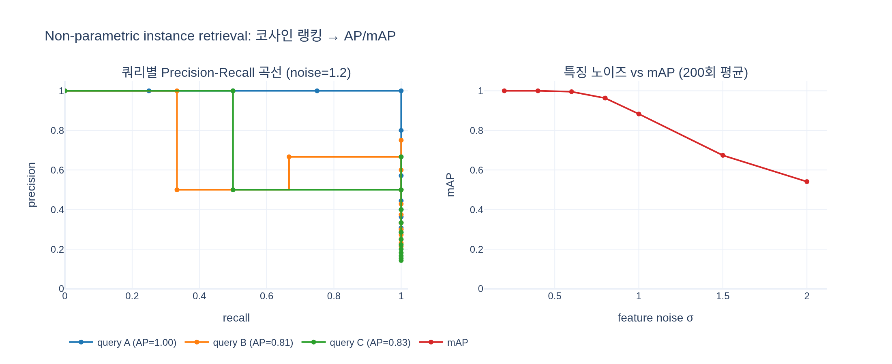

# Instance recognition 평가는 어떤 방식으로 수행하나?

> **답**: 파라미터 없는(non-parametric) 방식으로, 쿼리 이미지와의 **코사인 유사도**로 데이터베이스 이미지를 **랭킹**한다. 성능은 **mean average precision(mAP)** 으로 측정한다.
> — DINOv2 논문(arXiv 2304.07193v2) 7.3절 "Instance Recognition", 결과는 Table 9 (arXiv v2 기준; 다른 판에서는 Table 8로 매겨진 경우가 있음).

---

## 1. Instance recognition이란 — "같은 종류"가 아니라 "바로 그것"

- **Category-level** 인식(ImageNet 분류 등): "이 사진은 *성당*이다" — 클래스를 맞힌다.
- **Instance-level** 인식: "이 사진은 *파리의 노트르담 성당*이다" — 세상에 하나뿐인 특정 물체/장소/작품을 맞힌다.
  다른 시점·조명·계절·촬영 시기(수십 년 전 사진 vs 지금)에서도 같은 인스턴스를 찾아내야 하므로 훨씬 세밀한(fine-grained) 시각 정보가 필요하다.

논문은 이 절을 통해 DINOv2 특징이 **범주 수준(7.1~7.2절)과 인스턴스 수준 모두**에서 잘 작동한다는 것, 즉 "task granularity를 가로질러" 좋은 범용 특징이라는 점을 보이려 한다.

## 2. Non-parametric 평가 — 왜 학습 파라미터를 하나도 얹지 않는가

논문 원문:

> "we probe our model on the task of instance-level recognition using a **non-parametric approach**. Images from a database are **ranked according to their cosine similarity with a query image**."

**절차** (검색 = retrieval 그 자체):

1. 사전학습된 backbone(ViT)을 **frozen** 상태로 두고, 쿼리 이미지 $q$와 데이터베이스 이미지 $x_1,\dots,x_N$의 전역 특징 벡터(CLS 토큰 기반 임베딩)를 뽑는다.
2. 각 쌍의 코사인 유사도를 계산한다.
   $$\cos(q, x_i) = \frac{f(q)\cdot f(x_i)}{\|f(q)\|\,\|f(x_i)\|}$$
   특징을 미리 L2 정규화하면 단순 내적(행렬곱 하나)이 된다.
3. 유사도 **내림차순으로 데이터베이스 전체를 정렬**한다. 이 정렬 결과(랭킹 리스트)가 곧 모델의 "예측"이다.

**"non-parametric"의 뜻**: linear probe(선형 분류기 학습)나 fine-tuning처럼 **새로 학습되는 파라미터가 전혀 없다**. 분류기·투영층·거리 학습(metric learning) 없이, 특징 공간에서의 각도만 사용한다. 따라서

- 점수는 **특징 자체의 기하(같은 인스턴스가 얼마나 뭉치고, 다른 인스턴스가 얼마나 떨어져 있는가)** 를 그대로 반영한다. 다른 평가 방식에서 흔한 "probe가 잘 학습돼서 점수가 좋아진" 효과가 섞이지 않는다.
- 같은 이유로 k-NN 분류(7.1절)와 함께 **frozen feature의 품질을 가장 직접적으로 재는 프로토콜**이다.
- 6.2절 ablation에서 **KoLeo loss**가 Oxford-M 검색 mAP를 8%p 이상 올린 것도 이 맥락이다 — KoLeo는 배치 내 특징들을 초구(hypersphere) 위에 균일하게 퍼지게 하는 정규화이므로, "코사인 거리로 이웃을 찾는" 평가에 직접적으로 유리하다. (참고로 MIM 손실은 검색보다 분할 같은 patch-level 태스크에 기여했다.)

## 3. 평가 지표 — AP와 mAP

### Precision@k, Recall@k

한 쿼리에 대해 정답(같은 인스턴스) 이미지가 $R$장 있다고 하자. 랭킹의 상위 $k$개 안에 정답이 $h_k$개 있으면
$$\text{precision@}k = \frac{h_k}{k}, \qquad \text{recall@}k = \frac{h_k}{R}.$$

### Average Precision (AP) — 한 쿼리의 랭킹 품질

$k$번째 결과가 정답이면 $\mathrm{rel}(k)=1$, 아니면 0이라 할 때
$$\mathrm{AP} = \frac{1}{R}\sum_{k=1}^{N}\mathrm{rel}(k)\,\text{precision@}k .$$
즉 **정답이 등장하는 각 순위에서의 precision을 평균**한 값이다. 이는 recall을 가로축, precision을 세로축으로 그린 **PR 곡선 아래 면적**과 같다(정답 하나마다 recall이 $1/R$씩 증가하므로 $\sum_k(\text{recall}_k-\text{recall}_{k-1})\,\text{precision}_k$와 동일).

직관:
- 정답 $R$장이 모두 최상위에 오면 AP $=1$.
- 정답이 오답 뒤로 밀릴수록 그 순위의 precision이 낮아져 AP가 깎인다. 예) 정답 3개, 랭킹 `[1,0,1,0,1,0]` → 정답 위치의 precision = 1.00, 0.67, 0.60 → AP = 0.756. 랭킹 `[0,0,0,1,1,1]` → 0.25, 0.40, 0.50 → AP = 0.383.
- 순위 **순서**에 민감하고, 임계값(threshold)을 정할 필요가 없어 검색(retrieval) 평가의 표준 지표다.

### mean Average Precision (mAP)

쿼리 $Q$개의 AP를 평균한다.
$$\mathrm{mAP} = \frac{1}{Q}\sum_{q=1}^{Q}\mathrm{AP}_q .$$
논문 원문: "We measure performance by computing the **mean average precision** and report our results in Table 9."

## 4. 네 가지 벤치마크의 성격

| 벤치마크 | 무엇을 찾나 | 특징 | 논문에 보고된 지표 |
|---|---|---|---|
| **(Revisited) Oxford** — ℛOxford | 옥스퍼드 건축물 11개 랜드마크 (Radenović et al., 2018a) | 시점·가림·스케일 변화가 큰 랜드마크 검색. **Medium(M)**: easy+hard 정답 포함 / **Hard(H)**: hard 정답만 정답으로 인정, easy는 무시 → 훨씬 어려움 | mAP (M, H) |
| **(Revisited) Paris** — ℛParis | 파리 건축물 랜드마크 (같은 논문) | Oxford와 동일 프로토콜. 일반적으로 Oxford보다 점수가 높음 | mAP (M, H) |
| **Met** | 메트로폴리탄 미술관 소장 **예술 작품** 인스턴스 (Ypsilantis et al., 2021, NeurIPS D&B) | 약 40만 장의 학습 이미지·22만+ 클래스, 쿼리에는 어떤 작품에도 해당 않는 **distractor 쿼리**가 섞여 있어 "모른다"고 답하는 능력도 평가. 논문은 장거리 도메인(회화·조각·공예)을 다룬다는 점에서 랜드마크와 구별됨 | GAP(global AP, 전체 쿼리에 대한 micro-AP), GAP-(distractor 쿼리 제외), ACC(정확도) |
| **AmsterTime** | 암스테르담의 **현재 스트리트뷰 사진 ↔ 수십 년 전 아카이브 사진** 매칭 (Yildiz et al., 2022) | 1,231 쌍. 촬영 시기·매체(흑백 사진, 회화)·건물 변화로 **심한 도메인 시프트** | mAP |

공통점: 모두 "데이터베이스에서 쿼리와 같은 인스턴스를 찍은 이미지를 꺼내라"는 **검색 문제**이고, 논문은 모두 동일한 non-parametric 코사인 랭킹으로 평가했다.

## 5. Table 9 핵심 수치 (frozen feature, instance-level recognition)

| Feature | Arch | Oxford M | Oxford **H** | Paris M | Paris H | Met GAP | Met GAP- | Met ACC | AmsterTime mAP |
|---|---|---|---|---|---|---|---|---|---|
| OpenCLIP (weakly-sup.) | ViT-G/14 | 50.7 | 19.7 | 79.2 | 60.2 | 6.5 | 23.9 | 34.4 | 24.6 |
| MAE | ViT-H/14 | 11.7 | 2.2 | 19.9 | 4.7 | 7.5 | 23.5 | 30.5 | 4.2 |
| DINO | ViT-B/8 | 40.1 | 13.7 | 65.3 | 35.3 | 17.1 | 37.7 | 43.9 | 24.6 |
| iBOT | ViT-L/16 | 39.0 | 12.7 | 70.7 | 47.0 | 25.1 | 54.8 | 58.2 | 26.7 |
| **DINOv2** | ViT-S/14 | 68.8 | 43.2 | 84.6 | 68.5 | 29.4 | 54.3 | 57.7 | 43.5 |
| **DINOv2** | ViT-B/14 | 72.9 | 49.5 | 90.3 | 78.6 | 36.7 | 63.5 | 66.1 | 45.6 |
| **DINOv2** | ViT-L/14 | **75.1** | **54.0** | **92.7** | **83.5** | **40.0** | 68.9 | 71.6 | **50.0** |
| **DINOv2** | ViT-g/14 | 73.6 | 52.3 | 92.1 | 82.6 | 36.8 | **73.6** | **76.5** | 46.7 |

읽는 법:

- **Oxford-Hard**가 대표 수치. DINOv2 ViT-L/14 54.0 vs. 최고 SSL(DINO ViT-B/8) 13.7 → **약 +41%p**, vs. OpenCLIP-G 19.7 → **약 +34%p**. 논문 본문의 "+41% mAP … +34% mAP on Oxford-Hard"가 이 차이다.
- **MAE**는 분류 linear probe에서는 괜찮지만 검색에서 거의 무너진다(Oxford-H 2.2, AmsterTime 4.2). 픽셀 복원 목표가 만드는 특징은 코사인 거리로 이웃을 찾기에 적합하지 않다는 뜻 — 평가 방식이 non-parametric이라 이런 특징 공간의 성질이 그대로 드러난다.
- **OpenCLIP**은 텍스트 정렬 덕에 범주 수준에서는 강하지만 인스턴스 수준에서는 DINOv2에 크게 뒤진다. 텍스트 캡션이 "노트르담"과 "다른 고딕 성당"을 잘 구분해 주지 못하기 때문으로 해석할 수 있다.
- **가장 작은 DINOv2 ViT-S/14(68.8 / 43.2)** 조차 모든 baseline을 앞선다.
- 크기별로는 **ViT-L/14가 대부분 최고**이고, ViT-g/14는 Met에서만 앞선다. DINOv2 소형 모델들이 ViT-g에서 distillation된 점과 함께 볼 때, 가장 큰 모델이 항상 최적은 아님을 보여준다.
- Met의 GAP(6.5~40.0)가 GAP-/ACC보다 낮은 이유는, 어떤 작품에도 해당하지 않는 distractor 쿼리에 대해서도 낮은 신뢰도를 줘야 하기 때문이다.

## 6. 한 줄 요약

> frozen backbone 특징을 L2 정규화해 **쿼리–DB 코사인 유사도로 정렬**(추가 학습 없음) → 정답 순위로부터 **AP를 구하고 쿼리 평균해 mAP** → Oxford/Paris(랜드마크), Met(미술품), AmsterTime(시대 간 도시 사진) 네 벤치마크에서 DINOv2가 SSL·weakly-supervised 모두를 큰 폭으로 앞섬(Oxford-H +41%p / +34%p).

## 시각화

`expy.py`는 무작위 단위 벡터로 장난감 검색 문제(인스턴스 3개, DB 14장)를 만들고, 코사인 랭킹 → precision@k/recall@k → AP(정답 순위 precision 평균 = PR 곡선 면적) → mAP를 처음부터 구현해 `sklearn.metrics.average_precision_score`와 일치함을 확인한다. 왼쪽은 특징 노이즈가 큰 경우 세 쿼리의 PR 곡선(면적 = AP), 오른쪽은 특징 노이즈(품질)를 바꿔가며 잰 mAP — 학습 파라미터가 없으므로 mAP가 특징 품질을 그대로 따라간다.

