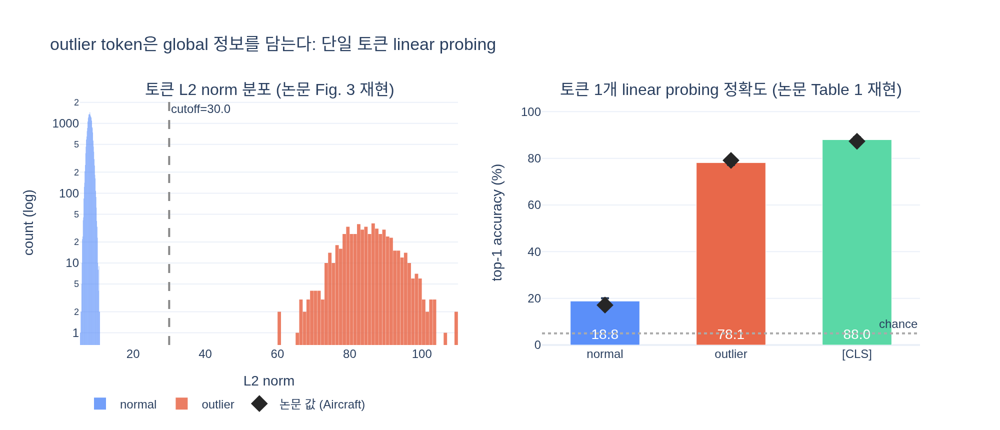

# outlier token이 global 정보를 담고 있음을 어떻게 보였는가?

> 출처: *Vision Transformers Need Registers* (Darcet, Oquab, Mairal, Bojanowski; ICLR 2024), §2.1 "Artifacts hold global information", Table 1 / Appendix G Table 6.

## 한 줄 답

**"토큰 하나만 주고 이미지를 맞혀 보게" 했다.** DINOv2-g로 patch embedding을 뽑아 이미지마다 토큰을 **딱 1개** 무작위로 고르고(high-norm이면 outlier 조건, 아니면 normal 조건), 그 토큰 하나를 이미지 표현으로 삼아 **로지스틱 회귀 분류기**를 학습해 분류 정확도를 쟀다. outlier 토큰 쪽이 normal 토큰보다 압도적으로 정확했고, 심지어 `[CLS]`에 근접했다.

---

## 1. 먼저: outlier 토큰이란 무엇인가

논문은 artifact를 **출력 토큰의 L2 norm**으로 정의한다. DINOv2 ViT-g/14의 patch token norm 분포는 **bimodal**이라, 대부분은 0~100 사이인데 소수가 수백 대의 norm을 갖는다. 그래서 `norm > 150`을 컷오프로 잡아 "high-norm = outlier", 나머지를 "normal"로 부른다. 전체의 약 **2.37%** 가 여기 해당한다. (컷오프 값은 모델마다 손으로 정하는 값이다.)

이 정의 덕분에 "outlier vs normal"을 **자동으로 갈라서** 두 집단의 성질을 비교하는 실험이 가능해진다.

## 2. 실험 프로토콜 (핵심)

논문 §2.1 마지막 문단의 절차를 그대로 옮기면:

1. 분류 데이터셋(IN1k, Places205, Aircraft, CIFAR-10/100, CUB, Caltech101, Cars, DTD, Flowers, Food, Pets, SUN, VOC — 총 14개)의 각 이미지를 **DINOv2-g**에 forward 해서 patch embedding을 얻는다.
2. 그 중 **토큰 하나를 무작위로 고른다.** 조건에 따라 high-norm 집합에서 고르거나, normal 집합에서 고른다.
3. 그 토큰 **하나만을 이미지 표현**으로 간주한다. (평균 풀링도, 여러 토큰 concat도 아니다.)
4. 그 위에 **로지스틱 회귀** 분류기를 학습해서 이미지 클래스를 예측하고 top-1 정확도를 잰다.
5. 비교 기준으로 `[CLS]` 토큰으로도 같은 분류기를 학습한다.

이 설계의 논리는 단순하다. patch 토큰은 원래 **자기 패치 주변의 국소 정보**만 담고 있어야 정상이다. 그런데 배경 한 구석의 패치 토큰 하나로 "이 이미지는 A-10 Thunderbolt다"를 맞힐 수 있다면, 그 토큰은 자기 패치가 아니라 **이미지 전체에 대한 정보**를 들고 있다는 뜻이다.

## 3. 결과 — Table 1

| | IN1k | P205 | Airc. | CF10 | CF100 | CUB | Cal101 | Cars | DTD | Flow. | Food | Pets | SUN | VOC |
|---|---|---|---|---|---|---|---|---|---|---|---|---|---|---|
| `[CLS]` | 86.0 | 66.4 | **87.3** | 99.4 | 94.5 | 91.3 | 96.9 | 91.5 | 85.2 | 99.7 | 94.7 | 96.9 | 78.6 | 89.1 |
| normal | 65.8 | 53.1 | **17.1** | 97.1 | 81.3 | 18.6 | 73.2 | 10.8 | 63.1 | 59.5 | 74.2 | 47.8 | 37.7 | 70.8 |
| outlier | 69.0 | 55.1 | **79.1** | 99.3 | 93.7 | 84.9 | 97.6 | 85.2 | 84.9 | 99.6 | 93.5 | 94.1 | 78.5 | 89.7 |

읽는 법:

- **fine-grained 데이터셋에서 격차가 극적이다.** Aircraft 17.1 → 79.1, Cars 10.8 → 85.2, CUB 18.6 → 84.9, Pets 47.8 → 94.1, Flowers 59.5 → 99.6. 이런 데이터셋은 국소 패치 하나로는 도저히 풀 수 없고 **전역 형태 정보**가 필요하다. 그래서 "global 정보를 담고 있는가"를 가장 민감하게 드러낸다.
- **outlier는 `[CLS]`에 육박한다.** Caltech101(97.6 vs 96.9), VOC(89.7 vs 89.1), Flowers(99.6 vs 99.7)에서는 사실상 동급이다. `[CLS]`는 설계상 global 요약을 담는 토큰인데, **패치 토큰 하나**가 거기에 맞먹는다는 게 핵심 관찰이다.
- **IN1k/P205 같은 큰 데이터셋에서는 격차가 작다**(65.8 vs 69.0). 장면/객체 카테고리는 배경 패치 하나로도 어느 정도 맞힐 수 있어서, normal 토큰의 베이스라인 자체가 높기 때문이다.

### 분산 (Appendix G, Table 6)

토큰을 **무작위로** 고르는 절차 자체가 분산의 원인이므로, 논문은 부록에 표준편차를 따로 보고한다. 예: Aircraft normal 17.1 ± 0.5, outlier 79.1 ± 0.5, CUB outlier 84.9 ± 2.1. 표준편차가 0.0~2.1 수준이라 **격차가 우연한 토큰 선택 때문이 아님**을 확인해 준다.

## 4. 반대편 증거 — outlier는 local 정보를 "잃었다"

이 실험만으로는 "outlier가 정보를 더 많이 담는다"까지만 말할 수 있다. 논문은 같은 linear probing 도구로 반대 방향도 잰다(Fig. 5b).

- **position prediction** (patch가 이미지의 어느 위치인지 맞히기): normal 41.7 vs outlier 22.8 (avg. distance 0.79 vs 5.09)
- **pixel reconstruction** (원래 패치 픽셀 복원): L2 error normal 18.38 vs outlier 25.23 (낮을수록 좋음)
- **이웃과의 cosine 유사도**: high-norm 패치는 patch embedding 단계에서 이미 이웃과 거의 동일 → **중복된(redundant) 정보만 있는 패치**

두 결과를 합치면 그림이 완성된다: outlier 토큰은 **국소 정보를 버리고 global 정보를 채워 넣은** 토큰이다.

## 5. 논문의 해석과 결론

> *large*, *sufficiently trained* 모델은 **중복된(정보량 적은) 토큰을 알아보고**, 그 자리를 global 정보를 **저장·처리·인출**하는 공간으로 재활용한다.

- outlier는 layer 15쯤(40-layer ViT-g)부터 갈라져 나오고, 학습의 1/3 지점 이후에 생기며, ViT-L 이상 크기에서만 나타난다 (Fig. 4).
- 이 행동 자체가 나쁜 건 아니지만, **patch 토큰 안에서** 일어나는 게 문제다. 국소 정보를 버리게 되어 dense prediction 성능을 깎는다.
- → 그래서 입력 시퀀스에 **register 토큰**을 명시적으로 추가한다. Appendix D.2(Table 4)는 register를 넣으면 outlier가 사라지고 그 **global 정보 적재 역할이 register로 그대로 옮겨간다**는 것을 같은 linear probing으로 확인해 준다.

## 6. 자주 헷갈리는 점

- **"norm이 커서 분류가 잘 되는 것 아닌가?"** 아니다. 로지스틱 회귀는 (입력 표준화/정규화만 맞추면) 전체 스케일에 거의 불변하다. 큰 norm은 outlier를 **식별하는 표지**일 뿐이고, 정확도를 만드는 것은 그 토큰에 실린 **클래스 신호 대 국소 noise 비**다. `expy.py` §4에서 이걸 직접 확인한다.
- **`[CLS]` 없이 실험한 게 아니다.** `[CLS]`는 상한 기준선으로 함께 보고된다. "outlier가 `[CLS]`에 얼마나 가까운가"가 주장의 강도다.
- **여러 토큰을 모아 쓴 게 아니다.** 정확히 **1개** 토큰이다. 그래서 결과가 놀라운 것이다.

---

## 시각화

`expy.py`는 실제 DINOv2 가중치 없이 합성 데이터로 위 프로토콜을 재현한다. 클래스별 global 신호 벡터 $g_c$ 와 패치별 국소 noise로 토큰을 만들되, 소수(~2.3%)의 outlier 토큰에만 global 신호를 강하게 싣고 norm을 10배로 키웠다. 시드 5개로 반복한 결과는 **normal 18.8 ± 1.2 / outlier 78.1 ± 1.0 / `[CLS]` 88.0 ± 1.0** 으로, 논문 Aircraft 열(17.1 / 79.1 / 87.3)과 같은 패턴을 보인다. 부록 실험(position probing)도 41.9 vs 21.7로 논문의 41.7 vs 22.8을 재현한다.

