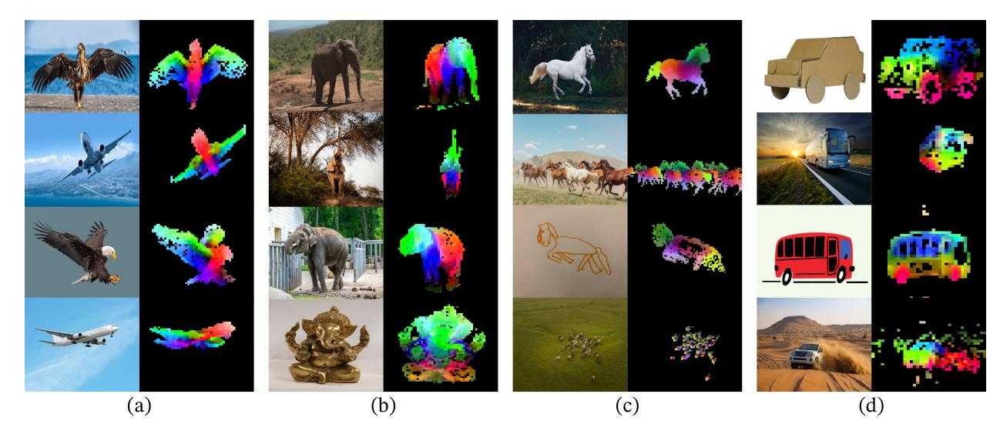
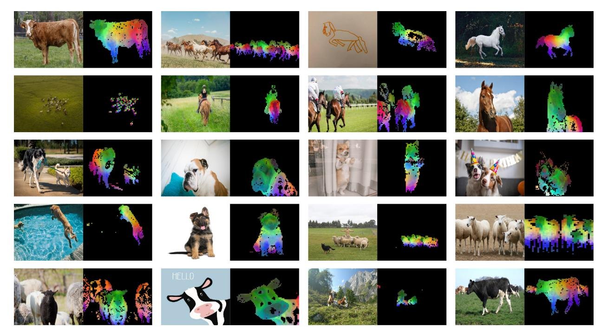
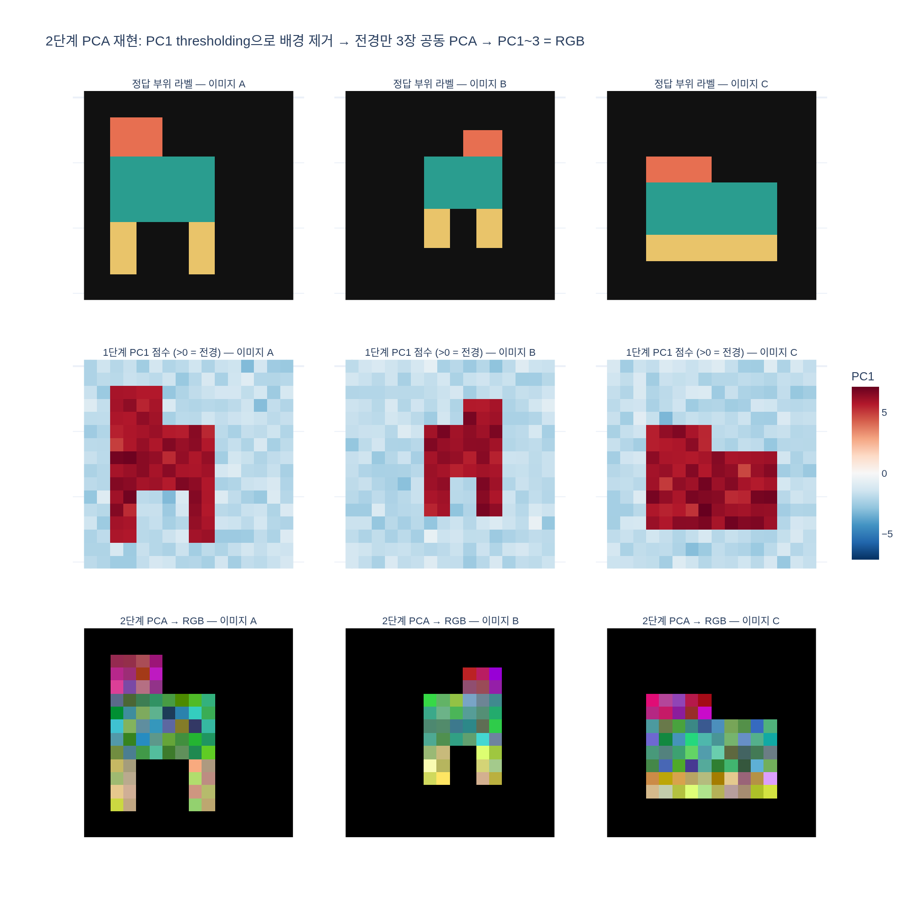

# patch feature PCA 분석 절차는?

> **답**: 패치 특징의 첫 주성분(PC1)을 thresholding해 **양수 패치만** 남기면 주 객체와 배경이 분리된다.
> 남은 패치들에 대해 **같은 카테고리 이미지 3장**에 걸쳐 **두 번째 PCA**를 수행하고, 첫 3개 성분을 **R, G, B 색 채널**로 표시한다.

출처: DINOv2 논문(Oquab et al., 2023) §7.5 Qualitative Results — "PCA of patch features", Fig. 1, Fig. 9.

---

## 0. 한 줄 요약

```
모든 패치 특징 ──PCA①──▶ PC1 점수 > 0 ? ──▶ 전경 패치만 ──PCA②(3장 합쳐서)──▶ PC1,PC2,PC3 → R,G,B
                          (배경 제거)                        (부위 좌표계 공유)
```

## 1. 무엇을 분석하는가 — "패치 특징"

DINOv2(ViT)는 이미지를 14×14 픽셀 패치로 쪼개고, 각 패치마다 고차원 특징 벡터(ViT-L: 1024차원, ViT-g: 1536차원)를 출력한다.
논문은 이 **패치 토큰 출력**들이 별도의 학습 없이도 "이 패치가 객체인지 배경인지", "객체의 어느 부위인지"를 선형적으로 담고 있음을 보이고 싶어 했다.
그런데 1024차원 벡터는 눈으로 볼 수 없으므로, **PCA로 3차원까지 줄여서 색으로 바꾼다**.

## 2. PCA란 — 30초 복습

PCA(주성분 분석)는 데이터 행렬 $X \in \mathbb R^{N\times D}$ (패치 $N$개, 차원 $D$)를 평균 중심화한 뒤,
**분산이 가장 큰 방향**부터 차례로 직교 축을 찾는 방법이다.

$$X_c = X - \bar x, \qquad X_c = U\Sigma V^\top$$

- $V$의 첫 열 $v_1$ = **PC1 방향**: 데이터가 가장 넓게 퍼진 축
- 패치 $x$의 **PC1 점수** $s_1 = (x-\bar x)\cdot v_1$: 그 축 위의 좌표 (평균이 0이므로 양/음이 자연스럽게 나뉜다)
- $v_2, v_3, \dots$: 앞 축에 직교하면서 남은 분산이 가장 큰 방향

즉 PC1 점수의 **부호**는 "데이터를 가장 크게 둘로 가르는 대비의 어느 쪽에 있는가"를 뜻한다.

## 3. 1단계 — PC1 thresholding으로 배경 제거

절차: 이미지(들)의 **모든 패치 특징**을 모아 PCA → 각 패치의 PC1 점수 계산 → **점수가 양수인 패치만 유지**.

왜 이게 전경/배경 분리가 되는가?

- 한 장의 사진 속 패치들을 놓고 보면, 의미적으로 가장 큰 차이는 "**주 객체 vs 배경**"이다. 코끼리 패치들끼리는 서로 비슷하고, 잔디·하늘 패치들끼리도 비슷하지만, 두 집단 사이는 아주 다르다.
- 최대 분산 방향(PC1)은 정의상 가장 큰 대비를 잡아내므로, PC1 축의 한쪽엔 객체 패치, 반대쪽엔 배경 패치가 몰린다. 평균이 0이니 **0을 경계로 threshold**하면 두 집단이 갈린다.
- 논문은 이를 "**highest variance direction을 탐지하는 비지도 전경/배경 검출기**"라고 부르고, 객체 경계를 꽤 정확히 그린다고 평가한다.
- 주의: 주성분 벡터는 $v$와 $-v$가 같은 축이라 **부호가 임의**다. 논문은 "양수 → 유지 / 음수 → 제거"라고 쓰지만 실제 구현에서는 어느 부호가 객체인지 확인해 맞춘다(예: 테두리 패치가 음수가 되도록).



Fig. 1을 보면 각 열(a~d)마다 원본 사진 옆에 **검정 배경 위에 객체만 색칠된** 그림이 있다.
검정 = PC1 점수가 음수여서 제거된 패치, 색이 있는 곳 = 양수로 살아남은 전경이다.
(c)열의 흰 말은 나무 그늘 배경이 깨끗하게 사라지고 말 실루엣만 남으며, (d)열의 사막 SUV는 모래·언덕이 모두 검게 지워진다.
객체 안쪽에 드문드문 검은 구멍이 보이는데, 이는 PC1 점수가 아슬아슬하게 음수로 넘어간 패치들이다 — threshold가 학습된 것이 아니라 단순히 0인 데서 오는 부작용이다.

## 4. 왜 PCA를 **한 번 더** 하는가 — 2단계

1단계 PCA에서 PC2, PC3까지 그냥 색으로 쓰면 안 될까? 잘 안 된다.

- 전경/배경 대비가 워낙 커서 전체 분산의 큰 몫을 PC1이 가져간다. 나머지 성분은 여전히 배경 내부의 변이(하늘 vs 잔디 등)와 전경 내부 변이가 **섞여** 있어서 "부위" 축이 되지 못한다.
- **배경 패치를 제거한 뒤** 남은 전경 패치만으로 PCA를 다시 하면, 남아 있는 분산은 **객체 내부의 부위 변이**뿐이다. 따라서 이제 PC1~3가 "머리 ↔ 몸통", "앞 ↔ 뒤", "위 ↔ 아래"와 같은 부위 축으로 정렬된다.

이것이 "남은 패치들에 대해 두 번째 PCA"의 이유다.

## 5. 왜 **같은 카테고리 3장을 함께** PCA하는가

이미지마다 따로 PCA를 하면 각 이미지가 자기만의 주성분 축을 갖게 되어, 축의 순서와 부호가 이미지마다 달라진다. 그러면 이미지 A에서 머리가 빨간색이어도 이미지 B에서는 머리가 파란색일 수 있어 비교가 불가능하다.

3장의 전경 패치를 **하나의 행렬로 합쳐** PCA하면 세 이미지가 **같은 좌표계**를 공유한다.
- 같은 부위의 패치는 특징이 비슷 → 같은 좌표 → **같은 색**.
- 그래서 Fig. 1 캡션대로 "자세·화풍·심지어 객체가 달라져도 같은 부위끼리 매칭"되는 그림이 나온다.

Fig. 1 (a)열에서 **독수리(사진 2장)와 비행기(2장)**가 한 그룹이다. 날개 끝은 초록, 몸통 중심은 빨강/자홍, 머리·꼬리 쪽은 파랑 계열로, 새와 비행기라는 다른 물체인데도 "날개 = 초록"이 대응된다.
(b)열은 코끼리 사진 3장 + 가네샤(코끼리 머리 신) 동상이다. 머리/귀 부분이 초록, 다리 아래쪽이 빨강으로 사진과 동상 사이에서 같은 배색이 유지된다.
(c)열은 흰 말, 말 떼, 말 선화(線畵), 항공 사진의 양 떼 — 화풍이 완전히 달라도 몸통/다리 색 배치가 이어진다.



Fig. 9(부록)는 같은 절차를 더 많은 이미지에 적용한 것이다. 첫 행의 소와 여러 말들에서 **머리 = 초록, 몸통 = 노랑/빨강, 다리 = 파랑/자홍** 배색이 반복되고, 셋째·넷째 행의 개들(보더콜리, 불독, 셰퍼드 강아지)에서도 머리 부분이 초록 계열로 일관된다.
"HELLO" 소 캐릭터(마지막 행)처럼 만화 그림에도 같은 색 배치가 나타나고, 한 이미지에 개 두 마리, 양 여러 마리가 있으면 **각 개체마다 같은 부위가 같은 색**으로 칠해진다.
논문은 이것을 **emerging property** — 모델이 부위 파싱을 학습한 적이 없는데 특징 공간에 부위 구조가 나타났다 — 로 강조한다.

## 6. 3개 성분 → RGB 매핑

2단계 PCA의 상위 3개 성분 점수 $(s_1, s_2, s_3)$를 각 패치마다 얻는다.
각 성분을 전경 패치 전체에 걸쳐 min-max 정규화해 $[0,1]$로 만들고,

$$R = \tilde s_1,\quad G = \tilde s_2,\quad B = \tilde s_3$$

로 넣어 패치 크기의 색 블록을 그린다. 배경(제거된 패치)은 검정으로 채운다.
3차원 임베딩을 색으로 보는 것이므로 색 자체에 의미는 없고, **"같은 색 = 특징 공간에서 가까움 = 같은 부위"**라는 상대적 의미만 있다. 부위가 연속적으로 변하는 동물 몸통에서는 색도 무지개처럼 부드럽게 이어진다.

## 7. 단계별 체크리스트

| 단계 | 입력 | 하는 일 | 왜 |
|---|---|---|---|
| PCA ① | 모든 패치 특징 | PC1 점수 부호로 threshold (>0 유지) | 최대 분산 방향 = 객체 vs 배경 대비 |
| 마스크 | PC1 > 0 | 전경 패치만 남김 | 배경 분산을 제거해 부위 변이가 상위 성분으로 올라오게 |
| PCA ② | 전경 패치 (같은 카테고리 **3장** 합쳐서) | PC1~3 추출 | 3장이 같은 좌표계 → 같은 부위 = 같은 색 |
| 색 | PC1,2,3 → min-max → R,G,B | 시각화 | 3차원 임베딩을 사람이 볼 수 있게, 배경은 검정 |

## 8. 함께 기억할 것

- 이 시각화는 **아무것도 학습하지 않는다** — PCA와 threshold 0만 쓴다. 그래서 "특징이 얼마나 선형적으로 잘 정돈되어 있는가"를 보여주는 정성적 증거로 쓰인다.
- 논문의 두 가지 관찰: (1) 최대 분산 방향 기반의 비지도 전경/배경 검출기가 객체 경계를 잘 그린다, (2) 나머지 성분이 "부위"에 대응하고 같은 카테고리 이미지끼리 잘 매칭된다.

## 시각화

`expy.py`(numpy만으로 2단계 PCA를 합성 데이터에 재현)의 결과. 1행: 정답 부위 라벨(주황=머리, 청록=몸통, 노랑=다리). 2행: 1단계 PC1 점수 — 빨강(양수)이 정확히 객체 영역, 파랑(음수)이 배경. 3행: 전경만 3장 공동 PCA → RGB — 위치·크기·자세가 다른 세 객체에서 머리≈자홍, 몸통≈녹색, 다리≈노랑으로 **같은 부위가 같은 색**이 된다.


