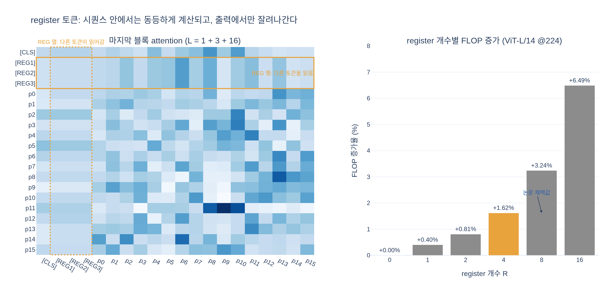

# register 토큰은 구조적으로 어디에 어떻게 추가되는가?

> **Q.** register 토큰은 구조적으로 어디에 어떻게 추가되는가?
>
> **A.** patch embedding layer 뒤에 [CLS] 토큰과 유사하게 학습 가능한 값으로 추가된다. Vision Transformer 끝에서는 폐기되고, [CLS]와 patch token만 이미지 표현으로 사용된다.

출처: *Vision Transformers Need Registers* (Darcet et al., ICLR 2024, arXiv:2309.16588) §2.2

---

## 1. 한 문장 요약

register는 **입력 시퀀스에만 존재하고 출력에서는 사라지는 토큰**이다. 이미지에서 오는 정보가 아니라 `nn.Parameter`로 학습되는 상수 벡터이며, patch embedding을 거친 토큰 시퀀스 뒤에 붙어 트랜스포머 블록을 함께 통과하지만, 마지막에 잘려나가 downstream에는 전혀 노출되지 않는다.

논문 원문:

> We therefore propose a simple fix to this issue: we explicitly add new tokens to the sequence, that the model can learn to use as registers. **We add these tokens after the patch embedding layer, with a learnable value, similarly to the [CLS] token. At the end of the vision transformer, these tokens are discarded, and the [CLS] token and patch tokens are used as image representations, as usual.**

이 붙고, 출력에서는 휴지통으로 버려진다](fig-6.jpeg)

Fig. 6의 노란 블록이 register다. 아래쪽(입력)에서는 `[patch] × N ‖ [CLS] ‖ [REG1..REGN]`이 모두 같은 시퀀스로 들어가고, 위쪽(출력)에서 노란 블록만 쓰레기통 아이콘으로 폐기된다. `output`이라는 대괄호가 파란(patch) + 검정([CLS])만 감싸고 있는 것이 핵심이다.

---

## 2. "어디에" — patch embedding layer **뒤**

ViT의 앞단 순서를 보면 register가 들어갈 자리가 명확해진다.

```
이미지 (B, 3, H, W)
  │
  ├─ patch_embed  (Conv2d stride=P)      →  (B, N, D)      # N = HW/P²
  │
  ├─ [CLS] concat                        →  (B, 1+N, D)
  ├─ + pos_embed                         →  (B, 1+N, D)
  │
  ├─ ★ register concat  ←── 여기          →  (B, 1+R+N, D)
  │
  ├─ Block × depth  (self-attention)     →  (B, 1+R+N, D)
  ├─ norm
  │
  └─ slice: [:,0]=CLS, [:,1:1+R]=REG(폐기), [:,1+R:]=patch
```

중요한 점은 **patch embedding "뒤"라는 말이 곧 "이미지 픽셀에서 유도되지 않는다"는 뜻**이라는 것이다. register는 conv를 거쳐 만들어지는 값이 아니라, 입력 이미지와 무관하게 항상 동일한 학습 파라미터가 배치 차원으로 broadcast 된 것이다.

### positional embedding을 받지 않는다

DINOv2 구현에서 눈여겨볼 디테일: `pos_embed`는 `[CLS] + patch`에만 더해지고, register는 **그 다음에** concat된다. 따라서 register에는 위치 정보가 없다. 위치를 갖지 않는 것이 자연스럽다 — register는 "이미지의 어떤 영역"이 아니라 그냥 전역 scratch space이기 때문이다.

---

## 3. "어떻게" — [CLS]와 똑같은 방식으로

| | `[CLS]` | `[REG]` × R |
|---|---|---|
| 생성 | `nn.Parameter(torch.zeros(1, 1, D))` | `nn.Parameter(torch.zeros(1, R, D))` |
| 초기화 | `nn.init.normal_(std=1e-6)` | `nn.init.normal_(std=1e-6)` |
| 이미지 의존성 | 없음 (학습된 상수) | 없음 (학습된 상수) |
| pos_embed | 받음 | **안 받음** |
| attention 참여 | 전체 시퀀스와 양방향 | 전체 시퀀스와 양방향 |
| 출력 사용처 | 이미지 표현 (분류 head 등) | **폐기** |

즉 "학습 가능한 값으로, [CLS]와 유사하게"라는 표현은 정확히 `nn.Parameter` + `expand` + `cat`이라는 동일 메커니즘을 가리킨다. 유일한 차이는 **출력을 쓰느냐 버리느냐**다.

### 실제 DINOv2 코드 (이 리포지토리)

`/home/sungwoo/projects/swcho/dinov2/dinov2/models/vision_transformer.py`

생성 (`DinoVisionTransformer.__init__`, L112-117):

```python
self.cls_token = nn.Parameter(torch.zeros(1, 1, embed_dim))
self.pos_embed = nn.Parameter(torch.zeros(1, num_patches + self.num_tokens, embed_dim))
assert num_register_tokens >= 0
self.register_tokens = (
    nn.Parameter(torch.zeros(1, num_register_tokens, embed_dim)) if num_register_tokens else None
)
```

`pos_embed`의 길이가 `num_patches + self.num_tokens`(= +1, CLS만)이고 register 개수를 포함하지 않는다는 점에 주목.

초기화 (`init_weights`, L175-179) — [CLS]와 동일한 `std=1e-6`:

```python
nn.init.normal_(self.cls_token, std=1e-6)
if self.register_tokens is not None:
    nn.init.normal_(self.register_tokens, std=1e-6)
```

삽입 (`prepare_tokens_with_masks`, L215-234):

```python
x = self.patch_embed(x)                                        # ← patch embedding layer
...
x = torch.cat((self.cls_token.expand(x.shape[0], -1, -1), x), dim=1)
x = x + self.interpolate_pos_encoding(x, w, h)                 # ← pos_embed는 CLS+patch에만

if self.register_tokens is not None:
    x = torch.cat(
        (
            x[:, :1],                                          # [CLS]
            self.register_tokens.expand(x.shape[0], -1, -1),   # [REG] × R
            x[:, 1:],                                          # patches
        ),
        dim=1,
    )
```

구현상 register는 `[CLS]` **바로 뒤**에 끼워 넣어진다(Fig. 6 그림에서는 편의상 맨 끝에 그려져 있지만, self-attention은 순열 등변이므로 위치 인덱스는 의미가 없다 — pos_embed를 안 받으니 더더욱).

폐기 (`forward_features`, L262-270):

```python
x_norm = self.norm(x)
return {
    "x_norm_clstoken":   x_norm[:, 0],
    "x_norm_regtokens":  x_norm[:, 1 : self.num_register_tokens + 1],   # 분리되지만
    "x_norm_patchtokens": x_norm[:, self.num_register_tokens + 1 :],
    ...
}
```

그리고 실제 사용처(`forward`, L348-353)는 `[CLS]`만 쓴다:

```python
def forward(self, *args, is_training=False, **kwargs):
    ret = self.forward_features(*args, **kwargs)
    if is_training:
        return ret
    else:
        return self.head(ret["x_norm_clstoken"])
```

dense feature를 뽑는 `get_intermediate_layers` 경로(L321)에서도 마찬가지로 잘라낸다:

```python
outputs = [out[:, 1 + self.num_register_tokens :] for out in outputs]
```

`x_norm_regtokens` 키가 dict에 남아 있는 것은 **분석·시각화용**이지(논문 Fig. 9, 15, 16), 표현으로 쓰이지 않는다.

---

## 4. 왜 이 설계인가

논문 §2의 관찰: 충분히 크고 오래 학습된 ViT는 **정보량이 적은 patch(주로 배경)를 재활용해서 전역 정보를 저장하는 scratch space로 쓴다**. 그 결과 해당 patch는 norm이 비정상적으로 크고(high-norm outlier), 자기 위치의 국소 정보를 잃어버려 dense prediction과 attention map 해석을 망친다.

register는 이 행동 자체를 없애는 게 아니라 **격리(isolate)** 한다. 모델이 원하던 scratch space를 명시적으로 제공하면, patch를 희생할 이유가 사라진다.

> the tokens we add to the sequence add no information, and their output value is not used for any purpose. They are simply registers where the model can learn to store and retrieve information during the forward pass.

이 관점이 곧 "출력에서 버린다"는 설계의 이유다. register의 **출력을 아무 손실 함수에도 연결하지 않기 때문에**, register는 오직 "다른 토큰이 읽어갈 중간 계산 결과를 들고 있는" 용도로만 학습된다. 출력을 쓰면 그것은 register가 아니라 또 하나의 [CLS] / object query가 된다 (논문 §4에서 DETR object query, BERT [SEP], Perceiver latent와 명시적으로 구분).

학습이 끝나면 실제로 high-norm outlier가 patch에서 사라지고 register로 옮겨간다:

![Fig. 9 — [CLS]와 register 토큰의 attention map 비교](fig-9.jpeg)

register들은 강제하지 않았는데도 서로 다른 영역에 attend하는 특화 양상을 보인다(slot attention과 유사). 이는 register가 실제로 전역 정보를 나눠 들고 있다는 증거다.

---

## 5. 비용은?

시퀀스 길이가 `1 + N` → `1 + R + N`이 되므로 attention 비용이 늘어난다. 하지만 ViT-L/14 · 224px 기준 patch 토큰이 256개라 R=4는 1.6% 수준 증가에 불과하다. 파라미터 증가는 `R × D` (예: 4×1024 = 4096개)로 300M 모델 대비 사실상 0이다.


논문은 최종적으로 **R = 4**를 채택했다(register 1개만으로도 artifact는 사라지지만, ImageNet 성능은 더 많은 register에서 계속 개선되어 dense task와의 절충점이 4).

---

## 6. 한 줄 정리

```
입력:  [CLS] ‖ [REG]×R ‖ [patch]×N      ← patch embedding 직후 concat, 학습 파라미터
       └─ pos_embed ─┘ 은 CLS/patch에만
블록:  모두 동일하게 self-attention 참여 (register도 읽고 쓰인다)
출력:  [CLS] ‖ [patch]×N                ← [REG]는 슬라이스로 버림
```

---

## 시각화


