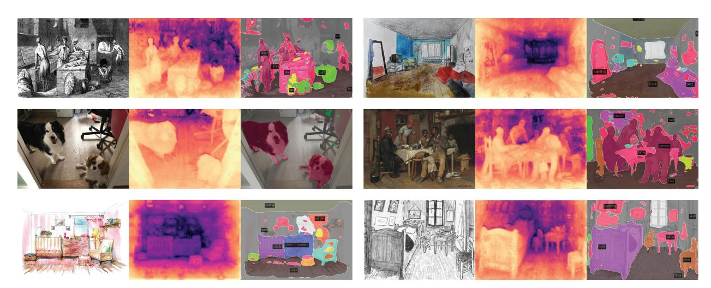

# 정성적 분할·깊이 결과: OpenCLIP-G vs DINOv2-g

> **Q.** 정성적 분할·깊이 결과에서 OpenCLIP과 DINOv2의 차이는?
>
> **A.** OpenCLIP-G의 분할 마스크는 artifact와 끊긴 컴포넌트가 많은 반면 DINOv2는 훨씬 안정적이다. 깊이 추정도 DINOv2가 더 매끄럽고 artifact가 적으며, SUN RGB-D의 의자처럼 OpenCLIP이 완전히 무시한 물체도 올바르게 잡는다.

출처: DINOv2 논문 (Oquab et al., 2023, arXiv 2304.07193) §7.5 *Qualitative Results*, Figure 7·8.

---

## 1. 실험 설정 — 무엇을 비교했나

- **백본은 얼린(frozen) 상태**, 그 위에 **선형 층 하나**만 학습한다. 즉 결과의 품질은 거의 전부 "패치 토큰이 얼마나 좋은가"에 달려 있다.
- 비교 대상: **OpenCLIP-G** (ViT-G/14, LAION-2B 이미지-텍스트 쌍으로 학습) vs **DINOv2-g** (ViT-g/14, LVD-142M 자기지도 학습).
- 과제·데이터셋
  - 의미 분할: **ADE20K** — 패치 토큰 → 클래스 로짓(저해상도 맵) → 업샘플.
  - 단안 깊이 추정: **NYUd**, **KITTI**, **SUN RGB-D**(NYUd로 학습한 뒤 zero-shot 전이) — 패치 토큰(+CLS)을 4배 업샘플하고 256개 깊이 bin으로 분류.

두 모델 모두 깊이 정보로 학습된 적이 없다는 점이 핵심이다. 그럼에도 깊이가 선형 분리 가능하다는 것은 두 모델의 공통점이고, **그 깊이 맵이 얼마나 "깨끗한가"**가 차이점이다.

## 2. Figure 7 — 실제로 무엇이 보이나

각 행을 왼쪽(입력) → 가운데(OpenCLIP-G) → 오른쪽(DINOv2-g) 순으로 보면 된다.

### ADE20K 분할 (1행)

| 관찰 | OpenCLIP-G | DINOv2-g |
|---|---|---|
| 벽돌집 예시 | 건물(building) 마스크 안에 **분홍색 반점(artifact)**이 곳곳에 박혀 있고, 잔디·벽 영역 경계에도 다른 색 조각들이 산발적으로 흩어져 있음 | 건물 영역이 한 덩어리로 유지되고, sky/building/grass/wall이 깔끔하게 나뉨 |
| 침실 예시 | bed, cushion, armchair 등이 **여러 개의 끊긴 조각(disconnected components)**으로 갈라지고, 창(windowpane) 주변에 잔여 색 파편이 많음 | bed가 하나의 큰 자주색 영역으로, armchair·cushion·pillow가 각각 연속된 영역으로 유지됨 |

논문 표현 그대로, OpenCLIP-G 마스크는 "many artifacts and disconnected components"를 보인다. 반면 DINOv2는 "완벽하진 않지만(while not perfect)" 같은 선형 프로브 설정에서 훨씬 좋은 결과를 낸다.

### 깊이 추정 (2~4행)

| 데이터셋 | OpenCLIP-G | DINOv2-g |
|---|---|---|
| **NYUd** (거실·식당) | 깊이 맵 전체가 **모래알처럼 자글자글한 노이즈**로 덮여 있고, 소파·식탁 형태를 알아보기 어려움 | 벽/천장의 깊이가 부드럽게 변하고, 소파·식탁·의자의 실루엣이 그대로 드러남 |
| **SUN RGB-D** (주방 테이블·거실) | 테이블·의자 영역이 배경과 뒤섞여 거의 구별 안 됨. 특히 오른쪽 예시의 **흔들의자가 아예 사라짐** | 둥근 테이블의 곡면이 밝은 연속 면으로 나타나고, **흔들의자가 등받이·팔걸이까지 밝은 전경 물체로 정확히 위치함** |
| **KITTI** (도로) | 도로 위쪽 하늘·나무 경계가 어지럽고 차량 실루엣이 흐릿함 | 도로면이 위로 갈수록 매끄럽게 멀어지고, 차량·표지판 실루엣이 더 선명함 |

이 그림이 카드 정답에서 말하는 세 가지를 그대로 담고 있다.

1. **분할**: OpenCLIP은 반점(artifact)과 끊긴 조각, DINOv2는 안정적.
2. **깊이**: DINOv2가 훨씬 매끄럽고(smoother) artifact가 적음.
3. **SUN RGB-D의 의자**: OpenCLIP은 완전히 무시(completely ignored), DINOv2는 올바르게 위치시킴(correctly positioned).

## 3. 정량 결과와의 대응

논문은 이 정성 결과가 "정량적 격차를 명확하게 보여준다"고 쓴다. Table 10·11에서 같은 선형 프로브 설정을 보면:

| 지표 (frozen + linear) | OpenCLIP ViT-G/14 | DINOv2 ViT-g/14 |
|---|---|---|
| ADE20K mIoU (lin.) ↑ | 39.3 | **49.0** |
| NYUd RMSE (lin. 1) ↓ | 0.541 | **0.344** |
| KITTI RMSE (lin. 1) ↓ | 3.57 | **2.62** |
| NYUd → SUN RGB-D RMSE (lin. 1) ↓ | 0.537 | **0.402** |

ADE20K에서 약 10 mIoU, NYUd RMSE는 약 36% 낮다. 그림의 "자글자글한 노이즈" vs "부드러운 면"이 곧 이 RMSE 차이다. 더 작은 DINOv2 ViT-B/14조차 OpenCLIP-G보다 모든 항목에서 낫다.

## 4. 왜 이런 차이가 나는가 — 학습 목표와 연결

### OpenCLIP: 이미지 수준 캡션 감독만 있다

- CLIP 계열의 손실은 **이미지 하나의 전역 임베딩**과 **문장 하나의 임베딩**을 맞추는 대조 학습이다.
- 캡션은 "a bedroom with a bed and a chair"처럼 **어느 픽셀이 무엇인지** 말해주지 않는다. 손실이 패치 토큰을 직접 감독하지 않으므로, 패치 토큰은 "전역 풀링을 거쳐 문장과 맞으면 그만"인 부산물이 된다.
- 결과적으로 이웃 패치들이 일관된 국소 표현을 갖도록 강제하는 항이 없다. 선형 층이 이런 토큰을 픽셀별로 분류하면, 의미적으로 비슷한 인접 패치가 서로 다른 클래스/깊이 bin으로 튀어 **반점·끊긴 조각·모래알 노이즈**가 된다.
- 캡션에 잘 안 등장하거나 전역 의미에 기여하지 않는 물체(빈 흔들의자)는 토큰 수준에서 배경과 구분될 이유가 없다 → **"의자가 사라지는" 현상**.

### DINOv2: 패치 수준 목표 + 특징 분산 정규화

- **iBOT 패치 수준 목표**: 학생에게 일부 패치를 마스킹하고, 교사가 본 해당 위치의 패치 토큰 분포를 예측하게 한다. 손실이 **패치 인덱스 i마다** 계산된다(L_iBOT = −Σ_i p_ti log p_si). 즉 각 패치 토큰이 "그 자리의 내용"을 표현하도록 직접 감독받고, 주변 문맥으로 가려진 패치를 복원해야 하므로 **인접 패치 표현의 일관성**이 학습된다. 이것이 마스크가 한 덩어리로 유지되고 깊이가 매끄럽게 변하는 직접적 원인이다.
- **DINO 이미지 수준 목표**와 **헤드 분리(untied heads)**: 전역 의미도 함께 학습하되, 대규모에서는 두 헤드를 분리하는 쪽이 낫다는 것을 확인했다.
- **KoLeo 정규화**: 배치 안에서 특징들이 서로 최소 거리를 유지하도록(균일하게 퍼지도록) 밀어낸다. 특징이 특정 방향으로 붕괴·뭉치지 않으므로, 선형 층이 깊이나 클래스처럼 미묘한 차이를 분리해 낼 여지가 넓어진다. (논문 ablation에서 KoLeo는 주로 검색·인스턴스 수준에 도움을 주지만, 특징 공간이 "잘 펴져" 있다는 성질은 선형 프로브 전반에 유리하다.)
- **고해상도 마무리 학습(518×518)**: 작은 물체가 사라지지 않게 하여 픽셀 수준 과제에 유리하다.

요약하면, **OpenCLIP은 "이미지 전체가 어떤 문장인가"를 배우고, DINOv2는 "각 패치가 무엇인가"까지 배운다**. 정성 그림의 artifact·끊긴 마스크·사라진 의자는 전자의 부작용, 매끄러운 깊이와 연속된 마스크는 후자의 결과다.

## 5. Figure 8 — 도메인 밖에서도 유지되는가

같은 절의 두 번째 정성 실험으로, DINOv2-g 선형 프로브를 **판화, 수채화 스케치, 고흐의 침실, 개 사진** 등 학습 도메인과 전혀 다른 입력에 그대로 적용한 결과다.

- 판화(좌상)의 인물들이 전경으로, 벽난로가 후경으로 깊이가 나뉘고, 인물 각각이 분리된 마스크로 잡힌다.
- 개 사진(좌중)은 앞의 큰 개와 뒤의 작은 개가 깊이 차이로 구분되고, 분할에서 두 마리가 각각 한 덩어리로 유지된다.
- 고흐 침실(우하)에서도 침대(bed), 의자(chair), 탁자(table), 바닥(floor)이 연속된 영역으로 나온다.

Figure 7에서 관찰된 "끊기지 않는 마스크, 매끄러운 깊이"라는 성질이 도메인이 바뀌어도 유지된다는 점이, 이것이 특정 데이터셋에 맞춘 결과가 아니라 **패치 토큰 자체의 성질**임을 뒷받침한다.

## 6. 기억용 요약

- **분할**: OpenCLIP-G = 반점 artifact + 끊긴 조각 / DINOv2-g = 연속된 안정적 마스크.
- **깊이**: OpenCLIP-G = 모래알 노이즈 / DINOv2-g = 매끄럽고 artifact 적음.
- **대표 사례**: SUN RGB-D 흔들의자 — OpenCLIP은 완전히 놓침, DINOv2는 정확히 위치.
- **공통점**: 둘 다 깊이 학습 없이도 깊이가 선형 분리 가능.
- **원인**: 캡션 감독은 픽셀(패치) 수준 목표가 없음 ↔ DINOv2는 iBOT 패치 수준 손실로 각 패치를 직접 감독 + KoLeo로 특징 공간을 균일하게 펼침.
