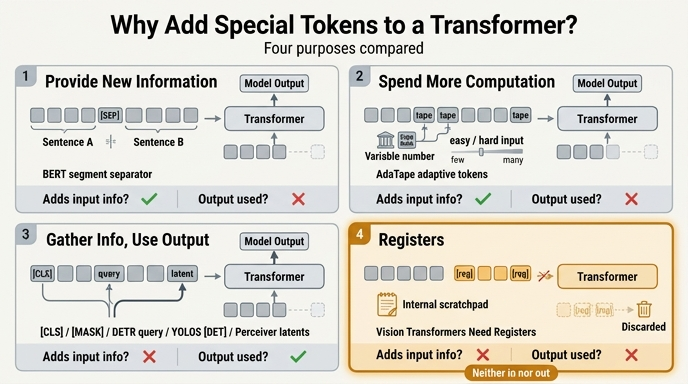

# Transformer에 특수 토큰을 추가하던 기존 방식들의 목적

## 카드

**Q.** transformer에 특수 토큰을 추가하는 기존 방식들의 목적은 무엇이었나?

**A.** 새 정보를 제공(BERT의 `[SEP]`), 연산량을 늘림(AdaTape의 tape token), 또는 정보를 모아 그 출력값을 모델 출력으로 사용(`[CLS]`, `[MASK]`, DETR의 object query, YOLOS detection token, Perceiver의 latent array)하는 것이었다.

---

## 이 질문이 나온 맥락

이 문장은 *Vision Transformers Need Registers*(Darcet et al., 2023, arXiv:2309.16588)의 관련 연구 절 "Additional tokens in transformers"에 나온다. 논문의 원문은 다음과 같다.

> Extending the transformer sequence with special tokens was popularized in BERT. However, most approaches add new tokens either (1) **to provide the network with new information** as for example [SEP] tokens in BERT, (2) **provide opportunity to spend more computation on the input** as seen with the tape tokens in AdaTape, or (3) **to gather information in these tokens, and use their output value as an output of the model** ... **Different to these works, the tokens we add to the sequence add no information, and their output value is not used for any purpose.**

즉 이 문단은 register 토큰의 신규성을 주장하기 위한 **대조군 정리**다. "특수 토큰 추가"라는 아이디어 자체는 전혀 새롭지 않으므로, 저자들은 기존 특수 토큰을 **목적**에 따라 세 갈래로 분류한 뒤 register가 그 어디에도 속하지 않음을 보인다.

핵심 판별 축은 두 가지다.

- **입력에 정보를 넣는가?** (토큰이 새로운 콘텐츠/조건을 실어 나르는가)
- **출력값을 쓰는가?** (그 토큰의 최종 출력이 손실 계산이나 다운스트림 표현으로 쓰이는가)

register는 이 둘이 **모두 아니오**다. 순전히 forward pass 중에 모델이 전역 정보를 **저장·처리·회수하는 스크래치패드**로만 존재한다(CPU 레지스터에서 이름을 따옴). 그래서 출력단에서 그냥 버려진다.

*Figure 6. N개의 학습 가능한 입력 토큰(노란색)을 추가하지만, 출력에서는 patch token과 `[CLS]` token만 사용한다 — 학습·추론 모두에서.*

---

## 목적별 분류 정리표

| 토큰 | 출처 | 입력에 정보를 넣는가? | 출력값을 쓰는가? | 목적 |
|---|---|---|---|---|
| `[SEP]` | BERT (Devlin et al., 2019) | **O** — 문장 A/B의 경계라는 새 정보 | X (보통 안 씀) | ① **새 정보 제공**: 두 세그먼트를 구분하는 구분자 |
| tape token | AdaTape (Xue et al., 2023) | △ — tape bank에서 가져온 추가 입력이지만 주 목적은 시퀀스 길이 확장 | X | ② **연산량 확장**: 입력 난이도에 따라 붙이는 토큰 수를 가변으로 조절 → adaptive computation |
| `[CLS]` | BERT / ViT (Dosovitskiy et al., 2021) | X (내용 없는 학습 가능 벡터) | **O** | ③ **정보 집약 → 출력**: 전역 표현을 모아 분류 헤드 입력으로 사용 |
| `[MASK]` | BERT / BEiT (Bao et al., 2021) | X (오히려 정보를 가림) | **O** | ③ **정보 집약 → 출력**: 마스킹된 위치의 출력으로 원래 토큰/시각 토큰을 복원(생성 학습) |
| object query | DETR (Carion et al., 2020) | X (학습 가능한 위치 임베딩) | **O** | ③ **정보 집약 → 출력**: 쿼리 하나가 객체 하나 → box + class 예측 (set prediction) |
| detection token `[DET]` | YOLOS (Fang et al., 2021) | X (랜덤 초기화 학습 벡터 100개) | **O** | ③ **정보 집약 → 출력**: `[CLS]`를 버리고 `[DET]` 100개를 patch token에 이어 붙여 각 출력으로 객체 검출 |
| latent array | Perceiver / Perceiver IO (Jaegle et al., 2021; 2022) | X (학습 가능한 latent N개) | **O** | ③ **다중 모달 정보 집약 → 출력**: 거대한 입력 배열을 cross-attention으로 고정 크기 latent에 압축한 뒤 디코딩 |
| **`[reg]` register** | **본 논문 (Darcet et al., 2023)** | **X** | **X — 출력단에서 폐기** | **④ 어느 쪽도 아님**: forward pass 중 내부 계산용 스크래치 공간 제공 |

---

## 각 토큰 자세히

### ① 새 정보를 제공 — BERT `[SEP]`

BERT는 "문장 A / 문장 B" 쌍을 하나의 시퀀스로 넣는다(NSP, QA, NLI 등). `[SEP]`은 그 경계가 어디인지를 **알려 주는** 토큰이다. 즉 시퀀스에 없던 구조 정보를 주입한다. 그 자체의 출력 벡터를 예측에 쓰지는 않는다.

- 같은 부류로 확장하면: T5의 sentinel, 대화 모델의 role/turn 토큰, 언어 코드 토큰 등도 "정보 주입"형이다.

### ② 연산량을 늘림 — AdaTape의 tape token

AdaTape (*Adaptive Computation with Elastic Input Sequence*, arXiv:2301.13195, ICML 2023)는 "쉬운 입력엔 적은 연산, 어려운 입력엔 많은 연산"을 **입력 시퀀스 길이**로 구현한다.

- **tape bank**: 후보 tape token들의 풀. input-driven bank(입력에서 유도) 또는 learnable bank(학습 파라미터) 두 방식.
- **adaptive tape reading**: 입력의 복잡도에 따라 bank에서 뽑아 붙이는 tape token의 **개수를 가변**으로 정한다.
- 모델 **깊이**(ACT류)가 아니라 **시퀀스 길이**를 늘려 연산량을 조절하므로 구현이 단순하고 하드웨어 효율이 좋다.
- 요점: 목적이 "표현을 뽑는 것"이 아니라 **"연산 예산을 더 쓸 자리를 만드는 것"**.

### ③ 정보를 모아 출력으로 사용

이 부류가 가장 크고, 다시 용도별로 나뉜다.

**분류용 — `[CLS]` (BERT, ViT)**
내용이 없는 학습 가능 벡터를 시퀀스 앞에 붙이고, self-attention을 거치며 전체 시퀀스 정보를 흡수하게 한다. 마지막 층의 `[CLS]` 출력이 곧 문장/이미지 전역 표현이 되어 분류 헤드로 들어간다.

**생성 학습용 — `[MASK]` (BERT, BEiT)**
가려진 위치를 `[MASK]`로 대체하고, 그 위치의 **출력**으로 원래 단어(BERT) 또는 시각 토큰(BEiT)을 예측한다. 정보를 주는 게 아니라 가리지만, 목적은 명확히 "그 출력을 쓰는 것"이다.

**검출용 — DETR object query**
학습 가능한 N개(보통 100)의 query 임베딩이 디코더에서 이미지 특징에 cross-attention 한다. 각 query의 출력 → FFN → (bounding box, class) 하나. 헝가리안 매칭 기반 set prediction 손실로 학습하므로 query 하나가 객체 슬롯 하나 역할을 한다.

**검출용 — YOLOS detection token `[DET]`**
DETR과 달리 **인코더 전용 순수 ViT**로 검출을 한다. `[CLS]`를 버리고, 랜덤 초기화한 학습 가능 `[DET]` 토큰 100개를 patch token 시퀀스에 그냥 이어 붙인다. 2D 구조에 대한 귀납 편향이나 태스크 사전 지식 없이, 각 `[DET]`의 출력으로 box/class를 낸다(손실은 DETR과 같은 bipartite matching). 목적은 SOTA 검출기가 아니라 **"Transformer의 범용성/전이성 입증"**이었다.

**다중 모달 집약용 — Perceiver / Perceiver IO latent array**
입력 배열 크기 M이 매우 클 때(M ≫ N), 학습 가능한 latent array(N개)를 query로 삼아 입력을 K, V로 cross-attention 한다. 이렇게 **고정 크기 latent 병목**에 정보를 압축한 뒤, latent 공간에서만 깊은 self-attention 스택을 돌린다. 그래서 attention 비용이 입력 크기에 제곱으로 커지지 않고, 텍스트·이미지·비디오·포인트클라우드 등 어떤 모달리티도 같은 구조로 받는다. Perceiver IO는 여기에 **output query**를 추가해 latent array를 다시 질의함으로써 임의 구조의 출력을 만든다. 어느 쪽이든 **latent의 값이 결국 출력으로 쓰인다**.

### ④ 그리고 register — 둘 다 아님

Registers는 patch embedding 직후에 `[CLS]`처럼 학습 가능한 값으로 N개(논문 기본값 4개) 삽입되고, ViT 마지막에서 **버려진다**. 이미지에 무관하게(input-independent) 항상 같은 초기값이므로 정보를 주입하지도 않는다.

왜 필요한가:

- 충분히 크고 오래 학습된 ViT는 **정보가 적은 배경 patch를 재활용**해 전역 정보를 저장하는 내부 메커니즘을 스스로 학습한다. 이 토큰들은 출력에서 **norm이 비정상적으로 큰 outlier**로 나타나고(artifact), linear probing 해 보면 일반 patch보다 이미지 분류 정확도가 훨씬 높다 → 전역 정보를 담고 있다는 증거.
- 문제는 그 대가로 해당 patch의 **국소 정보가 파괴**된다는 것. dense prediction(세그멘테이션, 깊이 추정)과 object discovery(LOST)가 나빠지고 attention map이 지저분해진다.
- register는 이 행동을 위한 **전용 자리**를 명시적으로 만들어 준다. 논문 표현으로는 "such tokens allow us not to **create** but to **isolate** this existing behavior" — 새 메커니즘을 만드는 게 아니라 이미 존재하던 메커니즘을 **격리**하는 것.
- 결과: patch token에서 high-norm outlier가 완전히 사라지고, 성능은 유지되거나 소폭 향상되며, feature/attention map이 매끄러워진다. 4개 기준 FLOP 증가는 2% 미만.

선행 연구로는 **Memory Transformer**(Burtsev et al., 2020)가 memory token을 시퀀스에 추가해 번역 성능을 올렸고, 이후 Recurrent Memory Transformer(Bulatov et al., 2022)로 이어진다. Sandler et al. (2022)는 이를 vision의 fine-tuning에 적용했으나 태스크 간 전이가 잘 안 됨을 관찰했다. Register 논문의 차별점은 **fine-tuning이 아니라 pretraining 단계에서** 이 토큰을 써서 모든 다운스트림 태스크에 이득이 되는 특징을 얻고, 무엇보다 **이 메커니즘이 ViT에 자연 발생한다는 사실 자체를 밝혀낸 것**이다.

---

## 암기 포인트

세 갈래를 "**주입 / 연산 / 집약**"으로 외우고, register는 "**셋 다 아님 = 순수 스크래치패드**"로 붙이면 된다.

| 물음 | `[SEP]` | tape | `[CLS]`·`[DET]`·query·latent | `[reg]` |
|---|---|---|---|---|
| 정보를 넣나? | O | △ | X | **X** |
| 출력을 쓰나? | X | X | O | **X** |

`[SEP]`은 정보만, tape은 연산만, `[CLS]` 계열은 출력만, register는 **아무것도 아님**.

## 참고

- Darcet et al., *Vision Transformers Need Registers*, ICLR 2024 — [arXiv:2309.16588](https://arxiv.org/abs/2309.16588)
- Xue et al., *Adaptive Computation with Elastic Input Sequence* (AdaTape) — [arXiv:2301.13195](https://arxiv.org/abs/2301.13195), [Google Research blog](https://research.google/blog/adatape-foundation-model-with-adaptive-computation-and-dynamic-read-and-write/)
- Fang et al., *You Only Look at One Sequence* (YOLOS), NeurIPS 2021 — [arXiv:2106.00666](https://arxiv.org/abs/2106.00666)
- Carion et al., *End-to-End Object Detection with Transformers* (DETR), ECCV 2020 — [arXiv:2005.12872](https://arxiv.org/abs/2005.12872)
- Jaegle et al., *Perceiver* — [arXiv:2103.03206](https://arxiv.org/abs/2103.03206) / *Perceiver IO* — [arXiv:2107.14795](https://arxiv.org/abs/2107.14795)
- Burtsev et al., *Memory Transformer* — [arXiv:2006.11527](https://arxiv.org/abs/2006.11527)

## 인포그래픽

