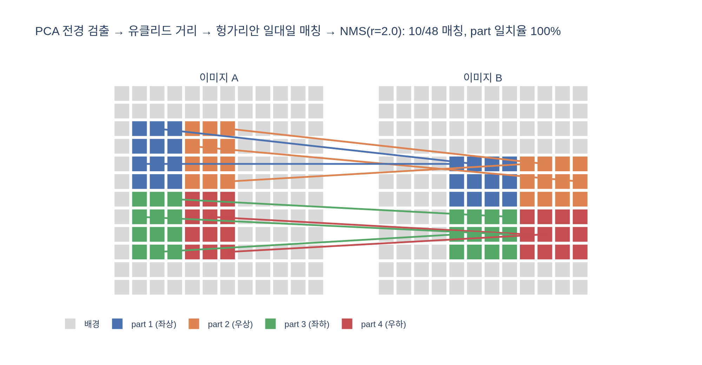

# patch matching 실험은 어떻게 수행되나?

**답:** 먼저 PCA 기반 절차로 전경 객체를 검출한 뒤, 두 이미지의 패치 특징 간 유클리드 거리를 계산하고 assignment problem을 풀어 매핑한다. 이후 non-maximum suppression으로 두드러진 매칭만 남긴다.

> 출처: DINOv2 논문(arXiv 2304.07193) §7.5 *Qualitative Results* — "Patch matching" 단락과 Figure 10.

## 왜 이런 실험을 하나

DINOv2는 이미지 전체를 요약하는 `[CLS]` 토큰뿐 아니라 **패치 단위 특징**도 내놓는다. 저자들은 "이 패치 특징 안에 어떤 정보가 들어 있는가"를 정량 지표가 아닌 **정성적**으로 보이기 위해, 서로 다른 두 이미지의 패치들을 직접 짝지어 선으로 연결해 보았다. 짝이 의미 있게 이어지면(비행기 날개 ↔ 새 날개) 특징이 "부위(part)" 수준의 의미를 담고 있다는 증거가 된다.

파이프라인은 4단계이며, 각 단계는 앞 단계의 잡음을 줄여 마지막 그림이 읽히게 만드는 역할을 한다.

## 1단계 — PCA로 전경 객체 검출

같은 절 바로 앞 단락("PCA of patch features")의 절차를 그대로 재사용한다.

1. 이미지의 패치 특징 전체에 PCA를 수행한다.
2. **첫 주성분(PC1)** 에 사영한 값이 양수인 패치만 남긴다.

논문의 관찰: 패치 특징에서 분산이 가장 큰 방향은 "객체 vs. 배경" 축이었고, 이 임계값 처리만으로 주 객체의 경계가 깨끗하게 분리된다("our unsupervised foreground / background detector ... performs very well"). 학습 없이 얻어진 emergent property다.

**이 단계가 필요한 이유:** 배경 패치(하늘, 잔디, 모래)는 두 이미지 모두에 대량으로 존재하고 서로 특징이 비슷하다. 전경 검출 없이 매칭하면 "하늘↔하늘" 같은 무의미한 매칭이 수십 개 생겨 객체 부위 간 매칭을 뒤덮는다. 배경을 빼야 거리 행렬이 전경 패치끼리의 $n_A \times n_B$ 크기로 줄고, 이후 assignment도 객체 안에서만 이뤄진다.

## 2단계 — 패치 특징 간 유클리드 거리 행렬

이미지 A의 전경 패치 특징 $f^A_i$와 이미지 B의 전경 패치 특징 $f^B_j$ 사이에 거리

$$d_{ij} = \lVert f^A_i - f^B_j \rVert_2$$

를 모두 계산해 $n_A \times n_B$ 행렬을 만든다. 논문은 코사인 유사도가 아닌 **유클리드 거리**를 명시했다. 이 행렬이 다음 단계의 비용(cost) 행렬이 된다.

## 3단계 — assignment problem 풀기 (최근접 이웃과 다른 점)

가장 단순한 매칭은 **최근접 이웃(NN)**: A의 각 패치가 독립적으로 $\arg\min_j d_{ij}$를 고르는 것이다. 문제는 여러 A 패치가 **같은 B 패치로 몰리는 다대일 충돌**이 생긴다는 점 — 그림에서는 한 점에서 선이 부채처럼 뻗어나오는 지저분한 모양이 된다.

논문이 택한 **assignment problem(선형 할당 문제)** 은 전체를 한 번에 본다:

$$\min_{\pi}\ \sum_{i} d_{i,\pi(i)} \quad \text{s.t. } \pi \text{는 일대일 대응}$$

즉 "각 A 패치를 서로 다른 B 패치에 하나씩 배정하되, 배정된 거리의 총합을 최소화"한다. 이 문제는 **헝가리안 알고리즘**(Kuhn–Munkres, $O(n^3)$) 등으로 정확히 풀 수 있고, `scipy.optimize.linear_sum_assignment`가 바로 이것이다.

| | 최근접 이웃(NN) | assignment(헝가리안) |
|---|---|---|
| 결정 단위 | 패치별 독립 | 전체 동시 |
| 제약 | 없음 | 일대일 |
| 총 거리 | 최소(제약이 없으니) | 조금 더 큼 |
| 결과 | 다대일 충돌, 선택받지 못한 B 패치 다수 | 모든 패치가 빠짐없이·겹침 없이 대응 |

일대일 제약 덕분에 "가장 비슷한 것 하나"에 모든 선이 쏠리지 않고, 객체 전체 부위가 골고루 대응된다. 아래 toy 실험(`expy.py`)에서 NN은 48개 매칭 중 25개가 B 타깃을 공유했지만, 헝가리안은 48개가 모두 서로 다른 타깃으로 갔다.

## 4단계 — non-maximum suppression으로 두드러진 매칭만 남기기

일대일 매칭을 해도 전경 패치 수만큼(수백 개) 선이 나온다. 논문은 "매칭 수를 줄이기 위해(In order to reduce the number of matches)" NMS를 적용해 **salient한 것만** 남긴다.

객체 검출의 박스 NMS와 같은 논리다:

1. 매칭을 **거리 오름차순**(= 매칭 강도 내림차순)으로 정렬한다.
2. 강한 매칭부터 하나씩 채택하고, 이미 채택된 매칭과 **공간적으로 가까운(반경 $r$ 이내)** 매칭은 억제한다.
3. 결과적으로 서로 겹치는 이웃 패치 묶음마다 **가장 강한 매칭 하나**만 살아남는다.

인접 패치들은 특징이 비슷해 거의 같은 곳으로 매칭되므로, 이 중 하나만 그려도 정보 손실이 없고 그림은 훨씬 읽기 쉬워진다. Figure 10에서 이미지 한 쌍당 선이 10개 안팎인 이유가 이것이다.

## Figure 10에서 관찰되는 것

위 네 묶음이 파이프라인의 최종 출력이다. 각 쌍에서 보이는 것:

- **Vehicles**: 도로 위 버스 ↔ 골판지 자동차, 빨간 버스 그림 ↔ 사막의 차. 바퀴↔바퀴, 창문↔창문, 지붕↔지붕이 이어진다. 사진↔골판지 공작물, 일러스트↔사진처럼 **스타일이 달라도** 매칭된다.
- **Birds / Airplanes**: 비행기 날개 ↔ 익룡 화석의 날개, 독수리 날개 ↔ 비행기 날개. 논문이 직접 언급한 예("the wing of a plane matches the wing of a bird") — 서로 다른 **객체 범주** 사이에서도 "같은 기능을 하는 부위"가 대응된다.
- **Elephants**: 코끼리 ↔ 가네샤 조각상(머리·코·귀), 그리고 옆모습 코끼리 ↔ 정면 코끼리. 후자는 **큰 포즈 변화**에도 강건함을 보여 주는 예로 논문에 명시되어 있다("large variation of poses (see the elephant)").
- **Drawings / Animals**: 만화 공룡 ↔ 공룡 화석, 말 선화 ↔ 실제 말 사진. 머리↔머리, 다리↔다리, 꼬리↔꼬리로 이어지며 **그림↔사진** 도메인 차이를 넘는다.

공통점: 선은 배경(하늘·모래·잔디)에는 하나도 걸리지 않고(1단계 전경 검출), 한 점에서 여러 선이 뻗지 않으며(3단계 일대일 할당), 객체 위에 적당한 간격으로 퍼져 있다(4단계 NMS). 저자들은 이를 특징이 "서로 다른 객체·동물에서 비슷한 역할을 하는 의미 영역"을 포착한 증거로 해석한다.

## 한 줄 정리

**PCA PC1 임계값으로 배경 제거 → 전경 패치 간 유클리드 거리 행렬 → 헝가리안(일대일 할당)으로 매핑 → NMS로 강한 매칭만 남김.** 각 단계는 "배경 잡음 제거 / 다대일 충돌 제거 / 시각적 잡음 제거"를 담당한다.

## 시각화

`expy.py`는 12×12 합성 패치 격자 두 장(객체 위치·모양이 다르고 4개 part 프로토타입 + 노이즈로 특징 생성)에 위 4단계를 그대로 적용한 toy 실험이다. PCA 전경 검출 정확도 100%, 헝가리안 매칭 48개 전부 part 일치, NMS(r=2) 후 10개 매칭이 남고 모두 같은 part 색끼리 이어진다.

